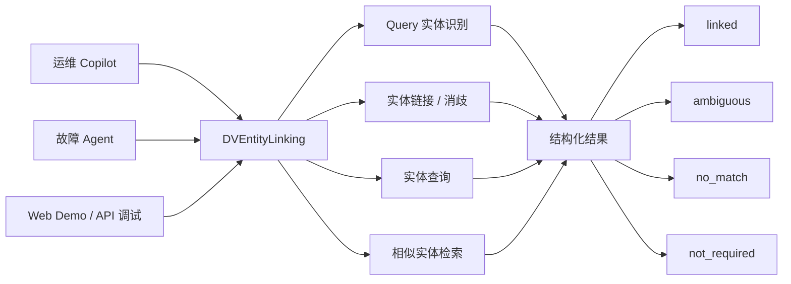
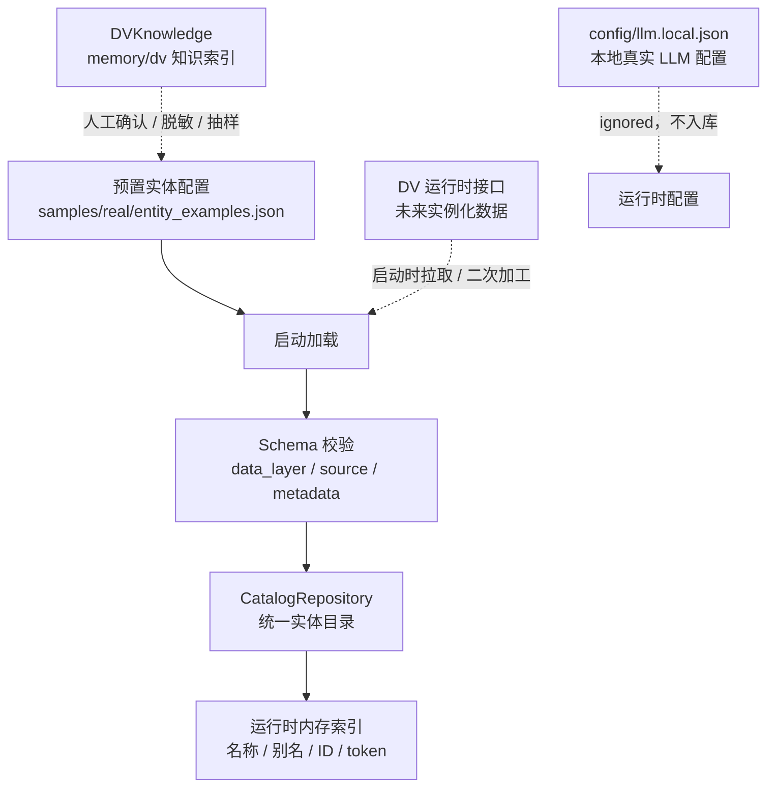
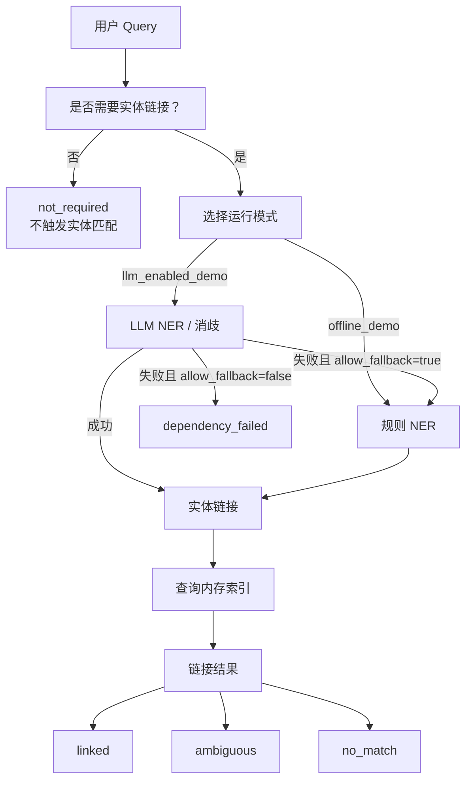
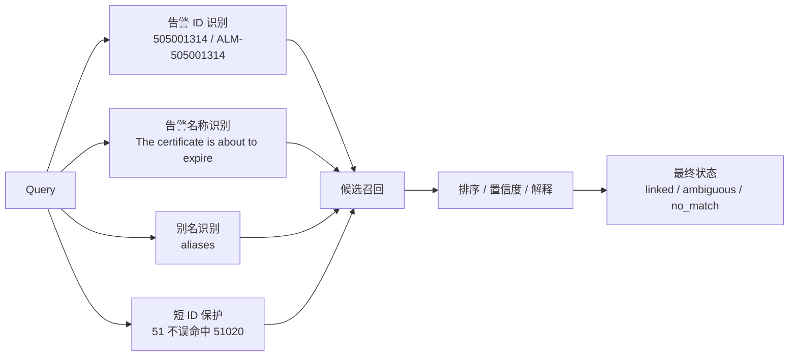
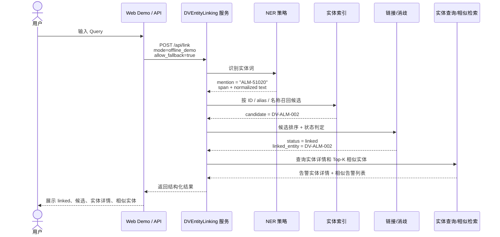
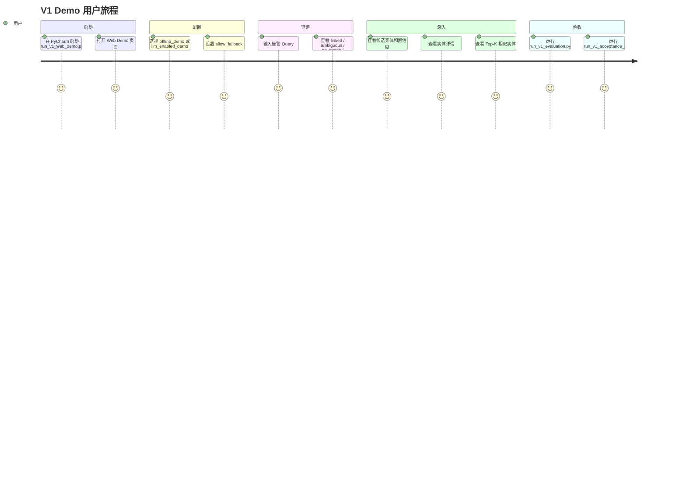
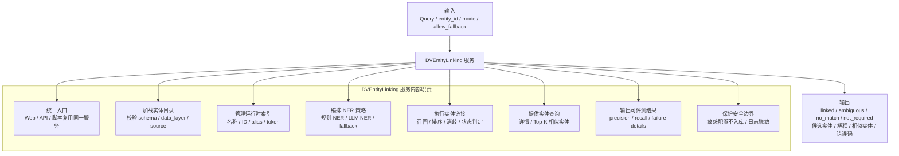

# DVEntityLinking 项目介绍

本文档用于向项目内外部人员讲解 DVEntityLinking 的整体方案：它解决什么问题、各模块如何协作、实体数据从哪里来、运行时如何触发 NER 和链接策略，以及用户如何体验和验收当前 V1 demo。

## 1. 项目定位

DVEntityLinking 是面向 DV 运维 Copilot 和故障 Agent 的实体理解服务。它不是单点问答能力，而是一个可复用的实体底座，负责把用户 Query、Agent 诊断过程和后续检索任务中的实体词，统一识别、归一化、链接到可查询的 DV 实体。

当前 V1 聚焦 `alarm` 告警知识实体，使用用户确认可提交的脱敏样例作为 demo 和评测基线。



这张图用于讲清楚：DVEntityLinking 是 Copilot、故障 Agent 和 Web/API 共用的实体理解层。它输出的不只是“匹配到了哪个实体”，还包括 `linked`、`ambiguous`、`no_match` 和 `not_required` 等可解释状态。

## 2. 数据从哪里来，怎么加载

实体数据来源分为当前已实现的预置样例，以及后续规划中的知识补充和运行时接口数据。



当前 V1 的实体数据管理策略：

- 只考虑 `alarm` 一种实体类型。
- 实体样例放在 `samples/real/entity_examples.json`，属于用户确认可提交的 `L1_SANITIZED` 数据。
- Query 样例放在 `samples/real/query_samples.json`，当前覆盖 16 条启动 Query。
- 启动时由 `CatalogRepository` 加载实体目录，并校验 schema、`data_layer`、`source`、`metadata` 等字段。
- 运行时构建内存索引，不引入第三方检索组件。
- `config/llm.local.json` 只保存在本地，被 `.gitignore` 忽略；API key、base URL 和完整请求响应不进入仓库。

未来规划：

- 稳定知识类实体可以继续通过配置文件预置，适合项目启动时直接加载。
- DVKnowledge 的 `memory/dv` 可以作为告警知识补充来源，但新增内容必须先做人工确认、脱敏和抽样。
- DV 运行时实例化数据后续通过 DV 接口获取，例如运行态资源、会话、实例对象等；告警类 V1 暂不涉及实例事件建模。
- 运行时数据进入实体服务前，需要经过二次加工、字段映射、数据层级标记和缓存管理。

## 3. 运行时 Query 链路

用户 Query 进入 Web Demo 或 API 后，由 DVEntityLinking 服务统一编排 NER、候选召回、实体链接、实体查询和相似检索。



运行时模式：

- `offline_demo`：默认模式，不依赖真实 LLM，使用规则 NER 和内存索引完成实体链接。
- `llm_enabled_demo`：可选模式，可调用 OpenAI-compatible LLM 做 NER 或消歧。
- `allow_fallback=true`：LLM 失败时回退到规则链路。
- `allow_fallback=false`：LLM 失败时返回结构化依赖失败状态。

## 4. NER 和链接策略

V1 的 NER 和链接策略围绕告警实体设计，重点处理告警 ID、告警名称、别名、多候选歧义和短 ID 子串问题。



关键策略说明：

- 告警 ID 是强特征，例如 `505001314`、`ALM-505001314`。
- 告警名称也是可链接实体词，例如 `The certificate is about to expire`。
- 当 ID 和名称同时出现时，两者应互相增强，而不是产生两个不同实体。
- 当一个实体词可能对应多个告警实体时，返回 `ambiguous`，并给出候选列表。
- 对短 ID 做保护，例如 `51` 不应该误命中 `51020`，`999` 不应该误命中更长 ID。
- 对不需要实体链接的 Query 返回 `not_required`，避免强行匹配导致误报。

## 5. 用具体 Query 讲用户旅程

示例 Query：

```text
Explain ALM-51020 The certificate is about to expire.
```



这个 Query 中既包含告警 ID `ALM-51020`，也包含告警名称 `The certificate is about to expire`。系统会识别实体词，召回候选实体，最终链接到 `DV-ALM-002`，并在页面展示实体详情和相似实体。

同一用户旅程下，其他典型 Query 会触发不同状态：

| Query | 预期状态 | 说明 |
| --- | --- | --- |
| `Check ALM-51020 impact.` | `linked` | 告警 ID 精确命中唯一实体。 |
| `What should I do if certificate is about to expire?` | `ambiguous` | 同一描述可能对应多个告警实体。 |
| `What is alarm 51?` | `no_match` | 短 ID 不能误命中长 ID。 |
| `Open the operations dashboard.` | `not_required` | 该 Query 不需要实体链接。 |

## 6. 用户验收旅程



用户可以通过两类入口体验当前 V1：

- Web Demo：适合演示 Query 输入、模式切换、候选结果、实体详情和相似实体。
- 评测脚本：适合验收 16 条启动 Query 的准确率、召回率和负例误报情况。

常用命令：

```powershell
python scripts\run_v1_web_demo.py --mode offline_demo --port 5016
python scripts\run_v1_evaluation.py
python scripts\run_v1_acceptance_smoke.py --mode offline_demo
```

## 7. DVEntityLinking 服务的作用

`DVEntityLinking` 可以理解为实体服务，也可以理解为实体能力编排层。它不只是 NER，也不只是检索，而是把实体数据、索引、NER、链接、检索、评测和安全边界组织成一个可复用服务。



一句话概括：

> DVEntityLinking 是 Copilot、故障 Agent 和 Web Demo 共用的实体理解服务，负责把自然语言里的实体词变成可查询、可解释、可评测的 DV 实体引用。

具体职责：

- 数据入口：加载预置实体，未来接入 DV 运行时接口数据。
- 数据管理：校验 schema、脱敏级别、来源、metadata 和可提交边界。
- 索引管理：把实体 ID、标准名、别名和 token 组织成可检索结构。
- NER 编排：决定使用规则 NER、LLM NER，还是 LLM 失败后的 fallback。
- 实体链接：完成候选召回、排序、消歧和最终状态判定。
- 实体查询：提供实体详情和 Top-K 相似实体。
- 评测闭环：输出准确率、召回率、负例误报和失败明细。
- 安全治理：保证真实 LLM 配置、API key、base URL 和完整日志不进入仓库。

## 8. 当前 V1 状态和未来规划

当前 V1 已具备：

- `alarm` 单实体类型支持。
- 9 个脱敏告警知识实体。
- 16 条脱敏 Query 样例。
- Web Demo LLM 模式切换和 fallback 开关。
- 内存索引检索策略。
- linked、ambiguous、no_match、not_required 四类结果状态。
- precision、recall 和负例误报验收指标。
- PyCharm 友好的启动脚本和验收 smoke。

后续规划：

- 扩展更多实体类型，例如网络资源、KPI、拓扑、知识案例等。
- 接入 DV 运行时接口，加载实例化实体数据。
- 在数据量扩大后评估是否需要 SQLite FTS5、向量检索或混合检索。
- 引入更完整的实体生命周期管理，包括更新、过期、版本和来源追踪。
- 强化 LLM 在复杂 NER、消歧、语义召回解释上的增强能力。
- 面向 Copilot 和故障 Agent 提供更稳定的 API 契约。

## 9. 推荐讲解顺序

面向其他人介绍时，建议按以下顺序：

1. 先讲项目定位：这是实体理解底座，不是单点问答。
2. 再讲数据来源：当前是脱敏预置样例，未来接 DVKnowledge 和 DV 运行时接口。
3. 然后讲运行时链路：Query 进入服务后如何触发 NER、链接、检索和评测。
4. 再用具体 Query 讲一遍用户旅程。
5. 最后讲 DVEntityLinking 服务职责和未来扩展方向。
