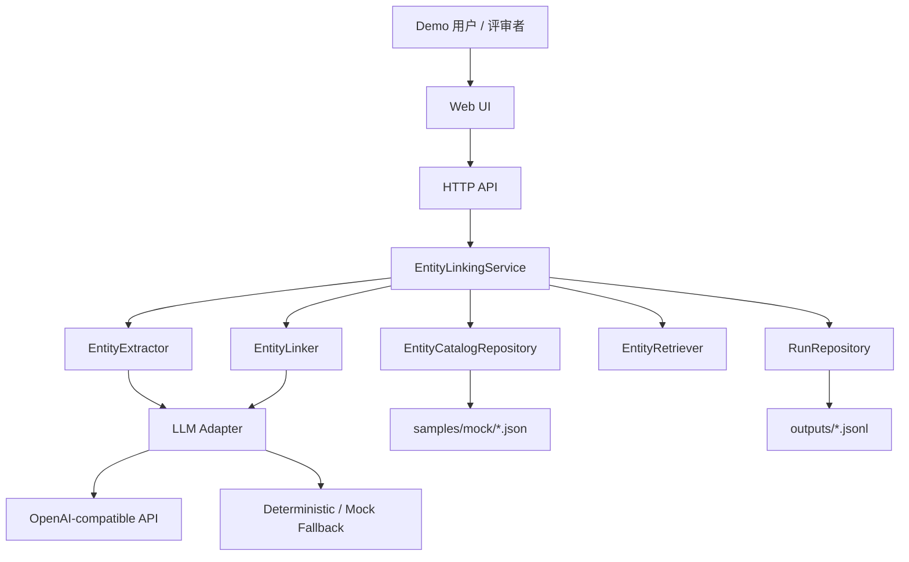

# DVEntityLinking V0 功能设计说明书

---

> 文档治理说明：本文是 V0 SR 主输出件，按版本保留。原过程性评审、处置和闭环文件已合并到 [../../releases/V0.md](../../releases/V0.md)；需要原始过程细节时通过 Git 历史追溯。

## 基本信息

| 项目 | 内容 |
| --- | --- |
| 特性名称 | DVEntityLinking V0 实体链接 demo |
| 版本号 | V0 |
| 文档版本 | V0.3 |
| 编写日期 | 2026-05-25 |
| 编写人 | Codex |
| 审核人 | 设计评审闭环验证已完成 |
| 当前状态 | 功能设计评审闭环已通过，结论为 closed with recorded residual risk，可作为代码实现输入 |

## 版本历史

| 版本号 | 修改日期 | 修改人 | 修改描述 |
| --- | --- | --- | --- |
| V0.1 | 2026-05-25 | Codex | 基于已闭环需求 IR V0.3 形成 V0 功能设计初稿，作为独立设计评审输入。 |
| V0.2 | 2026-05-25 | Codex | 根据独立功能设计评审处置，补充 mention 级链接结果、RetrievalItem、LLM 错误传播、数据层级门控、敏感字段过滤和 Web smoke 验收。 |
| V0.3 | 2026-05-25 | Codex | 根据功能设计闭环验证结论更新文档状态为功能设计评审闭环已通过。 |

---

# 1 概述

## 1.1 目的

本文档定义 DVEntityLinking V0 demo 的功能设计方案，用于把已闭环的需求分析转换为可实现、可测试、可评审的模块边界、数据契约、接口契约、降级语义、部署配置和测试设计输入。

预期读者：

- 独立功能设计评审者。
- 后续代码实现负责人。
- 后续测试设计与测试开发负责人。
- DV 运维 Copilot 和故障 Agent 相关能力规划人员。

## 1.2 范围

### 范围内

| 范围 | 说明 |
| --- | --- |
| Mock 实体目录 | 加载 L0 抽象合成实体词表，包含标准名、别名、类型、属性、关系、来源和数据层级。 |
| Query NER | 从用户 Query 中识别实体提及，支持 LLM nominal path 与 deterministic fallback。 |
| 实体匹配与链接 | 生成候选实体、排序、消歧并输出结构化链接结果。 |
| 实体查询 | 支持按实体 ID、名称和类型查询实体详情。 |
| Top-K 相似度检索 | 支持默认 K=5、最大 K=20 的相关/相似实体召回。 |
| 轻量 Web UI | 支持样例加载状态、Query 链接、实体详情和 Top-K 检索演示。 |
| LLM Adapter | 支持 OpenAI-compatible API 配置、调用超时、格式校验和降级。 |
| 本地运行记录 | 保存 demo 运行摘要，敏感内容和真实 DV artifact 遵守 ignored 规则。 |
| 自动化测试输入 | 明确契约测试、模块测试、API smoke 和 LLM smoke 的设计边界。 |

### 范围外

| 非范围 | 说明 |
| --- | --- |
| 真实 DV 生产接入 | V0 不直接连接真实 DV 生产接口。 |
| 写操作闭环 | V0 不做自动修复、派单、变更、确认告警等写操作。 |
| 生产级向量库 | V0 不要求生产级向量数据库、全量索引或长期实体治理。 |
| 企业级权限审计 | V0 Web UI 不要求鉴权、租户隔离和生产审计。 |
| 长文档抽取 | V0 只覆盖 Query 级实体提及识别，不做大文档实体抽取平台。 |
| 未确认 DV 字段事实化 | 未经用户确认的真实 DV 字段、接口和能力不得写成事实。 |

## 1.3 缩略语和术语

| 缩略语/术语 | 英文全称 | 中文解释 |
| --- | --- | --- |
| DV | DigitalView-SW | 面向运营商领域的电信软件网管系统 |
| IR | Issue Requirement | 需求项 |
| SR | Sub Requirement | 子需求 |
| NER | Named Entity Recognition | 命名实体识别 |
| LLM | Large Language Model | 大语言模型 |
| API | Application Programming Interface | 应用程序接口 |
| Top-K | Top K Results | 返回排序前 K 个结果 |
| L0 Mock | L0 Synthetic Mock | 抽象合成 Mock 数据 |
| L1 Mock | L1 Sanitized Sample | 用户确认可使用的脱敏样例 |
| L2 Mock | L2 Simulated Interface | 本地模拟 DV 接口返回 |
| L3 Readonly | L3 Real Readonly | 真实 DV 只读接入，V0 不默认进入 |

## 1.4 参考文献

| 文档名称 | 文档编号 | 版本 | 来源 |
| --- | --- | --- | --- |
| V0 需求分析文档 | IR-DVEntityLinking-requirements-analysis | V0.3 | [IR.md](./IR.md) |
| V0 需求评审/处置/闭环结论 | V0 release record | Closed | [../../releases/V0.md](../../releases/V0.md) |
| 项目总览 | PROJECT | 当前 | [../../PROJECT.md](../../PROJECT.md) |
| DV 背景文档 | DV_CONTEXT | 当前 | [../../DV_CONTEXT.md](../../DV_CONTEXT.md) |
| V0 用户决策 | DECISIONS | 当前 | [../../current/DECISIONS.md](../../current/DECISIONS.md) |
| DV SR 模板 | SR-templates | 当前 | `D:\workspace\analysis_and_design\templates\SR-templates.md` |

---

# 2 需求实现设计

## 2.1 总体设计方案概述

DVEntityLinking V0 采用本地单进程 demo 架构。Web UI 和 HTTP API 作为演示入口，Application Service 负责编排实体目录、实体提取、候选生成、链接消歧、检索和运行记录。LLM Adapter 是可选外部依赖边界，必须具备 offline deterministic fallback。



### 2.1.1 模块划分

| 模块 | Python 包建议 | 职责 | 依赖方向 |
| --- | --- | --- | --- |
| Schema / Models | `dv_entity_linking.models` | 定义枚举、数据模型、序列化和字段校验。 | 被其他模块依赖，不依赖业务模块。 |
| Config | `dv_entity_linking.config` | 加载 demo 配置、LLM 配置、运行模式和路径配置。 | 可依赖 models，不依赖业务模块。 |
| Entity Catalog | `dv_entity_linking.catalog` | 加载、校验、索引 L0/L1/L2 实体目录和关系。 | 依赖 models/config。 |
| Entity Extraction | `dv_entity_linking.extraction` | Query 级实体提及识别，LLM nominal path 与 deterministic fallback。 | 依赖 models/catalog/llm。 |
| Entity Linking | `dv_entity_linking.linking` | 候选生成、打分、排序、消歧和链接结果组装。 | 依赖 models/catalog/llm。 |
| Retrieval | `dv_entity_linking.retrieval` | 实体查询、Top-K 相似/相关实体检索。 | 依赖 models/catalog。 |
| LLM Adapter | `dv_entity_linking.llm` | OpenAI-compatible 调用、JSON 输出校验、超时和异常映射。 | 依赖 models/config。 |
| Service | `dv_entity_linking.service` | 编排 Query 链接、实体查询、检索和运行记录。 | 依赖业务模块。 |
| Web/API | `dv_entity_linking.web` | Flask 路由、静态页面、API 响应和错误展示。 | 只依赖 service/config/models。 |
| Evaluation / Runs | `dv_entity_linking.evaluation` | 样例执行、运行记录、测试辅助和 smoke 入口。 | 依赖 service/models。 |

### 2.1.2 技术选型

| 事项 | 设计选择 | 理由 |
| --- | --- | --- |
| Python 版本 | Python 3.12 | 满足用户约束。 |
| 数据模型 | `dataclasses` + 显式校验函数 | V0 依赖少、便于离线测试；如后续需要可迁移到 Pydantic。 |
| Web 框架 | Flask 3.x | 轻量、适合单进程 demo 和简单页面；实现阶段在设计评审闭环后补充依赖。 |
| Mock 数据格式 | JSON | 易读、易测试、易被 Web/API 复用。 |
| 运行记录 | JSONL | 便于逐条追加和测试断言；输出目录默认 ignored。 |
| LLM 协议 | OpenAI-compatible chat completion | 匹配 Qwen3.6-27B 接入方向。 |
| 离线模式 | deterministic/mock | 自动化基线不依赖真实 DV 和真实 LLM。 |

### 2.1.3 运行模式

| 模式 | 说明 | LLM 使用 | 适用场景 |
| --- | --- | --- | --- |
| `offline_demo` | 默认自动化基线模式，仅使用 L0 Mock 和 deterministic 逻辑。 | 否 | CI、本地测试、无外部依赖演示。 |
| `llm_enabled_demo` | 启用 OpenAI-compatible LLM nominal path。 | 是 | 本地具备 Qwen3.6-27B 配置时的 smoke 和演示。 |
| `mock_fallback` | 外部依赖失败或显式选择 fallback 时使用。 | 否 | LLM 超时、不可用、响应格式异常、schema 异常。 |

## 2.2 需求分解

### IR001 DVEntityLinking V0 实体链接 demo

#### 2.2.1.1 IR 原始描述

构建 DV 实体链接 demo，支撑运维 Copilot 和故障 Agent 中所有涉及实体的任务，包括但不限于实体构建、实体词表、Query 实体匹配与链接、实体查询与相似度检索；项目基于 Python 3.12 实现，涉及真实 DV 的内容需要与用户确认 Mock 方式；项目考虑使用 Qwen3.6-27B 大模型，可提供 OpenAI 格式的 API 接口。

#### 2.2.1.2 IR 结构化信息

| 字段 | 内容 |
| --- | --- |
| 需求优先级 | 高 |
| 需求类型 | 功能性需求 / 非功能性需求 |
| 涉及模块 | Catalog、Extraction、Linking、Retrieval、LLM Adapter、Web UI、Evaluation |

#### 2.2.1.3 IR 与 SR 的分解关系

| IR 编号 | SR 编号 | 分解说明 |
| --- | --- | --- |
| IR001 | SR001 | 建立 Mock 实体目录和实体词表，作为链接和检索目标。 |
| IR001 | SR002 | 从 Query 中识别实体提及，支持 LLM 与 fallback。 |
| IR001 | SR003 | 将实体提及映射到标准实体并输出候选、置信度和消歧理由。 |
| IR001 | SR004 | 查询实体详情并召回 Top-K 相似/相关实体。 |
| IR001 | SR005 | 提供轻量 Web UI 和 API 入口。 |
| IR001 | SR006 | 封装 OpenAI-compatible LLM 配置、调用和降级。 |
| IR001 | SR007 | 保存本地运行记录并支撑自动化验收。 |

---

### SR001 Mock 实体目录与实体词表

#### 2.2.2.1 SR 描述

V0 必须支持加载 L0 抽象合成 Mock 实体目录。实体目录至少覆盖网络资源/网元、告警/事件、KPI/性能指标、拓扑/关系、知识/Runbook/案例五类实体，每类至少 2 个实体，总数至少 20 个实体。所有实体必须包含 `data_layer` 与 `source`。

#### 2.2.2.2 SR 实现思路

- 使用 `samples/mock/entity_catalog.json` 作为默认 L0 实体目录。
- `CatalogRepository` 启动时读取 JSON，执行必填字段、唯一 ID、枚举、关系引用和来源标记校验。
- 在内存中建立三类索引：`by_id`、`name_alias_index`、`by_type`。
- 关系以轻量 adjacency list 形式保存在内存中，用于拓扑相邻检索和链接证据。
- L1/L2/L3/LOCAL_REAL 数据只作为可选路径，必须通过配置显式指定数据层级和确认记录路径；不得默认加载。

#### 2.2.2.3 功能实现刷新

输入：

| 输入 | 类型 | 说明 |
| --- | --- | --- |
| `catalog_path` | path | 默认 `samples/mock/entity_catalog.json`。 |
| `allowed_data_layers` | list | 默认仅允许 `L0_SYNTHETIC`。 |
| `data_layer_confirmation_path` | path/null | 非 L0 数据层级启用时必填，指向用户确认记录或本地确认清单。 |

输出：

| 输出 | 类型 | 说明 |
| --- | --- | --- |
| `CatalogLoadResult` | object | 加载状态、实体数量、类型分布、错误列表。 |
| `EntityRecord[]` | list | 校验后的实体记录。 |

处理流程：

1. 读取 JSON 文件。
2. 校验根对象、实体数组和每条实体记录。
3. 检查 `entity_id` 唯一性。
4. 检查 `data_layer`、`source`、`entity_type`。
5. 若出现非 `L0_SYNTHETIC` 数据层级，校验配置中存在 `data_layer_confirmation_path` 且文件存在；否则返回 `data_layer_not_confirmed`。
6. 检查关系引用存在性；无效关系作为 catalog load error。
7. 构建索引并返回加载摘要。

#### 2.2.2.4 DFX 分析

| 检查项 | 是否符合 | 说明 |
| --- | --- | --- |
| 可靠性 | 是 | 样例结构异常时返回 `catalog_load_failed`，Web UI 展示错误，不进入错误目录状态。 |
| 可用性 | 是 | UI 展示加载状态和实体数量摘要。 |
| 安全性 | 是 | 默认只加载 L0 Mock；真实 DV artifact 必须在 ignored 路径并显式配置。 |
| 可维护性 | 是 | JSON schema 和 dataclass 字段一一对应，便于测试。 |

#### 2.2.2.5 架构元素影响列表

| 架构元素 | 影响说明 | 修改类型 |
| --- | --- | --- |
| `samples/mock/entity_catalog.json` | 新增 L0 Mock 实体目录。 | 新增 |
| `dv_entity_linking.catalog` | 新增目录加载、校验和索引。 | 新增 |
| `dv_entity_linking.models` | 新增实体相关模型。 | 新增 |

#### 2.2.2.6 AR 设计

| AR 编号 | AR 描述 | 负责人 | 预计完成日期 |
| --- | --- | --- | --- |
| AR-SR001-01 | 实体目录 JSON schema 和加载校验实现。 | 后续实现 | 待排期 |
| AR-SR001-02 | 至少 20 个 L0 Mock 实体样例。 | 后续实现 | 待排期 |

---

### SR002 Query NER 与实体提及识别

#### 2.2.3.1 SR 描述

V0 必须从用户 Query 中识别实体提及，覆盖精确名称、别名/缩写、模糊、多实体、歧义和查无结果场景。LLM nominal path 用于 NER 难点，offline 模式使用 deterministic 逻辑。

#### 2.2.3.2 SR 实现思路

- `EntityExtractor.extract(query, mode)` 返回 `EntityMention[]`。
- offline 模式优先通过实体标准名和别名索引做最长匹配，再使用简单 token/fuzzy 规则识别可能提及。
- LLM 模式将 Query、允许实体类型、候选名称摘要和输出 schema 发送给 LLM，要求返回 JSON。
- LLM 返回必须通过 schema 校验；失败时自动切换 deterministic fallback，并标记 `degraded=true` 与错误码。

#### 2.2.3.3 功能实现刷新

输入：

| 输入 | 类型 | 说明 |
| --- | --- | --- |
| `query` | string | 用户原始 Query。 |
| `mode` | enum | `offline_demo`、`llm_enabled_demo` 或 `mock_fallback`。 |
| `entity_type_hints` | list | 可选实体类型提示。 |

输出：

| 输出 | 类型 | 说明 |
| --- | --- | --- |
| `mentions` | `EntityMention[]` | 包含 `text`、`span`、`predicted_type`、`source`。 |
| `degraded` | bool | 是否发生 fallback。 |
| `error_code` | string | 依赖失败或输入异常时返回。 |

异常语义：

| 场景 | 输出 |
| --- | --- |
| 空 Query | `status=invalid_input`，`error_code=invalid_input`。 |
| LLM 超时 | fallback 到 deterministic，`degraded=true`，`error_code=llm_timeout`。 |
| LLM JSON 格式错误 | fallback 到 deterministic，`degraded=true`，`error_code=llm_invalid_response`。 |
| 无实体提及 | 返回空 `mentions`，由链接服务进一步输出 `no_match`。 |

#### 2.2.3.4 DFX 分析

| 检查项 | 是否符合 | 说明 |
| --- | --- | --- |
| 可靠性 | 是 | LLM 异常不阻断 demo。 |
| 可用性 | 是 | UI 展示实体提及来源为 `llm`、`deterministic` 或 `mock`。 |
| 安全性 | 是 | LLM prompt 不携带完整生产 payload；完整请求响应日志默认关闭。 |
| 可维护性 | 是 | deterministic 规则和 LLM adapter 分层，便于单测。 |

#### 2.2.3.5 架构元素影响列表

| 架构元素 | 影响说明 | 修改类型 |
| --- | --- | --- |
| `dv_entity_linking.extraction` | 新增 NER 和 fallback 实现。 | 新增 |
| `dv_entity_linking.llm` | 提供 NER prompt 和 JSON 校验调用。 | 新增 |

#### 2.2.3.6 AR 设计

| AR 编号 | AR 描述 | 负责人 | 预计完成日期 |
| --- | --- | --- | --- |
| AR-SR002-01 | offline deterministic 提及识别实现。 | 后续实现 | 待排期 |
| AR-SR002-02 | LLM NER prompt、schema 校验和 fallback。 | 后续实现 | 待排期 |

---

### SR003 实体匹配、链接与消歧

#### 2.2.4.1 SR 描述

V0 必须把实体提及链接到标准实体，输出 `EntityLinkResult`，包含候选、置信度、证据、消歧理由、无匹配原因、降级标记和数据来源。候选必须按 `confidence` 降序排列。

#### 2.2.4.2 SR 实现思路

- `CandidateGenerator` 基于标准名、别名、类型提示、文本相似和关系上下文生成候选。
- `EntityLinker` 使用规则分数形成 baseline ranking。
- 当候选歧义明显且 LLM 可用时，调用 LLM 做消歧解释和候选选择。
- 多实体 Query 返回 `mention_results[]`，每个 mention 绑定独立候选、链接实体、置信度、状态和原因，同时保留总体 `status`。
- 当无候选时返回 `status=no_match` 和 `no_match_reason`。

#### 2.2.4.3 功能实现刷新

候选打分建议：

| 信号 | 分数建议 | 说明 |
| --- | --- | --- |
| 标准名完全匹配 | 0.95-1.00 | 精确命中。 |
| 别名完全匹配 | 0.85-0.95 | 别名或缩写命中。 |
| 模糊文本相似 | 0.50-0.85 | 字符串相似或 token overlap。 |
| 类型提示一致 | +0.05 | 不超过 1.0。 |
| 关系上下文一致 | +0.05 | 不超过 1.0。 |
| LLM 消歧置信 | 按校验后值使用 | 必须归一化到 0.0-1.0。 |

状态判定：

| 条件 | 状态 |
| --- | --- |
| 输入无效 | `invalid_input` |
| 有单一高置信候选且超过阈值 | `linked` |
| 多个候选接近或 LLM 判定不确定 | `ambiguous` |
| 无候选 | `no_match` |
| fallback 仍能产出结果 | `degraded` 或结果内 `degraded=true` |
| 依赖失败且无法降级产出 | `dependency_failed` |

总体状态聚合规则：

| 条件 | 顶层 `status` |
| --- | --- |
| 任一依赖失败且无法 fallback | `dependency_failed` |
| 输入无效 | `invalid_input` |
| 任一 mention 为 `ambiguous` 且无依赖失败 | `ambiguous` |
| 至少一个 mention 为 `linked` 且其他 mention 非 `ambiguous`/`dependency_failed` | `linked` |
| 全部 mention 为 `no_match` 或没有 mention | `no_match` |
| fallback 参与任一 mention 但仍有结构化结果 | 保持业务状态，同时 `degraded=true` |

V0 默认阈值：

| 配置项 | 默认值 | 说明 |
| --- | --- | --- |
| `link_min_confidence` | 0.70 | 低于该值不自动 linked。 |
| `ambiguity_margin` | 0.08 | Top1 与 Top2 差距小于该值视为歧义。 |
| `max_candidates` | 5 | 单个 mention 返回候选上限。 |

#### 2.2.4.4 DFX 分析

| 检查项 | 是否符合 | 说明 |
| --- | --- | --- |
| 可靠性 | 是 | 无匹配、歧义和依赖失败都有可解释状态。 |
| 可用性 | 是 | UI 展示候选、置信度和证据，避免只给黑盒答案。 |
| 安全性 | 是 | 证据只来自允许数据层级，不把真实 payload 写入默认输出。 |
| 可维护性 | 是 | 候选生成、排序和 LLM 消歧分层。 |

#### 2.2.4.5 架构元素影响列表

| 架构元素 | 影响说明 | 修改类型 |
| --- | --- | --- |
| `dv_entity_linking.linking` | 新增候选生成、排序、消歧。 | 新增 |
| `dv_entity_linking.models` | 新增候选和链接结果模型。 | 新增 |

#### 2.2.4.6 AR 设计

| AR 编号 | AR 描述 | 负责人 | 预计完成日期 |
| --- | --- | --- | --- |
| AR-SR003-01 | Candidate generation 和 ranking baseline。 | 后续实现 | 待排期 |
| AR-SR003-02 | 歧义、无匹配、降级结果组装。 | 后续实现 | 待排期 |

---

### SR004 实体查询与 Top-K 相似度检索

#### 2.2.5.1 SR 描述

V0 必须支持按实体 ID、名称和类型查询实体；支持 Top-K 相似/相关实体检索，默认 K=5，最大 K=20。结果按 `score` 降序排列，分数相同按 `entity_id` 稳定排序。

#### 2.2.5.2 SR 实现思路

- `EntityRetriever.get_entity(entity_id)` 返回实体详情。
- `EntityRetriever.search_entities(query, entity_type=None, limit=20)` 支持名称/别名查询。
- `EntityRetriever.similar_entities(entity_id, k=5)` 综合类型相同、名称/别名相似、拓扑相邻、历史案例相似和描述 token overlap。
- V0 不接生产向量库；语义相似以轻量 token overlap 或 mock embedding score 实现，保证可解释和可测试。

#### 2.2.5.3 功能实现刷新

相似度分数组成：

| 信号 | 权重建议 | 说明 |
| --- | --- | --- |
| 名称/别名相似 | 0.30 | 标准名、别名 token overlap。 |
| 描述语义相似 | 0.20 | 描述 token overlap 或 mock embedding。 |
| 实体类型相同 | 0.15 | 类型一致加分。 |
| 拓扑相邻 | 0.20 | 直接关系或一跳关系。 |
| 案例/知识关联 | 0.15 | 与知识或案例实体关联。 |

输出字段：

| 字段 | 说明 |
| --- | --- |
| `status` | `linked`、`no_match`、`invalid_input`。 |
| `items[]` | `entity_id`、`canonical_name`、`entity_type`、`score`、`similarity_reason`、`source`、`data_layer`。 |
| `no_match_reason` | 空结果或实体不存在时必填。 |

#### 2.2.5.4 DFX 分析

| 检查项 | 是否符合 | 说明 |
| --- | --- | --- |
| 可靠性 | 是 | K 越界会被归一化，空结果有原因。 |
| 可用性 | 是 | UI 展示相似原因，便于人工判断排序。 |
| 安全性 | 是 | 仅返回允许数据层级实体摘要。 |
| 可维护性 | 是 | 检索分数由可解释信号组成，便于测试。 |

#### 2.2.5.5 架构元素影响列表

| 架构元素 | 影响说明 | 修改类型 |
| --- | --- | --- |
| `dv_entity_linking.retrieval` | 新增实体查询和 Top-K 检索。 | 新增 |
| `samples/mock/query_samples.json` | 新增检索样例和预期理由。 | 新增 |

#### 2.2.5.6 AR 设计

| AR 编号 | AR 描述 | 负责人 | 预计完成日期 |
| --- | --- | --- | --- |
| AR-SR004-01 | 实体查询 API 和检索排序实现。 | 后续实现 | 待排期 |
| AR-SR004-02 | 至少 5 条 Top-K 检索样例。 | 后续实现 | 待排期 |

---

### SR005 轻量 Web UI

#### 2.2.6.1 SR 描述

V0 demo 形态为轻量 Web UI。UI 必须展示 Mock 数据加载状态，支持 Query 实体链接、实体详情查询和 Top-K 检索，且不隐藏无匹配、歧义和降级原因。

#### 2.2.6.2 SR 实现思路

- 使用 Flask 提供单页 UI 和 JSON API。
- 首页默认展示能力闭环顺序：目录状态、Query 链接、链接结果、实体详情、Top-K 检索。
- 样例区至少包含 Copilot 风格 Query 和故障 Agent 风格 Query。
- UI 只读取 service 层返回，不在前端重复业务判断。

#### 2.2.6.3 功能实现刷新

页面区域：

| 区域 | 功能 |
| --- | --- |
| Catalog Summary | 展示加载状态、实体总数、类型分布、数据层级。 |
| Query Linking | 输入 Query 或选择样例，触发实体链接。 |
| Link Result | 展示 status、mention、linked entity、candidates、confidence、reason、degraded。 |
| Entity Detail | 点击 linked/candidate 实体查看详情、别名和关系。 |
| Similar Entities | 对选中实体执行 Top-K 检索，展示 score 和 reason。 |
| Run Status | 展示模式、是否调用 LLM、错误码和运行 ID。 |

#### 2.2.6.4 DFX 分析

| 检查项 | 是否符合 | 说明 |
| --- | --- | --- |
| 可靠性 | 是 | API 错误以页面状态展示，不让页面白屏。 |
| 可用性 | 是 | 首屏即为可用 demo，不建设营销式 landing。 |
| 安全性 | 是 | 不展示 API key、完整 LLM 请求响应或真实 payload。 |
| 可维护性 | 是 | UI 通过 API 消费结构化结果。 |

#### 2.2.6.5 架构元素影响列表

| 架构元素 | 影响说明 | 修改类型 |
| --- | --- | --- |
| `dv_entity_linking.web` | 新增 Flask app、路由和静态页面。 | 新增 |
| `src/dv_entity_linking/web/templates/` | 新增 UI 模板。 | 新增 |
| `src/dv_entity_linking/web/static/` | 新增 CSS/JS。 | 新增 |

#### 2.2.6.6 AR 设计

| AR 编号 | AR 描述 | 负责人 | 预计完成日期 |
| --- | --- | --- | --- |
| AR-SR005-01 | Flask Web UI 和 API smoke。 | 后续实现 | 待排期 |
| AR-SR005-02 | Copilot 与故障 Agent 样例展示。 | 后续实现 | 待排期 |

---

### SR006 LLM Adapter 与降级路径

#### 2.2.7.1 SR 描述

V0 必须实现可配置的 Qwen3.6-27B/OpenAI-compatible LLM nominal path，用于 NER、匹配和消歧难点。自动化基线必须在 `offline_demo` 模式通过；有本地配置时可执行真实 LLM smoke。LLM 失败必须输出降级状态和原因。

#### 2.2.7.2 SR 实现思路

- `OpenAICompatibleLLMClient` 使用 `base_url`、`model`、`api_key_env`、`timeout_seconds`、`enabled` 初始化。
- 配置示例保存在 `config/llm.example.json`，真实配置保存在 ignored 的 `config/llm.local.json`。
- LLM client 只返回经过 JSON schema 校验的结构化对象。
- Adapter 层把超时、HTTP 错误、鉴权错误、JSON 解析错误和 schema 错误映射为统一 `error_code`。
- `MockLLMClient` 用于测试，提供可控成功、超时、HTTP 错误、鉴权失败、格式异常、schema 异常、依赖不可用和无法 fallback 响应。

#### 2.2.7.3 功能实现刷新

配置项：

| 配置项 | 默认值 | 说明 | 是否可热更新 |
| --- | --- | --- | --- |
| `mode` | `offline_demo` | 运行模式。 | 否 |
| `llm.enabled` | `false` | 是否启用 LLM nominal path。 | 否 |
| `llm.base_url` | 空 | OpenAI-compatible base URL。 | 否 |
| `llm.model` | `qwen3.6-27b` | 本地配置可覆盖。 | 否 |
| `llm.api_key_env` | `DVEL_LLM_API_KEY` | 从项目级环境变量读取，不写入配置。 | 否 |
| `llm.timeout_seconds` | `20` | LLM 调用超时。 | 否 |
| `llm.log_full_payload` | `false` | 完整日志默认关闭；开启后也仅写 ignored 输出。 | 否 |

错误映射：

| 错误码 | 场景 | fallback |
| --- | --- | --- |
| `llm_timeout` | 请求超时。 | 是 |
| `llm_http_error` | HTTP 4xx/5xx。 | 是 |
| `llm_auth_error` | 鉴权失败。 | 是 |
| `llm_invalid_response` | 非 JSON 或缺字段。 | 是 |
| `llm_schema_error` | 字段类型或枚举不满足契约。 | 是 |
| `dependency_failed` | 依赖失败且无可用 fallback。 | 否 |

错误传播规则：

| 来源错误 | Adapter | Service / API | 说明 |
| --- | --- | --- | --- |
| `llm_timeout` | 保留错误码 | fallback 后返回业务状态与 `degraded=true` | 自动化必须断言错误码。 |
| `llm_http_error` | 保留错误码 | fallback 后返回业务状态与 `degraded=true` | 包含 HTTP 4xx/5xx。 |
| `llm_auth_error` | 保留错误码 | fallback 后返回业务状态与 `degraded=true` | 鉴权失败不暴露密钥内容。 |
| `llm_invalid_response` | 保留错误码 | fallback 后返回业务状态与 `degraded=true` | 非 JSON 或缺字段。 |
| `llm_schema_error` | 保留错误码 | fallback 后返回业务状态与 `degraded=true` | 类型、枚举或必填字段错误。 |
| fallback 不可用 | `dependency_failed` | 返回 `status=dependency_failed` | 不伪造 linked/no_match。 |

#### 2.2.7.4 DFX 分析

| 检查项 | 是否符合 | 说明 |
| --- | --- | --- |
| 可靠性 | 是 | 外部依赖失败可降级到 deterministic/mock。 |
| 可用性 | 是 | UI 显示 LLM 是否使用、错误码和降级原因。 |
| 安全性 | 是 | API key 只从环境变量读取；完整日志默认关闭且 ignored。 |
| 可维护性 | 是 | 真实 client 与 mock client 接口一致。 |

#### 2.2.7.5 架构元素影响列表

| 架构元素 | 影响说明 | 修改类型 |
| --- | --- | --- |
| `dv_entity_linking.llm` | 新增 LLM client、mock client、错误映射。 | 新增 |
| `config/llm.example.json` | 作为配置示例继续维护。 | 修改 |
| `.gitignore` | 已包含本地 LLM 配置和输出 ignored 规则。 | 已存在 |

#### 2.2.7.6 AR 设计

| AR 编号 | AR 描述 | 负责人 | 预计完成日期 |
| --- | --- | --- | --- |
| AR-SR006-01 | OpenAI-compatible LLM adapter。 | 后续实现 | 待排期 |
| AR-SR006-02 | MockLLMClient 和 LLM 失败场景测试。 | 后续实现 | 待排期 |

---

### SR007 本地运行记录与自动化验收

#### 2.2.8.1 SR 描述

V0 必须支持本地运行记录和自动化验收。自动化测试必须在无真实 DV、无真实 LLM 的 `offline_demo` 模式下通过，并覆盖需求 3.5 的验收底线。

#### 2.2.8.2 SR 实现思路

- `RunRepository` 将运行摘要追加到 `outputs/runs.jsonl`，该目录默认 ignored。
- 运行记录只保存 Query、结果摘要、模式、是否使用 LLM、是否降级、时间和 run_id。
- 不保存 API key、token、cookie、完整生产 payload、敏感配置和完整 LLM 日志。
- 测试分层为 schema contract、catalog、extraction/linking、retrieval、LLM fallback、Web API smoke。

#### 2.2.8.3 功能实现刷新

运行记录字段：

| 字段 | 类型 | 说明 |
| --- | --- | --- |
| `run_id` | string | 本地运行 ID。 |
| `mode` | enum | `offline_demo`、`llm_enabled_demo`、`mock_fallback`。 |
| `query` | string | 用户 Query；本地保存允许，但提交前需检查。 |
| `result` | object | 链接或检索结果摘要。 |
| `llm_used` | bool | 是否调用 LLM。 |
| `degraded` | bool | 是否发生降级。 |
| `created_at` | string | ISO 8601 时间。 |

运行记录过滤规则：

| 规则 | 设计 |
| --- | --- |
| 允许字段 | `run_id`、`mode`、`query`、`result.summary`、`result.status`、`result.entity_ids`、`result.error_code`、`llm_used`、`degraded`、`created_at`。 |
| 禁止 key 模式 | `api_key`、`token`、`cookie`、`authorization`、`password`、`secret`、`payload`、`raw_request`、`raw_response`、`llm_full_log`。 |
| redaction 形式 | 命中禁止 key 时写入 `[REDACTED]` 或丢弃字段，不写原值。 |
| 完整 LLM 日志 | 默认关闭；显式开启时也只能写入 ignored 输出路径，不能进入提交文件。 |
| 写入失败 | 返回 `output_write_failed` warning，不阻断主流程。 |

测试门槛：

| 类别 | 最小设计 |
| --- | --- |
| L0 实体样例 | 至少 20 个实体，覆盖 5 类，每类至少 2 个。 |
| Query 样例 | 至少 12 条，覆盖 6 类场景。 |
| 使用方覆盖 | 至少 1 条 Copilot 风格 Query 和 1 条故障 Agent 风格 Query。 |
| 检索样例 | 至少 5 条 Top-K 检索样例。 |
| 降级样例 | 覆盖 LLM 超时、HTTP 错误、鉴权失败、格式异常、schema 异常、依赖不可用、无匹配、歧义、无法 fallback 的依赖失败。 |
| 自动化基线 | `pytest` 在 `offline_demo` 通过。 |
| LLM smoke | 仅在本地配置存在且显式启用时执行。 |

#### 2.2.8.4 DFX 分析

| 检查项 | 是否符合 | 说明 |
| --- | --- | --- |
| 可靠性 | 是 | 输出失败不应影响链接主流程，最多返回记录失败 warning。 |
| 可用性 | 是 | run_id 便于回看 demo 结果。 |
| 安全性 | 是 | ignored 路径、敏感字段过滤、完整日志默认关闭。 |
| 可维护性 | 是 | 测试分层明确，可支撑后续评审闭环。 |

#### 2.2.8.5 架构元素影响列表

| 架构元素 | 影响说明 | 修改类型 |
| --- | --- | --- |
| `dv_entity_linking.evaluation` | 新增运行记录和测试辅助。 | 新增 |
| `outputs/` | 本地运行输出，默认 ignored。 | 已存在 |
| `tests/` | 新增契约和功能测试。 | 新增 |

#### 2.2.8.6 AR 设计

| AR 编号 | AR 描述 | 负责人 | 预计完成日期 |
| --- | --- | --- | --- |
| AR-SR007-01 | RunRepository 和敏感字段过滤。 | 后续实现 | 待排期 |
| AR-SR007-02 | offline 自动化基线测试集。 | 后续测试设计/实现 | 待排期 |

---

# 3 接口设计

## 3.1 接口概述

V0 新增本地 HTTP JSON API 和内部 Python 接口。HTTP API 服务 Web UI；内部接口支撑模块边界和测试。

## 3.2 ER 接口设计（外部接口）

### 3.2.1 查询系统状态

| 项目 | 内容 |
| --- | --- |
| 接口 ID | ER-001 |
| 接口路径 | `/api/status` |
| 请求方法 | `GET` |
| 请求参数 | 无 |
| 返回参数 | `mode`、`catalog_loaded`、`entity_count`、`type_counts`、`llm_enabled`、`data_layers` |
| 错误码 | `catalog_load_failed`、`dependency_failed` |

### 3.2.2 Query 实体链接

| 项目 | 内容 |
| --- | --- |
| 接口 ID | ER-002 |
| 接口路径 | `/api/link` |
| 请求方法 | `POST` |
| 请求参数 | `query`，可选 `mode`、`entity_type_hints` |
| 返回参数 | `EntityLinkResult` |
| 错误码 | `invalid_input`、`catalog_load_failed`、`llm_timeout`、`llm_http_error`、`llm_auth_error`、`llm_invalid_response`、`llm_schema_error`、`dependency_failed` |

### 3.2.3 查询实体详情

| 项目 | 内容 |
| --- | --- |
| 接口 ID | ER-003 |
| 接口路径 | `/api/entities/{entity_id}` |
| 请求方法 | `GET` |
| 请求参数 | `entity_id` |
| 返回参数 | `EntityRecord` |
| 错误码 | `invalid_input`、`no_match` |

### 3.2.4 搜索实体

| 项目 | 内容 |
| --- | --- |
| 接口 ID | ER-004 |
| 接口路径 | `/api/entities` |
| 请求方法 | `GET` |
| 请求参数 | 可选 `q`、`entity_type`、`limit` |
| 返回参数 | `items[]` |
| 错误码 | `invalid_input` |

### 3.2.5 Top-K 相似实体检索

| 项目 | 内容 |
| --- | --- |
| 接口 ID | ER-005 |
| 接口路径 | `/api/retrieve` |
| 请求方法 | `POST` |
| 请求参数 | `entity_id`，可选 `k` |
| 返回参数 | `RetrievalResult` |
| 错误码 | `invalid_input`、`no_match` |

### 3.2.6 获取样例 Query

| 项目 | 内容 |
| --- | --- |
| 接口 ID | ER-006 |
| 接口路径 | `/api/samples` |
| 请求方法 | `GET` |
| 请求参数 | 无 |
| 返回参数 | `queries[]`、`retrieval_samples[]` |
| 错误码 | `catalog_load_failed` |

## 3.3 IR 接口设计（内部接口）

### 3.3.1 `CatalogRepository`

| 项目 | 内容 |
| --- | --- |
| 接口 ID | IR-001 |
| 方法 | `load() -> CatalogLoadResult` |
| 方法 | `get(entity_id: str) -> EntityRecord | None` |
| 方法 | `search(text: str, entity_type: str | None = None, limit: int = 20) -> list[EntityRecord]` |
| 方法 | `neighbors(entity_id: str) -> list[EntityRecord]` |
| 错误码 | `catalog_load_failed`、`invalid_input`、`data_layer_not_confirmed` |

### 3.3.2 `EntityExtractor`

| 项目 | 内容 |
| --- | --- |
| 接口 ID | IR-002 |
| 方法 | `extract(query: str, context: ExtractionContext) -> ExtractionResult` |
| 输入 | Query、运行模式、类型提示、catalog 摘要。 |
| 输出 | `mentions`、`degraded`、`error_code`。 |
| 错误码 | `invalid_input`、`llm_timeout`、`llm_http_error`、`llm_auth_error`、`llm_invalid_response`、`llm_schema_error` |

### 3.3.3 `EntityLinker`

| 项目 | 内容 |
| --- | --- |
| 接口 ID | IR-003 |
| 方法 | `link(query: str, mentions: list[EntityMention], context: LinkingContext) -> EntityLinkResult` |
| 输入 | Query、mention、catalog、运行模式。 |
| 输出 | `EntityLinkResult`。 |
| 错误码 | `invalid_input`、`no_match`、`dependency_failed` |

### 3.3.4 `EntityRetriever`

| 项目 | 内容 |
| --- | --- |
| 接口 ID | IR-004 |
| 方法 | `get_entity(entity_id: str) -> EntityRecord | None` |
| 方法 | `similar_entities(entity_id: str, k: int = 5) -> RetrievalResult` |
| 方法 | `search_entities(q: str, entity_type: str | None, limit: int) -> list[EntityRecord]` |
| 错误码 | `invalid_input`、`no_match` |

### 3.3.5 `LLMClient`

| 项目 | 内容 |
| --- | --- |
| 接口 ID | IR-005 |
| 方法 | `complete_json(task: str, messages: list[dict], schema_name: str) -> LLMResult` |
| 输入 | 任务名、消息、期望 schema 名称。 |
| 输出 | 已解析 JSON、usage 摘要、错误码。 |
| 错误码 | `llm_timeout`、`llm_http_error`、`llm_auth_error`、`llm_invalid_response`、`llm_schema_error` |

### 3.3.6 `RunRepository`

| 项目 | 内容 |
| --- | --- |
| 接口 ID | IR-006 |
| 方法 | `append(record: RunRecord) -> None` |
| 输入 | 运行记录摘要。 |
| 输出 | 无；失败时返回 warning。 |
| 错误码 | `output_write_failed` |

---

# 4 数据设计

## 4.1 本地文件结构

V0 不引入数据库，使用本地 JSON/JSONL 文件。

| 路径 | 类型 | 是否提交 | 说明 |
| --- | --- | --- | --- |
| `samples/mock/entity_catalog.json` | JSON | 是 | L0 Mock 实体目录。 |
| `samples/mock/query_samples.json` | JSON | 是 | Query 和检索样例。 |
| `config/llm.example.json` | JSON | 是 | LLM 配置示例，不含真实凭据。 |
| `config/llm.local.json` | JSON | 否 | 本地真实 LLM 配置，ignored。 |
| `outputs/runs.jsonl` | JSONL | 否 | 本地运行记录，ignored。 |
| `data/local_real_dv/` | 任意 | 否 | 用户明确提供的本地真实 DV artifact，ignored。 |
| `samples/local_real_dv/` | 任意 | 否 | 本地真实 DV 样例暂存，ignored。 |
| `outputs/local_real_dv/` | 任意 | 否 | 本地真实 DV 输出暂存，ignored。 |

## 4.2 Schema 设计

### 4.2.1 枚举

| 枚举 | 取值 |
| --- | --- |
| `DataLayer` | `L0_SYNTHETIC`、`L1_SANITIZED`、`L2_SIMULATED_INTERFACE`、`L3_REAL_READONLY`、`LOCAL_REAL_ARTIFACT` |
| `EntityType` | `network_resource`、`alarm_event`、`kpi_metric`、`topology_relation`、`knowledge_case` |
| `Status` | `linked`、`ambiguous`、`no_match`、`degraded`、`dependency_failed`、`invalid_input` |
| `RunMode` | `offline_demo`、`llm_enabled_demo`、`mock_fallback` |
| `MentionSource` | `llm`、`deterministic`、`mock` |

说明：对外展示可以使用中文类型名，内部枚举使用稳定英文值；样例中保留 `display_name` 便于 UI 显示。

### 4.2.2 `EntityRecord`

| 字段名 | 类型 | 是否必填 | 默认值 | 说明 |
| --- | --- | --- | --- | --- |
| `entity_id` | string | 是 | 无 | 当前目录内唯一。 |
| `entity_type` | enum | 是 | 无 | 内部稳定实体类型。 |
| `canonical_name` | string | 是 | 无 | 标准名。 |
| `aliases` | list[string] | 是 | `[]` | 别名数组，可为空。 |
| `description` | string | 否 | `""` | 描述文本。 |
| `attributes` | object | 否 | `{}` | Mock 属性或 TBD 字段。 |
| `relations` | list[RelationRecord] | 否 | `[]` | 关系数组。 |
| `data_layer` | enum | 是 | 无 | 数据层级。 |
| `source` | string | 是 | 无 | 数据来源。 |

### 4.2.3 `RelationRecord`

| 字段名 | 类型 | 是否必填 | 默认值 | 说明 |
| --- | --- | --- | --- | --- |
| `target_entity_id` | string | 是 | 无 | 目标实体 ID。 |
| `relation_type` | string | 是 | 无 | 例如 `depends_on`、`raises`、`measured_by`、`handled_by`。 |
| `source` | string | 是 | 无 | 关系来源。 |
| `data_layer` | enum | 是 | 无 | 数据层级。 |

### 4.2.4 `EntityMention`

| 字段名 | 类型 | 是否必填 | 默认值 | 说明 |
| --- | --- | --- | --- | --- |
| `text` | string | 是 | 无 | Query 中实体提及文本。 |
| `span` | tuple[int, int] | 否 | `null` | 起止位置。 |
| `predicted_type` | enum | 否 | `null` | NER 预测类型。 |
| `source` | enum | 是 | 无 | `llm`、`deterministic` 或 `mock`。 |

### 4.2.5 `LinkCandidate`

| 字段名 | 类型 | 是否必填 | 默认值 | 说明 |
| --- | --- | --- | --- | --- |
| `entity_id` | string | 是 | 无 | 候选实体 ID。 |
| `canonical_name` | string | 是 | 无 | 候选标准名。 |
| `entity_type` | enum | 是 | 无 | 候选类型。 |
| `confidence` | float | 是 | 无 | 0.0 到 1.0。 |
| `match_reason` | string | 是 | 无 | 匹配原因。 |
| `evidence` | list[object] | 是 | `[]` | 来源、片段、关系或分数。 |

### 4.2.6 `MentionLinkResult`

| 字段名 | 类型 | 是否必填 | 默认值 | 说明 |
| --- | --- | --- | --- | --- |
| `mention` | EntityMention | 是 | 无 | 当前 mention。 |
| `status` | enum | 是 | 无 | 当前 mention 的链接状态。 |
| `linked_entity` | EntityRecord/object | 条件必填 | `null` | 当前 mention `status=linked` 时必填。 |
| `candidates` | list[LinkCandidate] | 是 | `[]` | 当前 mention 的候选，按 `confidence` 降序。 |
| `confidence` | float | 条件必填 | `null` | 当前 mention 有链接或候选时填充，0.0 到 1.0。 |
| `disambiguation_reason` | string | 条件必填 | `""` | 当前 mention `linked` 或 `ambiguous` 时必填。 |
| `no_match_reason` | string | 条件必填 | `""` | 当前 mention `status=no_match` 时必填。 |
| `degraded` | bool | 是 | `false` | 当前 mention 是否发生 fallback 或依赖异常。 |
| `error_code` | string | 条件必填 | `""` | 当前 mention 降级、依赖失败或输入异常时必填。 |
| `source` | string | 是 | 无 | 例如 `llm+catalog`、`deterministic+catalog`、`mock_fallback`。 |
| `data_layer` | enum | 是 | 无 | 当前 mention 结果依据的最高风险数据层级。 |

### 4.2.7 `EntityLinkResult`

| 字段名 | 类型 | 是否必填 | 默认值 | 说明 |
| --- | --- | --- | --- | --- |
| `query` | string | 是 | 无 | 原始 Query。 |
| `status` | enum | 是 | 无 | 按 2.2.4.3 聚合规则得到的顶层状态。 |
| `mentions` | list[EntityMention] | 是 | `[]` | 多实体 Query 可包含多个 mention。 |
| `mention_results` | list[MentionLinkResult] | 是 | `[]` | 每个 mention 的独立链接结果；多实体断言以此为准。 |
| `linked_entity` | EntityRecord/object | 条件必填 | `null` | 单实体便捷字段；多实体时可为空或指向主实体。 |
| `candidates` | list[LinkCandidate] | 是 | `[]` | 单实体便捷字段；多实体时为各 mention Top 候选的合并摘要。 |
| `confidence` | float | 条件必填 | `null` | 单实体便捷字段或顶层摘要置信度。 |
| `disambiguation_reason` | string | 条件必填 | `""` | 顶层摘要原因；mention 级原因以 `mention_results[]` 为准。 |
| `no_match_reason` | string | 条件必填 | `""` | 顶层无匹配原因；mention 级原因以 `mention_results[]` 为准。 |
| `degraded` | bool | 是 | `false` | 是否发生 fallback 或依赖异常。 |
| `error_code` | string | 条件必填 | `""` | 降级、依赖失败或输入异常时必填。 |
| `data_layer` | enum | 是 | 无 | 结果依据的最高风险数据层级。 |
| `source` | string | 是 | 无 | 例如 `llm+catalog`、`deterministic+catalog`、`mock_fallback`。 |

### 4.2.8 `RetrievalItem`

| 字段名 | 类型 | 是否必填 | 默认值 | 说明 |
| --- | --- | --- | --- | --- |
| `entity_id` | string | 是 | 无 | 检索结果实体 ID。 |
| `canonical_name` | string | 是 | 无 | 标准名。 |
| `entity_type` | enum | 是 | 无 | 实体类型。 |
| `score` | float | 是 | 无 | 0.0 到 1.0。 |
| `similarity_reason` | string | 是 | 无 | 相似或相关原因。 |
| `source` | string | 是 | 无 | 数据来源摘要。 |
| `data_layer` | enum | 是 | 无 | 数据层级。 |

排序规则：`items[]` 按 `score` 降序排列；分数相同按 `entity_id` 升序稳定排序。

### 4.2.9 `RetrievalResult`

| 字段名 | 类型 | 是否必填 | 默认值 | 说明 |
| --- | --- | --- | --- | --- |
| `status` | enum | 是 | 无 | `linked`、`no_match` 或 `invalid_input`。 |
| `query_entity_id` | string | 是 | 无 | 被检索实体 ID。 |
| `k` | int | 是 | `5` | 实际使用 K。 |
| `items` | list[RetrievalItem] | 是 | `[]` | 检索结果项。 |
| `no_match_reason` | string | 条件必填 | `""` | 空结果时必填。 |

### 4.2.10 `RunRecord`

| 字段名 | 类型 | 是否必填 | 默认值 | 说明 |
| --- | --- | --- | --- | --- |
| `run_id` | string | 是 | 无 | 本地运行 ID。 |
| `mode` | enum | 是 | 无 | 运行模式。 |
| `query` | string | 是 | 无 | 用户 Query。 |
| `result` | object | 是 | 无 | 经过过滤的结果摘要，只允许保存 2.2.8.3 的允许字段。 |
| `llm_used` | bool | 是 | `false` | 是否调用 LLM。 |
| `degraded` | bool | 是 | `false` | 是否降级。 |
| `created_at` | string | 是 | 无 | ISO 8601 时间。 |

## 4.3 数据迁移

V0 无数据库迁移。后续如引入向量库或真实 DV 只读接入，应新增迁移/索引设计并重新进入设计评审。

---

# 5 部署设计

## 5.1 部署架构

V0 采用本地开发机单进程部署：

```text
Python 3.12 process
  - Flask Web/API
  - EntityLinkingService
  - In-memory Catalog
  - Optional OpenAI-compatible LLM client
  - Local JSON/JSONL files
```

## 5.2 配置项

| 配置项 | 默认值 | 说明 | 是否可热更新 |
| --- | --- | --- | --- |
| `DV_ENTITY_LINKING_MODE` | `offline_demo` | 运行模式。 | 否 |
| `DV_ENTITY_LINKING_CATALOG` | `samples/mock/entity_catalog.json` | 实体目录路径。 | 否 |
| `DV_ENTITY_LINKING_QUERY_SAMPLES` | `samples/mock/query_samples.json` | Query 样例路径。 | 否 |
| `DV_ENTITY_LINKING_OUTPUTS` | `outputs` | 运行输出目录。 | 否 |
| `DV_ENTITY_LINKING_ALLOWED_DATA_LAYERS` | `L0_SYNTHETIC` | 允许加载的数据层级。 | 否 |
| `DV_ENTITY_LINKING_DATA_CONFIRMATION` | 空 | 非 L0 数据层级确认记录路径；启用非 L0 时必填。 | 否 |
| `DVEL_LLM_API_KEY` | 空 | LLM API key 环境变量。 | 否 |
| `LLM_CONFIG_PATH` | `config/llm.local.json` | 本地 LLM 配置路径，ignored。 | 否 |

## 5.3 依赖组件

| 组件名称 | 版本要求 | 用途 |
| --- | --- | --- |
| Python | `>=3.12` | 项目运行环境。 |
| Flask | `>=3,<4` | 轻量 Web UI 和 API。 |
| pytest | 最新稳定版 | 自动化测试。 |
| OpenAI-compatible HTTP client | 待实现阶段选择 | 调用 Qwen3.6-27B 兼容接口。 |
| Qwen3.6-27B OpenAI-compatible API | 用户本地提供 | LLM nominal path，非 offline baseline 前置条件。 |

---

# 6 测试设计

## 6.1 测试场景

| 场景编号 | 场景名称 | 前置条件 | 测试步骤 | 预期结果 |
| --- | --- | --- | --- | --- |
| TS-001 | 加载 L0 Mock 实体目录 | 存在 `samples/mock/entity_catalog.json` | 启动 catalog load | 至少 20 个实体，覆盖 5 类，每类至少 2 个。 |
| TS-002 | 精确名称链接 | Catalog loaded | 输入标准名 Query | 返回 `linked`，Top1 为目标实体。 |
| TS-003 | 别名/缩写链接 | Catalog loaded | 输入别名 Query | 返回 `linked`，`match_reason` 标记 alias。 |
| TS-004 | 模糊匹配 | Catalog loaded | 输入轻微不完整或相似 Query | 返回候选，置信度在 0.0-1.0。 |
| TS-005 | 多实体 Query | Catalog loaded | 输入包含多个实体的 Query | 返回 `mention_results[]`，每个 mention 具备独立状态、候选、链接实体或原因。 |
| TS-006 | 歧义消解 | Catalog loaded | 输入歧义 Query | 返回 `ambiguous` 或带消歧理由的 `linked`。 |
| TS-007 | 查无结果 | Catalog loaded | 输入目录外实体 | 返回 `no_match` 和 `no_match_reason`。 |
| TS-008 | Top-K 检索 | Catalog loaded | 对实体执行 k=5 检索 | 返回按 score 降序排列的 items。 |
| TS-009 | K 上限 | Catalog loaded | 请求 k=100 | 实际 K 被限制到 20。 |
| TS-010 | LLM 超时 fallback | MockLLMClient timeout | 运行 `llm_enabled_demo` | 返回 `degraded=true` 和 `llm_timeout`。 |
| TS-011 | LLM HTTP/auth fallback | MockLLMClient HTTP 4xx/5xx 或 auth error | 运行 `llm_enabled_demo` | 返回 `degraded=true` 和 `llm_http_error` 或 `llm_auth_error`。 |
| TS-012 | LLM 格式/schema 异常 fallback | MockLLMClient invalid JSON 或 schema error | 运行 `llm_enabled_demo` | 返回 `degraded=true` 和 `llm_invalid_response` 或 `llm_schema_error`。 |
| TS-013 | LLM 无法 fallback 依赖失败 | MockLLMClient failure 且禁用 fallback | 运行 `llm_enabled_demo` | 返回 `status=dependency_failed` 和结构化错误码。 |
| TS-014 | 非 L0 数据层级未确认拒绝加载 | 配置允许 L1/L2/L3/LOCAL_REAL 但无确认路径 | 启动 catalog load | 返回 `data_layer_not_confirmed`。 |
| TS-015 | 运行记录敏感字段过滤 | 构造含敏感 key 的 result | 写入 RunRecord | forbidden keys 不落盘或写为 `[REDACTED]`。 |
| TS-016 | Web API smoke | Flask app 启动 | 调用 status/link/retrieve | HTTP 200 或结构化错误，页面不白屏。 |
| TS-017 | Web UI visibility smoke | Flask app 启动 | 打开首页并触发样例 Query | 页面展示 mode、catalog summary、link result、candidate list、retrieval result、error_code/degraded reason。 |

## 6.2 测试用例

| 用例编号 | 用例名称 | 所属场景 | 优先级 | 设计者 |
| --- | --- | --- | --- | --- |
| TC-CATALOG-001 | 校验 L0 catalog 数量和类型覆盖 | TS-001 | P0 | 后续测试设计 |
| TC-LINK-001 | 精确名称链接 | TS-002 | P0 | 后续测试设计 |
| TC-LINK-002 | 别名/缩写链接 | TS-003 | P0 | 后续测试设计 |
| TC-LINK-003 | 模糊匹配候选排序 | TS-004 | P1 | 后续测试设计 |
| TC-LINK-004 | 多实体 Query mention 级结果 | TS-005 | P0 | 后续测试设计 |
| TC-LINK-005 | 歧义状态和理由 | TS-006 | P0 | 后续测试设计 |
| TC-LINK-006 | 查无结果原因 | TS-007 | P0 | 后续测试设计 |
| TC-RETRIEVE-001 | Top-K 默认值、item 字段和排序 | TS-008 | P0 | 后续测试设计 |
| TC-RETRIEVE-002 | Top-K 上限 | TS-009 | P1 | 后续测试设计 |
| TC-LLM-001 | LLM 超时 fallback | TS-010 | P0 | 后续测试设计 |
| TC-LLM-002 | LLM HTTP/auth fallback | TS-011 | P0 | 后续测试设计 |
| TC-LLM-003 | LLM 格式/schema 异常 fallback | TS-012 | P0 | 后续测试设计 |
| TC-LLM-004 | LLM 无法 fallback dependency_failed | TS-013 | P0 | 后续测试设计 |
| TC-DATA-001 | 非 L0 数据层级确认门控 | TS-014 | P1 | 后续测试设计 |
| TC-RUN-001 | RunRecord 敏感字段过滤 | TS-015 | P1 | 后续测试设计 |
| TC-WEB-001 | Web API smoke | TS-016 | P1 | 后续测试设计 |
| TC-WEB-002 | Web UI visibility smoke | TS-017 | P1 | 后续测试设计 |

## 6.3 验收标准

- `offline_demo` 模式下自动化测试不依赖真实 DV 和真实 LLM。
- L0 Mock 实体目录至少 20 个实体，覆盖五类首批实体。
- Query 样例至少 12 条，覆盖精确、别名/缩写、模糊、多实体、歧义、查无结果。
- 至少包含 1 条 Copilot 风格 Query 和 1 条故障 Agent 风格 Query。
- Top-K 检索样例至少 5 条，覆盖名称/别名、语义、类型、拓扑相邻、历史案例相似。
- LLM 失败样例覆盖超时、HTTP 错误、鉴权失败、格式异常、schema 异常、依赖不可用和无法 fallback，并输出 `degraded=true` 或 `dependency_failed`、状态和原因。
- Web UI 可展示 catalog 状态、链接结果、候选、实体详情、Top-K 检索、错误码和降级原因。
- 不提交真实 API key、token、cookie、完整生产 payload、敏感配置或完整 LLM 日志。

---

# 7 风险分析

| 风险编号 | 风险描述 | 风险等级 | 影响 | 应对措施 | 负责人 |
| --- | --- | --- | --- | --- | --- |
| R-SR-001 | Qwen3.6-27B 具体 base URL、模型名、鉴权和能力差异仍未完全确认。 | 中 | LLM smoke 可能无法执行。 | 通过 `offline_demo` 保证基线；LLM 配置本地化并在 smoke 中条件执行。 | 后续实现 |
| R-SR-002 | LLM 输出不稳定，可能导致 NER 或消歧结果不可复现。 | 中 | 自动化测试波动。 | 自动化基线使用 deterministic/mock；真实 LLM smoke 不作为基线前置。 | 后续测试设计 |
| R-SR-003 | L0 Mock 与真实 DV 语义差距较大。 | 中 | Demo 说服力有限。 | L1/L2 作为用户确认后的可选增强，所有样例标记 `data_layer`/`source`。 | 用户/Codex |
| R-SR-004 | 未脱敏真实 DV artifact 本地保存存在误提交风险。 | 高 | 泄露风险。 | `.gitignore`、本地路径约束、输出过滤、提交前检查。 | 后续实现 |
| R-SR-005 | Flask 依赖尚未加入 `pyproject.toml`。 | 低 | 设计通过前无法运行 Web UI。 | 设计评审闭环后在实现阶段补充依赖和启动脚本。 | 后续实现 |

---

# 附录

## 附录 A 评审记录

| 评审日期 | 评审人 | 评审意见 | 处理状态 |
| --- | --- | --- | --- |
| 2026-05-25 | 独立评审者 A/B | 无 P0；提出 P1/P2/P3 findings，要求进入设计评审处置。 | 已处置并通过闭环验证 |

## 附录 B 追踪矩阵

| 需求 | 设计章节 | 测试场景 |
| --- | --- | --- |
| SR001 Mock 实体目录与实体词表 | 2.2.2、4.1、4.2.2 | TS-001、TS-014 |
| SR002 Query NER 与实体提及识别 | 2.2.3、3.3.2、4.2.4 | TS-002 至 TS-007、TS-010 至 TS-013 |
| SR003 实体匹配、链接与消歧 | 2.2.4、3.3.3、4.2.5、4.2.6、4.2.7 | TS-002 至 TS-007 |
| SR004 实体查询与 Top-K 相似度检索 | 2.2.5、3.2.3 至 3.2.5、4.2.8、4.2.9 | TS-008、TS-009 |
| SR005 轻量 Web UI | 2.2.6、3.2 | TS-016、TS-017 |
| SR006 LLM Adapter 与降级路径 | 2.2.7、3.3.5、5.2 | TS-010 至 TS-013 |
| SR007 本地运行记录与自动化验收 | 2.2.8、4.2.10、6 | 全部场景 |

## 附录 C 独立设计评审建议输入

| 类型 | 文件 |
| --- | --- |
| 功能设计文档 | [SR-DVEntityLinking-function-design.md](./SR-DVEntityLinking-function-design.md) |
| 设计评审输入包 | [SR-DVEntityLinking-function-design-review-input.md](./SR-DVEntityLinking-function-design-review-input.md) |
| 设计评审记录 | [SR-DVEntityLinking-function-design-review-record.md](./SR-DVEntityLinking-function-design-review-record.md) |
| 设计评审处置记录 | [SR-DVEntityLinking-function-design-review-disposition.md](./SR-DVEntityLinking-function-design-review-disposition.md) |
| 设计闭环验证记录 | [SR-DVEntityLinking-function-design-closure-verification.md](./SR-DVEntityLinking-function-design-closure-verification.md) |
| 需求分析基线 | [IR.md](./IR.md) |
| 需求闭环验证 | [../../releases/V0.md](../../releases/V0.md) |
| 项目总览 | [../../PROJECT.md](../../PROJECT.md) |
