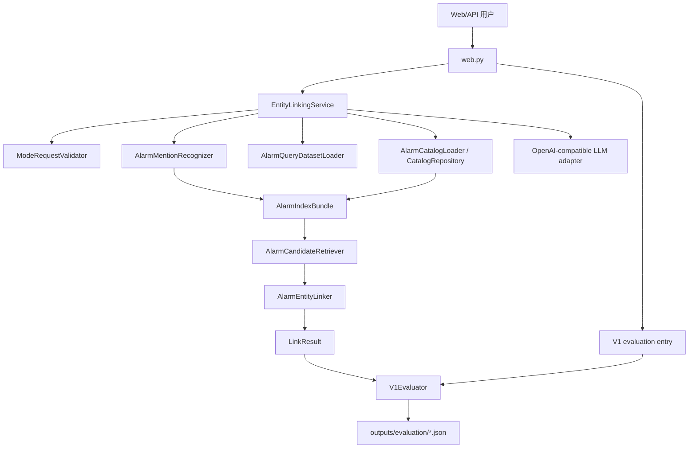

# DVEntityLinking V1 功能设计说明书

---

> 文档治理说明：本文是 V1 SR 主输出件，按版本保留。原过程性评审、处置和闭环文件已合并到 [../../releases/V1.md](../../releases/V1.md)；需要原始过程细节时通过 Git 历史追溯。

## 基本信息

| 项目 | 内容 |
| --- | --- |
| 特性名称 | DVEntityLinking V1 alarm 实体链接增强 |
| 版本号 | V1 |
| 文档版本 | V1.3 |
| 编写日期 | 2026-06-01 |
| 编写人 | Codex |
| 审核人 | 功能设计闭环验证已完成 |
| 当前状态 | 功能设计评审闭环已通过，结论为 closed with recorded residual documentation hygiene follow-up，可作为 V1 代码实现输入 |

## 版本历史

| 版本号 | 修改日期 | 修改人 | 修改描述 |
| --- | --- | --- | --- |
| V1.0-draft | 2026-05-31 | Codex | 基于已闭环 V1 需求和 SR addendum 形成 V1 功能设计初稿。 |
| V1.1-draft | 2026-05-31 | Codex | 根据独立功能设计评审补充模块归属、schema/error 契约、not_required 判定、评测报告、测试追踪和安全投影。 |
| V1.2 | 2026-05-31 | Codex | 根据功能设计闭环验证结论更新文档状态为功能设计评审闭环已通过。 |
| V1.3 | 2026-06-01 | Codex | 根据用户 V1 验收反馈，将样例契约和 Web 默认展示收敛为核心实体链接信息，承接 `v1.alarm_entity.2` / `v1.alarm_query.2`。 |

---

# 1 概述

## 1.1 目的

本文档把已闭环的 V1 需求和 SR 分解 addendum 转换为可实现、可测试、可评审的功能设计。设计重点是 V1 `alarm` only 实体链接链路，包括 Web/API LLM 模式切换、`alarm` catalog 加载、Query dataset 校验、mention 识别、候选召回、实体链接、评测器和安全配置日志边界。

预期读者：

- V1 功能设计独立评审者。
- V1 代码实现负责人。
- V1 测试设计与测试开发负责人。
- 后续运维 Copilot 和故障 Agent 集成规划人员。

## 1.2 范围

### 范围内

| 范围 | 说明 |
| --- | --- |
| Web/API LLM 模式 | 支持 `offline_demo`、`llm_enabled_demo`、`allow_fallback`、结构化状态和错误投影。 |
| `alarm` catalog | 加载 `samples/real/entity_examples.json`，校验 `v1.alarm_entity.2` 最小字段。 |
| Query dataset | 加载 `samples/real/query_samples.json`，校验 `v1.alarm_query.2`、span、expected entity 和 fail-closed 规则。 |
| Mention 识别 | 支持告警 ID、数字别名、名称、ID+名称，限制 V1 每 Query 最多 1 个 mention。 |
| 内存索引和候选召回 | 构建 exact alarm id、numeric alias、normalized name/alias、token index，并提供 Top-K 去重候选。 |
| 链接状态判定 | 输出 `linked`、`ambiguous`、`no_match`、`not_required`，不把 validation/LLM 错误伪装成链接状态。 |
| V1 evaluator | 基于 16 条 Query 样例计算 TP/FP/FN/TN、precision、recall、pass/fail 和失败明细。 |
| 安全边界 | 保持本地真实配置 ignored，过滤敏感字段，不保存完整 LLM 请求响应。 |

### 范围外

| 非范围 | 说明 |
| --- | --- |
| V2+ 实体类型 | V1 不设计除 `alarm` 外的实体类型。 |
| 多实体 Query | V1 每条 Query 最多 1 个实体词，多实体 Query 留到后续迭代。 |
| 真实 DV 接口拉取 | V1 告警类不接 DV 运行时实例化接口。 |
| 生产级检索基础设施 | 不引入三方检索组件、向量库或 SQLite FTS5 必需实现。 |
| 生产原始 payload 处理平台 | V1 不处理完整生产 payload 或完整 LLM 请求响应日志。 |

## 1.3 缩略语和术语

| 缩略语/术语 | 英文全称 | 中文解释 |
| --- | --- | --- |
| DV | DigitalView-SW | 面向运营商领域的电信软件网管系统 |
| IR | Issue Requirement | 需求项 |
| SR | Sub Requirement | 子需求 |
| LLM | Large Language Model | 大语言模型 |
| Top-K | Top K Results | 返回排序前 K 个结果 |
| TP | True Positive | Query 级正确命中 |
| FP | False Positive | Query 级误链接 |
| FN | False Negative | Query 级漏召回 |
| TN | True Negative | Query 级正确拒绝匹配 |
| fail-closed | Fail Closed | 校验失败时停止使用该输入，不部分加载、不继续给出成功结果 |

## 1.4 参考文献

| 文档名称 | 文档编号 | 版本 | 来源 |
| --- | --- | --- | --- |
| V1 需求分析 | IR-DVEntityLinking-v1-requirements-analysis | V1.5-draft | [IR.md](./IR.md) |
| V1 SR 分解 addendum | IR-DVEntityLinking-v1-sr-decomposition-addendum | V1.7-addendum-draft | [IR-SR-DECOMPOSITION.md](./IR-SR-DECOMPOSITION.md) |
| V1 SR addendum 闭环验证 | V1 release record | Closed | [../../releases/V1.md](../../releases/V1.md) |
| V1 用户决策 | DECISIONS | 当前 | [../../current/DECISIONS.md](../../current/DECISIONS.md) |
| V1 样例契约 | DATA_CONTRACT | 当前 | [../../current/DATA_CONTRACT.md](../../current/DATA_CONTRACT.md) |
| V0 功能设计 | SR-DVEntityLinking-function-design | V0.3 | [SR-DVEntityLinking-function-design.md](./SR-DVEntityLinking-function-design.md) |
| DV SR 模板 | SR-templates | 当前 | `D:\workspace\analysis_and_design\templates\SR-templates.md` |

---

# 2 需求实现设计

## 2.1 总体设计方案概述

V1 采用 V0 单进程 Flask demo 架构的增量设计，不替换 V0 主流程。V1 的主变化是把默认实体目录切换到 `alarm` catalog，并在现有 catalog/extraction/linking/retrieval/evaluation/web 模块上增加 schema-aware loader、alarm-specific index、Query dataset evaluator 和更明确的 Web/API mode 状态。



### 2.1.1 模块划分

| 模块 | Python 包/文件建议 | 职责 | 非职责 |
| --- | --- | --- | --- |
| Models | `models.py` | 增补 `EntityType.ALARM`、`Status.NOT_REQUIRED`、V1 query/evaluation dataclasses 和错误码。 | 不做文件 IO 或业务判定。 |
| Config / Mode | `service.py`、`web.py` | 校验 `mode`、`allow_fallback`，投影 invalid parameter 和 validation error。 | 不直接调用 LLM。 |
| Alarm Catalog | `catalog.py` | 加载和校验 `v1.alarm_entity.2`，构建 alarm catalog。 | 不拉取真实 DV 运行时接口。 |
| Query Dataset | `dv_entity_linking.datasets` | 加载和校验 `v1.alarm_query.2`，fail-closed。 | 不进入普通 `/api/link` 链路。 |
| Alarm Mention | `extraction.py` | 识别并规范化一个 alarm mention，执行 not_required 前置绕过。 | 不处理多实体 Query。 |
| Alarm Index/Retrieval | `dv_entity_linking.alarm_index` | exact ID、numeric alias、name/alias、token index 和 Top-K 去重候选。 | 不引入外部检索组件；不读取样例 JSON。 |
| Alarm Linking | `linking.py` | 根据 CandidateSet 输出 linked/ambiguous/no_match/not_required。 | 不把 dependency/validation error 伪装成链接状态。 |
| V1 Evaluator | `evaluation.py`、`scripts/run_v1_evaluation.py` | 执行 16 条样例评测，输出 TP/FP/FN/TN、precision、recall 和失败明细。 | 不替代真实 LLM smoke。 |
| Security / Run Record | `evaluation.py`、`web.py`、`config/README.md` | redaction、安全状态展示、ignored path 约束。 | 不保存完整请求响应。 |

### 2.1.2 依赖方向

- `models.py` 只定义结构和枚举，被所有模块依赖。
- `catalog.py` 和 Query dataset loader 只依赖 `models.py`。
- `extraction.py` 可依赖 catalog/index 和 LLM adapter，但必须有 offline path。
- `linking.py` 依赖 candidate retriever，不直接读取 JSON 文件。
- `evaluation.py` 依赖 service/linker/query dataset，不依赖 Web。
- `web.py` 只依赖 service/evaluator/config，不越过 service 直接操作业务细节。

### 2.1.3 Runtime Handoff

| 交接对象 | 生产者 | 消费者 | 关键字段 | 异常传递 |
| --- | --- | --- | --- | --- |
| `Mention` | `AlarmMentionRecognizer` | `AlarmCandidateRetriever`、`AlarmEntityLinker` | `text`、`span`、`normalized_text`、`source`、`confidence` | not_required 前置绕过、多 mention 限制、LLM schema error |
| `CandidateSet` | `AlarmCandidateRetriever` | `AlarmEntityLinker`、`V1Evaluator` | `entity_id`、`score`、`match_reason`、`rank`、`dedup_key` | index validation error、短 ID 子串保护、Top-K 去重 |
| `LinkResult` | `AlarmEntityLinker` | `V1Evaluator`、Web/API | `status`、`candidates`、`top_entity`、`error_code`、`result_source` | ambiguous 保留候选、negative 空候选、validation/LLM error 非链接状态 |

### 2.1.4 V1 模块归属和依赖边界

V1 实现必须采用确定模块归属，避免在实现阶段自行选择位置或把 evaluator 数据集校验放到 `/api/link` 正常链路中。

| 模块 | 文件归属 | 对外对象 | 允许依赖 | 禁止依赖/禁止职责 |
| --- | --- | --- | --- | --- |
| Mode/API contract | `web.py`、`service.py` | `ModeRequest`、`ModeStatus`、`ApiError` | `models.py`、`service.py` | 不直接读取 Query dataset；invalid request 不调用 linker。 |
| Alarm catalog validation | `catalog.py` | `AlarmCatalogState`、`CatalogValidationError` | `models.py` | 不调用 evaluator；不拉取真实 DV 接口。 |
| Query dataset validation | 新增 `datasets.py` | `QueryDataset`、`QuerySample`、`MentionAnnotation`、`ExpectedEntity`、`DatasetValidationError` | `models.py`、catalog entity id set | 不被 `/api/link` 正常链路依赖；只供 evaluator、样例检查和 status summary 使用。 |
| Alarm index and retrieval | 新增 `alarm_index.py` | `AlarmIndexBundle`、`CandidateSet`、`Candidate` | `models.py`、`catalog.py` | 不读取 JSON；不做最终 linked/ambiguous 状态判定。 |
| Mention recognition | `extraction.py` | `Mention`、`NotRequiredDecision` | `models.py`、`alarm_index.py`、`llm.py` | 不加载 Query dataset；不返回多 mention 结果。 |
| Alarm linking | `linking.py` | `LinkResult` | `models.py`、`alarm_index.py` | 不写评测报告；不把 validation/dependency error 映射为链接状态。 |
| Evaluation/report | `evaluation.py` | `EvaluationCaseResult`、`MetricSummary`、`EvaluationReport` | `datasets.py`、`service.py`、`models.py` | 不提供 Web/API 链接运行时依赖；不保存敏感字段。 |
| Security/redaction | `evaluation.py`、`web.py`、`config/README.md` | `sanitize_for_record`、safe status projection | `models.py` | 不输出 raw LLM request/response、base URL、traceback。 |

| 路径 | 加载内容 | 不应加载 |
| --- | --- | --- |
| `/api/status` | catalog summary、safe LLM status、可选 Query dataset validation summary | 不读取 ignored raw payload；不暴露 base URL。 |
| `/api/link` | catalog 和 alarm index | 不加载 evaluator-only Query dataset；不因 query dataset 损坏阻塞普通链接。 |
| `V1Evaluator.run()` | catalog、alarm index、Query dataset | 不调用 Web 层；不依赖真实 LLM 默认路径。 |

### 2.1.5 V1 schema、枚举和错误码迁移

V1 需在保持 V0 枚举和 JSON 行为兼容的基础上增量添加以下字段。旧 V0 类型、状态和测试不得删除或改义。

| 类型 | 新增项 | 值/类型 | 说明 |
| --- | --- | --- | --- |
| `EntityType` | `ALARM` | `"alarm"` | V1 唯一新增实体类型。 |
| `Status` | `NOT_REQUIRED` | `"not_required"` | Query 无实体链接需求。 |
| `ErrorCode` | `INVALID_MODE` | `"invalid_mode"` | `mode` 不在允许枚举内。 |
| `ErrorCode` | `INVALID_ALLOW_FALLBACK` | `"invalid_allow_fallback"` | `allow_fallback` 不是 JSON boolean。 |
| `ErrorCode` | `QUERY_DATASET_LOAD_FAILED` | `"query_dataset_load_failed"` | Query dataset fail-closed。 |
| `ErrorCode` | `VALIDATION_FAILED` | `"validation_failed"` | catalog/query validation 聚合错误。 |

#### 2.1.5.1 `ModeRequest`

| 字段 | 类型 | 必填 | 默认值 | 说明 |
| --- | --- | --- | --- | --- |
| `query` | string | 是 | 无 | 用户 Query；空白 Query 返回 `invalid_input`。 |
| `mode` | enum/string | 否 | 启动默认 `offline_demo` | 仅允许 `offline_demo`、`llm_enabled_demo`。 |
| `allow_fallback` | boolean | 否 | `true` | 必须是 JSON boolean；字符串 `"false"` 是非法输入。 |

#### 2.1.5.2 `ModeStatus`

| 字段 | 类型 | 必填 | 说明 |
| --- | --- | --- | --- |
| `requested_mode` | string | 是 | 请求或默认 mode。 |
| `effective_mode` | string/null | 是 | 实际执行 mode；invalid request 时为 null。 |
| `llm_enabled` | boolean | 是 | 是否尝试 LLM nominal path。 |
| `degraded` | boolean | 是 | 是否降级或错误。 |
| `fallback_allowed` | boolean | 是 | 本次是否允许 fallback。 |
| `fallback_used` | boolean | 是 | 是否实际 fallback。 |
| `error_code` | string/null | 是 | 结构化错误码。 |
| `provider` | string/null | 是 | allowlist 后的 provider 摘要。 |
| `model_alias` | string/null | 是 | 模型别名或脱敏模型名。 |
| `result_source` | string | 是 | `offline_index`、`llm`、`fallback_offline`、`none`。 |

#### 2.1.5.3 核心对象字段

| 对象 | 必填字段 | 说明 |
| --- | --- | --- |
| `ApiError` | `error_code`、`message`、可选 `field/query_id` | message 必须脱敏，不含 traceback、URL、token 或 raw payload。 |
| `Candidate` | `entity_id`、`entity_type`、`canonical_name`、`score`、`rank`、`match_reason`、`evidence` | `match_reason` 枚举包含 `alarm_id_exact`、`numeric_alias_exact`、`name_exact`、`token_overlap`、`llm_assisted`。 |
| `CandidateSet` | `mention`、`items`、`top_k`、`deduplicated`、`index_version` | 返回前按 `entity_id` 去重。 |
| `LinkResult` | `status`、`mode_status`、`candidates`、`errors` | no_match/not_required/invalid/dependency error 时 candidates 为空。 |
| `EvaluationReport` | `schema_version`、`summary`、`cases`、`failures`、`safe_config`、`redaction_applied` | schema version 为 `v1.alarm_evaluation_report.1`。 |

### 2.1.6 API error projection

| 场景 | HTTP status | `status` | `mode_status.result_source` | 其他要求 |
| --- | --- | --- | --- | --- |
| invalid `mode` | 400 | `invalid_input` | `none` | `errors[0].field="mode"`、无 candidates/linked_entity。 |
| invalid `allow_fallback` | 400 | `invalid_input` | `none` | `errors[0].field="allow_fallback"`、无 candidates/linked_entity。 |
| catalog validation failure | 503 | `dependency_failed` | `none` | V1 默认投影为 `error_code=catalog_load_failed`。 |
| query dataset validation failure on evaluator | 非 Web API | evaluator fail-closed | `none` | 不生成 pass report。 |
| LLM failure + fallback true | 200 | 业务链接状态 | `fallback_offline` | `degraded=true`、`fallback_used=true`。 |
| LLM failure + fallback false | 503 | `dependency_failed` | `none` | 不返回离线链接结果。 |

`allow_fallback` 只接受 JSON boolean。字符串、数字、null 均视为 `invalid_allow_fallback`。invalid request 必须在 service/linker 调用前返回。

### 2.1.7 `not_required` 与 alarm mention 判定状态机

V1 不再沿用“无 mention 即 no_match”的默认语义。判定顺序如下：

```text
empty query -> invalid_input
query matches not-required intent rules -> not_required, bypass_reason
query has alarm-shaped mention -> candidate retrieval -> linked/ambiguous/no_match
query has no alarm-shaped mention -> not_required, bypass_reason=no_alarm_intent
```

| 规则 | 示例 | reason |
| --- | --- | --- |
| 查询系统摘要、拓扑概览、健康度、操作入口且无 alarm-shaped token | “查看今天的网络健康概览” | `no_alarm_intent` |
| 用户明确要求非告警对象且无 alarm-shaped token | “打开工单列表” | `non_alarm_task` |
| QuerySample 标注为 `not_required` | Q-015、Q-016 | `sample_expected_not_required` |

alarm-shaped mention rules：

| 形态 | 规则 | 说明 |
| --- | --- | --- |
| full alarm ID | `(?i)(?<![A-Z0-9])ALM-\d{3,}(?![A-Z0-9])` | 保留 raw span；大小写归一为大写。 |
| numeric alias | `(?<!\d)\d{6,}(?!\d)` | V1 高置信数字别名至少 6 位；短数字只可作为 no_match 形态，不可直接命中。 |
| short numeric shape | `(?<!\d)\d{1,5}(?!\d)` | 可触发 no_match，但不得 substring 命中长 ID。 |
| name phrase | canonical/alias token sequence | 按 token 边界匹配，不跨词裸 substring。 |

`ALM-5102` 不得命中 `ALM-51020`；`51` 不得命中 `ALM-151` 或 `ALM-51020`；fuzzy/text similarity 不能对 alarm ID 或 numeric alias 产生高置信 exact reason。

### 2.1.8 V1 evaluator 计算和报告算法

```text
for each QuerySample:
  run link query in offline_demo
  compare result.status and candidates with expected_status/entities
  assign tp/fp/fn/tn and failure_reason
aggregate:
  precision = TP / (TP + FP)
  recall = TP / (TP + FN)
```

| expected_status | pass 计数 | fail 计数 |
| --- | --- | --- |
| `linked` | `TP += 1` | 无候选或 Top-1 未命中：`FN += 1`；若返回错误实体候选：另 `FP += 1`。 |
| `ambiguous` | `TP += 1` | 状态不是 ambiguous 或 Top-5 未覆盖全部 expected entities：`FN += 1`；候选含非 expected entity：另 `FP += 1`。 |
| `no_match` | `TN += 1` | 任一实体候选：`FP += 1`，`negative_false_positive += 1`。 |
| `not_required` | `TN += 1` | 任一实体候选：`FP += 1`，`negative_false_positive += 1`。 |

当 `TP + FP = 0` 时，`precision=1.0`，`precision_note=no_positive_predictions`。当 `TP + FN = 0` 时，`recall=1.0`，`recall_note=no_expected_positive_cases`。

`EvaluationCaseResult` 必须包含 `id`、`expected_status`、`actual_status`、`passed`、`tp`、`fp`、`fn`、`tn`、`expected_entity_ids`、`actual_entity_ids`、`failure_reason`。`MetricSummary` 必须包含 `total`、`passed`、`failed`、`tp`、`fp`、`fn`、`tn`、`negative_false_positive`、`precision`、`recall`、`precision_note`、`recall_note`。

### 2.1.9 Catalog 和 Query metadata validation

Catalog metadata 必须校验 `schema_version=v1.alarm_entity.2`、`entity_type_scope=["alarm"]`、`entity_count` 等于实际实体数且大于 0。每条 entity 必须包含 `entity_id`、`entity_type=alarm`、`canonical_name`、非空 `aliases` 和 `description`。V1 样例契约不要求 `data_layer`、`source`、`can_commit`、`sensitive_level` 或 `attributes`。

Query metadata 必须校验 `schema_version=v1.alarm_query.2`、`max_one_entity_mention_per_query=true`、`query_count` 等于实际 Query 数。每条 Query 必须包含 `id`、`query`、`mentions`、`expected_entities` 和 `expected_status`；有 mention 时必须校验 `text`、`span`、`expected_entity_ids`；`not_required` 必须 `mentions=[]` 且 `expected_entities=[]`。

### 2.1.10 安全投影和 redaction allowlist

Web/API status、run record 和 evaluator report 对 LLM 配置采用 allowlist 输出：只允许 `llm_enabled`、脱敏 `provider`、`model_alias`、`degraded` 和 `error_code`。禁止输出 raw URL/host。

Forbidden key fragments 扩展为：`api_key`、`token`、`cookie`、`authorization`、`password`、`secret`、`payload`、`raw_request`、`raw_response`、`llm_full_log`、`base_url`、`api_base`、`endpoint_url`、`host`、`url`、`traceback`、`exception`。

异常消息只保留 error code 和短消息；不得记录完整 stack trace、完整 URL、Authorization header、完整请求或完整响应。提交前敏感扫描必须覆盖 `.gitignore` 中的 `config/llm.local.json`、`outputs/`、`samples/local_real_dv/` ignored 状态。

## 2.2 需求分解

### IR-V1-001 DVEntityLinking V1 alarm 实体链接增强

#### 2.2.1.1 IR 原始描述

V1 需要支持 Web demo LLM 模式切换，基于用户确认可提交的真实启动样例完成 `alarm` 实体结构和 Query 标注基线，规划并实现无三方检索组件的内存索引和评测链路。

#### 2.2.1.2 IR 结构化信息

| 字段 | 内容 |
| --- | --- |
| 需求优先级 | 高 |
| 需求类型 | 功能性需求 + 非功能性需求 |
| 涉及模块 | Web/API、catalog、dataset、extraction、linking、retrieval、evaluation、security |

#### 2.2.1.3 IR 与 SR 的分解关系

| IR 编号 | SR 编号 | 分解说明 |
| --- | --- | --- |
| IR-V1-001 | SR-V1-A01 | Web/API LLM 模式切换与状态输出 |
| IR-V1-001 | SR-V1-A02 | `alarm` 实体 schema 与预置 catalog 加载 |
| IR-V1-001 | SR-V1-A03 | Query 样例 schema、评测数据集加载与校验 |
| IR-V1-001 | SR-V1-A04 | alarm mention 识别边界与规范化 |
| IR-V1-001 | SR-V1-A05 | alarm 实体链接与状态判定 |
| IR-V1-001 | SR-V1-A06 | 内存索引、候选召回与排序解释 |
| IR-V1-001 | SR-V1-A07 | V1 评测器与验收指标 |
| IR-V1-001 | SR-V1-A08 | 安全、配置和日志边界 |

### 2.2.2 SR-V1-A01 Web/API LLM 模式切换与状态输出

#### 2.2.2.1 SR 描述

Web/API 必须支持 `mode` 和 `allow_fallback`，默认 `mode=offline_demo`、`allow_fallback=true`，并返回 requested/effective mode、fallback、LLM 和 error 状态。

#### 2.2.2.2 SR 实现思路

新增 `ModeRequest` 和 `ModeStatus` 设计对象，由 Web/API 入口先完成参数校验，再调用 service。参数错误不进入实体链接：

| 输入 | 规则 |
| --- | --- |
| `mode` 缺失 | 使用启动配置默认值 `offline_demo`。 |
| `mode` 非枚举 | 返回 `invalid_mode`，`result_source=none`。 |
| `allow_fallback` 缺失 | 使用启动配置默认值 `true`。 |
| `allow_fallback` 非 boolean | 返回 `invalid_allow_fallback`，`result_source=none`。 |
| LLM 失败且 `allow_fallback=true` | 降级 offline，`fallback_used=true`。 |
| LLM 失败且 `allow_fallback=false` | 返回结构化 dependency/error，`result_source=none`。 |

#### 2.2.2.3 功能实现刷新

```text
HTTP request
  -> parse ModeRequest
  -> validate enum/boolean
  -> load catalog/index status
  -> execute link_query
  -> attach ModeStatus to response
```

### 2.2.3 SR-V1-A02 `alarm` 实体 schema 与预置 catalog 加载

#### 2.2.3.1 SR 描述

V1 默认加载 `samples/real/entity_examples.json`，只接受 `schema_version=v1.alarm_entity.2`、`entity_type=alarm` 和最小字段可提交样例。

#### 2.2.3.2 SR 实现思路

扩展 `EntityType` 增加 `ALARM = "alarm"`。`CatalogRepository` 保持通用能力，增加 V1 alarm schema validation：

| 校验项 | 失败错误码 |
| --- | --- |
| 文件不存在或非法 JSON | `catalog_load_failed` |
| schema_version 不匹配 | `catalog_load_failed` |
| 非 `alarm` 类型 | `catalog_load_failed` |
| 重复 `entity_id` | `catalog_load_failed` |
| 重复高置信告警号/数字别名 | `catalog_load_failed` |
| 缺失核心字段或重复高置信别名 | `catalog_load_failed` |

#### 2.2.3.3 功能实现刷新

加载成功后生成 `AlarmCatalogState`，包含 `entities_by_id`、`alias_index`、`numeric_alias_index`、`canonical_index` 和 provenance summary。加载失败必须 fail-closed，不允许部分加载。

### 2.2.4 SR-V1-A03 Query 样例 schema、评测数据集加载与校验

#### 2.2.4.1 SR 描述

V1 默认加载 `samples/real/query_samples.json`，形成 `QuerySample` 列表作为 evaluator 输入。

#### 2.2.4.2 SR 实现思路

新增 `QueryDatasetLoader`，输出 `QueryDataset` 或 `ValidationErrorList`。异常清单必须覆盖：

| 校验项 | 规则 |
| --- | --- |
| 文件和 JSON | 缺失文件、非法 JSON fail-closed。 |
| metadata | `schema_version=v1.alarm_query.2`，`query_count`，`max_one_entity_mention_per_query=true`。 |
| `query_count` | 必须等于实际 query 数。 |
| ID | `id` 必填且不能重复。 |
| status | 仅允许 `linked`、`ambiguous`、`no_match`、`not_required`。 |
| mention | 每条最多 1 个；span 0-based end-exclusive 且文本一致。 |
| expected entity | 引用必须存在于 catalog。 |
| negative | `no_match`/`not_required` 必须有 `negative_reason`。 |
| cardinality | `linked` 必须 1 个 expected entity，`ambiguous` 至少 2 个。 |

#### 2.2.4.3 功能实现刷新

无效 Query dataset 不得用于 evaluator 结果，不得产生部分 pass/fail 报告；Web/API 对校验失败投影为 structured validation error。

### 2.2.5 SR-V1-A04 alarm mention 识别边界与规范化

#### 2.2.5.1 SR 描述

V1 每条 Query 最多输出 1 个 alarm mention，支持 ID、数字别名、名称和 ID+名称组合。

#### 2.2.5.2 SR 实现思路

设计 `AlarmMentionRecognizer`，优先级为：

1. exact alarm id，例如 `ALM-505001314`。
2. numeric alias，例如 `505001314`。
3. canonical/alias 完整名称。
4. token name hit。
5. LLM-assisted mention，需通过 schema 校验。

短 ID 和数字别名必须使用 token boundary，不使用裸 substring 高置信匹配。not_required 可通过 QuerySample 或规则前置绕过，返回 `status=not_required`，不调用 candidate retriever。

### 2.2.6 SR-V1-A05 alarm 实体链接与状态判定

#### 2.2.6.1 SR 描述

根据 Mention 和 CandidateSet 输出 `linked`、`ambiguous`、`no_match`、`not_required`，并带排序解释。

#### 2.2.6.2 SR 实现思路

| 状态 | 判定规则 |
| --- | --- |
| `linked` | Top-1 唯一且高置信命中。 |
| `ambiguous` | 多个合理候选分数接近或同一实体词命中多个 expected-compatible 实体。 |
| `no_match` | 有实体形态但没有可接受候选。 |
| `not_required` | Query 无实体链接需求，候选为空。 |
| validation/dependency error | 不映射为链接状态，使用 structured error。 |

### 2.2.7 SR-V1-A06 内存索引、候选召回与排序解释

#### 2.2.7.1 SR 描述

构建 Python 内存索引，支撑 exact ID、numeric alias、name/alias、token index 和 Top-K 去重候选。

#### 2.2.7.2 SR 实现思路

`AlarmIndexBundle` 包含：

| 索引 | key | value | 用途 |
| --- | --- | --- | --- |
| `alarm_id_index` | normalized `ALM-*` | entity_id set | 告警号精确匹配 |
| `numeric_alias_index` | boundary numeric token | entity_id set | 数字别名精确匹配 |
| `name_index` | normalized canonical/alias | entity_id set | 名称精确匹配 |
| `token_index` | lower token | entity_id set | 轻量召回 |

排序分数采用 deterministic weights：exact alarm id > numeric alias > canonical/name exact > alias token > fuzzy。每个 candidate 输出 `match_reason` 和 evidence。Top-K 默认 5，先按 entity_id 去重。

### 2.2.8 SR-V1-A07 V1 评测器与验收指标

#### 2.2.8.1 SR 描述

基于 V1 Query 样例执行 evaluator，输出 Query 级 pass/fail、TP/FP/FN/TN、precision、recall 和失败明细。

#### 2.2.8.2 SR 实现思路

`V1Evaluator` 流程：

```text
load alarm catalog
  -> load query dataset
  -> for each QuerySample run link_query(mode=offline_demo)
  -> score against expected_status and expected_entities
  -> aggregate metrics
  -> write safe summary report
```

计数规则承接 addendum 5.3：

| expected_status | pass 条件 | fail 计数 |
| --- | --- | --- |
| linked | Top-1 命中 | FN=1；错误实体另 FP=1 |
| ambiguous | Top-5 覆盖全部 expected entities 且状态 ambiguous | FN=1；额外非 expected 候选另 FP=1 |
| no_match | 空候选 | 任一候选 FP=1 |
| not_required | 绕过或空候选 | 任一候选 FP=1 |

启动样例集验收阈值为所有样例 pass、negative false positive=0、precision=1.0、recall=1.0。

### 2.2.9 SR-V1-A08 安全、配置和日志边界

#### 2.2.9.1 SR 描述

本地真实 LLM 配置可用于 smoke，但不得进入提交、文档、Web/API 输出或完整日志。

#### 2.2.9.2 SR 实现思路

- `config/llm.local.json` 保持 ignored。
- `config/llm.example.json` 只使用 `api_key_env`。
- `ModeStatus.provider` 和 `model_alias` 只展示脱敏摘要。
- `RunRepository` 和 evaluator report 复用/扩展 `sanitize_for_record`。
- 敏感 key 匹配继续覆盖 `api_key`、`token`、`cookie`、`authorization`、`password`、`secret`、`payload`、`raw_request`、`raw_response`、`llm_full_log`。

---

# 3 接口设计

## 3.1 接口概述

| 接口 | 类型 | 变更 |
| --- | --- | --- |
| `/api/status` | HTTP GET | 增加 mode、LLM safe status、V1 catalog/query dataset validation summary。 |
| `/api/link` | HTTP POST | 增加 `mode`、`allow_fallback` 参数校验和 ModeStatus 输出。 |
| `V1Evaluator.run()` | 内部接口 | 新增 V1 样例评测入口。 |
| `scripts/run_v1_evaluation.py` | CLI | 新增本地评测脚本入口，后续实现阶段创建。 |

## 3.2 ER 接口设计

### 3.2.1 `/api/link`

| 项目 | 内容 |
| --- | --- |
| 接口 ID | ER-V1-LINK |
| 接口路径 | `/api/link` |
| 请求方法 | POST |
| 请求参数 | `query: string`、`mode?: offline_demo|llm_enabled_demo`、`allow_fallback?: boolean` |
| 返回参数 | `status`、`mode_status`、`mention_results`、`candidates`、`linked_entity`、`error_code`、`result_source` |
| 错误码 | `invalid_input`、`invalid_mode`、`invalid_allow_fallback`、`catalog_load_failed`、`query_dataset_load_failed`、`llm_*` |

### 3.2.2 `/api/status`

| 项目 | 内容 |
| --- | --- |
| 接口 ID | ER-V1-STATUS |
| 接口路径 | `/api/status` |
| 请求方法 | GET |
| 返回参数 | `default_mode`、`llm_enabled`、`llm_degraded`、`provider`、`model_alias`、`catalog_loaded`、`entity_count`、`entity_type_counts`、`query_dataset_loaded` |
| 安全要求 | 不返回 API key、base URL 原文、Authorization header 或完整错误堆栈。 |

## 3.3 IR 接口设计

### 3.3.1 `QueryDatasetLoader.load(path, catalog)`

| 项目 | 内容 |
| --- | --- |
| 输入 | Query 样例路径、catalog entity ids |
| 输出 | `QueryDataset` 或抛出 `DatasetValidationError` |
| 错误 | fail-closed，结构化 errors 列出 field、query_id、error_code、message |

### 3.3.2 `V1Evaluator.run(catalog_path, query_path, mode)`

| 项目 | 内容 |
| --- | --- |
| 输入 | catalog path、query path、mode，默认 offline |
| 输出 | `EvaluationReport` |
| 错误 | catalog/query validation failure 时不生成 pass 结果 |

---

# 4 数据库设计

V1 不引入数据库和持久化索引。

## 4.1 内存索引设计

| 索引名 | 字段 | 类型 | 说明 |
| --- | --- | --- | --- |
| `alarm_id_index` | aliases/canonical alarm id | dict[str, set[str]] | 精确告警号召回。 |
| `numeric_alias_index` | numeric aliases | dict[str, set[str]] | 数字别名召回，要求 token boundary。 |
| `name_index` | canonical/aliases normalized | dict[str, set[str]] | 名称/别名精确召回。 |
| `token_index` | tokenized names | dict[str, set[str]] | 轻量 token 倒排。 |

## 4.2 数据迁移

无数据迁移。V1 只读取 `samples/real` 中用户确认可提交的启动样例。

---

# 5 部署设计

## 5.1 部署架构

V1 仍为本地单进程 demo：

- Web/API：Flask。
- 数据：本地 JSON 样例。
- LLM：可选 OpenAI-compatible endpoint，本地配置 ignored。
- 输出：`outputs/` 下本地报告和运行摘要，默认 ignored。

## 5.2 配置项

| 配置项 | 默认值 | 说明 | 是否可热更新 |
| --- | --- | --- | --- |
| `catalog_path` | `samples/real/entity_examples.json` | V1 alarm catalog。 | 否 |
| `query_dataset_path` | `samples/real/query_samples.json` | V1 evaluator dataset。 | 否 |
| `default_mode` | `offline_demo` | Web/API 默认模式。 | 否 |
| `allow_fallback` | `true` | LLM 失败是否降级。 | 请求级可覆盖 |
| `top_k` | `5` | 候选和 ambiguous 评测默认 K。 | 请求级可覆盖 |
| `llm_config_path` | `config/llm.local.json` | 本地真实 LLM 配置，ignored。 | 否 |

## 5.3 依赖组件

| 组件名称 | 版本要求 | 用途 |
| --- | --- | --- |
| Python | 3.12 | 主运行环境。 |
| Flask | `>=3,<4` | Web/API demo。 |
| OpenAI-compatible API | 本地配置 | 可选 LLM nominal path。 |

---

# 6 测试设计

## 6.1 测试场景

| 场景编号 | 场景名称 | 前置条件 | 测试步骤 | 预期结果 |
| --- | --- | --- | --- | --- |
| TS-V1-001 | Alarm catalog 加载 | `samples/real/entity_examples.json` 存在 | 加载 catalog | 9 个 `alarm` 实体加载成功，schema/provenance 通过。 |
| TS-V1-002 | Query dataset 校验 | Query 样例存在 | 加载 dataset | 16 条 Query 校验通过，span 和 expected refs 一致。 |
| TS-V1-003 | invalid API parameter | Web/API 可用 | 传非法 mode/allow_fallback | 返回 `invalid_mode` 或 `invalid_allow_fallback`，不进入链接。 |
| TS-V1-004 | linked 正例 | catalog 和 dataset 加载成功 | 运行 linked 样例 | Top-1 命中 expected entity。 |
| TS-V1-005 | ambiguous 样例 | catalog 和 dataset 加载成功 | 运行 ambiguous 样例 | 状态 ambiguous，Top-5 覆盖全部 expected entities。 |
| TS-V1-006 | no_match 样例 | catalog 和 dataset 加载成功 | 运行 no_match 样例 | 候选为空，FP=0。 |
| TS-V1-007 | not_required 样例 | catalog 和 dataset 加载成功 | 运行 not_required 样例 | 绕过召回或空候选，FP=0。 |
| TS-V1-008 | 短 ID 子串保护 | catalog 加载成功 | Query 包含短 ID `51`、`999`、`ALM-5102` | 不裸 substring 命中长 ID。 |
| TS-V1-009 | LLM fallback | 本地 LLM 不可用或模拟失败 | `llm_enabled_demo` + fallback | 结构化 degraded，允许时 fallback，不允许时 result_source=none。 |
| TS-V1-010 | 安全扫描 | 本地真实配置存在 | 执行报告和 run record | 不输出 key、base URL 原文、完整请求响应。 |

## 6.2 测试用例

| 用例编号 | 用例名称 | 所属场景 | 优先级 | 设计者 |
| --- | --- | --- | --- | --- |
| TC-V1-CATALOG-001 | alarm catalog schema success/failure | TS-V1-001 | 高 | 测试设计阶段 |
| TC-V1-DATASET-001 | Query dataset fail-closed validation | TS-V1-002 | 高 | 测试设计阶段 |
| TC-V1-API-001 | mode and allow_fallback validation | TS-V1-003 | 高 | 测试设计阶段 |
| TC-V1-LINK-001 | linked/ambiguous/no_match/not_required status | TS-V1-004 至 TS-V1-007 | 高 | 测试设计阶段 |
| TC-V1-RETR-001 | short ID substring guard and Top-K dedup | TS-V1-008 | 高 | 测试设计阶段 |
| TC-V1-EVAL-001 | evaluator metrics formula and threshold | TS-V1-004 至 TS-V1-008 | 高 | 测试设计阶段 |
| TC-V1-SEC-001 | LLM config/log/report redaction | TS-V1-009 至 TS-V1-010 | 高 | 测试设计阶段 |

## 6.3 验收标准

| 类别 | 标准 |
| --- | --- |
| Catalog | V1 9 个 alarm 实体加载成功；非法 catalog fail-closed。 |
| Dataset | V1 16 条 Query 加载成功；异常 dataset fail-closed。 |
| Linking | linked Top-1 命中，ambiguous Top-5 覆盖，no_match/not_required 空候选。 |
| Metrics | 所有样例 pass，negative FP=0，precision=1.0，recall=1.0。 |
| Web/API | mode selector/API mode 生效，invalid 参数不进入链接。 |
| LLM | 默认 offline；LLM 失败按 allow_fallback 结构化处理。 |
| 安全 | 本地真实配置和完整请求响应不入库、不展示、不写报告。 |

## 6.4 SR 到测试追踪矩阵

| SR | 测试场景 | 测试用例 | 自动化建议 | 必须覆盖的异常路径 |
| --- | --- | --- | --- | --- |
| SR-V1-A01 | TS-V1-003、TS-V1-009 | TC-V1-API-001、TC-V1-SEC-001 | API tests + Web smoke | invalid mode、invalid allow_fallback、fallback=false LLM failure、validation error projection。 |
| SR-V1-A02 | TS-V1-001 | TC-V1-CATALOG-001 | unit + contract tests | schema mismatch、metadata mismatch、duplicate entity_id、duplicate alarm alias、non-alarm type、bad provenance。 |
| SR-V1-A03 | TS-V1-002 | TC-V1-DATASET-001 | unit + contract tests | invalid JSON、query_count mismatch、duplicate query id、bad span、bad expected ref、not_required 非空 mention/entity。 |
| SR-V1-A04 | TS-V1-004 至 TS-V1-008 | TC-V1-LINK-001、TC-V1-RETR-001 | unit tests | no alarm intent -> not_required、short numeric shape -> no_match、LLM mention schema error fallback。 |
| SR-V1-A05 | TS-V1-004 至 TS-V1-007 | TC-V1-LINK-001 | unit + integration tests | ambiguous 不伪装 linked、no_match/not_required 空候选、validation error 非链接状态。 |
| SR-V1-A06 | TS-V1-008 | TC-V1-RETR-001 | unit tests | `51`、`999`、`ALM-5102` 子串保护，Top-K 去重，排序解释。 |
| SR-V1-A07 | TS-V1-004 至 TS-V1-008 | TC-V1-EVAL-001 | evaluator integration | TP/FP/FN/TN、zero denominator、negative FP、失败样例 report schema。 |
| SR-V1-A08 | TS-V1-009、TS-V1-010 | TC-V1-SEC-001 | redaction unit + scan | base_url/api_base/endpoint_url/host/url/traceback/exception redaction，ignored path 检查。 |

## 6.5 DFX、架构影响和 AR 行动

| SR | DFX 重点 | 架构元素影响 | AR 行动 |
| --- | --- | --- | --- |
| SR-V1-A01 | 可用性、可靠性、安全 | Web/API、Service、LLM adapter | AR-V1-001 定义 ModeRequest/ModeStatus 和 invalid parameter 投影。 |
| SR-V1-A02 | 可靠性、可维护性、安全 | CatalogRepository、models | AR-V1-002 增加 `alarm` schema validation 和 metadata/provenance 校验。 |
| SR-V1-A03 | 可靠性、可测试性、安全 | 新增 `datasets.py`、evaluation | AR-V1-003 实现 QueryDatasetLoader fail-closed。 |
| SR-V1-A04 | 准确性、可测试性 | extraction、alarm_index | AR-V1-004 实现 alarm-shaped mention 和 not_required classifier。 |
| SR-V1-A05 | 准确性、可解释性 | linking、models | AR-V1-005 实现 LinkResult 状态决策树。 |
| SR-V1-A06 | 准确性、性能、可维护性 | 新增 `alarm_index.py`、retrieval | AR-V1-006 实现内存索引、Top-K 去重和子串保护。 |
| SR-V1-A07 | 可测试性、可追踪性 | evaluation、scripts | AR-V1-007 实现 evaluator report 和 metrics。 |
| SR-V1-A08 | 安全、隐私、可审计 | web、evaluation、config | AR-V1-008 扩展 redaction、safe projection 和敏感扫描。 |

---

# 7 风险分析

| 风险编号 | 风险描述 | 风险等级 | 影响 | 应对措施 | 负责人 |
| --- | --- | --- | --- | --- | --- |
| R-V1-DES-001 | V0 EntityType 未包含 `alarm`，实现需迁移枚举和旧测试。 | 中 | 可能影响 V0 mock 回归。 | 保留旧类型，增量添加 `ALARM`，所有旧测试必须继续通过。 | 实现负责人 |
| R-V1-DES-002 | 短 ID token boundary 规则实现不严会导致误匹配。 | 高 | 影响准确率和验收。 | 在 matcher 和 tests 中固定 `51`、`999`、`ALM-5102` 负例。 | 实现/测试负责人 |
| R-V1-DES-003 | LLM 模式与离线模式状态混淆。 | 中 | Web demo 误导用户。 | `ModeStatus` 明确 requested/effective/fallback/result_source。 | 实现负责人 |
| R-V1-DES-004 | Evaluator 指标实现与文档公式不一致。 | 高 | 验收不可信。 | 单元测试逐项覆盖 TP/FP/FN/TN 和报告字段。 | 测试负责人 |

---

# 附录

## 附录 A 评审记录

| 评审日期 | 评审人 | 评审意见 | 处理状态 |
| --- | --- | --- | --- |
| 2026-05-31 | 两个 no-context/sealed 独立只读评审 | Ready for disposition；无 P0，有 P1/P2/P3 | 处置完成 |
| 2026-05-31 | sealed 独立闭环验证 | Closed with recorded residual documentation hygiene follow-up | 已闭环 |

## 附录 B 参考资料

- [IR-SR-DECOMPOSITION.md](./IR-SR-DECOMPOSITION.md)
- [../../releases/V1.md](../../releases/V1.md)
- `samples/real/entity_examples.json`
- `samples/real/query_samples.json`
