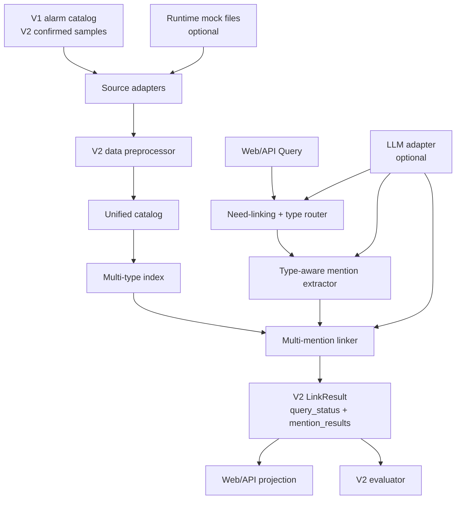

# DVEntityLinking V2 功能设计说明书

---

> 文档治理说明：本文是 V2 SR 主输出件，按版本保留。本文基于已闭环的 V2 IR 和 IR 阶段 SR 分解创建；后续独立功能设计评审、处置和闭环结论应更新到本文档和版本关闭记录。

## 基本信息

| 项目 | 内容 |
| --- | --- |
| 特性名称 | DVEntityLinking V2 多类型 LLM-based 实体链接增强 |
| 版本号 | V2 |
| 文档版本 | V2.2 |
| 编写日期 | 2026-06-01 |
| 编写人 | Codex |
| 审核人 | no-context/sealed 独立功能设计评审与闭环验证已完成 |
| 当前状态 | 功能设计评审闭环已通过，可作为代码实现输入 |

## 版本历史

| 版本号 | 修改日期 | 修改人 | 修改描述 |
| --- | --- | --- | --- |
| V2.0-draft | 2026-06-01 | Codex | 基于已闭环 V2 IR 和 SR 分解形成 V2 功能设计初稿。 |
| V2.1-draft | 2026-06-01 | Codex | 根据 no-context/sealed 功能设计评审处置，补充统一状态/错误枚举、LLM fallback 状态机、跨类型歧义判定、V2 评测公式、runtime mock schema 和安全投影规则。 |
| V2.2 | 2026-06-01 | Codex | 根据 no-context/sealed 闭环复核结果，确认功能设计评审处置已闭环，可进入代码实现。 |

---

# 1 概述

## 1.1 目的

本文档把已闭环的 V2 需求分析和 SR 分解转换为可实现、可测试、可评审的功能设计。设计重点是：多实体类型 catalog、运行时接口 Mock、数据预处理、分层分类 NER、多 mention 链接、Query 级 `partial` 状态、LLM-based 抽取/解释/rerank、Web demo 演示工作台和 V2 评测验收。

预期读者：

- V2 功能设计独立评审者。
- V2 代码实现负责人。
- V2 测试设计与测试开发负责人。
- 后续真实 DV 只读接口和运维 Copilot 集成规划人员。

## 1.2 范围

### 范围内

| 范围 | 说明 |
| --- | --- |
| V2 实体类型 | 在 V1 `alarm` 基线基础上新增 `ne_type`、`ne_name`、`kpi_task_name`、`kpi_meas_type_key`；`kpi_meas_objects` 保留类型设计但本轮启动样例先忽略。 |
| 数据预处理 | 统一把预置样例、确认样例和运行时 Mock 输出规范化为最小实体契约。 |
| 运行时接口 Mock | 提供可替换的文件驱动 source adapter，模拟启动时拉取 `ne_name` 或未来 KPI 运行时数据。 |
| 分层分类 NER | 先判断是否需要实体链接，再判断候选实体类型，最后执行类型内 mention 识别。 |
| 多 mention 链接 | 支持单 Query 多 mention，保留 mention 级状态和候选，提供 Query 级聚合状态。 |
| Query 级 `partial` | 当至少一个 mention 链接成功且至少一个 mention no_match、ambiguous 或降级时输出 `partial`。 |
| LLM-based 方法 | LLM 可参与 need-linking、类型分类、mention 抽取、候选解释和 rerank，输出必须 schema 校验并可降级。 |
| Web demo 增强 | 运维工作台式演示，展示 Query、mention、高亮、候选、实体详情、LLM 摘要和 catalog。 |
| V2 评测 | 覆盖 V1 回归、多类型、多 mention、`partial`、负例、跨类型歧义和 LLM 降级边界。 |

### 范围外

| 非范围 | 说明 |
| --- | --- |
| 实体结构升级 | V2 默认不新增实体字段、关系或类型专属 schema；如必须新增，回到用户确认。 |
| 真实 DV 接口直连 | V2 只做文件驱动 Mock，不接生产 DV 接口、不做网络鉴权、分页、限流。 |
| 真实 DV 写操作 | 不做自动修复、派单、告警确认、变更或其他生产写操作。 |
| 生产级检索基础设施 | 不强制引入向量库、FTS、数据库或外部检索组件。 |
| 完整前端产品化 | 页面只服务 demo 和评审，不建设权限、多租户、复杂拓扑工作台。 |
| 默认真实 LLM 验收 | 默认自动化仍为离线 deterministic；真实 LLM live smoke 只作为条件补证。 |

## 1.3 缩略语和术语

| 缩略语/术语 | 英文全称 | 中文解释 |
| --- | --- | --- |
| DV | DigitalView-SW | 面向运营商领域的电信软件网管系统 |
| IR | Issue Requirement | 需求项 |
| SR | Sub Requirement | 子需求 |
| NER | Named Entity Recognition | 命名实体识别 |
| LLM | Large Language Model | 大语言模型 |
| KPI | Key Performance Indicator | 关键性能指标 |
| `ne_type` | Network Element Type | 网元类型 |
| `ne_name` | Network Element Name | 网元名称或实例 |
| `kpi_task_name` | KPI Measurement Task Name | KPI 测量任务名称 |
| `kpi_meas_type_key` | KPI Measurement Type Key | KPI 测量指标 |
| `partial` | Partial Link Result | Query 级局部链接成功状态 |
| fail-closed | Fail Closed | 输入或依赖异常时停止使用损坏数据，不输出伪成功 |

## 1.4 参考文献

| 文档名称 | 文档编号 | 版本 | 来源 |
| --- | --- | --- | --- |
| V2 需求分析 | IR-DVEntityLinking-V2 | V2.4 | [IR.md](./IR.md) |
| V2 IR SR 分解 | IR-DVEntityLinking-V2-SR-DECOMPOSITION | V2.3-addendum | [IR-SR-DECOMPOSITION.md](./IR-SR-DECOMPOSITION.md) |
| 当前项目总览 | PROJECT | 当前 | [../../PROJECT.md](../../PROJECT.md) |
| 当前决策台账 | DECISIONS | 当前 | [../../current/DECISIONS.md](../../current/DECISIONS.md) |
| 当前数据契约 | DATA_CONTRACT | 当前 | [../../current/DATA_CONTRACT.md](../../current/DATA_CONTRACT.md) |
| 当前测试与验收策略 | TEST_ACCEPTANCE | 当前 | [../../current/TEST_ACCEPTANCE.md](../../current/TEST_ACCEPTANCE.md) |
| V1 功能设计 | SR-DVEntityLinking-V1 | V1.3 | [../v1/SR.md](../v1/SR.md) |
| DV SR 模板 | SR-templates | 当前 | `D:\workspace\analysis_and_design\templates\SR-templates.md` |

---

# 2 需求实现设计

## 2.1 总体设计方案概述

V2 采用现有 Python 3.12 + Flask 单进程 demo 架构的增量设计，不替换 V1 已关闭能力。核心改造是把 V1 alarm-only 的加载、抽取、索引、链接和评测链路扩展为多类型、多来源、多 mention 的结构，同时保留默认离线回归。



### 2.1.1 设计原则

| 原则 | 设计约束 |
| --- | --- |
| V1 兼容 | V1 `alarm` 样例、16 条 Query、evaluation 和 acceptance smoke 必须继续通过。 |
| 少依赖 | 默认继续 Python 内存索引，不新增必需三方检索组件。 |
| 最小实体契约 | V2 实体仍只要求 `entity_id`、`entity_type`、`canonical_name`、`aliases`、`description`。 |
| 来源可替换 | 运行时 Mock adapter 输出 source record，后续真实 DV adapter 替换 adapter，不改 linker。 |
| 多 mention 一等公民 | Query 级结果必须保留 mention 级状态、候选和错误，不能只输出单 top entity。 |
| LLM 可降级 | LLM 输出必须 schema 校验；失败时结构化降级，不作为默认验收唯一证据。 |
| 安全投影 | Web/API 和运行记录不展示 API key、真实 base URL、完整 prompt、完整响应、完整 DV payload。 |

### 2.1.2 模块划分

| 模块 | 文件归属建议 | 职责 | 非职责 |
| --- | --- | --- | --- |
| V2 Models | `models.py` | 增补 V2 entity/status/source/evaluation dataclass 和枚举。 | 不做 IO 和业务判定。 |
| Source Adapter | 新增 `sources.py` 或 `runtime_mock.py` | 读取预置样例和运行时 Mock 文件，输出 source records 和结构化错误。 | 不直接写入最终 catalog。 |
| Data Preprocessor | 新增 `preprocessing.py` | 规范化、去重、别名规则校验、类型校验、fail-closed。 | 不做 Query NER 或链接。 |
| Catalog Repository | `catalog.py` 增量 | 加载 unified catalog，支持 V1/V2 metadata 和类型过滤。 | 不依赖 Web 或 evaluator。 |
| Multi-type Index | 新增或扩展 `alarm_index.py` 为 `indexing.py` | 按类型构建 canonical name、ID、token、显式 alias 索引。 | 不做最终状态判定。 |
| Layered Extractor | `extraction.py` 增量 | need-linking、类型路由、多 mention 识别、LLM fallback。 | 不输出最终 link status。 |
| Multi-mention Linker | `linking.py` 增量 | per-mention candidate、状态判定、`partial` 聚合、LLM rerank。 | 不读取 JSON 文件。 |
| LLM Adapter | `llm.py` 增量 | prompt/schema、错误映射、safe trace summary。 | 不保存完整 prompt/response。 |
| V2 Evaluator | `evaluation.py`、新增 `datasets.py` 能力 | 加载 V2 Query 样例，计算 mention-level 和 query-level 指标。 | 不作为 Web runtime 依赖。 |
| Web/API Projection | `web.py` 增量 | 展示多类型 catalog、mention、高亮、候选、LLM 摘要。 | 不暴露敏感配置和 raw payload。 |

### 2.1.3 数据流和依赖方向

- `models.py` 被所有模块依赖，不反向依赖业务模块。
- `sources.py/runtime_mock.py` 只依赖 `models.py` 和标准库文件读取。
- `preprocessing.py` 依赖 source records 和 `models.py`，输出 normalized entities。
- `catalog.py` 消费 normalized entities 或 catalog JSON，不调用 extractor/linker/evaluator。
- `indexing.py` 消费 catalog，不读取样例文件。
- `extraction.py` 可依赖 catalog/index/LLM，但不得写 run record。
- `linking.py` 依赖 index/catalog/LLM，不读取 JSON，不调用 Web。
- `evaluation.py` 依赖 dataset loader 和 service/linker，不依赖 Web。
- `web.py` 只依赖 service/evaluation/config 的 safe projection。

### 2.1.4 V2 统一状态、错误和来源语义

V2 实现必须使用同一组状态、错误码和来源枚举，避免 Web/API、linker、LLM adapter、evaluator 各自解释。

#### QueryStatus

| 值 | 含义 | 是否成功链接状态 | 产生条件 |
| --- | --- | --- | --- |
| `linked` | Query 中所有需要链接的 mention 均成功链接 | 是 | 至少 1 个 mention，且所有 mention status 为 `linked`。 |
| `partial` | Query 局部链接成功 | 是，但非完全成功 | 至少 1 个 mention 为 `linked`，且至少 1 个 mention 为 `no_match`、`ambiguous` 或带 `degraded=true`。 |
| `ambiguous` | Query 未形成确定链接，至少一个 mention 存在歧义 | 否 | 无 linked mention，且至少 1 个 mention status 为 `ambiguous`。 |
| `no_match` | Query 需要链接但无可接受候选 | 否 | 所有 mention status 为 `no_match`。 |
| `not_required` | Query 不需要实体链接 | 否 | need-linking classifier 判定无需链接，且 mentions 为空。 |
| `dependency_failed` | 必需依赖失败且无 fallback | 否 | LLM 或必需 source 失败，`allow_fallback=false` 或 fallback 不可用。 |
| `invalid_input` | 请求或样例输入非法 | 否 | 空 Query、非法 mode、非法字段类型等输入错误。 |

#### MentionStatus

| 值 | 含义 |
| --- | --- |
| `linked` | mention Top-1 达到链接阈值且无保留歧义。 |
| `ambiguous` | 候选分数接近、跨类型候选不可安全消解，或 LLM rerank 不能合法选择唯一候选。 |
| `no_match` | 无候选或 Top-1 低于阈值。 |
| `dependency_failed` | mention 级必需依赖失败且无 fallback。 |

`degraded` 是 `ModeStatus` 或 mention/result 的布尔标志，不是成功链接状态。`invalid_input` 只作为 Query/API 级状态或错误，不作为 mention 级链接结果。

#### ErrorCode

所有错误码在文档、API 和测试中使用小写 snake_case。

| 值 | 适用层级 | 说明 |
| --- | --- | --- |
| `invalid_input` | API/query/dataset | 空 Query、span 越界、字段类型错误。 |
| `invalid_mode` | API | mode 不在允许枚举内。 |
| `invalid_allow_fallback` | API | `allow_fallback` 不是 JSON boolean。 |
| `catalog_load_failed` | source/catalog | catalog 文件缺失、非法 JSON、schema 错误。 |
| `runtime_source_failed` | source | runtime mock source 文件缺失或非法。 |
| `validation_failed` | preprocess/dataset | 计数不一致、重复 ID、非法类型、非法别名确认。 |
| `llm_timeout` | LLM | LLM 调用超时。 |
| `llm_http_error` | LLM | LLM HTTP 非鉴权错误。 |
| `llm_auth_error` | LLM | 鉴权失败。 |
| `llm_schema_error` | LLM | LLM JSON schema、span、candidate id 或类型非法。 |
| `dependency_failed` | mode/query | fallback disabled 或必需依赖无可用替代。 |
| `output_write_failed` | report/run | 报告或运行记录写入失败。 |

#### ResultSource

| 值 | 说明 |
| --- | --- |
| `offline_deterministic` | 完全由本地规则、catalog 和 index 产生。 |
| `llm` | LLM 参与并产出被使用，未发生 fallback。 |
| `fallback_offline` | LLM 或可选 source 失败后回退到离线路径。 |
| `runtime_mock` | runtime mock source 参与 catalog 构建。 |
| `confirmed_sample` | 已确认启动样例参与 catalog 构建。 |
| `none` | 输入非法、not_required 或 dependency_failed 无结果。 |

#### ModeStatus

| 字段 | 类型 | 必填 | 说明 |
| --- | --- | --- | --- |
| `requested_mode` | enum | 是 | 用户请求或默认模式。 |
| `effective_mode` | enum/null | 是 | 实际执行模式；invalid request 时为 null。 |
| `allow_fallback` | bool | 是 | 本次是否允许 fallback。 |
| `llm_enabled` | bool | 是 | 运行配置是否允许 LLM。 |
| `llm_used` | bool | 是 | 本次是否实际调用 LLM。 |
| `fallback_used` | bool | 是 | 本次是否实际 fallback。 |
| `degraded` | bool | 是 | 是否存在降级或非致命依赖错误。 |
| `result_source` | ResultSource | 是 | 顶层结果来源。 |
| `stage_statuses` | list | 是 | LLM/source 等阶段级状态摘要。 |
| `error_code` | ErrorCode/null | 是 | 顶层结构化错误。 |

### 2.1.5 LLM fallback 状态机

V2 LLM 参与点分为五个阶段，所有阶段输出 `LLMStageStatus`，并由 `ModeStatus` 汇总。

| 阶段 | 名称 | 失败 fallback=true | 失败 fallback=false | 成功输出 |
| --- | --- | --- | --- | --- |
| S1 | need-linking classifier | fallback 到 deterministic classifier，`degraded=true` | QueryStatus=`dependency_failed` | `need_linking`、confidence |
| S2 | type routing | fallback 到 deterministic type hints，`degraded=true` | QueryStatus=`dependency_failed` | candidate types |
| S3 | mention extraction | fallback 到 deterministic mention extraction，`degraded=true` | QueryStatus=`dependency_failed` | mentions |
| S4 | candidate explanation | 跳过解释，保留 offline candidates，`degraded=true` | 不阻塞链接，mention/result `degraded=true` | safe explanations |
| S5 | rerank/disambiguation | 保留 offline ranking；ambiguous 不强制 linked，`degraded=true` | 不阻塞已有 offline candidates；若唯一候选不足则保持 ambiguous/no_match | ranked candidate ids |

`LLMStageStatus` 字段：

| 字段 | 类型 | 说明 |
| --- | --- | --- |
| `stage` | enum | `need_linking`、`type_routing`、`mention_extraction`、`candidate_explanation`、`rerank`。 |
| `attempted` | bool | 是否尝试调用 LLM。 |
| `succeeded` | bool | 是否得到合法 schema 输出。 |
| `fallback_used` | bool | 是否回退到 deterministic/offline。 |
| `error_code` | ErrorCode/null | 使用小写 snake_case。 |
| `safe_summary` | string | 可展示摘要，不含 prompt/response 原文。 |

测试 fake client 必须覆盖 `llm_timeout`、`llm_http_error`、`llm_auth_error`、`llm_schema_error`。`allow_fallback=true` 时 V2 默认不得因为 LLM 失败破坏 V1/V2 离线回归；`allow_fallback=false` 时 S1-S3 失败返回 `dependency_failed`，S4-S5 失败不伪造 linked。

### 2.1.6 V2 评测公式

V2 evaluator 同时计算 query-level、mention-level 和 type-level 指标。所有公式在功能设计阶段固定，测试设计只补测试用例和报告格式。

#### Mention-level scoring

| Expected mention status | Actual mention result | TP | FP | FN | TN | Pass 条件 |
| --- | --- | --- | --- | --- | --- | --- |
| `linked` | `linked` 且 linked entity in expected ids | 1 | 0 | 0 | 0 | 通过 |
| `linked` | 非 linked，或 linked entity 不在 expected ids | 0 | 1 if any candidate/entity output else 0 | 1 | 0 | 失败 |
| `ambiguous` | `ambiguous` 且 Top-K 去重候选覆盖 expected ids | 1 | 0 | 0 | 0 | 通过 |
| `ambiguous` | 其他 | 0 | 1 if candidates non-empty else 0 | 1 | 0 | 失败 |
| `no_match` | `no_match` 且 candidates/link entity 为空 | 0 | 0 | 0 | 1 | 通过 |
| `no_match` | 产生候选或 linked entity | 0 | 1 | 0 | 0 | 失败，negative false positive +1 |
| `dependency_failed` | `dependency_failed` 且用例预期依赖失败 | 0 | 0 | 0 | 1 | 条件测试通过 |

#### Query-level pass/fail

| Expected query status | Pass 条件 |
| --- | --- |
| `linked` | QueryStatus=`linked`，所有 expected linked mentions 通过，无额外 false positive mention。 |
| `partial` | QueryStatus=`partial`，至少一个 linked mention 通过，至少一个 expected no_match/ambiguous/degraded mention 按预期通过，negative false positive=0。 |
| `ambiguous` | QueryStatus=`ambiguous`，至少一个 ambiguous mention 候选覆盖 expected ids，无错误 linked。 |
| `no_match` | QueryStatus=`no_match`，所有 mentions/candidates/link entity 为空或均为 no_match，negative false positive=0。 |
| `not_required` | QueryStatus=`not_required`，mentions、candidates、linked entity 为空。 |
| `dependency_failed` | QueryStatus=`dependency_failed`，且该用例明确配置 `allow_fallback=false` 或预期依赖失败。 |

#### Precision / recall

| 指标 | 公式 |
| --- | --- |
| mention precision | `mention_tp / (mention_tp + mention_fp)`；分母为 0 时记 1.0 并记录 `no_positive_predictions`。 |
| mention recall | `mention_tp / (mention_tp + mention_fn)`；分母为 0 时记 1.0 并记录 `no_expected_positive_cases`。 |
| per-type precision | 仅统计该 expected/predicted entity_type 相关 mention 的 TP/FP。 |
| per-type recall | 仅统计该 expected entity_type 相关 mention 的 TP/FN。 |
| negative false positive | expected `no_match` 或 `not_required` 产生候选或 linked entity 的次数。 |

#### 启动样例映射

| 样例 | 期望关注 |
| --- | --- |
| V2-Q-001、002、003、004、009、010 | 多 mention 全 linked。 |
| V2-Q-005、006 | 单 mention linked 回归。 |
| V2-Q-007 | QueryStatus=`partial`，一个 KPI linked，一个未知 NE no_match。 |
| V2-Q-008 | `not_required`，不得召回候选。 |
| V2-Q-011 | `no_match`，不得产生候选。 |
| 后续跨类型歧义样例 | QueryStatus=`ambiguous` 或 `partial`，Top-K 覆盖跨类型 expected candidates。 |

## 2.2 需求分解

### IR-V2-001 DVEntityLinking V2 多类型 LLM-based 实体链接增强

#### 2.2.1.1 IR 原始描述

V2 在 V1 alarm-only 验收关闭基础上，新增多实体类型、运行时接口 Mock、KPI 数据挖掘、分层分类 NER、LLM-based 实体识别/链接和前端演示增强。用户确认：实体结构暂不升级；KPI 拆为 `kpi_task_name`、`kpi_meas_objects`、`kpi_meas_type_key`；网元拆为 `ne_type` 和 `ne_name`；`kpi_meas_objects` 本轮先忽略；新增 KPI/网元实体别名默认空；V2 必须支持英文多 mention Query。

#### 2.2.1.2 IR 结构化信息

| 字段 | 内容 |
| --- | --- |
| 需求优先级 | 高 |
| 需求类型 | 功能性需求 + 非功能性需求 |
| 涉及模块 | preprocessing、runtime mock、catalog、extractor、LLM、linker、index、web、evaluation |

#### 2.2.1.3 IR 与 SR 的分解关系

| IR 编号 | SR 编号 | 分解说明 |
| --- | --- | --- |
| IR-V2-001 | SR-V2-A01 | 数据预处理与实体目录统一管控。 |
| IR-V2-001 | SR-V2-A02 | 运行时接口 Mock。 |
| IR-V2-001 | SR-V2-A03 | 分层分类 NER 与 mention 规范化。 |
| IR-V2-001 | SR-V2-A04 | LLM-based 抽取、分类、解释和 rerank。 |
| IR-V2-001 | SR-V2-A05 | 多类型实体链接与跨类型消歧。 |
| IR-V2-001 | SR-V2-A06 | 多类型索引、检索与存储策略。 |
| IR-V2-001 | SR-V2-A07 | Web demo 演示工作台增强。 |
| IR-V2-001 | SR-V2-A08 | V2 评测验收与安全边界。 |

### SR-V2-A01 数据预处理与实体目录统一管控

#### 2.2.2.1 SR 描述

统一接收 V1 alarm catalog、V2 confirmed sample、后续 DVKnowledge 挖掘候选和 runtime mock 输出，规范化为统一实体目录。新增 KPI/网元类实体 `aliases` 默认必须为空，任何别名都必须显式确认。

#### 2.2.2.2 SR 实现思路

设计 `SourceRecord -> NormalizedEntity -> CatalogRepository` 三段式链路：

| 对象 | 生产者 | 消费者 | 说明 |
| --- | --- | --- | --- |
| `SourceRecord` | preset source、runtime mock source | preprocessor | 保留输入来源、原始 ID/名称、类型、显式别名和错误。 |
| `NormalizedEntity` | preprocessor | catalog/index/linker | 只含最小实体契约和安全来源摘要。 |
| `UnifiedCatalog` | catalog repository | index/extractor/linker/web | 提供实体查询、类型过滤、metadata 和 load status。 |

#### 2.2.2.3 功能实现刷新

| 设计点 | 方案 |
| --- | --- |
| 实体类型 | `EntityType` 增补 `NE_TYPE`、`NE_NAME`、`KPI_TASK_NAME`、`KPI_MEAS_OBJECTS`、`KPI_MEAS_TYPE_KEY`。旧 `KPI_METRIC` 保留为 V0 legacy，不用于 V2 新样例。 |
| 输入文件 | V1 `samples/real/entity_examples.json` 继续作为 alarm 基线；V2 `samples/real/v2_entity_examples.json` 作为已确认新增实体启动样例。 |
| 别名规则 | 新增类型 `aliases` 必须存在且默认 `[]`；preprocessor 拒绝自动别名生成，非空别名需要 explicit confirmation 标记。 |
| 去重规则 | `entity_id` 全局唯一；同类型 `canonical_name` normalized 后不可重复；跨类型同名允许但必须保留类型信息供消歧。 |
| fail-closed | schema 错误、重复 ID、非法类型、非空未确认别名、entity_count 不一致均阻止 catalog 输出。 |
| V1 兼容 | V1 alarm loader 继续接受 `v1.alarm_entity.2`，不要求新增 V2 字段。 |

Alias confirmation 不写入最终实体结构，避免把确认元数据误当作实体 schema 升级。允许两种确认来源：

| 来源 | 字段 | 校验规则 |
| --- | --- | --- |
| SourceRecord | `explicit_aliases`、`alias_confirmation_id` | `explicit_aliases` 非空时必须提供确认 ID，preprocessor 才能写入 final `aliases`。 |
| Catalog metadata sidecar | `metadata.explicit_alias_confirmations` | 仅作为预处理校验输入，格式为 `{entity_id: [alias...]}`；最终实体仍只保留 `aliases` 数组。 |

当前 V2 启动样例所有新增 KPI/网元类实体 `aliases=[]`，因此不需要 alias confirmation sidecar。

#### 2.2.2.4 DFX 分析

| 检查项 | 是否符合 | 说明 |
| --- | --- | --- |
| 可靠性 | 是 | 输入 fail-closed，避免损坏 catalog 进入链接链路。 |
| 可用性 | 是 | catalog load status 明确展示类型计数和错误。 |
| 安全性 | 是 | 不提交未确认真实 DV payload 和敏感字段。 |
| 可维护性 | 是 | source/preprocess/catalog 分层便于未来真实 adapter 替换。 |

#### 2.2.2.5 架构元素影响列表

| 架构元素 | 影响说明 | 修改类型 |
| --- | --- | --- |
| `models.py` | 增补 V2 entity types、source/normalized records。 | 修改 |
| `catalog.py` | 支持 V2 metadata、合并 V1+V2 catalog、类型过滤。 | 修改 |
| `preprocessing.py` | 新增数据预处理模块。 | 新增 |
| `samples/real/v2_entity_examples.json` | 作为 V2 启动样例输入。 | 新增 |

### SR-V2-A02 运行时接口 Mock

#### 2.2.3.1 SR 描述

通过本地文件模拟 DV 运行时接口返回，至少支持 `ne_name`，可选支持未来 `kpi_meas_objects`。运行时 Mock 必须作为独立 adapter，不把文件读取细节耦合到 catalog/linker。

#### 2.2.3.2 SR 实现思路

定义 `RuntimeEntitySource` interface：

| 方法 | 输入 | 输出 | 错误 |
| --- | --- | --- | --- |
| `load()` | optional path/config | `RuntimeSourceResult` | 文件缺失、非法 JSON、字段缺失、类型不支持、重复记录 |
| `source_name()` | 无 | string | 无 |

V2 启动阶段可使用两类 source：

- `ConfirmedSampleSource`：读取 `samples/real/v2_entity_examples.json` 中已确认的 V2 启动样例。
- `FileRuntimeEntitySource`：读取可选 runtime mock 文件；不存在时输出结构化 degraded/empty result，不影响 V1 回归。

#### 2.2.3.3 功能实现刷新

| 设计点 | 方案 |
| --- | --- |
| 默认路径 | 不强制新增未确认 runtime payload 文件；先由 confirmed sample 支撑启动 demo。 |
| 可选 runtime path | 后续可通过配置项提供本地 ignored 或已确认 mock 文件路径。 |
| 输出对象 | `RuntimeSourceRecord`，字段包含 `source_type`、`entity_type`、`raw_id`、`raw_name`、`explicit_aliases`、`description`、`errors`。 |
| 替换边界 | 后续真实 DV adapter 只需实现同一 interface，不改 preprocessor/linker。 |
| 错误语义 | 必需 source 错误 fail-closed；可选 source 错误 degraded 并记录，不产生伪实体。 |

#### Runtime mock 文件 schema 和生命周期

| 字段 | 类型 | 必填 | 说明 |
| --- | --- | --- | --- |
| `metadata.schema_version` | string | 是 | 初始建议 `v2.runtime_source.1`。 |
| `metadata.source_kind` | string | 是 | `runtime_mock`；真实 adapter 未来输出同等 source record。 |
| `metadata.required` | boolean | 是 | `true` 时 load 失败阻塞 catalog；`false` 时 degraded empty source。 |
| `records[]` | list | 是 | runtime source records。 |
| `records[].raw_id` | string | 是 | 源侧 ID，预处理后映射到 `entity_id`。 |
| `records[].entity_type` | enum | 是 | 初始至少允许 `ne_name`，未来可扩展 `kpi_meas_objects`。 |
| `records[].raw_name` | string | 是 | 源侧名称，预处理后映射到 `canonical_name`。 |
| `records[].explicit_aliases` | list[string] | 否 | 默认为空；非空必须有确认 ID。 |
| `records[].description` | string | 否 | 安全说明，不含 raw payload。 |

Lifecycle：

| 时机 | 行为 |
| --- | --- |
| startup | 加载 confirmed sample source 和 optional runtime mock source，合并后进入 preprocessor。 |
| manual reload | Web/API 可后续提供安全 reload 入口；V2 初始实现可只在启动时加载。 |
| refresh failure required=true | fail-closed，不发布新 catalog。 |
| refresh failure required=false | 保留 confirmed sample catalog，记录 degraded source status。 |
| future real adapter | 必须输出同一 `RuntimeSourceResult`，不得让 downstream 依赖网络、分页或鉴权细节。 |

#### 2.2.3.4 DFX 分析

| 检查项 | 是否符合 | 说明 |
| --- | --- | --- |
| 可靠性 | 是 | adapter 错误结构化，必需/可选 source 行为分离。 |
| 可用性 | 是 | demo 无 runtime 文件时仍可使用已确认启动样例。 |
| 安全性 | 是 | 未确认真实 payload 不入库，ignored 路径不被记录完整内容。 |
| 可维护性 | 是 | 文件 mock 和未来真实接口共享 source interface。 |

### SR-V2-A03 分层分类 NER 与 mention 规范化

#### 2.2.4.1 SR 描述

V2 NER 先判断 Query 是否需要实体链接，再判断候选实体类型，最后按类型识别 mention。输出必须支持多 mention，并保留 mention 级 text、span、normalized_text、candidate_type、confidence、source。

#### 2.2.4.2 SR 实现思路

设计三层 pipeline：

| 层级 | 输入 | 输出 | 说明 |
| --- | --- | --- | --- |
| Need-linking classifier | Query | `not_required` 或需要链接 | 先挡住 dashboard 等无实体需求 Query。 |
| Type router | Query + catalog type summary | candidate types | 可输出多类型、不确定或 LLM schema error。 |
| Mention recognizer | Query + candidate types | mention list | 支持最多 2 个启动样例 mention，设计上可扩展。 |

#### 2.2.4.3 功能实现刷新

| 设计点 | 方案 |
| --- | --- |
| deterministic path | 按 canonical name 和显式 alias 做 span 定位；新增类型不自动拆词生成 alias。 |
| span 规则 | 使用原始 Query 的 0-based end-exclusive span；规范化匹配后必须回映到原文 span。 |
| 多 mention 去重 | 优先最长、非重叠 mention；同一文本跨类型候选保留类型不确定状态。 |
| not_required | 无实体意图且无实体形态 token 时直接 bypass，不进入候选召回。 |
| no_match mention | 识别到实体形态但 catalog 无候选时保留 mention，后续由 linker 判 no_match。 |
| LLM fallback | LLM schema/HTTP/auth/timeout 错误时按 allow_fallback 走 deterministic 或 dependency_failed。 |

#### 2.2.4.4 DFX 分析

| 检查项 | 是否符合 | 说明 |
| --- | --- | --- |
| 可靠性 | 是 | LLM 和 deterministic 输出走同一 schema 校验。 |
| 可用性 | 是 | 多 mention 输出便于 Web 高亮和局部状态解释。 |
| 安全性 | 是 | 不记录完整 prompt/response。 |
| 可维护性 | 是 | type router 与 mention recognizer 分离。 |

### SR-V2-A04 LLM-based 抽取、分类、解释和 rerank

#### 2.2.5.1 SR 描述

LLM 可用于 need-linking、实体类型分类、mention 抽取、候选解释和 rerank。LLM 输出必须是结构化 JSON 并通过 schema 校验，自然语言解释只能作为展示摘要，不作为实体事实。

#### 2.2.5.2 SR 实现思路

复用现有 OpenAI-compatible adapter，增补 V2 schema：

| Schema | 目的 | 关键字段 |
| --- | --- | --- |
| `V2MentionExtraction` | 抽取多 mention 和类型 | `mentions[].text/span/candidate_type/confidence`、`need_linking` |
| `V2CandidateExplanation` | 候选解释摘要 | `entity_id`、`reason_summary`、`risk_flags` |
| `V2Rerank` | 候选重排 | `mention_text`、`ranked_entity_ids`、`confidence` |

#### 2.2.5.3 功能实现刷新

| 设计点 | 方案 |
| --- | --- |
| prompt 边界 | prompt 中只放脱敏 Query、候选 ID/类型/名称，不放 API key、真实 URL、完整 DV payload。 |
| schema 校验 | 缺字段、非法类型、span 越界、候选 ID 不存在均映射 `llm_schema_error` 并降级。 |
| rerank 合并 | LLM rerank 只能重排 existing candidates，不可凭空新增实体。 |
| safe trace | Web/API 展示 llm_enabled、llm_used、fallback_used、error_code、summary，不展示完整 prompt/response。 |

#### 2.2.5.4 DFX 分析

| 检查项 | 是否符合 | 说明 |
| --- | --- | --- |
| 可靠性 | 是 | 所有 LLM 异常映射为结构化错误和 fallback。 |
| 可用性 | 是 | LLM 摘要帮助演示多类型解释和消歧。 |
| 安全性 | 是 | raw prompt/response 和敏感配置不出现在提交物。 |
| 可维护性 | 是 | LLM schema 与业务 schema 分离。 |

### SR-V2-A05 多类型实体链接与跨类型消歧

#### 2.2.6.1 SR 描述

对每个 mention 召回候选、排序、判定 mention 级状态，再聚合 Query 级状态。V2 必须支持 `partial`，并保留跨类型歧义候选，不强制选择。

#### 2.2.6.2 SR 实现思路

| 阶段 | 输入 | 输出 |
| --- | --- | --- |
| Candidate retrieval | mention + type hints + index | per-mention candidate set |
| Mention decision | candidate set + thresholds | `linked`、`ambiguous`、`no_match`、`dependency_failed` |
| Query aggregation | mention results | `linked`、`partial`、`ambiguous`、`no_match`、`not_required`、`dependency_failed` |

#### 2.2.6.3 功能实现刷新

| 情况 | Query 级状态 |
| --- | --- |
| no mentions + not_required | `not_required` |
| dependency failed and fallback disabled | `dependency_failed` |
| all mention results linked | `linked` |
| at least one linked and at least one no_match/ambiguous/degraded | `partial` |
| no linked and at least one ambiguous | `ambiguous` |
| all mention results no_match | `no_match` |

#### 跨类型歧义决策树

| 条件 | MentionStatus | 说明 |
| --- | --- | --- |
| type router 给出单一类型，Top-1 高于阈值，Top-2 分差 >= ambiguity_margin | `linked` | 类型路由和分数共同支持唯一实体。 |
| 同一 mention 在多个类型中出现 Top 候选，类型置信度差 < type_margin 或无可靠 type hint | `ambiguous` | 保留跨类型候选，不强行选择。 |
| LLM rerank 返回候选集中唯一 entity_id，schema 合法，confidence >= llm_rerank_min_confidence | `linked` | LLM 只能从已有 candidates 中选择，不得新增实体。 |
| LLM rerank 失败、返回未知候选或 confidence 不足 | 保持 offline `ambiguous` | 不因 LLM 失败降级为错误链接。 |
| Top-1 低于 link_min_confidence | `no_match` | 即使存在 token overlap，也不得制造误候选。 |

设计级样例：若 Query mention 为 `CPU Usage`，且 catalog 中同时存在 `kpi_meas_type_key=CPU Usage` 和未来某个 `ne_name=CPU Usage`，在 type router 无法确定类型时，mention status 必须为 `ambiguous`，候选列表覆盖两个 entity_id；若 Query 上下文为 `Show CPU Usage for ...` 且 type router 高置信判为 `kpi_meas_type_key`，才允许链接到 KPI 测量指标。

每个 `MentionLinkResult` 必须保留：

| 字段 | 说明 |
| --- | --- |
| `mention` | 原文 text、span、candidate_type/source/confidence。 |
| `status` | mention 级状态。 |
| `linked_entity` | linked 时的实体。 |
| `candidates` | Top-K 候选，含 entity_id/type/name/score/match_reason/source。 |
| `error_code` | LLM/schema/dependency 等结构化错误。 |

#### 2.2.6.4 DFX 分析

| 检查项 | 是否符合 | 说明 |
| --- | --- | --- |
| 可靠性 | 是 | Query 聚合不掩盖 mention 级局部失败。 |
| 可用性 | 是 | 前端可以逐 mention 展示候选和解释。 |
| 安全性 | 是 | 只展示安全候选字段。 |
| 可维护性 | 是 | 检索、mention 判定和 Query 聚合职责清晰。 |

### SR-V2-A06 多类型索引、检索与存储策略

#### 2.2.7.1 SR 描述

继续采用 Python 内存索引优先，支持按实体类型分区或过滤，召回 canonical name、entity_id、轻量 token 和经确认的显式 alias。

#### 2.2.7.2 SR 实现思路

设计 `MultiTypeIndexBundle`：

| 索引 | 用途 |
| --- | --- |
| `id_index` | entity_id exact lookup。 |
| `type_index` | entity_type -> entity_ids。 |
| `canonical_index` | normalized canonical name exact lookup。 |
| `alias_index` | only confirmed explicit aliases。 |
| `token_index` | 轻量 token overlap，主要用于候选补充，不作为唯一 linked 证据。 |

#### 2.2.7.3 功能实现刷新

| 设计点 | 方案 |
| --- | --- |
| 类型过滤 | mention candidate_type 明确时优先类型内召回；不确定时跨类型召回并保留类型歧义。 |
| 排序 | exact canonical > explicit alias > ID exact > token/fuzzy；同分按类型置信度、entity_id 稳定排序。 |
| refresh | runtime mock 更新后重建 index bundle，失败时保留上一版或 fail-closed 由配置决定。 |
| 持久化 | V2 不引入数据库；后续规模增长时再设计 SQLite/FTS/向量库路线。 |

#### 2.2.7.4 DFX 分析

| 检查项 | 是否符合 | 说明 |
| --- | --- | --- |
| 可靠性 | 是 | index 构建来自已校验 catalog。 |
| 可用性 | 是 | 支持 Top-K 候选和类型过滤。 |
| 安全性 | 是 | 不索引 ignored raw payload。 |
| 可维护性 | 是 | 内存 bundle 可替换为持久化索引。 |

### SR-V2-A07 Web demo 演示工作台增强

#### 2.2.8.1 SR 描述

Web demo 第一屏直接服务实体链接体验，展示运行状态、Query 输入、mention 高亮、候选、实体详情、catalog 过滤和 LLM 摘要。

#### 2.2.8.2 SR 实现思路

沿用 Flask 单页 demo，增强 API projection 和页面结构：

| 区域 | 内容 |
| --- | --- |
| Runtime status | catalog_loaded、entity_count、type_counts、llm status、fallback 状态。 |
| Query panel | Query 输入、mode、allow_fallback、样例 Query。 |
| Mention strip | 多 mention 高亮、类型、状态、置信度。 |
| Result panel | Query status、mention results、候选列表、partial/no_match 原因。 |
| Catalog panel | 按类型过滤查看实体目录。 |
| LLM summary | 是否启用、参与环节、降级原因、摘要解释。 |

#### 2.2.8.3 功能实现刷新

| 设计点 | 方案 |
| --- | --- |
| 页面风格 | 运维工作台式，信息密度适中，不做营销 landing。 |
| 响应式 | 桌面优先，移动宽度下 Query/结果/catalog 纵向堆叠。 |
| 安全展示 | API key/base URL/raw prompt/raw response 不展示。 |
| 调试 JSON | 可折叠展示 safe JSON，不默认铺满页面。 |

#### 2.2.8.4 DFX 分析

| 检查项 | 是否符合 | 说明 |
| --- | --- | --- |
| 可靠性 | 是 | 页面展示来自 safe projection，不参与业务判定。 |
| 可用性 | 是 | 多 mention/partial 可视化降低演示理解成本。 |
| 安全性 | 是 | 敏感字段过滤。 |
| 可维护性 | 是 | 仍为轻量 Flask demo，不引入复杂前端工程。 |

### SR-V2-A08 V2 评测验收与安全边界

#### 2.2.9.1 SR 描述

建立 V2 evaluation 和 acceptance smoke，覆盖 V1 回归、多类型、多 mention、`partial`、负例、跨类型歧义、LLM 降级和安全扫描。

#### 2.2.9.2 SR 实现思路

设计 `V2EvaluationCase` 和 `V2EvaluationReport`：

| 层级 | 指标 |
| --- | --- |
| Query-level | pass/fail、query_status、expected_status、negative_false_positive。 |
| Mention-level | mention pass/fail、linked/no_match/ambiguous、expected_entity_ids 覆盖。 |
| Type-level | per-type precision、recall、case count。 |
| Safety | redaction_applied、forbidden key scan、llm raw log absence。 |

#### 2.2.9.3 功能实现刷新

| 设计点 | 方案 |
| --- | --- |
| 启动样例 | `v2_query_samples.json` 的 11 条 Query 必须自动评测，含 7 条多 mention。 |
| V1 回归 | 继续运行 V1 16 条 Query，precision/recall 仍须 1.0。 |
| `partial` pass | 至少一个 expected linked mention 命中，且 no_match mention 不产生误候选；Query status 为 `partial`。 |
| no_match/not_required | 候选和 linked entity 必须为空，false positive 为 0。 |
| 跨类型歧义 | 最终 V2 评测需补样例；若本轮延期，测试设计记录非阻塞原因和残余风险。 |
| LLM 降级 | 默认离线不依赖真实 LLM；LLM schema/error path 通过 fake client 或条件 smoke 证明。 |

#### 2.2.9.4 DFX 分析

| 检查项 | 是否符合 | 说明 |
| --- | --- | --- |
| 可靠性 | 是 | 自动化评测覆盖正例、负例和降级路径。 |
| 可用性 | 是 | 报告能解释 partial 和 mention-level 失败。 |
| 安全性 | 是 | 敏感字段扫描和 redaction 是验收项。 |
| 可维护性 | 是 | V2 evaluator 与 Web runtime 分离。 |

---

# 3 接口设计

## 3.1 接口概述

V2 不新增生产外部接口，继续使用 Flask demo API，并扩展返回结构。内部接口重点新增 source/preprocess/index/extractor/linker/evaluator 契约。

## 3.2 ER 接口设计（外部接口）

### 3.2.1 `POST /api/link`

| 项目 | 内容 |
| --- | --- |
| 接口 ID | ER-V2-LINK |
| 接口路径 | `/api/link` |
| 请求方法 | POST |
| 请求参数 | `query: string`；`mode?: offline_demo/llm_enabled_demo`；`allow_fallback?: boolean` |
| 返回参数 | `query`、`status`、`mentions`、`mention_results`、`candidates`、`top_entity`、`mode_status`、`error_code`、`llm_summary` |
| 错误码 | `invalid_input`、`invalid_mode`、`invalid_allow_fallback`、`catalog_load_failed`、`dependency_failed`、`llm_schema_error` |

V2 `status` 允许 `linked`、`partial`、`ambiguous`、`no_match`、`not_required`、`dependency_failed`、`invalid_input`。

### 3.2.2 `GET /api/status`

| 项目 | 内容 |
| --- | --- |
| 接口 ID | ER-V2-STATUS |
| 接口路径 | `/api/status` |
| 请求方法 | GET |
| 请求参数 | 无 |
| 返回参数 | `catalog_loaded`、`entity_count`、`entity_type_counts`、`v1_regression_available`、`v2_samples_loaded`、`llm_enabled`、`llm_degraded`、`safe_config` |
| 错误码 | `catalog_load_failed`、`validation_failed` |

### 3.2.3 `GET /api/catalog`

| 项目 | 内容 |
| --- | --- |
| 接口 ID | ER-V2-CATALOG |
| 接口路径 | `/api/catalog?entity_type=<type>` |
| 请求方法 | GET |
| 请求参数 | optional `entity_type` |
| 返回参数 | safe entity list，包含 `entity_id`、`entity_type`、`canonical_name`、`description`、`aliases_count` |
| 错误码 | `invalid_input`、`catalog_load_failed` |

## 3.3 IR 接口设计（内部接口）

### 3.3.1 `RuntimeEntitySource`

| 项目 | 内容 |
| --- | --- |
| 接口 ID | IR-V2-SOURCE |
| 输入 | source config/path |
| 输出 | `RuntimeSourceResult(records, errors, degraded)` |
| 错误 | file not found、invalid JSON、unsupported entity_type、missing field、duplicate raw_id |

### 3.3.2 `PreprocessPipeline`

| 项目 | 内容 |
| --- | --- |
| 接口 ID | IR-V2-PREPROCESS |
| 输入 | list of `SourceRecord` |
| 输出 | list of `NormalizedEntity` or `PreprocessError` |
| 错误 | duplicate entity_id、invalid alias policy、entity_count mismatch、invalid type |

### 3.3.3 `LayeredEntityExtractor`

| 项目 | 内容 |
| --- | --- |
| 接口 ID | IR-V2-EXTRACT |
| 输入 | query、catalog type summary、mode、allow_fallback |
| 输出 | `ExtractionResult(mentions, not_required, degraded, error_code, llm_used)` |
| 错误 | invalid input、LLM schema/error、dependency failed |

### 3.3.4 `MultiMentionLinker`

| 项目 | 内容 |
| --- | --- |
| 接口 ID | IR-V2-LINKER |
| 输入 | query、mentions、index bundle、mode status |
| 输出 | `EntityLinkResult(query_status, mention_results, candidates, error_code)` |
| 错误 | dependency failed、validation failed |

---

# 4 数据库设计

## 4.1 表结构设计

V2 不新增数据库表。

## 4.2 索引设计

V2 使用进程内 `MultiTypeIndexBundle`，不新增数据库索引。

| 索引名 | 字段 | 类型 | 说明 |
| --- | --- | --- | --- |
| `id_index` | `entity_id` | dict | 精确查找实体。 |
| `type_index` | `entity_type` | dict[list] | 类型过滤和 catalog 展示。 |
| `canonical_index` | normalized canonical name | dict[set] | 标准名精确召回。 |
| `alias_index` | normalized explicit alias | dict[set] | 仅使用确认别名。 |
| `token_index` | lightweight token | dict[set] | 候选补充和排序解释。 |

## 4.3 数据迁移

无数据库迁移。V2 实体样例以新增文件方式引入，不修改 V1 样例 schema。若后续引入持久化索引，需要重新进入设计评审。

---

# 5 部署设计

## 5.1 部署架构

继续沿用本地单进程 Flask demo：

```text
python scripts/run_web_demo.py --mode offline_demo
python scripts/run_v1_acceptance_smoke.py --mode offline_demo
python scripts/run_v2_evaluation.py
python scripts/run_v2_acceptance_smoke.py --mode offline_demo
```

Web demo 只维护 `scripts/run_web_demo.py` 一个入口；当前版本默认加载 V2 样例，历史版本回看通过显式 catalog/samples 参数加载。

## 5.2 配置项

| 配置项 | 默认值 | 说明 | 是否可热更新 |
| --- | --- | --- | --- |
| `DVEL_MODE` | `offline_demo` | 默认运行模式。 | 否 |
| `DVEL_V2_ENTITY_SAMPLES` | `samples/real/v2_entity_examples.json` | V2 已确认新增实体样例。 | 否 |
| `DVEL_V2_QUERY_SAMPLES` | `samples/real/v2_query_samples.json` | V2 Query 样例。 | 否 |
| `DVEL_RUNTIME_MOCK_PATH` | 空 | 可选 runtime mock 文件；未配置时使用 confirmed sample source。 | 否 |
| `DVEL_WEB_LLM_*` | 本地环境或 `config/llm.local.json` | OpenAI-compatible LLM 配置，只允许本地 ignored。 | 可通过 Web safe config 更新部分环境变量 |

## 5.3 依赖组件

| 组件名称 | 版本要求 | 用途 |
| --- | --- | --- |
| Python | 3.12+ | 项目运行环境。 |
| Flask | >=3,<4 | Web/API demo。 |
| OpenAI-compatible LLM | optional | LLM enabled demo 和条件 smoke。 |

## 5.4 安全投影和敏感扫描

V2 safe projection 使用白名单优先，敏感扫描使用 forbidden key/pattern 双重保护。

| 对象 | 允许展示字段 |
| --- | --- |
| `safe_config` | `mode`、`llm_enabled`、`provider_alias`、`model_alias`、`catalog_loaded`、`entity_count`、`entity_type_counts`。 |
| `llm_summary` | `stage`、`attempted`、`succeeded`、`fallback_used`、`error_code`、`safe_summary`。 |
| `candidate` | `entity_id`、`entity_type`、`canonical_name`、`score`、`rank`、`match_reason`。 |
| `runtime_source_status` | `source_kind`、`required`、`record_count`、`degraded`、`error_code`。 |

Forbidden key parts 继承并扩展 V1：

`api_key`、`api_base`、`base_url`、`token`、`cookie`、`authorization`、`password`、`secret`、`endpoint_url`、`host`、`url`、`traceback`、`exception`、`payload`、`raw_request`、`raw_response`、`prompt`、`llm_full_log`、`dv_raw_payload`。

提交前扫描需排除 `config/llm.local.json` 和 `outputs/**`，但提交候选文件中不得出现真实 key、token、Authorization bearer、真实 base URL、完整 prompt/response 或完整 DV payload。

---

# 6 测试设计

## 6.1 测试场景

| 场景编号 | 场景名称 | 前置条件 | 测试步骤 | 预期结果 |
| --- | --- | --- | --- | --- |
| TS-V2-001 | V1 回归 | V1 样例存在 | 运行 V1 evaluation 和 acceptance smoke | 16/16 pass，precision/recall=1.0，negative FP=0 |
| TS-V2-002 | V2 catalog 加载 | V2 entity samples 存在 | 加载 V1+V2 catalog | 类型计数正确，aliases 默认空，非法输入 fail-closed |
| TS-V2-003 | 多 mention linked | V2 Query samples 存在 | 运行多 mention 正例 | 每个 mention 命中期望实体，Query status linked |
| TS-V2-004 | partial | V2-Q-007 | 链接包含一个存在和一个不存在实体的 Query | Query status partial，no_match mention 无误候选 |
| TS-V2-005 | no_match/not_required | V2-Q-008/V2-Q-011 | 运行负例 Query | no_match/not_required 不产生候选 |
| TS-V2-006 | 跨类型歧义 | 设计级决策树已定义，测试设计补样例或记录延期 | 运行同名/相似跨类型 Query | 保留候选，不强制选择；若延期则记录残余风险 |
| TS-V2-007 | LLM 降级 | fake LLM client | 模拟 timeout/schema/auth/http error | fallback 或 dependency_failed 符合 allow_fallback |
| TS-V2-008 | Web 展示 | Flask test client | 请求页面和 API | 展示 mention、partial、catalog、LLM safe summary |
| TS-V2-009 | 安全扫描 | 工作区存在 outputs/config | 扫描提交候选 | 无 key/token/base URL/raw prompt/raw response |
| TS-V2-010 | Runtime mock 异常 | runtime mock 文件缺失或非法 | 加载 required/optional source | required fail-closed，optional degraded 且不产生伪实体 |

## 6.2 测试用例

| 用例编号 | 用例名称 | 所属场景 | 优先级 | 设计者 |
| --- | --- | --- | --- | --- |
| TC-V2-CATALOG-001 | V2 entity sample schema and count | TS-V2-002 | 高 | Codex |
| TC-V2-CATALOG-002 | V2 aliases default empty and explicit alias guard | TS-V2-002 | 高 | Codex |
| TC-V2-NER-001 | English multi mention span extraction | TS-V2-003 | 高 | Codex |
| TC-V2-LINK-001 | Multi mention all linked | TS-V2-003 | 高 | Codex |
| TC-V2-LINK-002 | Query-level partial aggregation | TS-V2-004 | 高 | Codex |
| TC-V2-LINK-003 | Negative false positive remains zero | TS-V2-005 | 高 | Codex |
| TC-V2-LINK-004 | Cross-type ambiguity candidate retention | TS-V2-006 | 高 | Codex |
| TC-V2-LLM-001 | LLM schema error fallback | TS-V2-007 | 高 | Codex |
| TC-V2-LLM-002 | LLM timeout/auth/http fallback matrix | TS-V2-007 | 高 | Codex |
| TC-V2-RUNTIME-001 | Runtime source required/optional error behavior | TS-V2-010 | 高 | Codex |
| TC-V2-WEB-001 | Web renders V2 result sections | TS-V2-008 | 中 | Codex |
| TC-V2-SAFE-001 | Sensitive field redaction and scan | TS-V2-009 | 高 | Codex |

## 6.3 验收标准

| 类别 | 标准 |
| --- | --- |
| V1 回归 | V1 16 条 Query 继续全部通过，precision=1.0，recall=1.0。 |
| V2 样例 | 11 条 V2 Query 自动评测通过；7 条多 mention Query 保留 mention-level 结果。 |
| `partial` | `partial` Query 的 linked mention 命中期望实体，no_match mention 不产生误候选。 |
| 负例 | no_match/not_required negative false positive 为 0。 |
| LLM | 默认验收不依赖真实 LLM；fake/conditional LLM 路径覆盖 schema/error/fallback。 |
| 安全 | 无真实 API key、token、base URL、完整 prompt/response、完整 DV payload 入库。 |

---

# 7 风险分析

| 风险编号 | 风险描述 | 风险等级 | 影响 | 应对措施 | 负责人 |
| --- | --- | --- | --- | --- | --- |
| R-V2-001 | 跨类型歧义启动样例不足 | 中 | V2 验收可能不能证明跨类型消歧 | 本文已定义决策树；测试设计必须补样例，或明确延期理由和残余风险。 | 测试设计负责人 |
| R-V2-002 | LLM 输出不稳定 | 中 | live demo 结果波动 | 本文已定义 fallback 状态机；默认离线验收，LLM 仅条件补证，fake client 覆盖错误路径。 | 实现负责人 |
| R-V2-003 | 多 mention 指标公式复杂 | 低 | precision/recall 口径争议 | 本文已固定公式；测试设计按公式展开用例。 | 测试设计负责人 |
| R-V2-004 | runtime mock 与真实接口差异 | 中 | 后续真实 adapter 替换成本上升 | 保持 `RuntimeEntitySource` interface，真实接口接入前重新设计评审。 | 功能设计负责人 |
| R-V2-005 | Web 增强过度 | 低 | 分散实体链接主流程 | 页面只服务 demo，不引入复杂前端工程。 | 实现负责人 |

---

# 附录

## 附录 A 评审记录

| 评审日期 | 评审人 | 评审意见 | 处理状态 |
| --- | --- | --- | --- |
| 2026-06-01 | no-context/sealed 独立功能设计评审 | Ready for disposition；无 P0，有 P1/P2/P3，需要关闭 P1 后才能进入代码实现 | 处置完成并闭环 |
| 2026-06-01 | no-context/sealed 闭环复核 | P1/P2/P3-1 已由前次复核确认 closed；P3-2 文档卫生已关闭；V2 SR 功能设计评审闭环可标记为 closed | Closed |

## 附录 B 功能设计评审输入包建议

| 输入 | 文件 |
| --- | --- |
| V2 IR | [IR.md](./IR.md) |
| V2 IR SR 分解 | [IR-SR-DECOMPOSITION.md](./IR-SR-DECOMPOSITION.md) |
| V2 SR 功能设计 | [SR.md](./SR.md) |
| 当前数据契约 | [../../current/DATA_CONTRACT.md](../../current/DATA_CONTRACT.md) |
| 当前测试与验收策略 | [../../current/TEST_ACCEPTANCE.md](../../current/TEST_ACCEPTANCE.md) |
| 当前决策台账 | [../../current/DECISIONS.md](../../current/DECISIONS.md) |
| V2 entity samples | `samples/real/v2_entity_examples.json` |
| V2 query samples | `samples/real/v2_query_samples.json` |

评审重点：

- 模块边界是否足以指导实现，尤其 source/preprocess/catalog/index/extractor/linker/evaluator 的依赖方向。
- 多 mention、`partial`、mention-level 状态和 query-level 聚合是否无歧义。
- Runtime mock 是否可未来整体替换为真实 DV adapter。
- LLM schema、降级和安全投影是否充分。
- V2 测试映射是否覆盖 IR 闭环残余风险。
