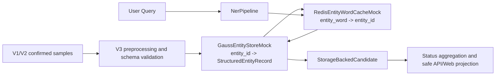

# DigitalView-SW DVEntityLinking V3 功能设计说明书

## 基本信息

| 项目 | 内容 |
|------|------|
| 特性名称 | DVEntityLinking V3 两层存储与 NER pipeline 重构 |
| 版本号 | V3-SR.2-closed |
| 编写日期 | 2026-06-25 |
| 编写人 | Codex |
| 审核人 | TBD |
| 状态 | 功能设计评审闭环已通过，可作为代码实现输入 |

## 版本历史

| 版本号 | 修改日期 | 修改人 | 修改描述 |
|--------|----------|--------|----------|
| V3-SR.1-draft | 2026-06-25 | Codex | 根据 V3 已闭环需求，形成两层存储、Redis Mock、高斯 Mock、NER pipeline、接口 schema、异常语义和设计级测试映射。 |
| V3-SR.2-closed | 2026-06-25 | Codex | 功能设计评审、处置和闭环验证完成；无 P0/P1/P2 阻塞，可作为 V3 代码实现输入。 |

---

# 1 概述

## 1.1 目的

本文把 V3 已闭环需求转换为可实现的功能设计。重点是两层存储和 NER pipeline：实体词到实体 ID 的 KV 查询由 Redis 接口 Mock 承担，结构化实体记录由高斯数据库接口 Mock 承担，NER pipeline 负责把 Query 转换为 mention、实体词 key、实体 ID、结构化实体候选和最终链接状态。

预期读者包括功能设计评审者、代码实现者、测试设计者和后续维护者。

## 1.2 范围

### 范围内

| 范围项 | 设计说明 |
| --- | --- |
| 存储接口 | 定义 `EntityWordCache`、`StructuredEntityStore` 和 `EntityStorageRepository` 的职责、输入输出和错误语义。 |
| Redis Mock | 本地文件/内存实现 Redis-like lookup，key 为 `canonical_name` + 经确认 `aliases`，value 为单实体 ID。 |
| 高斯 Mock | 本地文件/内存实现 Gauss-like lookup，支持按 `entity_id` 查询最小结构化实体字段。 |
| NER pipeline | 定义 Query validation、need-linking、mention detection、type classification、normalization、Redis lookup、Gauss lookup、candidate construction 和 aggregation。 |
| 兼容迁移 | 保持 V1/V2 样例、evaluation、smoke 和 Web/API 默认离线能力可回归。 |
| 安全和脱敏 | 不提交真实 Redis/Gauss/DV 连接信息、生产 payload、token 或完整 LLM 请求响应。 |

### 范围外

| 范围外项 | 说明 |
| --- | --- |
| 真实 Redis/Gauss 接入 | V3 当前只设计接口 Mock，真实连接、认证、连接池、SQL、事务和集群均不纳入。 |
| 代码实现立即开始 | 本文已完成功能设计评审、处置和闭环验证，可作为 V3 代码实现输入；实现仍需后续实现评审和测试评审门禁。 |
| 完整测试用例文档 | 本文仅给设计级测试映射，完整测试设计属于后续测试设计/开发阶段。 |
| V2 before 视觉证据 | V2 `AC-V2-FE-VIS-008` 继续搁置，不进入 V3 设计范围。 |

## 1.3 缩略语和术语

| 缩略语/术语 | 英文全称 | 中文解释 |
|-------------|----------|----------|
| NER | Named Entity Recognition | 命名实体识别，本文指从 Query 到 mention、实体词、类型和候选的 pipeline。 |
| KV | Key-Value | 键值对。V3 Redis Mock 的 key 为实体词，value 为实体 ID。 |
| Redis Mock | Redis interface mock | 本地模拟 Redis 查询边界的实体词缓存。 |
| Gauss Mock | GaussDB interface mock | 本地模拟高斯数据库查询边界的结构化实体存储。 |
| fail-closed | Fail closed | 数据或依赖异常时不输出伪实体、不误链接，返回结构化错误或降级状态。 |
| stage trace | Stage trace | NER 每个阶段的安全摘要、状态和错误信息。 |

## 1.4 参考文献

| 文档名称 | 文档编号 | 版本 | 来源 |
|----------|----------|------|------|
| V3 需求分析文档 | IR-DVEntityLinking-V3 | V3.1-draft | [IR.md](./IR.md) |
| V3 SR 分解需求分析 | IR-DVEntityLinking-V3-SR-DECOMPOSITION | V3.1-addendum-draft | [IR-SR-DECOMPOSITION.md](./IR-SR-DECOMPOSITION.md) |
| V3 需求评审记录 | REQUIREMENT-REVIEW | 2026-06-25 | [REQUIREMENT-REVIEW.md](./REQUIREMENT-REVIEW.md) |
| V3 需求评审处置记录 | REQUIREMENT-REVIEW-DISPOSITION | 2026-06-25 | [REQUIREMENT-REVIEW-DISPOSITION.md](./REQUIREMENT-REVIEW-DISPOSITION.md) |
| V3 需求评审闭环验证记录 | REQUIREMENT-CLOSURE-VERIFICATION | 2026-06-25 | [REQUIREMENT-CLOSURE-VERIFICATION.md](./REQUIREMENT-CLOSURE-VERIFICATION.md) |
| 当前数据契约 | DATA_CONTRACT | 2026-06-25 | [../../current/DATA_CONTRACT.md](../../current/DATA_CONTRACT.md) |
| 当前决策台账 | DECISIONS | 2026-06-25 | [../../current/DECISIONS.md](../../current/DECISIONS.md) |

---

# 2 需求实现设计

## 2.1 总体设计方案概述

V3 将当前 `CatalogRepository` 同时承担的实体加载、词面索引和详情查询职责拆分为三层：

1. `StructuredEntityStore`：结构化实体详情存储接口，V3 默认实现为 `GaussEntityStoreMock`。
2. `EntityWordCache`：实体词到实体 ID 的缓存接口，V3 默认实现为 `RedisEntityWordCacheMock`。
3. `NerPipeline`：查询处理主链路，按阶段产生 mention、normalized key、storage lookup、candidate 和最终状态。



该设计要求加载顺序固定为先高斯 Mock、后 Redis Mock。Redis value 引用的 `entity_id` 必须存在于高斯 Mock；重复 key、悬挂 entity ID、非法 schema 必须在启动加载阶段 fail-closed，不能进入链接链路。

## 2.2 需求分解

### IR-V3-001 V3 两层存储和 NER 详细设计

#### 2.2.1.1 IR 原始描述

用户要求搁置 V2 遗留问题，进入 V3。V3 重点包括两层存储和 NER 详细设计：KV 对走 Redis 缓存，key 是实体词，value 是实体 ID，Redis 接口 Mock；结构化数据存高斯数据库，高斯接口 Mock，支持按实体 ID 查询；NER 是本项目重中之重，必要时重构。

#### 2.2.1.2 IR 结构化信息

| 字段 | 内容 |
|------|------|
| 需求优先级 | 高，NER 为最高优先级设计主线 |
| 需求类型 | 功能性需求 + 技术架构需求 |
| 涉及模块 | `models`、`storage`、`ner_pipeline`、`extraction`、`linking`、`service`、`web`、`evaluation`、`tests` |

#### 2.2.1.3 IR 与 SR 的分解关系

| IR 编号 | SR 编号 | 分解说明 |
|---------|---------|----------|
| IR-V3-001 | SR-V3-A01 | 定义 V3 存储契约、数据模型、错误码和 schema version。 |
| IR-V3-001 | SR-V3-A02 | 定义 Redis 实体词缓存接口 Mock。 |
| IR-V3-001 | SR-V3-A03 | 定义高斯结构化实体存储接口 Mock。 |
| IR-V3-001 | SR-V3-A04 | 定义两层存储加载、校验、lookup 和降级策略。 |
| IR-V3-001 | SR-V3-A05 | 定义 NER pipeline 详细阶段、内部 schema 和重构边界。 |
| IR-V3-001 | SR-V3-A06 | 定义 V3 设计级测试、回归和安全边界。 |

---

### SR-V3-A01 V3 存储契约和数据模型

#### 2.2.2.1 SR 描述

V3 新增存储契约层，拆分实体词缓存和结构化实体存储。数据模型必须保留 V1/V2 最小实体字段，并扩展内部 lookup 和 trace schema。

#### 2.2.2.2 SR 实现思路

新增或重构建议：

| 模块 | 职责 | 非职责 |
| --- | --- | --- |
| `models.py` | 承载公共 enum 和 dataclass，新增 storage/NER 内部 schema。 | 不直接读取文件或外部服务。 |
| `storage.py` | 定义 `EntityWordCache`、`StructuredEntityStore`、mock loader 和 cross-layer validation。 | 不做 NER 识别、不做 Web projection。 |
| `catalog.py` | 保留 V1/V2 兼容加载和 legacy search；可作为 V3 Mock artifact 生成输入。 | V3 目标状态下不再是唯一链接数据入口。 |
| `service.py` | 统一启动、加载和调用 pipeline。 | 不直接扫描实体目录生成候选。 |

#### 2.2.2.3 功能实现刷新

核心 schema：

| Schema | 字段 | 说明 |
| --- | --- | --- |
| `StructuredEntityRecord` | `entity_id`、`entity_type`、`canonical_name`、`aliases`、`description` | V3 初始结构化实体最小字段；文件级 `metadata.schema_version` 为 `v3.gauss_entities.1`。可映射为现有 `EntityRecord` 的安全子集。 |
| `EntityWordRecord` | `entity_word`、`normalized_key`、`entity_id`、`source`、`normalization_version` | Redis Mock KV 记录；文件级 `metadata.schema_version` 为 `v3.redis_entity_words.1`。`entity_word` 来源限于 `canonical_name` 和经确认 `aliases`。 |
| `StorageLookupResult` | `status`、`entity_id`、`entity_record`、`error_code`、`safe_trace` | 统一表达 Redis/Gauss lookup 结果。 |
| `StartupCheckReport` | `status`、`entity_count`、`word_count`、`errors[]`、`warnings[]` | 启动加载和跨层校验报告。 |

建议 enum：

| Enum | 值 |
| --- | --- |
| `StorageLookupStatus` | `hit`、`miss`、`invalid_key`、`entity_miss`、`schema_error`、`dependency_failed` |
| `StorageStartupStatus` | `ready`、`failed` |
| `StorageErrorCode` | `duplicate_key`、`duplicate_entity_id`、`dangling_entity_id`、`missing_required_field`、`unsupported_schema_version`、`unconfirmed_data_layer` |

现有 `ErrorCode` 可新增同名或映射值；实现时避免把 storage error 压缩成普通 `no_match`。

V3 entity-word normalization policy：

| 步骤 | 规则 |
| --- | --- |
| 1 | 输入必须为 string；`None` 或非 string 在 schema 校验阶段失败。 |
| 2 | 使用 Unicode NFKC 规范化，统一全角/半角字符和常见括号形态。 |
| 3 | 对英文执行 `casefold()`；中文、数字和符号保留原语义字符。 |
| 4 | 删除所有 Unicode whitespace。 |
| 5 | 保留 `-`、`_`、`/`、`.`、`(`、`)` 等实体名中常见符号；不自动生成符号替代别名。 |
| 6 | 归一化后为空时返回 `invalid_key`。 |

`normalized_key` 必须由上述规则生成。Redis Mock 加载时不得信任文件内 `normalized_key`，必须重新计算并与文件值比对；不一致时 `schema_error`。

#### 2.2.2.4 DFX 分析

| 检查项 | 是否符合 | 说明 |
|--------|----------|------|
| 可靠性 | 是 | 启动阶段 fail-closed，避免坏数据进入运行链路。 |
| 可用性 | 是 | storage lookup trace 可投影到 Web/API 安全字段。 |
| 安全性 | 是 | Mock artifact 不包含真实连接、账号、密码、token 或生产 payload。 |
| 可维护性 | 是 | 接口与 Mock 实现分离，未来真实适配器可替换。 |

#### 2.2.2.5 架构元素影响列表

| 架构元素 | 影响说明 | 修改类型 |
|----------|----------|----------|
| `models.py` | 新增 V3 storage 和 NER stage schema。 | 修改 |
| `storage.py` | 新增两层存储接口和 Mock 实现。 | 新增 |
| `catalog.py` | 保留兼容，同时减少 V3 链接主链路对 legacy search 的依赖。 | 修改 |

#### 2.2.2.6 AR 设计

| AR 编号 | AR 描述 | 负责人 | 预计完成日期 |
|---------|---------|--------|--------------|
| AR-V3-SR-A01 | 新增 V3 storage/NER schema 与 error mapping。 | TBD | TBD |

---

### SR-V3-A02 Redis 实体词缓存接口 Mock

#### 2.2.3.1 SR 描述

Redis Mock 提供实体词到实体 ID 的单值 KV 查询。key 范围为 `canonical_name` + 经确认 `aliases`，不自动生成别名；value 为单实体 ID。

#### 2.2.3.2 SR 实现思路

接口设计：

```python
class EntityWordCache:
    def load(self, records: list[EntityWordRecord], entity_store: StructuredEntityStore) -> StartupCheckReport: ...
    def lookup(self, entity_word: str) -> EntityWordLookupResult: ...
```

Mock artifact 建议路径：

| 文件 | 用途 |
| --- | --- |
| `samples/real/v3_redis_entity_words.json` | Redis Mock KV 输入，复用 V1/V2 confirmed samples 派生并人工确认。 |

JSON 结构：

```json
{
  "metadata": {
    "schema_version": "v3.redis_entity_words.1",
    "normalization_version": "v3.entity_word_norm.1",
    "key_scope": ["canonical_name", "confirmed_aliases"],
    "aliases_auto_generated": false,
    "word_count": 0
  },
  "entity_words": [
    {
      "entity_word": "ALM-51020",
      "normalized_key": "alm-51020",
      "entity_id": "DV-ALM-001",
      "source": "confirmed_alias"
    }
  ]
}
```

加载校验：

| 校验 | 失败处理 |
| --- | --- |
| 空 key 或空 value | `schema_error`，启动失败。 |
| 重复 normalized key 指向不同 entity ID | `duplicate_key`，启动失败，fail-closed。 |
| value 引用不存在 entity ID | `dangling_entity_id`，启动失败。 |
| key 来源不是 `canonical_name` 或经确认 `aliases` | `unconfirmed_data_layer` 或 `schema_error`，启动失败。 |

#### 2.2.3.3 功能实现刷新

`lookup(entity_word)` 不负责 fuzzy search，不负责类型消歧，不访问高斯 Mock。它只返回：

| 状态 | 语义 |
| --- | --- |
| `hit` | 返回唯一 entity ID。 |
| `miss` | key 合法但未命中，不制造候选。 |
| `invalid_key` | key 为空或归一化后为空。 |
| `dependency_failed` | cache 未加载或启动检查失败。 |

#### 2.2.3.4 DFX 分析

| 检查项 | 是否符合 | 说明 |
|--------|----------|------|
| 可靠性 | 是 | 重复 key 和悬挂 ID 在启动阶段失败。 |
| 可用性 | 是 | lookup 状态可用于 mention 级 trace。 |
| 安全性 | 是 | 不配置真实 Redis host、port、password。 |
| 可维护性 | 是 | 业务只依赖接口，不依赖 JSON 文件结构。 |

#### 2.2.3.5 架构元素影响列表

| 架构元素 | 影响说明 | 修改类型 |
|----------|----------|----------|
| `storage.py` | 新增 `RedisEntityWordCacheMock`。 | 新增 |
| `samples/real/v3_redis_entity_words.json` | V3 Redis Mock 样例。 | 新增 |

#### 2.2.3.6 AR 设计

| AR 编号 | AR 描述 | 负责人 | 预计完成日期 |
|---------|---------|--------|--------------|
| AR-V3-SR-A02 | 实现 Redis Mock loader、lookup 和 fail-closed 校验。 | TBD | TBD |

---

### SR-V3-A03 高斯结构化实体存储接口 Mock

#### 2.2.4.1 SR 描述

高斯 Mock 提供按 `entity_id` 查询结构化实体记录的接口。V3 初始沿用最小字段，不新增类型专属字段。

#### 2.2.4.2 SR 实现思路

接口设计：

```python
class StructuredEntityStore:
    def load(self, records: list[StructuredEntityRecord]) -> StartupCheckReport: ...
    def get(self, entity_id: str) -> StructuredEntityLookupResult: ...
```

Mock artifact 建议路径：

| 文件 | 用途 |
| --- | --- |
| `samples/real/v3_gauss_entities.json` | 高斯 Mock 实体记录，复用 V1/V2 confirmed samples 的最小字段。 |

JSON 结构：

```json
{
  "metadata": {
    "schema_version": "v3.gauss_entities.1",
    "source": "confirmed_sample",
    "entity_count": 0,
    "field_scope": "minimal_entity_fields"
  },
  "entities": [
    {
      "entity_id": "DV-ALM-001",
      "entity_type": "alarm",
      "canonical_name": "ALM-51020 Example",
      "aliases": ["ALM-51020"],
      "description": "Sanitized demo description"
    }
  ]
}
```

#### 2.2.4.3 功能实现刷新

`get(entity_id)` 返回结构化结果，不返回真实数据库元信息。`entity_id` 不存在时是 `entity_miss`，不同于 Redis `miss`。

| 校验 | 失败处理 |
| --- | --- |
| duplicate entity ID | 启动失败。 |
| 缺失 `entity_id/entity_type/canonical_name/aliases/description` | 启动失败。 |
| 不支持 `schema_version` | 启动失败。 |
| 未确认 data layer | 启动失败。 |

#### 2.2.4.4 DFX 分析

| 检查项 | 是否符合 | 说明 |
|--------|----------|------|
| 可靠性 | 是 | 结构化实体数据先加载并校验，再允许 Redis 加载。 |
| 可用性 | 是 | 按 ID 查询为候选构造提供稳定主键。 |
| 安全性 | 是 | 不暴露真实 host、user、password、JDBC/ODBC 连接串。 |
| 可维护性 | 是 | 未来真实 GaussDB adapter 只需实现同一接口。 |

#### 2.2.4.5 架构元素影响列表

| 架构元素 | 影响说明 | 修改类型 |
|----------|----------|----------|
| `storage.py` | 新增 `GaussEntityStoreMock`。 | 新增 |
| `samples/real/v3_gauss_entities.json` | V3 高斯 Mock 样例。 | 新增 |

#### 2.2.4.6 AR 设计

| AR 编号 | AR 描述 | 负责人 | 预计完成日期 |
|---------|---------|--------|--------------|
| AR-V3-SR-A03 | 实现 Gauss Mock loader、entity ID lookup 和 safe projection。 | TBD | TBD |

---

### SR-V3-A04 两层存储集成和一致性策略

#### 2.2.5.1 SR 描述

`EntityStorageRepository` 负责组合 Redis Mock 与高斯 Mock，提供启动加载、跨层一致性校验和运行时安全 lookup。

#### 2.2.5.2 SR 实现思路

启动顺序：

1. 读取并校验 `v3_gauss_entities.json`。
2. 构建 `GaussEntityStoreMock`。
3. 读取并校验 `v3_redis_entity_words.json`。
4. 使用高斯 Mock 校验 Redis value 引用。
5. 产出 `StartupCheckReport(status=ready)` 或结构化失败。

#### 2.2.5.3 功能实现刷新

运行时 lookup 序列：

```text
normalized mention text
  -> EntityWordCache.lookup()
  -> if hit: StructuredEntityStore.get(entity_id)
  -> if both hit: StorageBackedCandidate
  -> else: mention-level miss/error/degraded status
```

状态映射：

| Redis 状态 | Gauss 状态 | Mention 状态 | Query 聚合影响 |
| --- | --- | --- | --- |
| hit | hit | `linked` 或候选进入 ranking | 按候选结果聚合 |
| miss | N/A | `no_match` | 多 mention 下可能为 `partial` |
| hit | entity_miss | `dependency_failed` | Query 为 `dependency_failed` 或 `partial`，取决于其他 mention |
| schema_error/dependency_failed | N/A | `dependency_failed` | 不回退为伪实体 |

#### 2.2.5.4 DFX 分析

| 检查项 | 是否符合 | 说明 |
|--------|----------|------|
| 可靠性 | 是 | 跨层异常 fail-closed，存储异常与 no_match 可区分。 |
| 可用性 | 是 | safe trace 可解释命中、未命中和依赖失败。 |
| 安全性 | 是 | trace 只展示 schema version、status、error code，不展示本地绝对路径或连接串。 |
| 可维护性 | 是 | `EntityStorageRepository` 隔离 V3 主链路与 Mock 文件格式。 |

#### 2.2.5.5 架构元素影响列表

| 架构元素 | 影响说明 | 修改类型 |
|----------|----------|----------|
| `service.py` | 启动时加载 V3 storage repository。 | 修改 |
| `evaluation.py` | 结果评分需读取 mention 级 storage 状态。 | 修改 |
| `web.py` | 可安全展示 storage lookup trace。 | 修改 |

#### 2.2.5.6 AR 设计

| AR 编号 | AR 描述 | 负责人 | 预计完成日期 |
|---------|---------|--------|--------------|
| AR-V3-SR-A04 | 实现两层启动校验、lookup repository 和 safe trace。 | TBD | TBD |

---

### SR-V3-A05 NER pipeline 详细设计和重构策略

#### 2.2.6.1 SR 描述

NER pipeline 是 V3 最高优先级。它替代当前抽取和链接之间隐式耦合的流程，显式输出每个阶段的状态、错误、降级和安全 trace。

#### 2.2.6.2 SR 实现思路

建议新增 `ner_pipeline.py`，保留现有 `EntityExtractor` 和 `EntityLinker` 作为兼容实现或阶段内部 helper。目标调用方向：

```text
EntityLinkingService
  -> NerPipeline
      -> QueryValidationStage
      -> NeedLinkingStage
      -> MentionDetectionStage
      -> TypeClassificationStage
      -> EntityWordNormalizationStage
      -> StorageLookupStage
      -> CandidateConstructionStage
      -> StatusAggregationStage
```

阶段职责：

| Stage | 输入 | 输出 | 失败语义 |
| --- | --- | --- | --- |
| Query validation | raw query | normalized query | 空 query -> `invalid_input` |
| Need-linking | normalized query | required/not_required | 无实体意图 -> `not_required`，不访问 storage |
| Mention detection | query | mention text/span/source | 无 mention -> `no_match` 或 `not_required` |
| Type classification | mention | candidate type/confidence | 不确定可为空，不得丢弃已确认实体词 |
| Entity-word normalization | mention | normalized key | 空 key -> `invalid_key` |
| Redis lookup | normalized key | entity ID or miss | miss -> no candidate；error -> dependency_failed |
| Gauss lookup | entity ID | structured entity | entity_miss/error -> dependency_failed |
| Candidate construction | structured entity | candidate list | 候选为空 -> no_match |
| Aggregation | mention results | query status | linked/partial/ambiguous/no_match/not_required/dependency_failed |

#### 2.2.6.3 功能实现刷新

内部 schema：

| Schema | 字段 |
| --- | --- |
| `NerStageResult` | `stage`、`status`、`input_summary`、`output_summary`、`error_code`、`degraded` |
| `MentionDetectionResult` | `text`、`span`、`source`、`detector`、`confidence` |
| `TypeClassificationResult` | `candidate_type`、`confidence`、`reason`、`source` |
| `EntityWordLookupResult` | `entity_word_key`、`normalized_key`、`status`、`entity_id`、`error_code` |
| `StorageBackedCandidate` | `entity_id`、`entity_type`、`canonical_name`、`confidence`、`match_reason`、`storage_trace` |
| `NerPipelineResult` | `query_status`、`mention_results[]`、`stage_trace[]`、`degraded`、`error_code` |

LLM 关系：

| 模式 | 行为 |
| --- | --- |
| `offline_demo` | deterministic pipeline 必须可回归，默认验收使用该模式。 |
| `llm_enabled_demo` | LLM 可参与 mention detection、type classification、解释或 rerank；LLM schema/error 必须降级到 deterministic 或返回结构化失败。 |
| LLM 不可用且 fallback allowed | 返回 deterministic 结果，`degraded=true`，保留 error code。 |
| LLM 不可用且 fallback not allowed | 返回 `dependency_failed`，不制造候选。 |

重构边界：

| 当前模块 | V3 处理 |
| --- | --- |
| `EntityExtractor` | 阶段化为 mention detection/type classification helper。 |
| `EntityLinker` | 从 catalog scan 迁移为 storage-backed candidate ranking 和 aggregation。 |
| `CatalogRepository` | 保留 legacy V1/V2 loader；V3 主链路使用 storage repository。 |
| `EntityLinkingService` | 成为 startup + runtime orchestration 入口。 |

#### 2.2.6.4 DFX 分析

| 检查项 | 是否符合 | 说明 |
|--------|----------|------|
| 可靠性 | 是 | 每个 stage 都有状态和错误，partial 不掩盖 mention 级失败。 |
| 可用性 | 是 | stage trace 支持 Web/API 解释，但只展示安全摘要。 |
| 安全性 | 是 | 不展示完整 LLM prompt/response、真实 payload 或本地敏感路径。 |
| 可维护性 | 是 | pipeline stage 可单测，storage lookup 与 NER 逻辑解耦。 |

#### 2.2.6.5 架构元素影响列表

| 架构元素 | 影响说明 | 修改类型 |
|----------|----------|----------|
| `ner_pipeline.py` | 新增 V3 NER pipeline 主模块。 | 新增 |
| `extraction.py` | 拆分或复用 mention detection helper。 | 修改 |
| `linking.py` | 调整为 storage-backed candidate 构造和聚合。 | 修改 |
| `web.py` | 增加 stage trace 和 storage trace safe projection。 | 修改 |

#### 2.2.6.6 AR 设计

| AR 编号 | AR 描述 | 负责人 | 预计完成日期 |
|---------|---------|--------|--------------|
| AR-V3-SR-A05 | 实现 V3 NER pipeline、内部 schema、LLM optional 增强和迁移计划。 | TBD | TBD |

---

### SR-V3-A06 V3 评测、回归和安全边界

#### 2.2.7.1 SR 描述

V3 必须新增 Redis/Gauss Mock、两层集成和 NER pipeline 的设计级测试映射，同时保持 V1/V2 回归。

#### 2.2.7.2 SR 实现思路

新增样例策略：

| 文件 | 内容 |
| --- | --- |
| `samples/real/v3_gauss_entities.json` | 由 V1/V2 confirmed samples 派生的最小结构化实体。 |
| `samples/real/v3_redis_entity_words.json` | `canonical_name` 和经确认 `aliases` 到 entity ID 的 KV。 |
| `samples/real/v3_ner_golden_cases.json` | NER golden cases，覆盖 span、normalization、storage lookup、partial、ambiguous、no_match、not_required。 |

NER golden cases JSON 结构：

```json
{
  "metadata": {
    "schema_version": "v3.ner_golden_cases.1",
    "query_count": 0,
    "uses_storage_artifacts": [
      "samples/real/v3_gauss_entities.json",
      "samples/real/v3_redis_entity_words.json"
    ]
  },
  "queries": [
    {
      "id": "V3-Q-001",
      "query": "Check ALM-51020.",
      "expected_status": "linked",
      "mentions": [
        {
          "text": "ALM-51020",
          "span": [6, 15],
          "normalized_text": "alm-51020",
          "entity_word_key": "alm-51020",
          "expected_entity_ids": ["DV-ALM-001"],
          "expected_status": "linked"
        }
      ]
    }
  ]
}
```

#### 2.2.7.3 功能实现刷新

验收入口建议：

| 命令 | 目标 |
| --- | --- |
| `python -m pytest` | 全量单元/合同/集成回归。 |
| `python scripts\run_v1_evaluation.py` | V1 16 条 Query 回归。 |
| `python scripts\run_v1_acceptance_smoke.py --mode offline_demo` | V1 smoke 回归。 |
| `python scripts\run_v2_evaluation.py` | V2 多类型、多 mention 回归。 |
| `python scripts\run_v2_acceptance_smoke.py --mode offline_demo` | V2 smoke 回归。 |
| `python scripts\run_v3_evaluation.py` | V3 NER/storage golden cases。 |
| `python scripts\run_v3_acceptance_smoke.py --mode offline_demo` | V3 两层存储和 NER smoke。 |

V3 命令在实现阶段新增；本文不要求当前存在。

#### 2.2.7.4 DFX 分析

| 检查项 | 是否符合 | 说明 |
|--------|----------|------|
| 可靠性 | 是 | 覆盖正常、miss、schema error、dependency failed 和 fallback。 |
| 可用性 | 是 | smoke 输出包含安全的 startup report、stage trace 和 summary。 |
| 安全性 | 是 | 扫描真实 Redis/Gauss 连接串、password、token、完整 LLM 请求响应。 |
| 可维护性 | 是 | golden cases 与 Mock artifacts 分离，方便后续真实适配器补证。 |

#### 2.2.7.5 架构元素影响列表

| 架构元素 | 影响说明 | 修改类型 |
|----------|----------|----------|
| `tests/` | 新增 storage、NER pipeline 和 V3 smoke 测试。 | 新增/修改 |
| `scripts/` | 新增 V3 evaluation/smoke。 | 新增 |
| `docs/current/TEST_ACCEPTANCE.md` | 实现后回填 V3 验证结果。 | 修改 |

#### 2.2.7.6 AR 设计

| AR 编号 | AR 描述 | 负责人 | 预计完成日期 |
|---------|---------|--------|--------------|
| AR-V3-SR-A06 | 新增 V3 设计级测试、smoke、evaluation 和敏感扫描。 | TBD | TBD |

---

# 3 接口设计

## 3.1 接口概述

| 接口 | 类型 | 说明 |
| --- | --- | --- |
| `/api/link` | 外部接口 | 保持现有 Query 链接入口，V3 可增加 `stage_trace` 和 `storage_lookup` 安全投影字段。 |
| `/api/entities/<id>` | 外部接口 | 继续按 entity ID 查询实体详情，V3 底层来自 `StructuredEntityStore`。 |
| `EntityWordCache.lookup` | 内部接口 | Redis-like entity word lookup。 |
| `StructuredEntityStore.get` | 内部接口 | Gauss-like entity ID lookup。 |
| `NerPipeline.run` | 内部接口 | V3 Query 到链接结果的主流程。 |

## 3.2 ER 接口设计（外部接口）

### 3.2.1 `/api/link`

| 项目 | 内容 |
|------|------|
| 接口 ID | ER-V3-LINK |
| 接口路径 | `/api/link` |
| 请求方法 | POST |
| 请求参数 | `query` 必填；`mode` 可选，默认 `offline_demo`；`allow_fallback` 可选，默认 `true`。 |
| 返回参数 | 兼容现有 `status`、`mentions`、`mention_results`、`candidates`、`linked_entity`、`error_code`、`degraded`；V3 可新增 `stage_trace[]`、`storage_lookup` 安全字段。 |
| 错误码 | `invalid_input`、`dependency_failed`、`llm_schema_error`、`validation_failed`。 |

外部 API 不暴露真实连接、本地绝对路径、完整 LLM prompt/response 或生产 payload。

## 3.3 IR 接口设计（内部接口）

### 3.3.1 `EntityWordCache.lookup`

| 项目 | 内容 |
|------|------|
| 接口 ID | IR-V3-CACHE-LOOKUP |
| 输入 | `entity_word: str` |
| 输出 | `EntityWordLookupResult` |
| 错误码 | `invalid_key`、`dependency_failed` |
| 约束 | 只做精确 normalized key lookup，不做 fuzzy search。 |

### 3.3.2 `StructuredEntityStore.get`

| 项目 | 内容 |
|------|------|
| 接口 ID | IR-V3-STORE-GET |
| 输入 | `entity_id: str` |
| 输出 | `StructuredEntityLookupResult` |
| 错误码 | `entity_miss`、`dependency_failed` |
| 约束 | 不返回真实数据库元信息。 |

### 3.3.3 `NerPipeline.run`

| 项目 | 内容 |
|------|------|
| 接口 ID | IR-V3-NER-RUN |
| 输入 | `query: str`、`mode: RunMode`、`allow_fallback: bool` |
| 输出 | `NerPipelineResult` 或映射后的 `EntityLinkResult` |
| 错误码 | `invalid_input`、`dependency_failed`、`llm_schema_error`、`validation_failed` |
| 约束 | 默认离线 deterministic 可回归；LLM 是可选增强。 |

---

# 4 数据库设计

## 4.1 表结构设计

V3 不连接真实数据库。本节描述 Mock artifact 的逻辑表结构。

### 4.1.1 `v3_gauss_entities`

| 字段名 | 类型 | 长度 | 是否必填 | 默认值 | 说明 |
|--------|------|------|----------|--------|------|
| `schema_version` | string | - | 是 | - | 文件级 schema version。 |
| `entity_id` | string | - | 是 | - | 结构化实体主键。 |
| `entity_type` | string | - | 是 | - | 必须属于已支持 `EntityType`。 |
| `canonical_name` | string | - | 是 | - | 标准名。 |
| `aliases` | list[string] | - | 是 | `[]` | 经确认别名。 |
| `description` | string | - | 是 | - | 展示和解释所需描述。 |

### 4.1.2 `v3_redis_entity_words`

| 字段名 | 类型 | 长度 | 是否必填 | 默认值 | 说明 |
|--------|------|------|----------|--------|------|
| `schema_version` | string | - | 是 | - | 文件级 schema version。 |
| `entity_word` | string | - | 是 | - | Redis key 语义字段。 |
| `normalized_key` | string | - | 是 | - | 归一化后的唯一 key。 |
| `entity_id` | string | - | 是 | - | Redis value 语义字段，单实体 ID。 |
| `source` | string | - | 否 | `confirmed_sample` | 安全来源标签。 |
| `normalization_version` | string | - | 否 | `v3.entity_word_norm.1` | 归一化规则版本。 |

## 4.2 索引设计

| 索引名 | 表名 | 字段 | 类型 | 说明 |
|--------|------|------|------|------|
| `pk_v3_gauss_entities` | `v3_gauss_entities` | `entity_id` | unique | 高斯 Mock 主键。 |
| `uk_v3_redis_entity_words` | `v3_redis_entity_words` | `normalized_key` | unique | Redis Mock key，重复冲突 fail-closed。 |

## 4.3 数据迁移

V3 初始不做生产数据迁移。实现阶段可提供本地转换脚本，将 V1/V2 confirmed samples 转换为 `v3_gauss_entities.json` 和 `v3_redis_entity_words.json`，转换结果仍需通过 D003 边界和 schema 校验。

---

# 5 部署设计

## 5.1 部署架构

V3 默认部署仍为本地 Python + Flask demo，不启动真实 Redis 或 GaussDB。Mock 数据文件随仓库样例加载，真实配置仍只允许本地 ignored 文件。

Web demo 继续遵守 D041 的单一入口规则，只维护 `scripts/run_web_demo.py`。实现阶段不得新增 `run_v3_web_demo.py` 之类的版本专用入口；V3 通过 storage mode 和 Mock 路径配置进入同一启动入口。历史 V1/V2 回看继续通过显式样例路径或模式参数完成。

## 5.2 配置项

| 配置项 | 默认值 | 说明 | 是否可热更新 |
|--------|--------|------|--------------|
| `DVEL_STORAGE_MODE` | `legacy_catalog` | 单一 Web 入口默认保持既有兼容链路；V3 smoke/acceptance 显式使用 `v3_mock`。 | 否 |
| `DVEL_GAUSS_MOCK_PATH` | `samples/real/v3_gauss_entities.json` | 高斯 Mock artifact 路径。 | 否 |
| `DVEL_REDIS_MOCK_PATH` | `samples/real/v3_redis_entity_words.json` | Redis Mock artifact 路径。 | 否 |
| `DVEL_LLM_API_KEY` | unset | 仅本地 LLM 条件补证使用。 | 是，本地进程级 |

配置项不得包含真实 host、port、password、token 或连接串。

`scripts/run_web_demo.py` 设计级参数建议：

| 参数 | 默认值 | 说明 |
| --- | --- | --- |
| `--storage-mode` | `legacy_catalog`，V3 smoke 可显式传 `v3_mock` | 控制使用现有 catalog 链路还是 V3 两层 Mock 链路。 |
| `--gauss-mock` | `samples/real/v3_gauss_entities.json` | V3 高斯 Mock 路径，仅 `v3_mock` 模式生效。 |
| `--redis-mock` | `samples/real/v3_redis_entity_words.json` | V3 Redis Mock 路径，仅 `v3_mock` 模式生效。 |
| `--samples` | 现有默认样例 | Web 默认 Query 样例；V3 smoke 可指向 `v3_ner_golden_cases.json`。 |

## 5.3 依赖组件

| 组件名称 | 版本要求 | 用途 |
|----------|----------|------|
| Python | 3.12 | 本地 demo、测试和脚本。 |
| Flask | `>=3,<4` | Web/API demo。 |
| OpenAI-compatible LLM | 可选 | LLM classification/explanation/rerank 条件补证。 |
| Redis/GaussDB | 不依赖 | V3 仅使用接口 Mock。 |

---

# 6 测试设计

## 6.1 测试场景

| 场景编号 | 场景名称 | 前置条件 | 测试步骤 | 预期结果 |
|----------|----------|----------|----------|----------|
| TS-V3-STORAGE-001 | 高斯 Mock 正常加载和按 ID 查询 | v3_gauss_entities 有合法实体 | 加载后按 entity ID 查询 | 返回结构化实体，状态 `hit`。 |
| TS-V3-STORAGE-002 | Redis Mock hit/miss | 两层 Mock ready | 查询已确认 key 和未知 key | hit 返回 entity ID，miss 不制造候选。 |
| TS-V3-STORAGE-003 | Redis duplicate key fail-closed | duplicate normalized key 指向不同 entity ID | 启动加载 | 启动失败，错误 `duplicate_key`。 |
| TS-V3-STORAGE-004 | Redis dangling ID fail-closed | Redis value 引用不存在 entity ID | 启动加载 | 启动失败，错误 `dangling_entity_id`。 |
| TS-V3-NER-001 | need-linking 和 not_required | 无实体意图 Query | 运行 pipeline | 不访问 storage，返回 `not_required`。 |
| TS-V3-NER-002 | mention span 和 normalization | Query 含已确认 alias | 运行 pipeline | span 与原文一致，normalized key 命中 Redis。 |
| TS-V3-NER-003 | 多 mention partial | Query 一个 mention hit，一个 miss | 运行 pipeline | mention 级状态保留，Query 为 `partial`。 |
| TS-V3-NER-004 | LLM optional fallback | LLM enabled 但 schema error | allow_fallback=true | deterministic fallback，`degraded=true`。 |
| TS-V3-REG-001 | V1/V2 回归 | V1/V2 样例存在 | 运行既有 evaluation/smoke | 保持通过。 |
| TS-V3-SEC-001 | 敏感信息扫描 | 仓库待提交状态 | 扫描连接串/token/payload | 不出现真实 Redis/Gauss/DV/LLM 敏感内容。 |

## 6.2 测试用例

| 用例编号 | 用例名称 | 所属场景 | 优先级 | 设计者 |
|----------|----------|----------|--------|--------|
| TC-V3-REDIS-001 | Redis Mock hit/miss/error contract | TS-V3-STORAGE-002 | P1 | TBD |
| TC-V3-REDIS-002 | Redis duplicate key fail-closed | TS-V3-STORAGE-003 | P1 | TBD |
| TC-V3-GAUSS-001 | Gauss Mock entity ID lookup | TS-V3-STORAGE-001 | P1 | TBD |
| TC-V3-INTEGRATION-001 | Redis hit + Gauss hit | TS-V3-STORAGE-001/002 | P1 | TBD |
| TC-V3-INTEGRATION-002 | Redis hit + Gauss miss dependency failed | TS-V3-STORAGE-004 | P1 | TBD |
| TC-V3-NER-001 | Need-linking and not_required | TS-V3-NER-001 | P1 | TBD |
| TC-V3-NER-002 | Mention span normalization and storage lookup | TS-V3-NER-002 | P1 | TBD |
| TC-V3-NER-003 | Multi mention partial aggregation | TS-V3-NER-003 | P1 | TBD |
| TC-V3-NER-004 | LLM optional fallback | TS-V3-NER-004 | P2 | TBD |
| TC-V3-REG-001 | V1/V2 regression remains green | TS-V3-REG-001 | P1 | TBD |
| TC-V3-SEC-001 | Sensitive value scan | TS-V3-SEC-001 | P1 | TBD |

## 6.3 验收标准

- `python -m pytest` 通过。
- V1/V2 evaluation 和 smoke 保持通过。
- V3 storage contract 覆盖 hit、miss、duplicate key、dangling ID、schema error。
- V3 NER golden cases 覆盖 not_required、no_match、linked、partial、ambiguous、dependency_failed。
- 默认自动化不依赖真实 Redis、GaussDB、DV 生产接口或真实 LLM。
- Web/API safe projection 不泄露真实连接、token、完整 LLM 请求响应或生产 payload。

---

# 7 风险分析

| 风险编号 | 风险描述 | 风险等级 | 影响 | 应对措施 | 负责人 |
|----------|----------|----------|------|----------|--------|
| R-V3-001 | Redis 单值结构无法表达同一实体词多实体冲突 | 中 | 冲突数据无法进入链接链路 | 按 D077 fail-closed，并用 golden cases 记录 ambiguous 的非 Redis 冲突来源。 | TBD |
| R-V3-002 | canonical_name 过长或与 Query 常用实体词不一致 | 中 | Redis key 命中不足 | 仅使用经确认 aliases 补充 key，不自动生成别名。 | TBD |
| R-V3-003 | NER 重构破坏 V1/V2 回归 | 高 | 已关闭能力回退 | 保留兼容 adapter，V1/V2 evaluation/smoke 作为 P1 回归门禁。 | TBD |
| R-V3-004 | LLM 输出不稳定或 schema 不合规 | 中 | 默认验收不稳定 | LLM 仅可选增强，默认 offline deterministic；LLM 错误结构化降级。 | TBD |
| R-V3-005 | Mock artifact 被误认为真实外部服务接入 | 中 | 范围和安全边界失真 | 文档、配置和测试均声明不连接真实 Redis/Gauss；敏感扫描阻断真实连接信息。 | TBD |

---

# 附录

## 附录 A 评审记录

| 评审日期 | 评审人 | 评审意见 | 处理状态 |
|----------|--------|----------|----------|
| 2026-06-25 | Codex | 主代理只读功能设计评审，无 P0/P1/P2；P3 文档同步项进入处置，见 [FUNCTION-DESIGN-REVIEW.md](./FUNCTION-DESIGN-REVIEW.md)。 | 已处置 |
| 2026-06-25 | Codex | 功能设计评审闭环验证通过，见 [FUNCTION-DESIGN-CLOSURE-VERIFICATION.md](./FUNCTION-DESIGN-CLOSURE-VERIFICATION.md)。 | Closed |

## 附录 B 评审输入包

| 项 | 内容 |
| --- | --- |
| review_type | Function design review |
| review_object | [SR.md](./SR.md) |
| baseline_documents | [IR.md](./IR.md)、[IR-SR-DECOMPOSITION.md](./IR-SR-DECOMPOSITION.md)、[REQUIREMENT-CLOSURE-VERIFICATION.md](./REQUIREMENT-CLOSURE-VERIFICATION.md)、[../../current/DATA_CONTRACT.md](../../current/DATA_CONTRACT.md)、[../../current/TEST_ACCEPTANCE.md](../../current/TEST_ACCEPTANCE.md)、[../../current/DECISIONS.md](../../current/DECISIONS.md) |
| scope | 检查 V3 功能设计是否覆盖两层存储、Redis/Gauss Mock、NER pipeline、schema、接口、异常语义、回归和安全边界。 |
| out_of_scope | 不评审代码实现、完整测试用例、真实 Redis/Gauss 接入和 V2 before 证据。 |
| allowed_commands | `Get-Content`、`rg`、`python -m pytest`、`python -m compileall -q src scripts`、`git diff --check`。 |
| expected_output | 独立功能设计评审记录。 |

## 附录 C 后续文档更新

- 功能设计评审、处置和闭环记录见 [FUNCTION-DESIGN-REVIEW.md](./FUNCTION-DESIGN-REVIEW.md)、[FUNCTION-DESIGN-REVIEW-DISPOSITION.md](./FUNCTION-DESIGN-REVIEW-DISPOSITION.md) 与 [FUNCTION-DESIGN-CLOSURE-VERIFICATION.md](./FUNCTION-DESIGN-CLOSURE-VERIFICATION.md)。
- 代码实现开始前，必须以闭环后的本 SR 作为实现输入。
