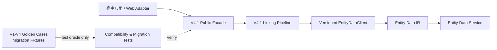

# DVEntityLinking V4.1 功能设计说明书

最后更新：2026-07-16  
状态：草案，待评审后作为 V4.1 实现输入  
上游需求：[V4.1 IR](./IR.md)

## 1. 设计目标

V4.1 以 V4 的对外行为为冻结基线，建立可独立演进的运行实现。设计重点是替换历史运行依赖，而非复制或重写业务语义：公开调用方始终经稳定门面进入 V4.1 pipeline；历史 V1–V4 资产只用于数据迁移、回归对照和必要的短期边界适配。

## 2. 总体架构



运行时依赖方向为：宿主 adapter → public facade → application/domain ports ← infrastructure adapter。`legacy/`、历史 Mock、样例 JSON 和旧 demo 不得出现在该方向上。

## 3. 功能设计分解

| SR 编号 | 对应 IR | 设计要点 | 验收输出 |
| --- | --- | --- | --- |
| SR-V4.1-A01 | IR-V4.1-001 | 建立 V4.1 独立组装与依赖边界。 | 默认入口依赖扫描和集成测试。 |
| SR-V4.1-A02 | IR-V4.1-002 | 冻结公开契约，提供版本化兼容校验。 | DTO/API 快照与兼容矩阵。 |
| SR-V4.1-A03 | IR-V4.1-003 | 设计数据、配置与调用方迁移器。 | 可重复迁移与校验报告。 |
| SR-V4.1-A04 | IR-V4.1-004 | 设计历史行为对照与差异治理。 | golden/evaluation 差异报告。 |
| SR-V4.1-A05 | IR-V4.1-005 | 设计灰度、回退、观测与弃用机制。 | 切换与回退演练证据。 |
| SR-V4.1-A06 | IR-V4.1-005 | 建立统一追踪 ID 和证据目录。 | 需求至验收的可查询映射。 |

### SR-V4.1-A01 独立运行边界

#### 设计

V4.1 公开入口继续仅暴露 `LinkRequestV1`、`LinkResponseV1`、`EntityLinkingModule` 与 `create_entity_linking_module()`（具体名称以当前 V4 公开导出为准）。组装层仅允许创建 V4.1 的 pipeline 组件、版本化 `EntityDataClient` 和已批准的 S3/S5 hook。

实现需维护一份机器可检验的禁止依赖集合，至少包括：`dv_entity_linking.legacy`、V3 Mock client、Redis/Gauss mock、历史 JSON catalog 路径和 Flask demo 全局对象。测试、迁移工具可通过显式 test-only fixture 引用这些资产，但 production package 与默认工厂不得引用。

#### 关键规则

- 公共门面不得泄漏内部领域对象、数据库记录或历史模型。
- V4.1 pipeline 中的 `EntityDataClient` 是唯一实体词/详情读取端口。
- 任何临时兼容 adapter 必须放在 `compat/`（或等价独立边界）并带 `CMP-V4.1-*`、owner、到期版本与删除条件。
- 禁止“数据服务不可用时自动改用 V3 Mock”的隐式回退；必须返回既有 `dependency_failed` 语义。

### SR-V4.1-A02 公开兼容层

#### 设计

建立 `compatibility_manifest`，为每个公开请求/响应字段登记：字段名、版本、必填性、默认值、语义说明及验证用例。兼容测试以已批准的 V4 响应快照及调用方样例为输入，分别校验：

1. 请求可被 V4.1 解析；
2. V4 已有字段仍存在且类型、枚举与语义一致；
3. V4.1 新字段不会影响旧调用方反序列化；
4. 同一输入的状态、mention、候选 ID、span 与安全错误语义无非批准差异。

对确实需要破坏性调整的场景，新增明确版本化 DTO/方法；不得改变 V1 DTO 的含义来“兼容”新实现。

### SR-V4.1-A03 数据、配置与调用方迁移

#### 数据迁移

迁移器输入为已确认的 V4 canonical entity 数据或其权威导出，输出为 V4.1 所需的 Entity Data Service 发布输入。迁移至少执行以下校验：

- `entity_id`、实体类型、`entity_name`、alias、attributes、relationships 和状态的记录级一致性；
- 从标准名和确认 alias 重建的实体词投影一致性；
- `normalized_key` 非空、可重算且在 active 实体间保持单值；
- 关系目标存在，且不存在非法/重复规范化关系；
- 发布后的 `MATCH_WORDS` 与 `BATCH_GET_ENTITIES` 结果符合 IR 契约且 data version 一致。

迁移结果输出结构化报告：输入版本、输出版本、记录数、词条数、冲突数、缺失数、校验摘要、执行时间和操作者标识。报告不得包含凭据或完整敏感 payload。

#### 配置迁移

为 V4.1 定义带 schema 校验的配置版本。保留 V4 等价配置值时使用一次性转换；废弃的 V3 Mock、Redis/Gauss 路径、隐式 Flask 开关必须在生产配置中报错，而非静默忽略。配置转换必须支持 dry-run，并输出废弃项及建议替代项。

#### 调用方迁移

调用方迁移以“维持 V4 公共调用方式”为默认。确需改造的调用方按 `CMP-V4.1-*` 建立清单，记录 owner、变更、验证用例、切换窗口与回退措施。

### SR-V4.1-A04 兼容对照与差异治理

对照测试将历史输入与预期作为独立 oracle，不从 V4.1 production code 推导预期。覆盖范围至少包括：

| 类别 | 必测内容 |
| --- | --- |
| 意图与状态 | `not_required`、`invalid_input`、`linked`、`partial`、`ambiguous`、`no_match`、`dependency_failed`。 |
| mention 语义 | 多 mention、重复词、span 还原、短 ID 边界、上下文词、最长非重叠和未知实体形态。 |
| 候选语义 | 排序、Top-K、类型提示、歧义 fail-closed、详情缺失和 data-version 不一致。 |
| 增强回退 | S3/S5 关闭、超时、低置信、非法 schema/ID 与 fallback 语义。 |
| 安全 | trace/error 不含敏感配置、上游原文和凭据。 |

差异以 `DIFF-V4.1-*` 登记，包含基线、实际结果、影响范围、根因、处置结论、批准人和对应测试。未关闭或未批准的 P0/P1 差异阻断切换。

### SR-V4.1-A05 灰度、回退与弃用

#### 切换流程

1. 在隔离环境完成数据/配置 dry-run 和全量对照。
2. 以只读或镜像流量进行结果比对；必要时不返回 V4.1 结果给终端用户。
3. 小范围切换至 V4.1，持续监控状态分布、依赖失败率、响应耗时、结果差异和迁移校验指标。
4. 达到观察窗口与阈值后扩大范围；完成后关闭历史运行入口。

#### 回退规则

回退目标是已确认的 V4 部署版本和其对应数据版本。触发条件至少包括：不可接受的 compatibility diff、`dependency_failed` 异常升高、数据版本不一致或安全边界破坏。回退过程只切换应用/路由配置，不执行未经验证的数据反向迁移；如数据需恢复，使用迁移前备份与已演练的恢复流程。

#### 弃用登记

每个历史资产都应记录 `DEP-V4.1-*`：资产、当前用途、运行时是否禁止、保留理由、owner、删除条件和目标版本。历史资产只有在回归/审计价值存在时保留；保留不等于可由生产路径调用。

### SR-V4.1-A06 追踪模型

所有工作项使用以下 ID 关联：

```text
IR-V4.1-* → SR-V4.1-* → IMP-V4.1-* → TEST-V4.1-* → MIG-V4.1-* / AC-V4.1-*
```

建议新增 `docs/baselines/v4.1/TRACEABILITY.md` 作为实施期单一追踪表；本轮先以 IR/SR 中的 ID 建立基线，实施开始后再登记具体实现任务、测试文件、迁移报告和验收记录。

## 4. 测试与验收设计

| 测试层 | 验证内容 | 对应验收 |
| --- | --- | --- |
| 静态依赖检查 | 默认 package、公开工厂和生产 adapter 不引用禁止集合。 | AC-V4.1-001 |
| 契约测试 | 公开 DTO、状态、错误、同步/异步入口的向后兼容。 | AC-V4.1-002 |
| 迁移测试 | dry-run、幂等重跑、冲突拒绝、发布后 IR 冒烟。 | AC-V4.1-004 |
| 行为对照 | V1–V4 golden/evaluation 与 V4.1 结果差异。 | AC-V4.1-003 |
| 故障注入 | 依赖失败、版本不一致、LLM 回退、回退开关。 | AC-V4.1-005 |
| 安全检查 | 日志/trace/迁移报告的敏感信息扫描。 | AC-V4.1-003、005 |
| 追踪审查 | 每项 IR/SR 有实现、测试和证据链接。 | AC-V4.1-006 |

## 5. 实施前置项

| AR 编号 | 需要确认的设计输入 | 影响 |
| --- | --- | --- |
| AR-V4.1-001 | V4 冻结 commit/tag、验收例外项。 | 决定对照基线。 |
| AR-V4.1-002 | 真实部署和实体数据服务的灰度能力。 | 决定切换与回退设计。 |
| AR-V4.1-003 | 外部调用方清单及 V4 DTO 使用方式。 | 决定兼容 manifest 覆盖范围。 |
| AR-V4.1-004 | 历史资产的保留与删除责任人。 | 决定弃用计划。 |
