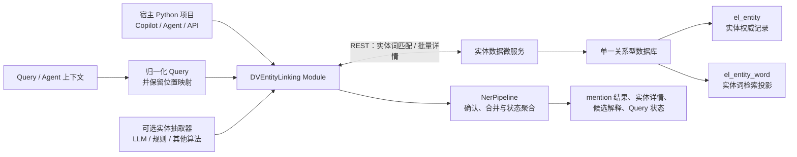

# DVEntityLinking V4 需求分析文档

最后更新：2026-07-14
状态：V4 IR 基线；后续据此派生 SR

## 1. 定位与演进目标

V4 是 DV 智能体体系内的实体理解能力演进，不是独立的 NER Demo，也不是先建库再重写全部链接规则。它继续服务于运维 Copilot、故障 Agent、知识检索和 Web/API 演示：把 Query 或 Agent 上下文中的实体词稳定映射为实体 ID、实体详情与可解释状态。

V1 建立了确定性的候选召回、链接状态和负例语义；V2 建立了数据预处理、多类型多 mention、`partial` 和可选 LLM 降级；V3 将“实体词链接”和“结构化实体查询”明确为两项逻辑职责，并以 Redis/Gauss Mock 验证了跨层一致性。

V4 的目标是以**一个关系型数据库**取代两份 Mock 数据的持久化承载，同时保留这两项逻辑职责和当前 Python NER 的最终判定能力。该数据库由独立的实体数据微服务持有；本项目不再直接连接数据库，而是作为可嵌入其他 Python 项目的实体链接模块，通过目标服务发布的 IR URL 和平台 Client 访问数据服务：

- 一个数据库是实体数据的唯一权威源，由实体数据微服务管理；本模块不保存数据库连接或 SQL 方言逻辑。
- 使用两个最小必要表，而非一个大 JSON 表或过度拆表：实体权威表与实体词检索投影表。
- 数据库直接完成第一阶段实体词撞词：以归一化 Query 反向包含归一化实体词；Python 继续完成原文 span 还原、词边界/上下文确认、最长非重叠和 Query 状态聚合。
- 本项目以 Python module 方式集成到宿主项目；IR client 是存储访问边界，Web/API 仅是可选宿主适配器。
- 增加可选实体抽取能力：它可提供候选 mention，但必须经过统一 schema 校验，且关闭、失败或低置信时回退到确定性识别。
- 以当前代码的实体模型为准：`entity_name`、`alias`、`desc`、`attributes`、`relationships` 已是 V4 的实体表达基础。
- 将既已完成的实体 schema 优化纳入 V4 范围：统一字段命名、受控扩展属性和显式实体关系必须随数据库迁移保持完整。
- 保持“别名必须确认、冲突 fail-closed、默认离线 deterministic 可回归、LLM 仅可选增强”的既有约束。

## 2. 范围与非目标

### 范围内

- `EntityLinkingService` 内嵌于现有 Flask/Web/API 与未来 Copilot、故障 Agent 调用链，不改变项目单体 demo 的部署边界。
- 作为 Python module 提供宿主可调用的实体链接入口，以及面向实体数据微服务的 REST client。
- 实体数据微服务负责预处理、校验、入库和词投影生成；本模块负责候选请求、Python 链接、评测与集成验证。
- 当前支持的实体类型及后续经确认的新类型；类型专属字段继续放入 `attributes`，关系继续放入 `relationships`。
- 规范实体 schema 的端到端迁移：存储校验、数据样例、服务层、Web/API 安全投影、前端适配和测试均只使用 canonical 字段名。

### 非目标

- 不在 V4 初期将全文 SQL、`LIKE`、`INSTR` 或归一化合成词作为最终撞词规则。
- 不把 `attributes`、`desc`、关系文本自动变成别名或召回词。
- 不擅自把 V3 的“一个实体词 key 对一个实体 ID”改为多值映射。
- 不定义类型专属字段字典、关系词表、真实 DV 生产接口、真实 LLM 默认验收或生产级高可用方案。
- 不保留 `canonical_name`、`description`、`aliases` 的长周期双读、双写或对外兼容模式。
- 不在本模块内直连关系型数据库、维护数据库连接池、执行业务 SQL 或承担实体数据写入 API。

## 3. 总体架构



两个表位于同一个数据库中，由实体数据微服务维护；DVEntityLinking module 通过 REST 使用其逻辑能力：

| 逻辑职责 | V3 | V4 |
| --- | --- | --- |
| 实体词撞词 | Redis Mock：实体词 → 单一实体 ID | 数据服务基于 `el_entity_word` 执行 `normalized_query` 包含 `normalized_word` 的批量匹配并返回命中词 |
| 实体详情查询 | Gauss Mock：实体 ID → 实体记录 | 数据服务基于 `el_entity` 按 ID 批量返回实体记录 |
| 最终链接判定 | `NerPipeline` | 保留在 Python；数据库不直接输出 `linked`/`ambiguous` |

因此，“两个逻辑层”不等于“两个数据库”。V4 只维护一个数据库和两个职责清晰的数据表。

## 4. 模块职责与调用边界

| 模块 | V4 职责 | 不承担的职责 |
| --- | --- | --- |
| Python Module Facade | 向宿主项目暴露稳定的 `link` 能力、配置和结构化结果。 | 不要求宿主采用 Flask 或本项目的前端。 |
| Optional Entity Extractor | 可选地产生候选 mention、类型或置信度。 | 不直接链接实体、不生成实体数据或别名。 |
| Entity Data IR Client | 通过平台 Client 请求候选实体词、实体详情、健康/版本信息，并映射超时、鉴权和协议错误。 | 不包含 SQL、连接池、部署地址或数据写入逻辑。 |
| NerPipeline | 融合抽取结果与确定性规则，完成最终撞词、未知实体形态识别、链接和聚合。 | 不依赖具体 REST/SQL 方言。 |
| Entity Data Service | 维护 `el_entity`、`el_entity_word`、入库校验和投影生成。 | 不决定 Query 的 span、重叠消除和链接状态。 |
| Host API Adapter | 由宿主项目选择性封装为 Web/API、Copilot 或 Agent 接口。 | 不暴露连接信息、原始上游 payload 或敏感属性。 |

LLM 或其他抽取算法仍只能作为 need-linking、候选 mention、类型判断、解释或 rerank 的可选增强；它产生的 mention 必须保留原文 span 并通过 schema 校验。它只能重排既有候选，不能生成未确认实体或未确认别名。

## 5. 数据模型

### 5.1 `el_entity`：实体权威表

一条记录对应一个稳定的业务实体。原始展示文本保留在此表中，避免归一化破坏实体名称、别名和 Query span 的可解释性。

| 字段 | 说明 |
| --- | --- |
| `entity_id` | 主键；稳定实体标识。 |
| `entity_type` | 实体类型；当前范围由现有契约和后续确认共同决定。 |
| `entity_name` | 原始标准名称。 |
| `alias_json` | 原始、已确认的别名数组；无确认别名时为空数组。 |
| `desc` | 简短说明。 |
| `attributes_json` | 当前代码中的扩展属性对象；不参与默认撞词。 |
| `relationships_json` | 当前代码中的关系数组；不拆分关系表，除非后续关系查询成为独立需求。 |
| `data_layer` | 数据层级，用于延续 Mock/脱敏/真实只读边界。 |
| `source` | 安全的数据来源摘要。 |
| `status` | `active` / `inactive`；只有 active 实体参与默认召回。 |
| `created_at`、`updated_at` | 审计时间。 |

`entity_id` 唯一；实体必填字段、实体类型、`attributes_json`、`relationships_json` 的结构继续由写入前校验保证。`alias_json` 是别名的权威保存位置，不允许把未确认别名仅写入词表绕过校验。

### 5.2 `el_entity_word`：实体词检索投影表

该表不是独立业务实体，也不是需要人工双写的别名表。它是从 `el_entity.entity_name` 和已确认 `alias_json` 推导出的、专用于召回和最终匹配的投影。

| 字段 | 说明 |
| --- | --- |
| `entity_word_id` | 主键。 |
| `entity_id` | 外键，关联 `el_entity.entity_id`。 |
| `entity_type` | 实体类型冗余字段，用于数据库匹配阶段的类型过滤，必须与实体表一致。 |
| `entity_word` | 原始实体词；Python 用它在原始 Query 中定位 span。 |
| `normalized_key` | 由 `entity_word` 派生，仅用于校验、去重、精确映射与可观测性。 |
| `source` | 仅允许 `entity_name` 或 `confirmed_alias`。 |
| `match_mode` | `EXACT_WORD`、`STRUCTURED_TOKEN` 或 `CONTEXT_REQUIRED`；控制命中后的应用侧确认规则。 |
| `min_context_required` | 是否要求上下文确认；普通短词默认不允许仅凭包含关系链接。 |
| `context_keywords_json` | `CONTEXT_REQUIRED` 词条允许的上下文关键词；为空时不通过上下文确认。 |
| `priority` | 同一位置多词命中时的业务优先级辅助值。 |
| `normalization_version` | 当前使用 `v3.entity_word_norm.1`，为规则升级留出迁移边界。 |
| `status` | 词条是否有效；默认随实体状态受控。 |
| `created_at`、`updated_at` | 审计时间。 |

派生规则固定如下：

1. 每个 active 实体的 `entity_name` 生成一条 `source=entity_name` 记录。
2. 每个已确认 alias 生成一条 `source=confirmed_alias` 记录。
3. `normalized_key = normalize_entity_word(entity_word)`：Unicode NFKC、`casefold()`、移除 Unicode 空白。
4. 同一 `entity_id` 内相同 `normalized_key` 去重。
5. 不生成缩写、分词、拼接词、描述词、属性词或关系词。
6. `EXACT_WORD` 与 `STRUCTURED_TOKEN` 可进入直接包含匹配；`CONTEXT_REQUIRED` 命中后仍必须由 module 校验上下文，避免将 `SYSTEM`、`USERS` 等普通词误链接为实体。

### 5.3 跨表一致性与冲突约束

V4 继承 V3 的默认语义：一个有效 `normalized_key` 只能指向一个实体 ID。不同实体出现相同的标准名或已确认别名时，入库校验必须 fail-closed，不能静默改成多行候选、更不能随机取其一。

| 校验 | 失败行为 |
| --- | --- |
| `entity_word.entity_id` 不存在或实体 inactive | 拒绝发布该批数据。 |
| `entity_word` 不属于该实体的标准名或确认别名 | 拒绝发布。 |
| `normalized_key` 计算值不一致或为空 | 拒绝发布。 |
| 不同 active 实体有相同 `normalized_key` | 拒绝发布并返回冲突实体与词来源。 |
| 实体字段、JSON 结构、类型或数据层级非法 | 拒绝发布，不做部分可用加载。 |

这保证 V4 延续 V3 已验证的单值实体词契约。若未来需要支持“同一词多实体”的真实歧义，必须先明确替代的词表结构、Python 消歧规则、API 状态和 golden cases；不能作为本轮表结构的隐式副作用。

### 5.4 可扩展实体 schema 与关系语义

V4 将实体 schema 优化视为与数据库落地同级的需求范围，而不是可选字段补充。每个结构化实体必须使用统一 common schema：

| 字段 | V4 要求 |
| --- | --- |
| `entity_id` | 非空稳定主键；也是关系目标和词表映射的唯一引用。 |
| `entity_name`、`desc` | 非空字符串；分别作为标准展示名和简短说明。 |
| `alias` | 字符串数组；只有明确确认的值可以生成实体词投影。 |
| `entity_type` | 当前受支持的实体类型。 |
| `attributes` | 必填 JSON 对象；用于已确认的类型专属元数据，默认 `{}`。 |
| `relationships` | 必填数组；用于显式、带类型、指向其他实体 ID 的关系，默认 `[]`。 |

`attributes` 的值必须是 JSON 兼容数据，且不得包含密钥、连接信息、完整原始 payload 或其他不安全内容；Web/API 仍按既有安全规则过滤后投影。`attributes` 不会自动成为顶层公共字段、alias 或撞词词源。

每个 `relationships` 元素必须同时包含非空 `relation_type` 和 `target_entity_id`。关系是从当前实体指向目标实体的有向关系；目标 ID 必须存在于同一批已发布实体中，悬挂引用、非法对象和重复的规范化关系必须 fail-closed。关系文本同样不参与默认候选召回或撞词。

V4 不引入独立关系表：在当前“按实体读取详情、展示有限关系”的范围内，关系保存在 `relationships_json` 已足够。只有当关系成为独立检索、反向查询、图遍历或大规模分析需求时，才另行提出表拆分需求。

字段命名迁移是原子性的：持久化数据、领域模型、仓储、API 和前端只输出 `entity_name`、`desc`、`alias`。如果数据仍仅提供旧字段名，必须在入库或启动校验阶段失败，不能以隐式 fallback 掩盖迁移不完整。

## 6. 数据服务写入与投影生成

实体数据由实体数据微服务通过统一写入流程进入数据库，而不是由本模块或维护人员分别更新两张表：

```text
source records
  → 数据预处理：字段规范化、别名确认、安全与冲突校验
  → 事务写入 el_entity
  → 删除该实体旧的 el_entity_word 投影
  → 由 entity_name + confirmed alias 生成新投影
  → 做跨实体 normalized_key 冲突校验
  → 提交；任一步失败则整体回滚
```

批量导入、增量更新和未来真实只读适配器都必须复用这一流程。这样，`el_entity` 是权威数据，`el_entity_word` 是可重建投影；不会出现 alias 已更新而候选词未更新的漂移。DVEntityLinking module 只读取该服务公开的契约，不参与写事务。

## 7. 查询、召回与最终撞词

### 7.1 阶段一：数据库实体词撞词

模块先将 Query 归一化为 `NormalizedQuery`，其中必须同时保留 `original_text`、`normalized_text` 和“归一化字符位置 → 原文字符位置”的映射。随后通过 Entity Data REST Client 提交 `normalized_text`、可选实体类型提示和数据版本，由数据微服务在 `el_entity_word` 上执行批量反向包含匹配：

```text
normalized_query 包含 normalized_word
```

逻辑 SQL 等价于：

```sql
SELECT entity_word_id, entity_id, entity_type, entity_word,
       normalized_key, source, match_mode, min_context_required,
       context_keywords_json, priority
FROM el_entity_word
WHERE status = 'active'
  AND INSTR(:normalized_query, normalized_key) > 0
```

这是数据库承担的“撞词”职责：每个 Query 一次批量 REST 调用找出其中命中的实体词，不能把 Query 切成许多 token 后逐词远程查询。响应必须返回原始实体词和上述匹配控制字段，不能只返回实体详情或只返回归一化合成词。

归一化合成词用于数据库匹配，但不替代原文语义。例如 `CPU Usage` 的 `cpuusage` 命中后，module 必须根据位置映射恢复原文 `CPU Usage` 的 span，不能把 `cpuusage` 直接作为对外 mention 文本。

候选匹配接口发生超时、鉴权失败、协议/schema 错误或数据版本不一致时，模块必须映射为结构化 `dependency_failed` 或降级状态；不得静默把外部失败伪装为 `no_match`。

### 7.2 阶段二：Python 最终匹配与链接

NerPipeline 对数据库已命中的实体词和正则/可选抽取器产生的 mention 执行最终确认：

1. `need_linking` 先排除不需要链接的 Query；
2. 可选抽取器有合法输出时，将其作为候选 mention；无输出、关闭、失败或低置信时继续确定性识别；
3. 对每个数据库命中词在 `normalized_text` 中定位全部命中位置，并通过位置映射还原原文 span；
4. 按 `match_mode` 校验字母数字词边界、结构化 token 或必需上下文；
5. 合并数据库命中、正则命中和抽取器候选，按最长、非重叠规则保留 mention；
6. 对最终 mention 的 `entity_id` 去重后一次批量请求实体详情，构建候选和安全 trace；
7. 保留 unknown/entity-shaped mention，再聚合 `linked`、`partial`、`ambiguous`、`no_match`、`not_required` 或结构化依赖失败。

数据库漏掉可匹配词会造成 false negative，数据库对短词的包含命中则可能造成 false positive。因此 V4 的正确性门槛同时包括数据库撞词完整性和 Python 的边界/上下文/重叠确认；数据库命中不直接等同于 `linked`。

## 8. REST 集成接口草案

V4 固定模块与数据服务之间的能力边界，并采用一个由目标服务发布的业务 IR URL。请求通过 `operation` 受控枚举选择严格 schema，而非把 SQL 或自由查询条件暴露给调用方；平台 Client 负责以该 IR URL 进行内部调用。

| 操作 | 请求语义 | 最小响应 | 调用方 |
| --- | --- | --- | --- |
| `MATCH_WORDS` | `normalized_query`、可选类型提示、可选数据版本 | 命中词的 `entity_word`、`normalized_key`、`entity_id`、`entity_type`、`source`、`match_mode`、上下文约束、数据版本 | Entity Data REST Client |
| `BATCH_GET_ENTITIES` | 去重后的 `entity_id[]` | canonical entity schema、安全可投影字段、数据版本 | Entity Data REST Client |
| `UPSERT_ENTITY` | canonical `entity` 与写入幂等 `request_id` | 写入确认、数据版本 | 受控数据管理调用方 |
| `DELETE_ENTITY` / `REBUILD_ENTITY_WORDS` | `entity_id` 或可选 `entity_ids[]` 与 `request_id` | 写入确认、数据版本 | 受控数据管理/运维调用方 |
| 健康与契约版本 | 独立健康 URL，无业务 `operation` | 服务可用性、契约版本、数据版本 | 宿主启动检查/运维 |

所有业务响应必须包含 `operation`、`status`、`data_version` 和 `data`。服务端仅接受已发布的枚举值，并按操作隔离鉴权；写操作必须幂等。新增能力通过新增 operation 及其 schema 演进，既有 operation 的字段不得重命名或改变语义。

V4 的 Python module 对宿主至少提供一个同步或异步的链接入口。其输入为 Query、可选 Agent 上下文、可选类型提示和抽取模式；其输出继续沿用 Query/mention 级状态、span、候选、实体详情、数据服务 trace 摘要与结构化错误。宿主是否再暴露 HTTP endpoint，由宿主项目决定。

抽取器采用可插拔接口：输入为 Query 与安全上下文，输出为 `mentions[]`、候选类型、置信度和可选安全摘要。每个 mention 必须能够回映到 Query 原文 span；否则该抽取输出无效并回退到确定性路径。抽取器的超时、异常、非法 schema 或低置信不应改变已验证的离线确定性结果。

## 9. 索引与性能策略

数据库产品尚未确认，V4 先定义数据与 REST 接口语义，不绑定 SQL 方言。以下索引由实体数据微服务实现和维护；module 仅通过召回接口使用其效果。最小索引要求：

| 表 | 约束/索引 | 用途 |
| --- | --- | --- |
| `el_entity` | 主键 `entity_id` | 实体详情精确读取。 |
| `el_entity` | `(status, entity_type)` | active 实体的类型过滤。 |
| `el_entity_word` | 主键 `entity_word_id` | 记录标识。 |
| `el_entity_word` | 外键/索引 `entity_id` | 投影重建、实体关联和批量读取。 |
| `el_entity_word` | 唯一约束 `(normalized_key, status_scope)` | 维持 active 词条单值映射；具体实现需适配数据库的部分唯一索引能力。 |
| `el_entity_word` | `(status, normalized_key)` | 键校验、精确映射和冲突检查。 |

数据库全文或倒排能力仅作为后续的**实体词批量匹配优化**。启用前必须在真实规模、端到端 REST 延迟基线、中文/英文/符号边界、别名、漏召回率和回归样例上验证；优化结果不得改变 Python 最终匹配语义。

## 10. 与当前实现的映射

| 当前实现 | V4 演进方式 |
| --- | --- |
| `EntityRecord` / `StructuredEntityRecord` | 对应 `el_entity` 的领域模型；使用当前的 `entity_name`、`alias`、`desc`、`attributes`、`relationships`。 |
| `EntityWordRecord` | 对应 `el_entity_word` 的领域模型。 |
| `normalize_entity_word()` | 作为唯一的词表派生与运行时确认规则，必须共享实现或共享测试向量。 |
| `GaussEntityStoreMock` | 替换为 Entity Data REST Client 的实体详情读取能力。 |
| `RedisEntityWordCacheMock` | 替换为 REST 实体词批量匹配能力，不再表达 Redis 运行依赖。 |
| `EntityStorageRepository` | 演进为 REST 存储门面，保持 NerPipeline 不感知 HTTP 与 SQL。 |
| `_detect_known_mentions()` | 演进为 Python 终判入口；输入改为数据库批量匹配结果及其位置映射。 |
| V3 JSON artifacts | 作为首批迁移输入、回归对照和导入校验样例。 |

历史文档中的 `canonical_name`、`aliases`、`description` 属于 V1/V2/V3 早期命名；V4 以当前代码和当前数据契约中的 `entity_name`、`alias`、`desc` 为准。

## 11. 迁移、回归与验收

### 10.1 迁移路径

1. 以 V3 Gauss Mock 和当前本地实体模型导入 `el_entity`。
2. 按 `entity_name + confirmed alias` 生成 `el_entity_word`，与 V3 Redis Mock 的词和实体 ID 做差异报告。
3. 对差异逐条确认来源；不接受“为了补词自动生成 alias”。
4. 以 REST contract stub 接入 V4 数据服务，保留 V3 Mock adapter 仅用于对照与迁移回归。
5. 在 V3 golden cases、V1/V2 回归和新增 V4 用例全部通过后，才将 V4 设为默认存储模式。

### 10.2 必须新增或保留的验证

- 实体必填字段、JSON 扩展字段、重复实体 ID、dangling entity ID、词表来源和规范化版本的 fail-closed 测试。
- canonical schema 测试：`attributes={}`、`relationships=[]` 的默认结构；合法扩展属性的安全投影；旧字段名、非法 JSON 值、悬挂关系和重复关系的拒绝行为。
- `entity_name` 命中、确认 alias 命中、大小写/NFKC/空白变化、短词边界、包含关系和最长非重叠 span 测试。
- 数据库实体词匹配完整性：每个 golden mention 的 `normalized_word` 必须由匹配接口返回；同时覆盖多空白、大小写、NFKC 与多个出现位置。
- REST 契约测试：实体词批量匹配、实体批量读取、健康/版本、超时、鉴权失败、协议错误、空结果和数据版本不一致必须有明确的结构化语义。
- module 集成测试：宿主项目调用入口、同步/异步适配、可选抽取器关闭/成功/失败/非法 span/低置信回退，以及无 Flask 依赖的离线回归。
- `linked`、`partial`、`ambiguous`、`no_match`、`not_required`、依赖失败的 Query 与 mention 级语义回归。
- V1/V2/V3 既有 evaluation、acceptance smoke、安全扫描与默认离线 deterministic 回归。
- 数据库不可用、空结果、投影与实体不一致、批量导入回滚的结构化错误测试。

## 12. V4 前置决策

以下事项会影响实现细节，但不改变本设计的核心边界：

1. 确认实体数据微服务的 REST 契约、认证方式、超时/重试、数据版本与部署边界；本模块只依赖此契约。
2. 确认实际关系型数据库产品和实体数据微服务的部署方式；据此选择实体词批量匹配的优化实现。
3. 确认首期实体量和端到端延迟目标，决定何时从“全量 active 实体词候选”升级为数据库专用索引召回。
4. 确认可选实体抽取器的首期实现、输入安全边界、置信度阈值和是否需要异步调用；默认必须能关闭并回退。
5. 确认 `attributes`、`relationships` 的真实数据来源和安全投影规则；它们本轮不自动参与撞词。
6. 若业务确实需要同词多实体，单独提出词表多值和消歧需求，补齐 API、状态、测试与迁移设计后再演进。
