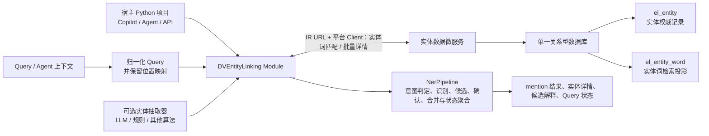

# DVEntityLinking V4 需求分析文档

最后更新：2026-07-16
状态：V4 IR 运行边界已收口；核心能力迁移以能力矩阵逐项验收；LLM 仅保留旧版已实现的抽取与候选消歧能力

## 1. 定位与演进目标

V4 是 DV 智能体体系内的实体理解能力演进，不是独立的 NER Demo，也不是先建库再重写全部链接规则。它继续服务于运维 Copilot、故障 Agent、知识检索和 Web/API 演示：把 Query 或 Agent 上下文中的实体词稳定映射为实体 ID、实体详情与可解释状态。

V1 建立了确定性的候选召回、链接状态和负例语义；V2 建立了数据预处理、多类型多 mention、`partial` 和可选 LLM 降级；V3 将“实体词链接”和“结构化实体查询”明确为两项逻辑职责，并以 Redis/Gauss Mock 验证了跨层一致性。

V4 的目标是以**一个关系型数据库**取代两份 Mock 数据的持久化承载，同时保留这两项逻辑职责和当前 Python NER 的最终判定能力。该数据库由独立的实体数据微服务持有；本项目不再直接连接数据库，而是作为可嵌入其他 Python 项目的实体链接模块，通过目标服务发布的 IR URL 和平台 Client 访问数据服务：

- `el_entity` 与 `el_entity_word` 是唯一权威数据来源，由实体数据微服务管理；本模块不保存数据库连接或 SQL 方言逻辑。
- V4 运行时禁止 Redis、缓存词表和本地持久化实体快照作为任何召回或实体详情的权威来源；单次请求内的临时变量不属于缓存。
- 使用两个最小必要表，而非一个大 JSON 表或过度拆表：实体权威表与实体词检索投影表。
- 数据库直接完成第一阶段实体词撞词：以归一化 Query 反向包含归一化实体词；它只替换 V3 的实体词检索层，不能替代 Python NER、候选决策或最终链接能力。
- 本项目以 Python module 方式集成到宿主项目；IR client 是存储访问边界，Web/API 仅是可选宿主适配器。
- 增加可选实体抽取能力：它可提供候选 mention，但必须经过统一 schema 校验，且关闭、失败或低置信时回退到确定性识别。
- 以当前代码的实体模型为准：`entity_name`、`alias`、`desc`、`attributes`、`relationships` 已是 V4 的实体表达基础。
- 将既已完成的实体 schema 优化纳入 V4 范围：统一字段命名、受控扩展属性和显式实体关系必须随数据库迁移保持完整。
- 保持“别名必须确认、冲突 fail-closed、默认离线 deterministic 可回归、LLM 仅可选增强”的既有约束。

## 2. 范围与非目标

### 范围内

- 作为 Python module 提供宿主可调用的实体链接入口，以及面向实体数据微服务的 IR URL + 平台 Client。
- 实体数据微服务负责预处理、校验、入库和词投影生成；本模块负责候选请求、Python 链接、评测与集成验证。
- 当前支持的实体类型及后续经确认的新类型；类型专属字段继续放入 `attributes`，关系继续放入 `relationships`。
- 规范实体 schema 的端到端迁移：存储校验、数据样例、服务层、Web/API 安全投影、前端适配和测试均只使用 canonical 字段名。
- V1–V3 已验证的实体理解核心能力必须等价迁入 V4，不得因 module 化、数据库迁移或 IR 调用而降级为“仅已知词撞词”。

### 非目标

- 不在 V4 初期将全文 SQL、`LIKE`、`INSTR` 或归一化合成词作为最终撞词规则。
- 不把 `attributes`、`desc`、关系文本自动变成别名或召回词。
- 不擅自把 V3 的“一个实体词 key 对一个实体 ID”改为多值映射。
- 不定义类型专属字段字典、关系词表、真实 DV 生产接口、真实 LLM 默认验收或生产级高可用方案。
- 不保留 `canonical_name`、`description`、`aliases` 的长周期双读、双写或对外兼容模式。
- 不在本模块内直连关系型数据库、维护数据库连接池、执行业务 SQL 或承担实体数据写入 API。
- 不在 V4 默认运行链中启用 V3 Mock、Gauss JSON、Redis JSON、Redis、缓存词表或本地持久化实体快照；它们仅可作为显式测试/迁移对照资产。

### 2.1 核心能力保留基线（V4 不可裁剪范围）

V4 是存储与集成边界演进，**不是功能降级重写**。下表能力均是 V4 首期交付和验收的硬约束；数据库匹配仅是其中 P4 的候选输入。

| V1–V3 核心能力 | V4 必须保留的行为 | 不允许的退化 |
| --- | --- | --- |
| `need_linking` / `not_required` | 在任何远程召回前决定是否需要链接，并保留明确 bypass 原因。 | 将所有 Query 都送往数据库，或把 bypass 伪装为 `no_match`。 |
| 多类型、多 mention 识别 | 同一 Query 可产生多个已知与未知 mention，并保留原文 span、来源和类型信息。 | 只返回一个已知实体词或丢弃未链接 mention。 |
| 确定性未知实体形态识别 | 对 alarm ID、资源 ID 等已定义形态执行本地规则识别，并在未确认时保留 unknown/no-match 结果。 | 数据库无词命中即直接认定 Query 没有实体。 |
| 候选生成、排序与解释 | 对每个 mention 输出候选实体、置信度、来源、排序和可解释理由；必要时表达歧义。 | 数据库返回一个词即直接构造唯一 `linked`。 |
| 链接/聚合状态 | 完整保留 `linked`、`partial`、`ambiguous`、`no_match`、`not_required`、`dependency_failed`、`invalid_input` 的 Query 与 mention 级语义。 | 仅保留 `linked/no_match/dependency_failed`。 |
| LLM 可选增强和确定性回退 | 仅保留旧版已实现的 S3 mention extraction 与 S5 rerank；两者可关闭，失败、低置信或非法 schema 时不得破坏确定性结果。 | 让 LLM 成为唯一识别路径、让 LLM 创建候选 ID，或把 S1/S2/S4 等新增能力伪装为历史能力。 |
| 数据层异常与安全 trace | 记录安全的阶段、来源、候选/存储状态和降级原因；不泄露原始上游响应或凭据。 | 将依赖失败伪装成 miss，或只返回无上下文的错误字符串。 |
| 评测与运行记录 | 保留 V1/V2/V3 golden case、evaluation/smoke 和可选运行记录能力。 | 仅以新的简单撞词测试替代历史回归。 |

V4 实现必须先满足该基线，才可宣称完成 V4 的实体链接能力；仅包含归一化、词召回、span 恢复和详情读取的代码只能称为“数据服务召回适配器验收切片”。

### 2.2 V1→V2→V3 累计能力迁移矩阵

V4 的最起始目标是“以新的数据承载与 module 集成方式，保留并演进既有实体链接产品能力”。因此迁移基线不是某一个 V3 类，而是 V1、V2、V3 已闭环能力的**累计集合**。后续实现、测试和验收必须逐项满足下表；任一项缺失均属于 V4 功能回退。

| 来源版本 | 已建立的能力 | V4 等价落点 | 强制验收语义 |
| --- | --- | --- | --- |
| V1 | `alarm` 基线、标准名/确认 alias/ID 的确定性候选召回、短 ID 子串保护、候选排序与解释。 | `KnownMentionRecognizer`、`CandidateResolver`、`MentionSelector`。 | 精确匹配不误吞短 ID；Top-1/Top-K 与解释保持可验证。 |
| V1 | `linked`、`ambiguous`、`no_match`、`not_required` 与负例零误报。 | `ResultAggregator`、`LinkResponseV1`。 | `not_required` 不召回候选；`no_match` 不含伪候选；歧义不得强制链接。 |
| V1 | 离线 deterministic 默认路径、LLM 模式、结构化错误/降级和 precision/recall 评测。 | S3 `EntityExtractionEnhancer`、S5 `CandidateReranker`、`SafeTraceBuilder`、evaluator/run record。 | 自动化不依赖真实 LLM；抽取不可用时按 `allow_fallback` 保持离线结果或明确 dependency failure；rerank 不可用时保持确定性候选结论。 |
| V2 | 多来源数据预处理、canonical 实体目录和确认 alias 约束。 | Entity Data Service 的入库/投影流程及 V4 canonical schema。 | 多类型实体、确认样例和运行时数据进入同一 schema；不得自动制造 alias。 |
| V2 | 多实体类型路由、同 Query 多 mention、mention 级候选/错误和 Query 级 `partial`。 | `LinkingIntentPolicy`、`EntityTypeResolver`、recognizers、`ResultAggregator`。 | 所有 mention 可观察；至少一个 linked 且至少一个失败/歧义/降级时必须为 `partial`。 |
| V2 | 跨类型候选与歧义、LLM 抽取与 rerank 的 schema 校验和回退。 | `CandidateResolver`、S3 `EntityExtractionEnhancer`、S5 `CandidateReranker`。 | LLM 只能补充 mention 或重排已确认候选，schema/span/ID 非法必须降级，不得覆盖确定性结论。 |
| V3 | 词表归一化、实体词→实体 ID、实体 ID→详情、跨层 fail-closed 和安全 storage trace。 | `NormalizedQuery`、Entity Data IR Client、V4 data version/trace。 | 数据服务异常、详情缺失或版本不一致不伪装为 `no_match`，不得误链接。 |
| V3 | 已知词确认与未知实体形态识别、最长非重叠、完整 Query/mention 聚合。 | V4 `NerPipeline` 全链路。 | 数据库候选与本地未知识别共同参与选择；unknown mention 必须保留。 |

### 2.3 设计—组件—测试验收映射

缺少以下任一组件或测试即阻断 V4 验收；状态以任务清单和 CI 测试结果为准。

| 运行承诺 | Owner/component | 独立验证 | 状态 |
| --- | --- | --- | --- |
| 生产 IR 生命周期 | `IrEntityDataClient`、工厂策略 | `tests/test_v4_module.py` | implemented |
| 非本地生产装配 | `create_entity_linking_module` | `tests/test_v4_module.py` | implemented |
| 意图与 mention 识别 | `LinkingIntentPolicy`、recognizers | `tests/test_v4_module.py` | implemented |
| 类型/候选与选择 | resolvers、`MentionSelector` | `tests/test_v4_final_pipeline_contract.py` | implemented |
| 聚合与安全 trace | `ResultAggregator`、`SafeTraceBuilder` | `tests/test_v4_module.py` | implemented |
| S3/S5 回退与 async | enhancer/reranker、`link_async` | `tests/test_v4_final_pipeline_contract.py`、`tests/test_v4_module.py` | implemented |

V1/V2 的 Web 展示形态可以由宿主 adapter 实现，但它们的**领域输出能力**（模式状态、mention、候选、解释、错误、降级和评测）必须由 V4 module 保留，不能因 V4 不依赖 Flask 而删除。

## 3. 总体架构



两个表位于同一个数据库中，由实体数据微服务维护；DVEntityLinking module 仅通过 IR URL 和平台 Client 使用其逻辑能力：

| 逻辑职责 | V3 | V4 |
| --- | --- | --- |
| 实体词撞词 | Redis Mock：实体词 → 单一实体 ID | 数据服务基于 `el_entity_word` 执行 `normalized_query` 包含 `normalized_word` 的批量匹配并返回命中词 |
| 实体详情查询 | Gauss Mock：实体 ID → 实体记录 | 数据服务基于 `el_entity` 按 ID 批量返回实体记录 |
| 最终链接判定 | `NerPipeline` | 保留在 Python；数据库不直接输出 `linked`/`ambiguous` |

因此，“两个逻辑层”不等于“两个数据库”。V4 只维护一个数据库和两个职责清晰的数据表。

## 4. 模块职责与调用边界

| 模块 | V4 职责 | 不承担的职责 |
| --- | --- | --- |
| Python Module Facade | 向宿主项目暴露稳定的 `link` 能力、配置和结构化结果。 | 不要求宿主采用 Flask 或本项目的前端。 |
| Optional Entity Extractor | 可选地产生候选 mention、类型或置信度。 | 不直接链接实体、不生成实体数据或别名。 |
| Entity Data IR Client | 通过平台 Client 请求候选实体词、实体详情、健康/版本信息，并映射超时、鉴权和协议错误。 | 不包含 SQL、连接池、部署地址或数据写入逻辑。 |
| NerPipeline | 承载 V1–V3 核心能力：意图判定、已知/未知 mention 识别、类型判断、候选排序、最终确认、降级和聚合。 | 不依赖具体 REST/SQL 方言。 |
| Entity Data Service | 维护 `el_entity`、`el_entity_word`、入库校验和投影生成。 | 不决定 Query 的 span、重叠消除和链接状态。 |
| Host API Adapter | 由宿主项目选择性封装为 Web/API、Copilot 或 Agent 接口。 | 不暴露连接信息、原始上游 payload 或敏感属性。 |

LLM 只以两个独立可选 hook 介入 pipeline，且严格保持 V1/V2 的原有位置：S3 `EntityExtractionEnhancer` 与数据库召回并行地产生候选 mention；S5 `CandidateReranker` 仅对已形成的歧义候选集进行选择。二者都不能生成未确认实体、未确认别名或绕过候选确认直接输出 `linked`。

| 阶段 | 合法输入与输出 | 失败与回退 |
| --- | --- | --- |
| S3 mention extraction | 输入 Query、安全上下文和类型提示；输出可回映原文的 mention、span、类型与置信度。 | span/schema/低置信/异常时，`allow_fallback=true` 丢弃 LLM 输出并继续确定性识别；`false` 返回 `dependency_failed`。 |
| S5 rerank / disambiguation | 输入 Query、mention 和已有候选的 ID、类型、命中词、匹配理由与分数；输出已有候选 ID 中的一个、置信度和理由。 | 非法 ID、schema、低置信或异常时始终保留确定性 Top-K 与 `ambiguous`，不得强制 Top-1。 |

S1 need-linking、S2 type routing 与 S4 独立候选解释不属于旧版已实现能力，不能作为 V4 的核心能力保留或默认实现范围；如未来需要，必须在后续版本以独立需求重新评审。

## 5. 数据模型

### 5.1 `el_entity`：实体权威表

一条记录对应一个稳定的业务实体。原始展示文本保留在此表中，避免归一化破坏实体名称、别名和 Query span 的可解释性。

| 字段 | 说明 |
| --- | --- |
| `entity_id` | 主键；稳定实体标识。 |
| `entity_type` | 实体类型；当前范围由现有契约和后续确认共同决定。 |
| `entity_name` | 原始标准名称。 |
| `alias_json` | 原始、已确认的别名数组；无确认别名时为空数组。 |
| `desc` | 简短说明。 |
| `attributes_json` | 当前代码中的扩展属性对象；不参与默认撞词。 |
| `relationships_json` | 当前代码中的关系数组；不拆分关系表，除非后续关系查询成为独立需求。 |
| `data_layer` | 数据层级，用于延续 Mock/脱敏/真实只读边界。 |
| `source` | 安全的数据来源摘要。 |
| `status` | `active` / `inactive`；只有 active 实体参与默认召回。 |
| `created_at`、`updated_at` | 审计时间。 |

`entity_id` 唯一；实体必填字段、实体类型、`attributes_json`、`relationships_json` 的结构继续由写入前校验保证。`alias_json` 是别名的权威保存位置，不允许把未确认别名仅写入词表绕过校验。

### 5.2 `el_entity_word`：实体词检索投影表

该表不是独立业务实体，也不是需要人工双写的别名表。它是从 `el_entity.entity_name` 和已确认 `alias_json` 推导出的、专用于召回和最终匹配的投影。

| 字段 | 说明 |
| --- | --- |
| `entity_word_id` | 主键。 |
| `entity_id` | 外键，关联 `el_entity.entity_id`。 |
| `entity_type` | 实体类型冗余字段，用于数据库匹配阶段的类型过滤，必须与实体表一致。 |
| `entity_word` | 原始实体词；Python 用它在原始 Query 中定位 span。 |
| `normalized_key` | 由 `entity_word` 派生，仅用于校验、去重、精确映射与可观测性。 |
| `source` | 仅允许 `entity_name` 或 `confirmed_alias`。 |
| `match_mode` | `EXACT_WORD`、`STRUCTURED_TOKEN` 或 `CONTEXT_REQUIRED`；控制命中后的应用侧确认规则。 |
| `min_context_required` | 是否要求上下文确认；普通短词默认不允许仅凭包含关系链接。 |
| `context_keywords_json` | `CONTEXT_REQUIRED` 词条允许的上下文关键词；为空时不通过上下文确认。 |
| `priority` | 同一位置多词命中时的业务优先级辅助值。 |
| `normalization_version` | 当前使用 `v3.entity_word_norm.1`，为规则升级留出迁移边界。 |
| `status` | 词条是否有效；默认随实体状态受控。 |
| `created_at`、`updated_at` | 审计时间。 |

派生规则固定如下：

1. 每个 active 实体的 `entity_name` 生成一条 `source=entity_name` 记录。
2. 每个已确认 alias 生成一条 `source=confirmed_alias` 记录。
3. `normalized_key = normalize_entity_word(entity_word)`：Unicode NFKC、`casefold()`、移除 Unicode 空白。
4. 同一 `entity_id` 内相同 `normalized_key` 去重。
5. 不生成缩写、分词、拼接词、描述词、属性词或关系词。
6. `EXACT_WORD` 与 `STRUCTURED_TOKEN` 可进入直接包含匹配；`CONTEXT_REQUIRED` 命中后仍必须由 module 校验上下文，避免将 `SYSTEM`、`USERS` 等普通词误链接为实体。

### 5.3 跨表一致性与冲突约束

V4 继承 V3 的默认语义：一个有效 `normalized_key` 只能指向一个实体 ID。不同实体出现相同的标准名或已确认别名时，入库校验必须 fail-closed，不能静默改成多行候选、更不能随机取其一。

| 校验 | 失败行为 |
| --- | --- |
| `entity_word.entity_id` 不存在或实体 inactive | 拒绝发布该批数据。 |
| `entity_word` 不属于该实体的标准名或确认别名 | 拒绝发布。 |
| `normalized_key` 计算值不一致或为空 | 拒绝发布。 |
| 不同 active 实体有相同 `normalized_key` | 拒绝发布并返回冲突实体与词来源。 |
| 实体字段、JSON 结构、类型或数据层级非法 | 拒绝发布，不做部分可用加载。 |

这保证 V4 延续 V3 已验证的单值实体词契约。若未来需要支持“同一词多实体”的真实歧义，必须先明确替代的词表结构、Python 消歧规则、API 状态和 golden cases；不能作为本轮表结构的隐式副作用。

### 5.4 可扩展实体 schema 与关系语义

V4 将实体 schema 优化视为与数据库落地同级的需求范围，而不是可选字段补充。每个结构化实体必须使用统一 common schema：

| 字段 | V4 要求 |
| --- | --- |
| `entity_id` | 非空稳定主键；也是关系目标和词表映射的唯一引用。 |
| `entity_name`、`desc` | 非空字符串；分别作为标准展示名和简短说明。 |
| `alias` | 字符串数组；只有明确确认的值可以生成实体词投影。 |
| `entity_type` | 当前受支持的实体类型。 |
| `attributes` | 必填 JSON 对象；用于已确认的类型专属元数据，默认 `{}`。 |
| `relationships` | 必填数组；用于显式、带类型、指向其他实体 ID 的关系，默认 `[]`。 |

`attributes` 的值必须是 JSON 兼容数据，且不得包含密钥、连接信息、完整原始 payload 或其他不安全内容；Web/API 仍按既有安全规则过滤后投影。`attributes` 不会自动成为顶层公共字段、alias 或撞词词源。

每个 `relationships` 元素必须同时包含非空 `relation_type` 和 `target_entity_id`。关系是从当前实体指向目标实体的有向关系；目标 ID 必须存在于同一批已发布实体中，悬挂引用、非法对象和重复的规范化关系必须 fail-closed。关系文本同样不参与默认候选召回或撞词。

V4 不引入独立关系表：在当前“按实体读取详情、展示有限关系”的范围内，关系保存在 `relationships_json` 已足够。只有当关系成为独立检索、反向查询、图遍历或大规模分析需求时，才另行提出表拆分需求。

字段命名迁移是原子性的：持久化数据、领域模型、仓储、API 和前端只输出 `entity_name`、`desc`、`alias`。如果数据仍仅提供旧字段名，必须在入库或启动校验阶段失败，不能以隐式 fallback 掩盖迁移不完整。

## 6. 数据服务写入与投影生成

实体数据由实体数据微服务通过统一写入流程进入数据库，而不是由本模块或维护人员分别更新两张表：

```text
source records
  → 数据预处理：字段规范化、别名确认、安全与冲突校验
  → 事务写入 el_entity
  → 删除该实体旧的 el_entity_word 投影
  → 由 entity_name + confirmed alias 生成新投影
  → 做跨实体 normalized_key 冲突校验
  → 提交；任一步失败则整体回滚
```

批量导入、增量更新和未来真实只读适配器都必须复用这一流程。这样，`el_entity` 是权威数据，`el_entity_word` 是可重建投影；不会出现 alias 已更新而候选词未更新的漂移。DVEntityLinking module 只读取该服务公开的契约，不参与写事务。

## 7. 查询、召回与最终链接

### 7.0 V4 核心运行模型（最终验收基线）

V4 的主流程必须是“多源识别并行、统一候选与消歧、最后读取详情”，而不是“数据库撞词后直接读取详情”。下列顺序是最终验收的强制基线：

```text
Query 校验
  → need-linking 判断（确定性）
  → Query 归一化（保留位置映射）
  → 并行：数据库已知词召回 / 本地正则规则与可选抽取器（S3 hook）
  → Mention 合并与 span 确认
  → 候选生成与消歧（可选 S5 rerank hook）
  → 对最终可确认候选批量读取实体详情
  → Query 与 mention 状态聚合
```

数据库只参与“已知词召回”和“已消歧候选的实体详情读取”两个受控步骤。正则与其他确定性识别规则必须能够在数据库空命中时独立产生 unknown/no-match mention；可选抽取器只能补充 mention、类型线索或候选排序信号，不能绕过候选确认直接生成实体 ID。

因此，任何以 `match_words → batch_get → linked/no_match` 为主干、将正则/抽取能力降为数据库命中后的附属步骤的实现，均不满足 V4 最终验收要求，即使其已能完成已知词撞词。

### 7.1 阶段一：数据库实体词撞词

模块先将 Query 归一化为 `NormalizedQuery`，其中必须同时保留 `original_text`、`normalized_text` 和“归一化字符位置 → 原文字符位置”的映射。随后通过 Entity Data IR Client 和平台 Client 提交 `normalized_text`、可选实体类型提示和数据版本，由数据微服务在 `el_entity_word` 上执行批量反向包含匹配：

```text
normalized_query 包含 normalized_word
```

逻辑 SQL 等价于：

```sql
SELECT entity_word_id, entity_id, entity_type, entity_word,
       normalized_key, source, match_mode, min_context_required,
       context_keywords_json, priority
FROM el_entity_word
WHERE status = 'active'
  AND INSTR(:normalized_query, normalized_key) > 0
```

这是数据库承担的“撞词”职责：每个 Query 一次批量 IR 调用找出其中命中的实体词，不能把 Query 切成许多 token 后逐词远程查询。响应必须返回原始实体词和上述匹配控制字段，不能只返回实体详情或只返回归一化合成词。

归一化合成词用于数据库匹配，但不替代原文语义。例如 `CPU Usage` 的 `cpuusage` 命中后，module 必须根据位置映射恢复原文 `CPU Usage` 的 span，不能把 `cpuusage` 直接作为对外 mention 文本。

候选匹配接口发生超时、鉴权失败、协议/schema 错误或数据版本不一致时，模块必须映射为结构化 `dependency_failed` 或降级状态；不得静默把外部失败伪装为 `no_match`。

### 7.2 阶段二：Python 多源识别、候选与最终链接

NerPipeline 必须按下列顺序处理数据库已命中的实体词、正则规则和可选抽取器产生的 mention：

1. 校验 Query；再以确定性 `need_linking` 排除不需要链接的 Query，并产生可解释的 `not_required`；
2. 归一化 Query 并保留位置映射；
3. 并行执行两个识别支路：数据库已知词召回，以及本地确定性正则/未知实体形态识别；可选 S3 `EntityExtractionEnhancer` 有合法输出时加入本地支路，无输出、关闭、失败或低置信时继续确定性识别；
4. 对每个数据库命中词在 `normalized_text` 中定位全部位置，恢复原文 span；按 `match_mode` 校验字母数字边界、结构化 token 或必需上下文；
5. 合并数据库、正则和抽取器的 mention，确认原文 span 并按最长非重叠规则选择；未知 mention 必须保留；
6. 为每个保留 mention 生成候选集，综合 entity type、词来源、边界/上下文、规则证据、抽取置信度和业务 priority 进行排序与消歧；输出唯一候选、Top-K 歧义候选或 no-match。多候选 mention 可调用 S5 `CandidateReranker` 从已确认候选中选择唯一 ID；S5 失败或低置信时保留确定性排序，ambiguous 不强制 linked；
7. 仅对第 6 步最终可确认的 entity ID 去重后一次批量请求实体详情；unknown/no-match mention 不得编造 entity ID，ambiguous mention 只能读取其已确认的候选详情；
8. 结合详情构建 mention 级 linked、unknown/no-match、ambiguous 或 dependency-failed 结果，并聚合 `linked`、`partial`、`ambiguous`、`no_match`、`not_required` 或结构化依赖失败。

数据库漏掉可匹配词会造成 false negative，数据库对短词的包含命中则可能造成 false positive。因此 V4 的正确性门槛同时包括数据库撞词完整性和 Python 的边界/上下文/重叠确认；数据库命中不直接等同于 `linked`。

#### LLM 作用阶段与降级边界

V4 仅迁入 V1/V2 中已经存在的两处 LLM 作用点，不能扩大为数据库查询、实体写入、别名生成或无候选实体猜测：

| 原能力 | V4 阶段 | 允许输入 | 允许输出 | 失败或低置信处理 |
| --- | --- | --- | --- | --- |
| `extract_entities` | 步骤 3，本地识别支路 | Query、安全上下文、类型提示。 | 可回映原文的 mention、span、类型、置信度。 | `allow_fallback=true` 时丢弃该批 LLM 输出并继续确定性识别；否则 `dependency_failed`。 |
| `disambiguate_entity` | 步骤 6，确定性候选仍歧义时。 | Query、mention、已确认候选的 ID、类型、命中词、匹配理由和分数；不发送完整实体详情或敏感属性。 | 已提供候选 ID 中的一个、置信度和安全理由。 | 非法 ID、schema、超时、异常或低置信时始终保留确定性 Top-K 与 `ambiguous`，与 `allow_fallback` 无关。 |

`CandidateReranker` 不得在候选唯一、无候选或 LLM 关闭时运行；它也不得促使 `BATCH_GET_ENTITIES` 查询未被确定性候选集确认的 ID。抽取与 rerank 的最小置信度均由 module 配置控制，默认与旧版 rerank 阈值一致为 `0.70`。

## 8. Entity Data IR 协议草案

V4 固定模块与数据服务之间的能力边界，并采用一个由目标服务发布的业务 IR URL。请求通过 `operation` 受控枚举选择严格 schema，而非把 SQL 或自由查询条件暴露给调用方；平台 Client 负责以该 IR URL 进行内部调用。

| 操作 | 请求语义 | 最小响应 | 调用方 |
| --- | --- | --- | --- |
| `MATCH_WORDS` | `payload.normalized_query`、可选类型提示、可选数据版本 | 命中词的 `entity_word`、`normalized_key`、`entity_id`、`entity_type`、`source`、`match_mode`、上下文约束、数据版本 | Entity Data IR Client |
| `BATCH_GET_ENTITIES` | `payload.entity_id[]`、`payload.expected_data_version` | canonical entity schema、安全可投影字段、数据版本 | Entity Data IR Client |
| `UPSERT_ENTITY` | canonical `entity` 与写入幂等 `request_id` | 写入确认、数据版本 | 受控数据管理调用方 |
| `DELETE_ENTITY` / `REBUILD_ENTITY_WORDS` | `entity_id` 或可选 `entity_ids[]` 与 `request_id` | 写入确认、数据版本 | 受控数据管理/运维调用方 |
| 健康与契约版本 | 独立健康 URL，无业务 `operation` | 服务可用性、契约版本、数据版本 | 宿主启动检查/运维 |

所有业务响应必须包含 `operation`、`status`、`data_version` 和 `data`。服务端仅接受已发布的枚举值，并按操作隔离鉴权；写操作必须幂等。新增能力通过新增 operation 及其 schema 演进，既有 operation 的字段不得重命名或改变语义。

V4 的 Python module 对宿主至少提供一个同步或异步的链接入口。其输入为 Query、可选 Agent 上下文、可选类型提示和抽取模式；其输出继续沿用 Query/mention 级状态、span、候选、实体详情、数据服务 trace 摘要与结构化错误。宿主是否再暴露 HTTP endpoint，由宿主项目决定。

LLM 只采用两个可插拔接口，由 `EntityLinkingModule` 构造时注入；`extraction_mode=disabled` 时均不调用。

| hook | 接口输入 | 接口输出 | schema 校验失败行为 |
| --- | --- | --- | --- |
| S3 `EntityExtractionEnhancer.extract` | Query、安全上下文、类型提示 | `mentions[]`（span、类型、置信度） | 按 `allow_fallback` 丢弃输出并回退确定性识别，或返回 `dependency_failed`。 |
| S5 `CandidateReranker.rerank` | Query、mention 文本、已确认候选集合、安全上下文 | 已有候选中的 `selected_entity_id`、`confidence`、`reason` | 保留确定性排序和 Top-K，不强制链接。 |

S3 产生的每个 mention 必须能够回映到 Query 原文 span；否则该抽取输出整体无效。S5 只能作用于已由候选确认阶段产生的候选集合，不能新增实体 ID 或改变 `match_mode`/边界确认结论。安全摘要不得包含凭据、IR URL、原始上游 payload 或未通过安全投影的属性。

## 9. 索引与性能策略

数据库产品尚未确认，V4 先定义数据与 IR 接口语义，不绑定 SQL 方言。以下索引由实体数据微服务实现和维护；module 仅通过召回接口使用其效果。最小索引要求：

| 表 | 约束/索引 | 用途 |
| --- | --- | --- |
| `el_entity` | 主键 `entity_id` | 实体详情精确读取。 |
| `el_entity` | `(status, entity_type)` | active 实体的类型过滤。 |
| `el_entity_word` | 主键 `entity_word_id` | 记录标识。 |
| `el_entity_word` | 外键/索引 `entity_id` | 投影重建、实体关联和批量读取。 |
| `el_entity_word` | 唯一约束 `(normalized_key, status_scope)` | 维持 active 词条单值映射；具体实现需适配数据库的部分唯一索引能力。 |
| `el_entity_word` | `(status, normalized_key)` | 键校验、精确映射和冲突检查。 |

数据库全文或倒排能力仅作为后续的**实体词批量匹配优化**。启用前必须在真实规模、端到端 IR 延迟基线、中文/英文/符号边界、别名、漏召回率和回归样例上验证；优化结果不得改变 Python 最终匹配语义。

## 10. 与当前实现的映射

| 当前实现 | V4 演进方式 |
| --- | --- |
| `EntityRecord` / `StructuredEntityRecord` | 对应 `el_entity` 的领域模型；使用当前的 `entity_name`、`alias`、`desc`、`attributes`、`relationships`。 |
| `EntityWordRecord` | 对应 `el_entity_word` 的领域模型。 |
| `normalize_entity_word()` | 作为唯一的词表派生与运行时确认规则，必须共享实现或共享测试向量。 |
| `GaussEntityStoreMock` | 替换为 Entity Data IR Client 的实体详情读取能力。 |
| `RedisEntityWordCacheMock` | 替换为 IR 实体词批量匹配能力；Redis 不进入 V4 运行依赖。 |
| `EntityStorageRepository` | 演进为 IR 存储门面，保持 NerPipeline 不感知传输与 SQL。 |
| `_detect_known_mentions()` | 演进为 Python 终判入口；输入改为数据库批量匹配结果及其位置映射。 |
| V3 JSON artifacts | 作为首批迁移输入、回归对照和导入校验样例。 |

历史文档中的 `canonical_name`、`aliases`、`description` 属于 V1/V2/V3 早期命名；V4 以当前代码和当前数据契约中的 `entity_name`、`alias`、`desc` 为准。

## 11. 迁移、回归与验收

### 10.1 迁移路径

1. 以 V3 Gauss Mock 和当前本地实体模型导入 `el_entity`。
2. 按 `entity_name + confirmed alias` 生成 `el_entity_word`，与 V3 Redis Mock 的词和实体 ID 做差异报告。
3. 对差异逐条确认来源；不接受“为了补词自动生成 alias”。
4. 以 IR contract stub 接入 V4 数据服务；V3 Mock adapter 仅允许测试显式注入用于对照与迁移回归，绝不作为工厂后备路径。
5. 在 V3 golden cases、V1/V2 回归和新增 V4 用例全部通过后，才将 V4 设为默认存储模式。

### 10.2 必须新增或保留的验证

- 实体必填字段、JSON 扩展字段、重复实体 ID、dangling entity ID、词表来源和规范化版本的 fail-closed 测试。
- canonical schema 测试：`attributes={}`、`relationships=[]` 的默认结构；合法扩展属性的安全投影；旧字段名、非法 JSON 值、悬挂关系和重复关系的拒绝行为。
- `entity_name` 命中、确认 alias 命中、大小写/NFKC/空白变化、短词边界、包含关系和最长非重叠 span 测试。
- 数据库实体词匹配完整性：每个 golden mention 的 `normalized_word` 必须由匹配接口返回；同时覆盖多空白、大小写、NFKC 与多个出现位置。
- IR 契约测试：实体词批量匹配、实体批量读取、健康/版本、超时、鉴权失败、协议错误、空结果和数据版本不一致必须有明确的结构化语义。
- module 集成测试：宿主项目调用入口、同步/异步适配，以及“数据库召回与正则/抽取并行、先 merge/candidate/disambiguation 再 batch_get”的顺序断言；覆盖抽取器关闭/成功/失败/非法 span/低置信回退和无 Flask 依赖的离线回归。
- `linked`、`partial`、`ambiguous`、`no_match`、`not_required`、依赖失败的 Query 与 mention 级语义回归。
- V1/V2/V3 既有 evaluation、acceptance smoke、安全扫描与默认离线 deterministic 回归。
- 数据库不可用、空结果、投影与实体不一致、批量导入回滚的结构化错误测试。
- 最终流程验收：数据库空命中但正则命中时仍产生 unknown/no-match mention；正则/抽取与已知词同 Query 时完成 span 合并；无可确认候选时不得调用 `BATCH_GET_ENTITIES`；候选消歧完成后只对最终候选集合批量读取详情。

## 12. V4 前置决策

以下事项会影响实现细节，但不改变本设计的核心边界：

1. 确认实体数据微服务的 IR 契约、认证方式、超时/重试、数据版本与部署边界；本模块只依赖此契约，不感知服务内部是否使用 REST。
2. 确认实际关系型数据库产品和实体数据微服务的部署方式；据此选择实体词批量匹配的优化实现。
3. 确认首期实体量和端到端延迟目标，决定何时从“全量 active 实体词候选”升级为数据库专用索引召回。
4. 确认可选实体抽取器的首期实现、输入安全边界、置信度阈值和是否需要异步调用；默认必须能关闭并回退。
5. 确认 `attributes`、`relationships` 的真实数据来源和安全投影规则；它们本轮不自动参与撞词。
6. 若业务确实需要同词多实体，单独提出词表多值和消歧需求，补齐 API、状态、测试与迁移设计后再演进。
