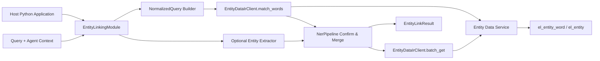

# DVEntityLinking V4 功能设计说明书

## 基本信息

| 项目 | 内容 |
| --- | --- |
| 特性名称 | DVEntityLinking V4：可嵌入 Python Module、实体数据 IR 集成与数据库实体词撞词 |
| 版本号 | V4-SR.1-draft |
| 编写日期 | 2026-07-14 |
| 状态 | 功能设计草稿；待评审后作为实现输入 |
| 上游需求 | [V4 IR](./IR.md) |

## 版本历史

| 版本号 | 日期 | 修改说明 |
| --- | --- | --- |
| V4-SR.1-draft | 2026-07-14 | 基于 V4 IR 与当前 V1–V3 实现，定义 module、Entity Data IR、数据库撞词、位置映射、可选抽取与迁移设计。 |
| V4-SR.2-draft | 2026-07-15 | 修订：明确 V1–V3 核心 NER/链接能力必须等价迁入；数据库撞词仅是第一阶段召回，不得以简化门面替代完整 pipeline。 |
| V4-SR.3-draft | 2026-07-15 | 修订最终运行基线：数据库已知词召回与正则/可选抽取并行；必须先完成 mention 合并、候选生成和消歧，再批量读取最终候选详情。 |
| V4-SR.4-draft | 2026-07-15 | 收敛 LLM 范围：仅保留旧版已实现的 S3 mention extraction 与 S5 rerank；S1/S2/S4 不进入 V4 核心能力或默认实现范围。 |
| V4-SR.5-draft | 2026-07-16 | 收口运行边界：公开工厂强制 IR URL + 平台 Client；Redis/缓存/本地持久快照禁止进入 V4 运行时；Flask 下沉为可选 Web adapter；历史 Mock 仅限显式测试注入。 |

---

# 1 概述

## 1.1 目的

本文将 V4 IR 转换为可实现的功能设计。V4 将当前项目从直接运行的 Flask demo 演进为可嵌入宿主 Python 项目的实体链接 module；实体数据由外部实体数据微服务和一个关系型数据库管理。本 module 不执行 SQL，也不维护数据写入，而是通过 IR Client 接收“数据库已命中的实体词”和实体详情，在本地**完整保留** V1–V3 的意图判定、已知/未知 mention 识别、类型判断、候选生成与排序、span 还原、边界/上下文确认、重叠消除、可选抽取回退、mention 级降级和 Query 状态聚合。数据库撞词只是该 pipeline 的第一阶段召回。

## 1.2 范围

### 范围内

| 范围项 | 设计说明 |
| --- | --- |
| Python module | 定义不依赖 Flask 的门面、配置、依赖注入和同步/异步调用边界。 |
| IR 数据访问 | 定义实体词批量匹配、实体详情批量读取、健康/版本接口的请求、响应和错误映射。 |
| 数据库撞词 | 数据服务使用 `normalized_query` 反向包含 `normalized_key`，每条 Query 一次批量匹配调用。 |
| Python 确认 | 定义归一化位置映射、原文 span 还原、`match_mode`、最长非重叠和 Query 状态聚合。 |
| 核心能力迁移 | 以 V3 `NerPipeline` 的完整行为为基线，迁入 need-linking、未知实体形态、候选/置信度/解释、歧义、partial、LLM 回退和安全 trace。 |
| 可选实体抽取 | 定义可插拔抽取器及其 schema 校验、合并和回退。 |
| 数据 schema | 定义 `el_entity`、`el_entity_word` 的逻辑字段、投影生成和 canonical entity schema。 |
| 迁移与验证 | V3 Mock 对照、IR contract stub、V1/V2/V3 回归和 V4 golden cases。 |

### 范围外

| 范围外项 | 说明 |
| --- | --- |
| 数据库直连 | module 不保存连接串、不建连接池、不执行 SQL。 |
| 实体数据写入 API | 由实体数据微服务负责，module 只读。 |
| Redis、缓存词表、内存长期实体快照 | V4 运行时禁止作为召回或实体详情的权威来源；单次请求内的临时变量不属于缓存。 |
| 向量库、图数据库 | 不属于 V4 运行依赖。 |
| 自动别名和关系推断 | 仅接受已确认 alias 与显式关系。 |
| 宿主 Web 框架 | Flask/ FastAPI / Agent 框架由宿主自行选择。 |

## 1.3 术语

| 术语 | 说明 |
| --- | --- |
| Entity Data Service | 外部实体数据微服务，拥有数据库、实体发布和实体词匹配能力。 |
| Module | 本项目提供给宿主 Python 项目的可调用实体链接组件。 |
| 数据库撞词 | 数据服务在 `el_entity_word` 中查询“归一化 Query 包含归一化实体词”。 |
| NormalizedQuery | 原文、归一文本及归一位置到原文位置映射的不可变对象。 |
| 最终确认 | module 对数据库命中执行 span 还原、边界/上下文规则和重叠消除。 |

---

# 2 需求实现设计

## 2.1 总体设计方案



一条正常 Query 最多两次数据服务调用：

1. `match_words`：数据库批量撞词，返回命中的实体词记录；
2. `batch_get`：对最终保留 mention 的去重实体 ID 批量读取详情。

`match_words` 命中不等于 `linked`。数据库的职责是找到可能命中的词；module 的职责是将命中安全还原为原文 mention 并形成最终状态。

## 2.2 需求分解

| IR 编号 | SR 编号 | 分解说明 |
| --- | --- | --- |
| IR-V4-001 | SR-V4-A01 | Python module 门面、配置与宿主集成边界。 |
| IR-V4-001 | SR-V4-A02 | NormalizedQuery、位置映射和 canonical schema。 |
| IR-V4-001 | SR-V4-A03 | Entity Data Service IR Client 与错误语义。 |
| IR-V4-001 | SR-V4-A04 | 数据库实体词匹配、Python 最终确认与可选抽取合并。 |
| IR-V4-001 | SR-V4-A05 | 实体表、实体词投影、数据发布与校验边界。 |
| IR-V4-001 | SR-V4-A06 | V3 到 V4 的兼容迁移与适配器替换。 |
| IR-V4-001 | SR-V4-A07 | 合同、golden case、回归和安全验证。 |
| IR-V4-001 | SR-V4-A08 | V1–V3 核心 NER/链接能力等价迁入与功能防回退。 |

### SR-V4-A01 Python Module 门面与宿主集成

#### 设计

新增具体的 `EntityLinkingModule` 作为宿主唯一依赖的业务入口，并提供 `create_entity_linking_module()` 工厂函数。Flask Web/API 改为可选 adapter，只调用该门面，不再是核心运行前提。`Protocol` 只用于 module 内部的依赖端口，不能作为宿主实例化的公开对象。

```python
class EntityLinkingModule:
    def __init__(
        self,
        *,
        data_client: EntityDataClient,
        config: ModuleConfig,
        extractor: EntityExtractionEnhancer | None = None,
        reranker: CandidateReranker | None = None,
    ) -> None: ...

    def link(self, request: LinkRequest) -> EntityLinkResult: ...

    async def link_async(self, request: LinkRequest) -> EntityLinkResult: ...


def create_entity_linking_module(
    config: ModuleConfig,
    *,
    platform_client: InternalRouteClient,
) -> EntityLinkingModule: ...
```

两个可选 LLM hook（S3/S5）通过构造函数注入；未注入时视为关闭。请求 `extraction_mode=disabled` 时两者均不调用，pipeline 走纯确定性路径。

| 对象 | 核心字段 | 说明 |
| --- | --- | --- |
| `LinkRequest` | `query`、`agent_context`、`entity_types`、`extraction_mode`、`allow_fallback` | `query` 必填；上下文必须是安全投影。`extraction_mode` 取 `disabled` 或宿主约定的增强模式，默认 `disabled`。 |
| `EntityLinkResult` | `status`、`mention_results`、`mode_status`、`errors`、`service_trace` | 延续既有 Query/mention 状态语义；安全 trace 记录抽取/rerank 是否使用或回退。 |
| `ModuleConfig` | 必填 `entity_data_ir_url`、timeout、失败策略、`llm_mention_min_confidence`、`llm_rerank_min_confidence` | 不包含 V3 Mock 路径；不序列化 secret、token 或 IR URL 到结果。 |

生产工厂必须同时收到非空 `entity_data_ir_url` 与 `platform_client`，缺失任一项立即配置失败，绝不创建 V3 Mock。测试可直接构造 `EntityLinkingModule(data_client=fake)`，但不能改变公开工厂语义。module 构造时通过依赖注入接收 `EntityDataClient`、S3 抽取器和 S5 reranker。不得在领域代码中读取 Flask request、环境变量或具体 HTTP 库。

#### 公开集成契约

宿主模块和 `main` 方法只感知以下三类公开对象：

```python
from dv_entity_linking import (
    LinkRequestV1,
    LinkResponseV1,
    create_entity_linking_module,
)

linker = create_entity_linking_module(config)
response: LinkResponseV1 = linker.link(LinkRequestV1(query="Check CPU Usage."))
```

| 公开对象 | 稳定性规则 | 明确不暴露 |
| --- | --- | --- |
| `LinkRequestV1` | 只承载 Query、可选上下文、类型提示和运行选项；新增字段必须有默认值。 | Flask request、HTTP session、数据库查询参数。 |
| `LinkResponseV1` | 只包含版本化状态、mention、安全实体摘要、错误和安全 trace；已有字段不改名/删改语义。 | `EntityRecord`、`EntityWordRecord`、数据库列、REST 原始响应。 |
| `EntityLinkingModule.link()` | 入口方法签名在 V4 生命周期内保持稳定；同步/异步调用返回同一响应语义。 | 内部 pipeline、抽取器、缓存、SQL/HTTP 实现。 |
| `create_entity_linking_module()` | 唯一默认组装入口；内部实现可替换。 | 要求宿主理解依赖注入细节。 |

核心领域对象只在内部层流转。无论 `attributes`、`relationships`、实体词表字段、数据库撞词方式或 REST 数据服务怎样演进，均由 module 内部 adapter 映射成稳定的 `LinkResponseV1`。宿主不导入 `domain`、`infrastructure` 或 `legacy` 子包。

当公开请求或响应确需不兼容变化时，新增 `V2` DTO 或新的门面方法，并保留 `V1` 至明确的弃用窗口结束；不得借由修改内部实体 schema 让集成方被动适配。

#### Package 结构

V4 不继续把宿主门面、pipeline、HTTP client 与 Flask adapter 平铺在同一级。建议采用“少层、明确依赖方向”的 package 结构：

```text
src/dv_entity_linking/
├── __init__.py                 # 唯一稳定导出：门面、工厂、V1 DTO
├── module.py                   # 组装门面和依赖；宿主的主要入口
├── application/
│   ├── dto.py                  # LinkRequest、EntityLinkResult、safe trace
│   └── link_entities.py        # 单一用例编排，不依赖 HTTP/Flask
├── domain/
│   ├── models.py               # EntityRecord、EntityWordMatch、Mention 等领域对象
│   ├── normalization.py        # NormalizedQuery 和位置映射
│   ├── matching.py             # 边界、上下文、重叠消除与聚合规则
│   └── ports.py                # EntityDataClient、EntityExtractor 等 Protocol
├── infrastructure/
│   ├── entity_data_ir.py       # 平台 Client + IR URL 的生产适配器
│   ├── entity_data_rest.py     # 仅本地联调的直连 HTTP 适配器
│   ├── extractors/             # 可选规则/LLM 抽取器实现
├── adapters/
│   └── flask.py                # 可选；把 Flask 请求映射到 module 门面
└── legacy/                     # V1/V2 兼容 catalog/evaluation 和测试专用 v3_mock，仅迁移期保留
```

依赖方向固定为：`adapters`、`infrastructure` → `application`、`domain`；`application` → `domain`；`domain` 不依赖 HTTP、数据库、Flask、环境变量或具体抽取器。`module.py` 是唯一允许把平台 Client、IR URL、配置和可选抽取器组装在一起的位置。

历史 V1–V3 脚本、测试和 demo 必须显式从 `legacy/` 导入；V4 新代码不得依赖 legacy。生产安装不依赖 Flask；历史 Web adapter 只能通过 `dv-entity-linking[web]` 可选依赖使用。根目录不保留同名兼容转发文件，最终且当前只保留 `__init__.py` 与 `module.py`，使宿主只能看到公开 V4 门面。

宿主只需使用稳定公开入口，而不依赖内部目录。默认集成使用工厂函数；宿主已有 HTTP client、鉴权或测试 stub 时，才直接构造门面并注入依赖：

```python
from dv_entity_linking import (
    LinkRequest,
    ModuleConfig,
    create_entity_linking_module,
)

module = create_entity_linking_module(ModuleConfig(...))
result = module.link(LinkRequest(query="Check CPU Usage."))
```

```python
from dv_entity_linking import EntityLinkingModule, ModuleConfig
from my_project.clients import EntityDataServiceClient

module = EntityLinkingModule(
    data_client=EntityDataServiceClient(...),
    config=ModuleConfig(...),
)
```

迁移时不要求一次移动全部 V1–V3 文件：先建立上述新边界，将现有 `NerPipeline`、`models` 和 V3 Mock 包装为实现；在 V4 contract 与回归稳定后再逐步收拢旧的平铺模块。

失败策略：

| 场景 | `FAIL_FAST` | `DEGRADED` |
| --- | --- | --- |
| 启动健康检查失败 | module 初始化失败。 | 宿主可启动；链接请求返回 `dependency_failed`。 |
| 单次匹配/详情调用失败 | 直接返回结构化错误。 | 同左；不得伪造 `no_match`。 |
| S3 抽取 hook 失败 | `allow_fallback=false` 时 Query 级 `dependency_failed`。 | 丢弃 LLM 输出，回退确定性识别，`degraded=true`。 |
| S5 rerank hook 失败 | 保留确定性 Top-K 与 `ambiguous`，不强制 `linked`。 | 同左；旧版 rerank 失败不应阻断已有确定性候选。 |

### SR-V4-A02 归一化、位置映射与 canonical schema

#### 设计

归一化必须同时服务数据库匹配和原文 span 还原。定义：

```python
@dataclass(frozen=True)
class NormalizedQuery:
    original_text: str
    normalized_text: str
    normalized_to_original: tuple[int, ...]
    normalization_version: str
```

算法以原文字符为单位执行 Unicode NFKC、`casefold()` 和 Unicode 空白删除。每个保留的归一化字符记录其原文字符索引；若一个原文字符展开为多个归一化字符，各字符映射到相同原文索引。由归一区间 `[start, end)` 还原原文 span 的规则为：

```text
original_start = normalized_to_original[start]
original_end = normalized_to_original[end - 1] + 1
```

还原后必须验证：span 非越界、原文非空、重新归一化后的文本与 `normalized_key` 一致；否则丢弃该命中并记录安全 trace，不能构造伪 mention。

canonical entity schema 固定为 `entity_id`、`entity_type`、`entity_name`、`alias`、`desc`、`attributes`、`relationships`。旧字段 `canonical_name`、`aliases`、`description` 不得由 IR Client 或 module 输出。

### SR-V4-A03 Entity Data IR Client

#### 设计

定义协议抽象，具体 HTTP 客户端可替换：

```python
class EntityDataClient(Protocol):
    def match_words(self, request: EntityWordMatchRequest) -> EntityWordMatchResponse: ...
    def batch_get(self, request: EntityBatchGetRequest) -> EntityBatchGetResponse: ...
    def health(self) -> EntityDataHealth: ...
```

| 接口 | 请求 | 成功响应 | 错误映射 |
| --- | --- | --- | --- |
| `match_words` | `normalized_query`、`entity_types?`、`expected_data_version?` | `matches[]`、`data_version`、`contract_version` | timeout、auth、transport、schema、version mismatch → `dependency_failed`。 |
| `batch_get` | 去重 `entity_ids[]`、`expected_data_version?` | `entities[]`、`missing_ids[]`、`data_version` | transport/schema → dependency failed；已匹配 ID 缺失 → `entity_miss`。 |
| `health` | client contract version | service status、data version、contract version | 启动报告或安全 trace。 |

`matches[]` 最小字段：`entity_word_id`、`entity_id`、`entity_type`、`entity_word`、`normalized_key`、`source`、`match_mode`、`min_context_required`、`context_keywords`、`priority`。响应 `data_version` 必须在同一 Query 的 `match_words` 和 `batch_get` 中一致；否则当前 Query 返回 `dependency_failed`，避免词表与详情跨版本混合。

生产 IR Client 只暴露已脱敏的 `adapter`、平台错误分类、延迟、contract/data version 和错误码。它不得将 Authorization、IR URL、响应原文或栈追踪放入 `EntityLinkResult`。直连 HTTP client 仅用于本地联调和契约测试。

### SR-V4-A04 数据库撞词与 Python 最终确认

#### 数据服务匹配规则

实体数据微服务仅对 active 词条执行逻辑匹配：

```sql
WHERE status = 'active'
  AND INSTR(:normalized_query, normalized_key) > 0
```

可选 `entity_type` 过滤必须在该查询中生效。数据库返回命中的词记录而非 `linked` 结论；同一词多次出现时，module 负责枚举所有位置。禁止将 Query 切词后逐 token 发起 REST 请求。

#### Module pipeline

| 阶段 | 输入 | 输出 | 关键规则 |
| --- | --- | --- | --- |
| P1 validate | `LinkRequest` | 合法 Query 或 invalid input | 空白 Query 不调用远端服务。 |
| P2 need-linking | Query/context | bypass 或继续 | 确定性 `not_required` 不调用匹配接口。 |
| P3 normalize | 原文 Query | `NormalizedQuery` | 生成位置映射。 |
| P4 known-word recall（并行支路 A） | normalized Query + 请求类型提示 | `EntityWordMatch[]` | 一次 `match_words` 调用；只产生已知词候选。 |
| P5 local recognition（并行支路 B） | 原文 Query/context | rule/extracted mentions | 正则识别未知实体形态；S3 `EntityExtractionEnhancer` 输出的 schema、span、置信度合法才可加入。 |
| P6 restore/confirm known | 命中词 + `NormalizedQuery` | known mention candidates | 枚举位置，恢复 span，应用 match mode，并保留类型、来源和词级候选。 |
| P7 merge/select | 已知词、正则、抽取 mention | 非重叠 mention 集合 | 两个支路汇合；起点优先、同起点更长优先、再按 priority；未知 mention 不得静默丢弃。 |
| P8 candidate resolve | mention + 词/规则/类型证据 | 唯一候选、Top-K 歧义或 no-match | 形成 candidate 列表、置信度、静态解释与歧义结论；多候选时可调用 S5 `CandidateReranker` 从已确认候选中选择，失败保留确定性 Top-K。 |
| P9 detail lookup | 已消歧的候选 entity IDs | entity records | 一次 `batch_get` 调用；无可确认候选不调用；不对 unknown mention 编造 entity ID。 |
| P10 mention result | mention + candidates/details | mention 级结果 | 输出 linked、no_match/unknown、ambiguous 或 dependency_failed 及安全 trace。 |
| P11 aggregate | mention results | Query result | 保持 linked/partial/ambiguous/no_match/not_required/dependency_failed/invalid_input，并汇总安全的增强使用/回退状态。 |

`match_mode` 规则：

| 模式 | 应用侧确认 |
| --- | --- |
| `EXACT_WORD` | ASCII 字母数字边界必须成立。 |
| `STRUCTURED_TOKEN` | 保留结构化符号，按实体词前后 token 边界确认。 |
| `CONTEXT_REQUIRED` | 除边界外，Query 邻近上下文必须包含确认的 `context_keywords`；否则丢弃命中。 |

可选抽取器的输出只可补充候选 mention；它不能跳过候选生成与消歧去生成实体 ID。若抽取 mention 未能由确认实体词、规则映射或其他已批准的候选来源得到可确认实体，则保留为 unknown/no_match mention，不能直接链接。

`CandidateReranker` 是与 `MentionEnhancer` 并列的可选端口，不是抽取器的附属能力。它只能在 P8 的确定性候选数大于 1 时运行，输入为 Query、mention 和候选 ID/类型/命中证据，输出为 `selected_entity_id`、`confidence`、`reason`。`selected_entity_id` 必须属于输入候选集，置信度必须不低于 `ModuleConfig.llm_rerank_min_confidence`（默认 `0.70`）；否则判为 rerank 失败。它不得读取完整实体详情、写入实体、创建 alias 或返回新 ID。

抽取输出低于 `ModuleConfig.llm_mention_min_confidence`（默认 `0.70`）同样判为增强失败。抽取失败在 `allow_fallback=true` 时必须保留确定性结果，`false` 时返回结构化 `dependency_failed`。rerank 的超时、schema 非法、低置信或非法 ID 始终保留 `ambiguous` 与原有 Top-K，不能强制 Top-1。

#### 最终流程验收约束

`match_words → batch_get → linked/no_match` 不是 V4 的合法主流程，只能作为“已知词召回适配器”验收切片。最终交付必须满足以下顺序和可观测性：

1. `P4` 与 `P5` 并行执行，并分别在 trace 中记录来源、结果数和降级信息；
2. `P7` 完成前不得生成最终 Query 状态；
3. `P8` 完成前不得调用 `batch_get`；`P9` 只能携带消歧后的最终候选 ID；
4. 数据库空命中不阻断正则/抽取支路；该支路仍可产生 unknown/no-match 或可确认候选；
5. 无可确认候选时不得执行 `batch_get`；存在歧义时必须返回有序 Top-K 和 `ambiguous`，不得因详情查询方便而强制选择 Top-1。

#### LLM 双阶段增强与回退

V4 只实现旧版已存在的两个 hook：S3 `EntityExtractionEnhancer` 与 S5 `CandidateReranker`。`extraction_mode=disabled` 时两者均不调用；没有注入对应实现时视为关闭，不新增远程依赖。

| 阶段 | 何时调用 | 合法输出 | 失败语义 |
| --- | --- | --- | --- |
| S3 抽取 | 与 P4 数据库召回并行。 | 可回映原文的 mention、span、类型、置信度。 | `allow_fallback=true` 时丢弃 LLM 输出并继续确定性规则；`false` 时 Query 级 `dependency_failed`。 |
| S5 消歧 | P8 已有两个及以上确定性候选时。 | 仅能选择输入候选 ID 中的一个、置信度和理由。 | 非法 ID、schema、低置信或异常时保留确定性 Top-K 与 `ambiguous`；不因 rerank 失败强制 `linked` 或阻断已有确定性结果。 |

抽取的 span 必须精确回映 Query，抽取与 rerank 的置信度均必须不低于各自的 `ModuleConfig` 阈值。安全 trace 记录是否使用或回退，但不新增五阶段 `LLMStageStatus` 作为 V4 公开契约。S1 意图判定、S2 召回前类型过滤与 S4 独立候选解释均不在 V4 范围内；如未来需要必须单独提出需求和验收用例。

### SR-V4-A08 核心 NER 与链接能力等价迁入

V4 的新 `application/domain` pipeline 必须吸收 V1、V2、V3 的**累计行为**，而不能由只包含 `match_words → batch_get` 的轻量门面替代。迁移期可以调用或包装 legacy 实现以保持行为，但 V4 最终运行路径必须在新分层中拥有可测试的等价实现；`legacy/` 只作为对照、过渡和回归输入。

能力保留不是原则性声明，而是可关闭的产品契约。以下领域职责必须按矩阵逐项迁入为独立、可替换、可单测的组件；任一项未通过其 golden case、黑盒流程断言与历史对照，就不能宣称 V4 完成。`legacy/`、V3 Mock、Redis/Gauss JSON 只能提供对照输入，不能进入 V4 默认运行链。当前运行边界收口完成后，迁移顺序固定为 `LinkingIntentPolicy → Known/UnknownMentionRecognizer → EntityTypeResolver → CandidateResolver → MentionSelector → ResultAggregator → SafeTraceBuilder`；不得为了迁移方便重新引入缓存或默认 Mock。

| V3 行为单元 | V4 领域职责 | 最小可观察输出 |
| --- | --- | --- |
| `_has_linking_intent` / `_looks_not_required` | `LinkingIntentPolicy` | `not_required`、bypass reason、未调用远程服务的 trace。 |
| `_detect_known_mentions` | `KnownMentionRecognizer` | 数据库候选恢复后的全部原文 span、词边界与来源。 |
| `_detect_unknown_mentions` | `UnknownMentionRecognizer` | 未确认的实体形态 mention、span、类型线索与 `no_match` 理由。 |
| 类型提示与分类 | `EntityTypeResolver` | 类型提示、预测类型和类型冲突/未知状态。 |
| `LinkCandidate` 与排序 | `CandidateResolver` | 有序 candidates、置信度、match/disambiguation reason。 |
| `_longest_non_overlapping` | `MentionSelector` | 已知和未知 mention 的可解释合并结果。 |
| `_aggregate_status` / `_top_candidates` | `ResultAggregator` | mention 级结果、Query 级 `linked/partial/ambiguous/no_match/...` 与顶层候选。 |
| LLM mention extraction | S3 `EntityExtractionEnhancer` | 成功时补充 mention；失败按 `allow_fallback` 回退确定性识别或返回 dependency failure。 |
| LLM rerank/disambiguation | S5 `CandidateReranker` | 只能选择已有候选；失败保留确定性排序，ambiguous 不强制 linked。 |
| storage lookup / stage trace | `SafeTraceBuilder` | 不含凭据和原始响应的阶段、数据版本、错误码、来源与降级信息。 |

#### V1/V2 防回退验收

| 历史能力 | V4 设计约束 | 验收用例 |
| --- | --- | --- |
| V1 alarm 基线、标准名/确认 alias/ID 与短 ID 边界 | 数据库只改变候选来源，`KnownMentionRecognizer` 仍执行原文边界与 structured token 确认。 | V1 linked、alias、`ALM-5102`/`ALM-51020`、no-match、not-required golden cases 全量通过。 |
| V1 ambiguous 与 Top-K 候选 | 单值词表不冲突时保持唯一链接；当规则/未来多候选输入产生无法安全决策的候选时保留 `ambiguous` 和有序 candidates。 | V1 ambiguous case 的 expected entities 覆盖 Top-K，禁止强制 Top-1 linked。 |
| V1 offline/LLM 模式与降级 | 默认 deterministic；S3/S5 分别可关闭。S3 失败按 `allow_fallback` 回退或失败；S5 失败始终保留确定性歧义结论。 | `extraction_mode=disabled` 不调用 LLM；S3/S5 timeout/schema/low-confidence 的 `degraded`、`error_code`、`fallback_used` 断言。 |
| V2 多类型与预处理 | `EntityTypeResolver` 使用 request hint 与实体词元数据；类型专属字段不影响 common schema。 | V2 alarm、网元、KPI 等多类型样例及类型过滤回归。 |
| V2 多 mention / `partial` | 所有识别 mention 都必须产生 mention 级结果，聚合器按既有定义计算 `partial`。 | V2 多 mention 全 linked、一个 linked + 一个 unknown/no-match、一个 linked + 一个 degraded。 |
| V2 跨类型歧义与 rerank | `CandidateResolver` 先形成确定性候选；S5 只能重排已有候选，不能新增实体。 | 跨类型 ambiguous、S5 低置信、非法 candidate ID、rerank failure 均不伪造 linked。 |
| V1/V2 evaluator 与安全投影 | module 输出提供 evaluator 所需的 Query/mention/candidate/mode/error 字段；宿主 Web 仅负责展示。 | V1/V2 evaluation、smoke 和安全字段投影持续绿色。 |
| 最终运行顺序 | 已知词召回与正则/抽取并行；merge → candidate resolve → detail lookup → aggregate。 | 通过调用顺序 trace 断言：DB 空命中仍运行本地支路；无最终候选不调用 batch_get；详情查询只接收消歧后的 ID 集合。 |

V4 DTO 应以**追加字段**方式恢复必要观察面，至少包含：

- mention 的 `source`、`predicted_type`、`normalized_text`、`status`、`confidence`、`candidates`、`no_match_reason`、`disambiguation_reason`、安全 `storage_lookup/trace`；
- Query 的完整状态、顶层 candidates、结构化 errors、`degraded`、`fallback_available`、`mode_status` 与安全 trace；
- 既有 V1 DTO 字段不得改名或改变含义；无法以默认值兼容的破坏性调整必须新建 V2 DTO。

`EntityDataClient.match_words` 只能提供已知实体词候选。它不可替代 `UnknownMentionRecognizer`、`CandidateResolver` 或 `ResultAggregator`；数据服务正常返回空命中时，pipeline 仍必须运行未知实体形态识别和 `no_match` 语义。

### SR-V4-A05 实体数据与投影设计

#### 逻辑表

| 表 | 职责 | 关键约束 |
| --- | --- | --- |
| `el_entity` | 权威实体记录。 | `entity_id` 主键；canonical schema；`attributes_json` JSON 安全；关系目标必须存在。 |
| `el_entity_word` | 标准名和确认 alias 的匹配投影。 | `normalized_key` 由词面重算；active key 单值映射；仅 `entity_name` / `confirmed_alias` 来源。 |

`el_entity_word` 除 `entity_id` 外冗余 `entity_type`、`match_mode`、`min_context_required`、`context_keywords_json`、`priority`，使匹配接口无需先读取实体详情。`attributes`、`relationships`、`desc` 不生成词条。

#### 发布流程

```text
source records
→ schema / alias / relation / 安全校验
→ transaction 写入 el_entity
→ 由 entity_name + confirmed alias 重建 el_entity_word
→ 重新计算 normalized_key 与冲突校验
→ 发布 data_version
```

不同 active 实体出现同一 `normalized_key` 时按当前 V3 单值契约 fail-closed。若未来需要多值词表，必须另行改变 IR、接口、状态与评测，不能通过降低唯一约束实现。

### SR-V4-A06 迁移与兼容设计

| 当前 V3 | V4 目标 | 迁移策略 |
| --- | --- | --- |
| `GaussEntityStoreMock` | `EntityDataClient.batch_get` | 用 IR contract stub 替换调用点；仅保留 Mock adapter 做显式测试对照。 |
| `RedisEntityWordCacheMock` | `EntityDataClient.match_words` | 改为一次 Query 批量匹配；Redis 不得进入 V4 默认或生产运行链。 |
| `EntityStorageRepository` | IR storage facade | `NerPipeline` 仅依赖 facade/Protocol。 |
| `_detect_known_mentions` 扫描内存词表 | 根据数据库命中恢复并确认 mention | 保留最长非重叠和边界语义。 |
| V1 need-linking、V2 多类型/多 mention/partial/LLM fallback、V3 未知实体形态、候选排序、聚合、安全 trace | V4 `application/domain` pipeline | 按 V1→V2→V3 累计 golden case 先迁移、对照后再替换 legacy；不得作为非范围删除。 |
| Flask Web demo | host adapter | demo 继续作为集成样例，不成为 module 必需依赖。 |

迁移必须保持 canonical schema 原子性；旧字段不能在新适配器中静默双读。迁移阶段可显式注入 `V3MockEntityDataClient`，让同一 golden Query 同时经过 V3 Mock 与 V4 IR stub，比较 mention 文本、span、entity ID、状态和安全错误语义；它绝不进入 `create_entity_linking_module()` 的默认链路。

### SR-V4-A07 设计级测试、回归与安全

| 测试类别 | 最小覆盖 |
| --- | --- |
| NormalizedQuery | NFKC、casefold、空白删除、符号、重复位置、展开字符和 span 还原。 |
| REST contract | match/batch/health 成功、空匹配、timeout、auth、坏 schema、版本不一致。 |
| 数据库匹配 | 标准名、确认 alias、多次出现、类型过滤、短普通词和上下文限制。 |
| Pipeline | need-linking/not-required、DB 命中、正则与未知实体形态、抽取器合并/回退、候选排序/歧义、最长非重叠、mention 级结果、所有 Query 状态。 |
| LLM 双阶段 hook | S3 extraction 合并/非法 span/低置信回退；S5 rerank 成功/低置信/非法 ID 回退；`extraction_mode=disabled` 时不调用；S3 `allow_fallback=false` 返回 `dependency_failed`，S5 失败保持确定性 `ambiguous`。 |
| 数据 schema | canonical 字段、attributes 安全投影、relationships 悬挂/重复拒绝、词表冲突 fail-closed。 |
| Module 集成 | 无 Flask 运行、同步/异步入口、`FAIL_FAST`/`DEGRADED`、宿主 adapter。 |
| 回归 | V1/V2/V3 evaluation 与 smoke；V4 golden cases 分别对照 V1、V2、V3 的历史语义，不得只对照 V3 Mock。 |

新增 V4 golden cases 至少覆盖：`CPU Usage` 的位置映射、同一词重复出现、`ALM-5102` 不命中 `ALM-51020`、`SYSTEM` 缺少上下文不链接、无链接意图不访问数据服务、数据库 miss 后仍识别 unknown 实体形态、多 mention 的 `partial`、候选歧义、服务失败不等于 `no_match`、详情跨版本不一致、S3 抽取器失败/低置信/非法 span 回退，以及 S5 rerank 不新增实体 ID、失败保持确定性 Top-K。

#### 最终流程的黑盒测试规则

最终流程测试不能只断言 `LinkResponse`，也不能只检查 module 自行生成的 `service_trace`；两者都可能在错误流程中保持“看似正确”。测试必须通过独立的 `EntityDataClient` mock 观测真实调用，并由 mock 拒绝不符合流程的请求。

| 反例 | 外部 mock 的强制断言 | 可拦截的错误实现 |
| --- | --- | --- |
| 可选抽取与已知词召回并行 | `MATCH_WORDS` 被调用时，抽取分支已实际启动。 | 先 `match_words`，再运行抽取器的串行实现。 |
| 合并类型线索后再查详情 | 同 span 返回多个 entity ID、抽取器提供唯一类型线索时，`BATCH_GET_ENTITIES` 只能收到被消歧后的一个 ID。 | `match_words → batch_get(全部 ID)` 后才做候选或类型判断。 |
| 数据库空命中但本地规则命中 | 返回 entity-shaped mention；`BATCH_GET_ENTITIES` 必须零调用。 | DB miss 即提前返回、或为 unknown 虚构详情查询。 |
| 无候选 / 歧义 | 无候选不调用详情；歧义只查询其有序 Top-K，且输出 `ambiguous`。 | 为了查询方便强制 Top-1，或盲目读取所有实体。 |

这些用例必须使用独立的期望结果和 client 调用记录，不得由 production code 的 trace、内部私有方法调用或同一套候选选择函数充当 oracle。历史 V1/V2/V3 回归继续验证业务兼容性，但不能替代本表的流程反例测试。

---

# 3 接口设计

## 3.1 宿主 Module 接口

| 接口 ID | 输入 | 输出 | 约束 |
| --- | --- | --- |
| IR-V4-MODULE-LINK | `LinkRequest`（含 `extraction_mode`、`allow_fallback`） | `EntityLinkResult`（含安全 mode status） | 同步入口；不得依赖 Flask。`extraction_mode=disabled` 时不调用 LLM。 |
| IR-V4-MODULE-LINK-ASYNC | `LinkRequest` | awaitable `EntityLinkResult` | 复用同一领域语义；不得出现不同状态定义。 |
| IR-V4-MODULE-HOOKS | S3/S5 可选 hook 实例 | 无 | 通过 `EntityLinkingModule` 构造函数注入；未注入视为关闭。 |

## 3.2 Entity Data Service 统一 IR 接口

所有业务数据操作统一使用实体数据服务发布的 `entity_data_ir_url`。请求使用稳定信封，`operation` 是服务端受控枚举，决定 `payload` 的严格 schema；它不是可传递 SQL 或任意查询条件的自由字段。平台 Client 以该 URL 发起内部调用，module 不拼接部署层 HTTP 地址。

```json
{
  "contract_version": "v1",
  "operation": "MATCH_WORDS",
  "request_id": "write-only-idempotency-key",
  "payload": {
    "expected_data_version": "optional"
  }
}
```

| 操作枚举 | 调用方 | 调用次数 | `payload` 语义 | 写入 |
| --- | --- | --- | --- | --- |
| `MATCH_WORDS` | Entity Data IR Client | 每 Query 最多一次 | `normalized_query`、可选 `entity_types`、可选 `expected_data_version` | 否 |
| `BATCH_GET_ENTITIES` | Entity Data IR Client | 每 Query 最多一次 | `entity_ids[]`、可选 `expected_data_version` | 否 |
| `UPSERT_ENTITY` | 受控数据管理调用方 | 按需 | 完整 canonical `entity` | 是 |
| `DELETE_ENTITY` | 受控数据管理调用方 | 按需 | `entity_id` | 是 |
| `REBUILD_ENTITY_WORDS` | 受控运维调用方 | 按需 | 可选 `entity_ids[]` | 是 |

读取 `MATCH_WORDS` 示例：

```json
{
  "contract_version": "v1",
  "operation": "MATCH_WORDS",
  "payload": {
    "normalized_query": "checkcpuusagenow",
    "entity_types": ["kpi_meas_type_key"]
  }
}
```

统一响应外壳为 `contract_version`、`operation`、`status`、`data_version`、`data` 和可选 `error`。响应中的每个 match 必须携带原始 `entity_word`；module 不接受只有 `normalized_key` 的响应。写操作必须携带 `request_id` 用于幂等；读写操作必须使用不同权限。健康检查仍可使用 `GET /health` 或 `GET /v1/entity-data:status`。

---

# 4 数据库设计

数据库由实体数据微服务实现；本节是其对 module 的逻辑契约，不要求本项目执行建表 SQL。

## 4.1 `el_entity`

| 字段 | 必填 | 说明 |
| --- | --- | --- |
| `entity_id` | 是 | 稳定主键。 |
| `entity_type`、`entity_name`、`desc` | 是 | canonical common fields。 |
| `alias_json`、`attributes_json`、`relationships_json` | 是 | 分别默认 `[]`、`{}`、`[]`。 |
| `status`、`data_version` | 是 | 发布与读取一致性。 |

## 4.2 `el_entity_word`

| 字段 | 必填 | 说明 |
| --- | --- | --- |
| `entity_word_id`、`entity_id`、`entity_type` | 是 | ID 与匹配时类型过滤。 |
| `entity_word`、`normalized_key` | 是 | 原文词与数据库撞词 key。 |
| `source` | 是 | `entity_name` 或 `confirmed_alias`。 |
| `match_mode`、`min_context_required`、`context_keywords_json`、`priority` | 是 | module 最终确认控制字段。 |
| `status`、`data_version` | 是 | active 查询与版本一致性。 |

最小索引：`el_entity(entity_id)`、`el_entity_word(entity_id)`、active `normalized_key` 的唯一约束，以及按 status/type 的过滤索引。`INSTR` 的执行计划和后续全文优化属于实体数据微服务的性能实现，但不得改变接口结果集语义。

---

# 5 部署、配置与安全

| 配置 | 说明 |
| --- | --- |
| `entity_linking.entity_data_ir_url` | 目标服务发布的 IR URL；不得写入日志或 API 响应。 |
| `entity_linking.timeout_ms` | 平台 Client 调用超时。 |
| `entity_linking.startup_failure_policy` | `FAIL_FAST` 或 `DEGRADED`。 |
| `entity_linking.extractor.mode` | `disabled`、规则或已确认的外部抽取器。 |
| `entity_linking.contract_version` | module 期望的数据服务契约版本。 |

禁止提交或投影数据库连接串、数据服务凭据、Authorization、token、完整 Query 上下文、完整 HTTP 响应、完整 LLM 请求/响应和不安全 attributes。

---

# 6 实现前置项与 AR

| AR 编号 | 内容 | 状态 |
| --- | --- | --- |
| AR-V4-SR-001 | 确认 IR 鉴权、超时、重试和契约版本协商。 | 待确认 |
| AR-V4-SR-002 | 确认数据库产品及 `INSTR`/全文匹配的性能基线。 | 待确认 |
| AR-V4-SR-003 | 确认可选抽取器首期实现与置信度阈值。 | 待确认 |
| AR-V4-SR-004 | 定义 V4 IR contract stub 与 golden case 数据集。 | 待实现 |
