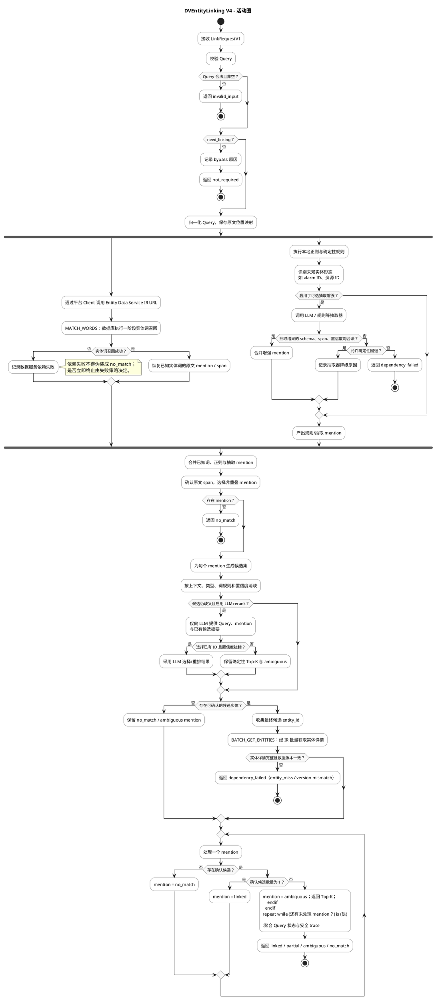

# DVEntityLinking V4 运行流程与活动图

本文以 V4 的目标运行形态、module、IR 调用边界和实体数据模型为准。数据库仅承担一阶段已知实体词召回；正则规则与可选抽取器是并行的 mention 来源。Python module 统一完成 mention 合并、候选生成、消歧、实体详情查询和状态聚合，保留 V1–V3 的核心 NER/链接能力。

## 1. 运行流程图

```plantuml
@startuml V4_Runtime_Flow
title DVEntityLinking V4 - 运行流程图

skinparam componentStyle rectangle
skinparam shadowing false
left to right direction

actor "宿主服务 / Agent / API" as Host
component "DVEntityLinking Module\n稳定门面 link(request)" as Facade
component "Query 校验" as Validate
component "need_linking\n意图判定" as Intent
component "Query 归一化\n保留原文位置映射" as Normalize
component "正则与可选抽取器\n未知形态 / LLM / 规则" as Recognizer
component "Mention 合并与 Span 确认" as MentionMerge
component "候选生成" as Candidate
component "可选 LLM 候选重排\n仅已有歧义候选" as Reranker
component "消歧与置信度判断" as Disambiguation
component "平台 Client\nIR URL 调用" as Client
component "Entity Data Service" as DataService
database "单一关系型数据库" as Database
entity "el_entity_word\n实体词检索投影" as WordTable
entity "el_entity\n实体权威数据" as EntityTable
component "LinkResponseV1\nmention、候选、实体摘要、trace" as Result

Host --> Facade : LinkRequestV1
Facade --> Validate : 原始 Query
Validate --> Intent : 校验通过的 Query
Validate --> Result : 非法\ninvalid_input
Intent --> Result : 不需要链接\nnot_required
Intent --> Normalize : 需要链接
Normalize --> Client : normalized query\nMATCH_WORDS
Client --> DataService : 使用目标服务 IR URL
DataService --> WordTable : 阶段一召回\nnormalized_query 包含 normalized_word
WordTable --> DataService : 命中实体词
DataService --> Database
Database --> EntityTable
DataService --> Client : EntityWordMatch 列表
Client --> MentionMerge : 已知词召回结果
Normalize --> Recognizer : 原文 / normalized query
Recognizer --> MentionMerge : 正则 / 抽取 mention\n（需 schema、span 校验）
Normalize --> MentionMerge : 原文位置映射
MentionMerge --> Candidate : 已确认 mention
Candidate --> Reranker : 仅候选歧义时\n已有候选摘要
Reranker --> Disambiguation : 已有 ID 内的选择/重排
Candidate --> Disambiguation : 唯一候选 / LLM 关闭或回退
Disambiguation --> Client : BATCH_GET_ENTITIES\n最终候选 entity_id
Client --> DataService
DataService --> EntityTable : 批量读取实体详情
EntityTable --> DataService
DataService --> Client : EntityRecord 列表
Client --> Disambiguation : 实体详情
Disambiguation --> Result : 最终确认、置信度与状态聚合
Facade --> Result
Result --> Host

note bottom of WordTable
仅由 entity_name 与
已确认 alias 派生。
不负责最终 linked 判定。
end note

note bottom of Recognizer
与数据库召回并行执行。
可识别已定义的未知实体形态；
抽取器仅补充 mention，不能直接确认实体 ID。
end note

note bottom of Reranker
只能选择已有候选 ID。
非法 ID、低置信或失败时保留
确定性 Top-K / ambiguous，或按策略失败。
end note

note bottom of Disambiguation
数据库只做已知词召回和实体详情读取；
Python 保留 V1-V3 的候选、消歧、
置信度、降级与聚合能力。
end note
@enduml
```

## 2. 活动图

## 3. 读取要点

- `MATCH_WORDS` 与本地正则/可选抽取器（S3）并行。前者从 `el_entity_word` 召回已知词，后者补充未知实体形态或候选 mention。
- mention 合并后才进入候选生成和消歧；数据库绝不直接给出 `linked` 结论。
- `BATCH_GET_ENTITIES` 在候选确认后从 `el_entity` 批量读取权威实体详情。
- LLM 仅有两个旧版等价 hook：S3 mention extraction 与 DB 召回并行；S5 rerank 仅对多候选 mention 介入。S3 失败按 `allow_fallback` 回退确定性路径或返回 `dependency_failed`；S5 失败保留确定性 Top-K 与 `ambiguous`。
- 最终的 `linked`、`partial`、`ambiguous`、`no_match`、`not_required` 和 `dependency_failed` 全部由 module 内 Python 流程输出。
