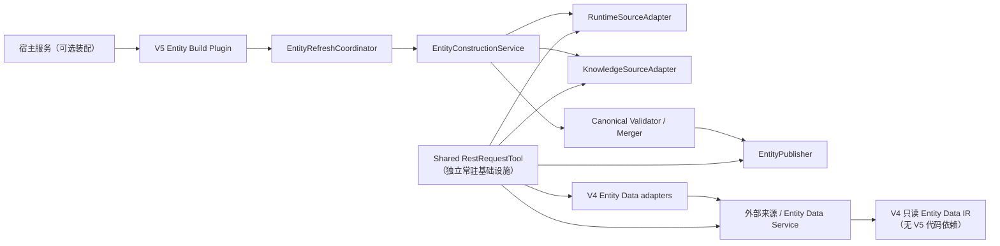

# DVEntityLinking V5 功能设计说明书

最后更新：2026-07-16  
状态：设计基线，待评审后作为实现输入  
上游需求：[V5 IR](./IR.md)

## 1. 设计概览

V5 以独立、可插拔的实体构建插件提供写入侧能力，V4 与该插件之间没有代码调用关系；两者只经 Entity Data Service 的已发布实体数据间接衔接。插件与 V4 共同依赖一个独立常驻的 `RestRequestTool` 基础设施能力。`EntityConstructionService` 不知道 HTTP client 或数据库，负责构建；`EntityPublisher` 负责批量更新和原子切换；`EntityRefreshCoordinator` 管理启动及每日刷新。



## 2. 组件职责

| 组件 | 输入 | 输出 | 约束 |
| --- | --- | --- | --- |
| `RestRequestTool` | 声明式 `RestRequest` | `RestResponse` 或 `RestError` | 独立常驻基础设施；唯一底层 HTTP/platform IR client 持有者，供 V4 与 V5 使用。 |
| `RuntimeSourceAdapter` / `KnowledgeSourceAdapter` | 来源配置 | `ConstructionInput[]` | 只调用 `RestRequestTool`；不发布数据。 |
| `EntityConstructionService` | 两类 `ConstructionInput` | `EntityBuild` 或 `BuildError` | canonical 映射、来源优先级合并、校验、冲突拒绝。 |
| `EntityPublisher` | 已验证 `EntityBuild` | `PublicationResult` | 批量、幂等、不可部分提交。 |
| `EntityRefreshCoordinator` | lifecycle/schedule trigger | `RefreshResult` | 单进程互斥、保留上一成功数据快照。 |
| `EntityRefreshScheduler` | 时区、每日时间 | trigger | 不承担构建或发布业务。 |

除 `RestRequestTool` 外，上述 V5 组件全部属于 V5 Entity Build Plugin；V4 package 不得导入插件实现类。`RestRequestTool` 位于独立共享基础设施包，V4 与 V5 都可通过其公开接口使用。宿主以显式依赖注入选择是否装配插件，未来迁移至 Entity Data Service 时可整体迁出 V5 插件组件和端口实现，而共享工具继续服务 V4 查询场景。

## 3. 契约设计

### 3.1 REST 请求

`RestRequest` 至少包含 `method`、`url`、`params`、`json_body`、`auth_reference`、`timeout_seconds`、`retry_policy`、`idempotency_key`。`auth_reference` 仅是配置定位符，日志、结果与异常不得解析或输出其秘密值。

可重试条件仅包括连接/读取超时和明确的暂时性服务错误；非幂等写请求只有存在 idempotency key 时才可重试。响应先由工具解码为 JSON/文本安全摘要，再交给 adapter 做来源 schema 校验。V4 的 `IrEntityDataClient` 和 `RestEntityDataClient` 同样遵循此规则；前者将现有 `platform_client` 作为工具的可注入 transport，后者使用 HTTP transport。

### 3.2 构建与发布

来源 adapter 将远端数据映射为 V4 已有实体字段；来源类别和请求配置只存在于 adapter 配置及运行日志中，不进入实体对象。构建器产生完整的 V4 schema 实体集合和仅含计数、结果状态、错误代码的安全报告。

Publisher 仅接受 `validation=passed` 的实体集合。它先完成批量写入校验与对账，再原子切换当前数据；安全重试不得产生重复实体。失败只能返回结构化结果，不能自行删除或部分替换已发布数据。

软件版本与每日数据更新严格分离：每日构建不产生 V5.x 软件版本，也不在实体中新增版本、来源、时间或快照字段；只有代码、公开契约、schema、构建规则或来源优先级经评审变更时才能升级软件版本。

### 3.3 刷新状态机

`idle → pending → running → succeeded | failed | skipped`。进入 `running` 时持有进程内互斥；完成后释放。调度触发发现锁被占用则不等待、不启动第二轮，直接生成 `skipped`，reason 为 `refresh_skipped_in_progress`。

首次同步由 lifecycle 显式调用：blocking 模式在完成后返回，background 模式立即返回但 health/readiness 可读取当前状态。每日时间使用显式时区，默认 `Asia/Shanghai`。

### 3.3.1 任务注册与调度分离

```text
EntityBuildTask("bootstrap", source, "once")     -> run_once()  -> 成功结果缓存
EntityBuildTask("runtime", source, "daily")      -> run_daily() -> 与缓存合并、校验、发布
EntityBuildTask("knowledge", source, "daily")    -> run_daily() -> 同上，可持续新增
```

`EntityBuildTaskRunner` 是唯一的任务编排器。它只接受返回 V4 schema 实体列表的 source；source 数量可扩展，构建器不需要为新增接口增加分支。`DailyRefreshScheduler` 只负责“是否到午夜且当天未执行”的判断，宿主负责定期调用它；一次任务永不由该 scheduler 调用。

当接口返回体一致时，推荐仅使用 `v5_entity_build_config.json` 的 `once_endpoints` / `daily_endpoints` 清单。`ConfiguredEndpointSource` 按清单统一调用接口并读取 `entities`；新增接口只新增 `{name, url}` 配置项，无需新增 adapter、task 或调度代码。

### 3.4 Query Recall Facade 与动态配置

`QueryRecallFacade` 是独立于 Entity Build Plugin 的可选宿主门面。其公开类型不带版本后缀：

| 对外入参 | 含义 | 优先级 |
| --- | --- | --- |
| `QueryRecallRequest.query` | 必填原始 Query。 | 必填。 |
| `use_llm` | 可选，覆盖当前配置的 LLM 参与开关。 | 显式调用值优先。 |
| `top_k` | 可选，限制每个 mention 返回的候选数量。 | 显式调用值优先。 |

其余策略来自已验证的运行配置：`recall.use_llm` 映射兼容层的抽取模式，`recall.allow_fallback` 映射既有回退语义，`recall.top_k` 在候选产生后做安全截断；未配置或不合法的覆盖值不得改变既有默认语义。

Facade 的公开输出为 `QueryRecallResult`，字段为 `query`、`status`、`mentions`、`candidates`、`top_entity`、`error_code`、`degraded` 与安全诊断；这些名称不带版本后缀。V4 的 `LinkRequestV1` / `LinkResponseV1` 仅作为兼容适配层内部输入/输出，不得出现在 V5 的公开方法签名、配置文件或新文档示例中。旧类型的移除须在兼容调用方完成迁移后单独执行，不能作为 V5 门面对外继续扩散版本后缀。

`RecallConfigProvider` 从配置文件读取 immutable `RecallConfig`。文件变更触发 reload 时，provider 先解析、类型/范围校验，再原子替换内存配置快照；正在处理的请求继续使用其开始时读取的配置快照。reload 失败保留最近成功配置并生成不含文件内容或秘密值的安全错误。首期不支持通过查询 API 修改配置。

## 4. 错误与安全

| 阶段 | 错误类别 | 行为 |
| --- | --- | --- |
| REST | `timeout`、`transport`、`remote_status`、`invalid_response` | 工具分类、有限重试并返回安全错误。 |
| 来源映射 | `source_schema_invalid` | 中止本轮构建，不发布。 |
| 构建校验 | `missing_required_field`、`canonical_conflict`、`entity_word_conflict` | fail-closed，不发布。 |
| 快照 | `snapshot_write_failed`、`snapshot_reconciliation_failed`、`snapshot_switch_failed` | 保持上一成功数据快照，记录 build ID 与安全摘要。 |
| 调度 | `refresh_skipped_in_progress` | 仅记录跳过，不启动并发刷新。 |
| 查询配置 | `recall_config_invalid`、`recall_config_reload_failed` | 保留最近有效配置，不影响正在执行的请求。 |

安全 trace 仅包含阶段、错误代码、HTTP 状态类、次数、来源类别、build ID、版本摘要与计数；禁止包含 URL、Authorization、token、cookie、完整 request/response body 或完整实体敏感属性。

## 5. 实施与验证顺序

1. 定义 DTO/port、Query Recall Facade/配置契约与 V5 IR/SR 追踪，先建立 V4/V4.1 兼容回归。
2. 实现共享 `RestRequestTool` 与 fake transport，并将 V4 Entity Data adapter 迁至该工具。
3. 实现 Query Recall Facade 与配置热加载，覆盖 LLM/Top-K 策略和 V4 兼容。
4. 实现来源 adapter、构建器与 validator，覆盖冲突拒绝和确定性合并。
5. 实现 publisher stub/adapter，覆盖候选快照写入、对账、原子切换、幂等和上一成功快照保留。
6. 实现 lifecycle/scheduler，使用 fake clock 验证启动、午夜、重叠、失败和恢复。
7. 获得真实接口授权后执行 dry-run、批量发布、对账、灰度与回退演练。

## 6. 部署与回退

未获得正式来源和 Entity Data 写入授权前，V5 只能运行 fixture/dry-run，不得连接生产环境。生产失败时停止 V5 刷新任务并保持上一个 Entity Data 成功数据快照；不清库、不自动删除，也不执行未经验证的反向迁移。

## 7. 可迁移性约束

V5 插件不得依赖 V4 的 linking pipeline、DTO 内部实现或 Web adapter；V4 也不得依赖 V5 插件。两者允许依赖独立共享的 REST 请求工具。插件仅依赖共享 REST 工具、来源端口、批量更新端口和调度抽象。将构建能力迁移到 Entity Data Service 时，允许替换这些端口实现与宿主装配位置，但不允许修改 V4 领域代码或共享工具的 V4 查询契约。
