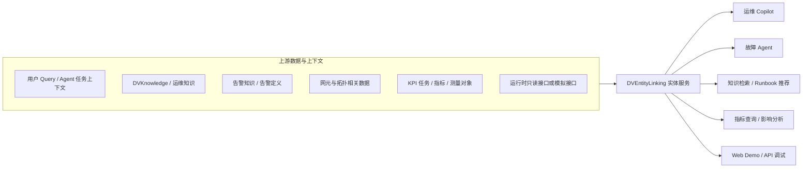
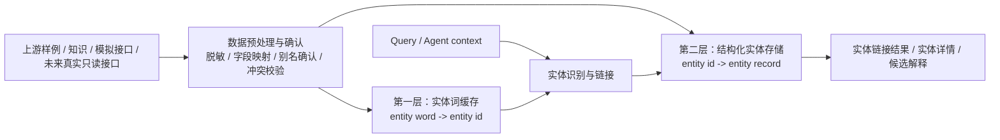

# DVEntityLinking 项目总结（需求分析输入）

> 用于支撑后续正式需求分析（IR）和功能设计（SR）的项目背景、系统上下文与需求边界说明。

最后更新：2026-06-29  
状态：Draft / requirement-analysis input  
作者：Codex  

---

## 1. 文档定位

本文是正式需求分析前的项目总结材料，重点回答：

- 本项目作为“实体服务”在 DV 智能体体系中的定位是什么。
- 需要从哪些数据来源获取实体、实体词和上下文信息。
- 需要支撑哪些智能体、服务和典型场景使用。
- 实体数据范围包括哪些实体类型。
- 两层数据存储方案在需求层面的边界是什么。
- 后续正式 IR 需要覆盖哪些需求范围、约束和待确认决策。

本文不是正式 IR/SR，不新增验收结论，也不替代 `docs/PROJECT.md`、`docs/current/DECISIONS.md`、`docs/current/DATA_CONTRACT.md`、`docs/current/TEST_ACCEPTANCE.md` 以及历史基线文档中的权威记录。后续正式需求分析可直接把本文作为“项目背景、系统上下文和范围输入”。

---

## 2. 项目背景

DVEntityLinking 面向 DV 运维 Copilot 和故障 Agent。运维场景中，用户 Query、诊断链路、知识检索、指标查询和根因分析经常会出现告警名、告警 ID、网元类型、网元实例、KPI 任务、测量指标等实体词。如果这些实体词不能被统一识别、归一化和链接，Copilot 或 Agent 很容易出现以下问题：

- 同一实体在不同 Query 中被多种名称、别名或编号引用，缺少统一实体 ID。
- Query 中存在多个实体词时，无法区分哪些已链接、哪些未命中、哪些存在歧义。
- 未命中和不需要实体链接的 Query 容易被误匹配，导致误报。
- Agent 诊断链路中的告警、KPI、网元、知识对象无法稳定串联。
- 真实 DV 数据、脱敏样例、Mock 数据和 LLM 输出边界不清，影响后续设计和验收。
- 前端 demo、API、评测脚本和验收口径缺少统一需求语义，容易把演示能力误当成生产能力。

因此，本项目的核心需求不是做一个问答机器人，而是沉淀一个可复用、可解释、可评测的 DV 实体服务。

---

## 3. 项目目标

从需求角度看，DVEntityLinking 当前目标可以概括为：

| 目标 | 描述 |
| --- | --- |
| 提供统一实体服务 | 为 DV 智能体体系提供统一实体识别、归一化、链接、查询和解释能力。 |
| 支撑 Copilot 和 Agent | 为运维 Copilot、故障 Agent、知识检索、指标查询和演示调试提供一致的实体上下文。 |
| 管理实体数据范围 | 明确哪些实体类型进入范围，哪些仅作为候选或暂不纳入。 |
| 支撑多状态结果 | 明确区分链接成功、部分链接、歧义、无匹配、不需要链接、依赖失败和输入非法。 |
| 支撑脱敏样例验证 | 使用已确认样例和 Mock artifacts 进行离线可回归验证。 |
| 支撑未来真实接入 | 为后续真实 DV 接口、Redis、GaussDB 和 LLM 增强保留确认和设计空间。 |
| 保持安全边界 | 避免真实密钥、真实连接信息、真实生产 payload 和完整 LLM 日志进入仓库或默认展示。 |

---

## 4. 系统上下文

DVEntityLinking 在 DV 智能体体系中定位为“实体服务层”。它位于上游数据源、智能体运行上下文和下游智能应用之间，负责把自然语言或任务上下文中的实体词转换为稳定、可查询、可解释的实体引用。

实体服务的责任边界：

- 从上游数据源获取或接收实体相关数据，但不替代上游系统成为主数据系统。
- 维护实体词到实体 ID 的链接语义，但不默认执行生产写操作。
- 向下游智能体和服务输出实体 ID、实体类型、链接状态、候选结果、失败原因和安全可展示解释。
- 对真实 DV 数据、Mock 数据、LLM 输出和本地样例保持可追溯边界。

---

## 5. 上游数据来源范围

正式需求分析需要明确实体服务从哪些地方获取数据、每类数据用于什么目的、进入范围前需要哪些确认。

| 数据来源 | 可能提供的数据 | 主要用途 | 当前需求边界 | 待确认事项 |
| --- | --- | --- | --- | --- |
| 用户 Query | 自然语言文本、实体词、意图线索、上下文片段。 | 实体识别、need-linking 判断、实体链接入口。 | 默认纳入；Query 可来自 Web/API、Copilot 或 Agent。 | Query 语言范围、最大长度、多轮上下文是否纳入。 |
| Agent 任务上下文 | 诊断步骤、已识别告警、指标、资源对象、前序推理结果。 | 在诊断链路中保持实体上下文一致。 | 作为需求方向纳入；结构需后续确认。 | Agent 上下文结构、可写入字段、是否保存中间结果。 |
| DVKnowledge / 运维知识 | 网元类型、KPI 名称、Runbook、案例、故障模式、别名候选。 | 构建实体目录、补充别名、支撑知识检索。 | 可作为候选来源；真实内容必须脱敏和确认。 | 知识条目结构、可信度、更新频率、可提交边界。 |
| 告警知识 / 告警定义 | 告警 ID、告警名称、描述、可能原因、影响、处理建议。 | 告警实体链接、告警解释、故障诊断起点。 | 告警知识实体纳入；告警事件实例默认不纳入。 | 是否扩展 severity、impact、cause、repair action 等字段。 |
| 网元与网络资源数据 | 网元类型、网元名称、站点、小区、链路、板卡、端口、拓扑节点。 | 资源实体链接、影响范围分析、拓扑上下文补充。 | 网元类型和网元名称优先；拓扑关系默认候选。 | 实例 ID、命名规则、拓扑关系、数据量和权限。 |
| KPI / 性能数据 | KPI 任务名称、测量对象、指标 key、计数器、单位、粒度。 | 指标查询、异常定位、性能类实体链接。 | KPI 任务名和指标 key 优先；测量对象为候选。 | 指标枚举、单位、对象 ID、时间粒度、阈值语义。 |
| 运行时只读接口或模拟接口 | 当前运行态网元、测量对象、实例化资源、接口返回错误。 | 支撑运行态实体查询和未来真实接入穿刺。 | 默认使用模拟接口或脱敏样例；不默认直连生产。 | 接口协议、分页、权限、限流、错误码、脱敏策略。 |
| 人工确认样例 | 脱敏实体、Query、golden cases、Mock artifacts。 | 离线验证、需求样例、验收底线。 | 纳入；必须标明来源和可提交边界。 | 样例覆盖范围、更新责任、是否代表真实能力。 |
| LLM 输出 | 实体抽取建议、类型分类、解释、rerank 或补充候选。 | 可选增强，不作为默认事实来源。 | 默认不作为权威数据源；必须经结构化校验。 | 是否进入验收、失败回退、脱敏报告和稳定性门槛。 |

---

## 6. 需要支撑的服务与场景

实体服务需要支撑多个下游服务或场景。正式 IR 应明确每类调用方的输入、输出、状态语义和失败行为。

| 服务/场景 | 使用实体服务的目的 | 输入示例 | 输出需求 | 关键约束 |
| --- | --- | --- | --- | --- |
| 运维 Copilot 自然语言查询 | 将 Query 中的告警、网元、KPI 等词映射为明确实体。 | “Check ALM-51020 and CPU Usage.” | 实体 ID、实体类型、链接状态、候选和解释。 | 不应把无关 Query 强行链接。 |
| 故障 Agent 诊断链路 | 在多步骤诊断中稳定引用同一告警、指标、资源和知识对象。 | Agent 当前步骤、前序诊断结果、用户追问。 | mention 级结果、实体上下文、失败原因。 | 需要保留局部失败，避免上下文漂移。 |
| 告警解释与处置建议 | 将告警 ID 或告警名称链接到告警知识实体。 | 告警 ID、告警名称、告警描述片段。 | 告警实体、相似告警、知识解释入口。 | 告警知识与告警实例事件要区分。 |
| KPI 查询与异常分析 | 将 KPI 任务、指标 key、测量对象链接到实体。 | KPI 名称、指标 key、网元名、测量对象。 | KPI 实体、关联对象、指标语义。 | 指标单位、粒度和对象范围需确认。 |
| 网元/资源查询 | 将网元类型或网元名称映射为资源实体。 | 网元类型、网元实例名、站点或资源名称。 | 资源实体、类型、候选和上下文。 | 真实运行态数据需权限和脱敏确认。 |
| 知识检索 / Runbook 推荐 | 用实体结果约束知识检索范围。 | 已链接告警、网元、KPI 或故障模式。 | 可用于检索的实体上下文和解释。 | 知识来源可信度和可提交边界需确认。 |
| Web Demo / API 调试 | 展示实体链接能力并支持需求验收讨论。 | Query、运行模式、样例数据。 | 可视化结果、JSON 契约、调试信息。 | Demo 能力不得被默认为生产能力。 |
| 自动化评测与验收 | 用样例验证需求语义和回归底线。 | Query 样例、实体样例、golden cases。 | pass/fail、precision、recall、误报统计。 | 自动化验收与人工判断应分开记录。 |

---

## 7. 两层数据存储方案（需求层）

实体服务需要同时满足“快速实体词链接”和“结构化实体查询”两类需求。因此，需求层建议采用两层数据存储模型：

| 层级 | 需求定位 | 主要数据 | 关键规则 | 失败或异常行为 |
| --- | --- | --- | --- | --- |
| 第一层：实体词缓存 | 面向 Query 链接的快速查找层。 | 规范化实体词、确认别名、实体 ID。 | 一个实体词 key 默认只映射一个实体 ID；别名必须经确认；不得自动生成不可信别名。 | 同 key 多实体冲突、非法 key、引用不存在实体 ID 时应 fail-closed 或输出结构化失败。 |
| 第二层：结构化实体存储 | 面向实体详情、候选解释和下游查询的实体记录层。 | 实体 ID、实体类型、标准名、别名、描述、可扩展属性。 | 以实体 ID 为稳定主键；初始字段保持最小必要集合；类型专属字段需单独确认。 | 缺失必填字段、重复实体 ID、schema 不兼容时应阻止进入服务。 |
| 跨层一致性 | 保证实体词链接结果可以查询到结构化实体。 | entity word、entity ID、entity record。 | 实体词缓存中的实体 ID 必须存在于结构化实体存储；实体词必须来自标准名或确认别名。 | 出现 dangling ID 或未确认实体词时不得静默链接。 |

该两层方案在需求层的重点不是指定具体实现，而是明确：实体词链接和结构化实体查询是两个不同职责；两层之间必须有一致性校验；未来如替换为真实 Redis、GaussDB 或其他存储，也必须保留相同的输入输出契约、错误语义和安全边界。

---

## 8. 实体数据范围

实体数据范围是后续需求分析需要优先明确的边界。下表按“实体类型”说明当前建议纳入范围、数据含义、来源边界和待确认事项。

| 实体类型 | 中文说明 | 是否建议纳入本轮需求范围 | 数据来源边界 | 待确认事项 |
| --- | --- | --- | --- | --- |
| `alarm` | 告警知识实体，例如告警 ID、告警名称、告警描述。 | 是 | 使用已确认脱敏样例；不建模真实告警实例事件。 | 是否补充 severity、impact、cause、处理建议等类型专属字段。 |
| `ne_type` | 网元类型，例如设备类型、网元类别。 | 是 | 可来自预置样例或经确认的知识来源抽样。 | 类型枚举、中文/英文名称、别名和层级关系是否需要标准化。 |
| `ne_name` | 网元实例或网元名称。 | 是，但需保持 Mock/脱敏边界 | 可通过模拟运行时接口或脱敏样例表达；不默认连接真实生产接口。 | 真实实例命名规则、唯一 ID、所属区域/站点/拓扑关系是否进入范围。 |
| `kpi_task_name` | KPI 测量任务名称。 | 是 | 来自预置样例、知识来源抽样或模拟运行时接口。 | 任务名与测量对象、指标 key 之间的关系是否需要建模。 |
| `kpi_meas_type_key` | KPI 测量指标或测量类型 key。 | 是 | 使用已确认样例或 Mock 数据；不默认使用真实生产指标全集。 | 指标 key、展示名、单位、聚合粒度和告警阈值是否进入范围。 |
| `kpi_meas_objects` | KPI 测量对象。 | 候选，默认不强制纳入 | 通常属于实例化运行时数据，需模拟接口或真实只读接口确认后再纳入。 | 是否本轮纳入；若纳入，需确认对象 ID、对象类型、生命周期和数据量边界。 |
| `alarm_event` | 告警实例或事件实体。 | 默认不纳入 | 与生产运行态事件强相关，当前不默认建模真实事件。 | 是否需要区分“告警知识”与“告警事件实例”。 |
| `topology_relation` | 拓扑关系、链路、上下游关系。 | 候选，默认不纳入 | 需要真实或模拟拓扑来源；当前仅作为未来扩展方向。 | 关系类型、方向性、时效性和展示方式。 |
| `knowledge_case` | 运维知识、Runbook、案例或故障模式。 | 候选，默认不纳入 | 可来自知识库抽样或脱敏案例，但必须确认可提交边界。 | 知识条目的结构、来源、可信度和与实体的关联方式。 |
| `network_resource` | 泛化网络资源类型。 | 不建议作为本轮精确实体类型 | 可作为上位概念；具体落地建议拆分为 `ne_type`、`ne_name` 等更明确类型。 | 是否仅作为术语保留，还是需要重新定义为可链接实体。 |
| `kpi_metric` | 泛化 KPI 指标类型。 | 不建议作为本轮精确实体类型 | 可作为上位概念；具体落地建议拆分为 `kpi_task_name`、`kpi_meas_type_key`、`kpi_meas_objects`。 | 是否废弃泛化类型，避免与细分类型并存导致歧义。 |
| 业务/服务实体 | 服务、客户、SLA 对象、业务路径等。 | 暂不纳入 | 当前缺少确认样例和真实字段边界。 | 是否属于后续阶段或其他项目范围。 |
| 流程对象实体 | 工单、变更、派单、处理动作等。 | 暂不纳入 | 涉及流程系统和写操作边界，当前不默认纳入。 | 是否需要只读引用；是否触发合规、权限和审计要求。 |

实体数据范围需要在正式 IR 中作为显式范围项维护。凡是未列为“是”的实体类型，都不应在设计或验收中被默认视为已支持能力。

---

## 9. 目标用户与使用场景

### 9.1 目标用户或系统

| 用户/系统 | 需求关注 |
| --- | --- |
| 运维 Copilot | 需要把用户 Query 中的告警、网元、KPI 等词映射为明确实体，支撑后续查询、解释和推荐。 |
| 故障 Agent | 需要在诊断链路中稳定引用同一实体上下文，避免同名、别名和多实体场景导致上下文漂移。 |
| Demo 使用者 | 需要通过演示入口直观看到 Query、实体词、候选、链接状态、实体详情和解释。 |
| API/集成调用方 | 需要稳定的 JSON 输入输出契约、状态语义和错误语义。 |
| 需求/设计/测试人员 | 需要明确样例范围、验收边界、Mock 边界和后续真实接入的待确认事项。 |

### 9.2 典型需求场景

| 场景 | 需求描述 | 期望结果 |
| --- | --- | --- |
| 单实体精确链接 | Query 包含明确告警 ID、告警名称、网元名或 KPI 名称。 | 返回唯一实体、实体 ID、实体类型、置信度和解释。 |
| 多实体 Query | Query 同时包含多个实体词，例如告警和 KPI、网元和指标。 | 按 mention 输出结果，并在 Query 级汇总为 linked 或 partial。 |
| 歧义实体词 | 同一实体词可能对应多个实体。 | 返回 ambiguous 或候选列表，不静默选择错误实体。 |
| 无匹配 Query | Query 中存在疑似实体词，但样例或存储中无对应实体。 | 返回 no_match，不产生误链接。 |
| 不需要链接 Query | Query 是打开看板、查看总览等不需要实体链接的操作。 | 返回 not_required，避免强行匹配。 |
| 外部依赖失败 | LLM、存储或未来真实接口不可用或返回异常。 | 返回结构化依赖失败或降级状态，并保留可解释原因。 |
| 样例和 Mock 校验 | 样例、实体词表或结构化实体数据存在冲突、缺字段或未确认来源。 | fail-closed，阻止问题数据进入链接链路。 |

---

## 10. 需求范围

### 10.1 当前应纳入需求范围

| 范围项 | 说明 |
| --- | --- |
| 实体目录与实体词表 | 支持实体 ID、实体类型、标准名、确认别名和描述等最小必要信息。 |
| Query 实体识别 | 判断 Query 是否需要实体链接，识别实体词、span 和候选类型。 |
| 实体链接与消歧 | 基于实体词、别名、候选和存储结果形成 linked、partial、ambiguous、no_match 等状态。 |
| 多 mention 支持 | 支持一个 Query 中存在多个实体词，并保留 mention 级结果。 |
| 数据和 Mock 约束 | 区分 L0 合成、L1 脱敏、L2 模拟接口、未来 L3 真实只读接入。 |
| Web/API 展示 | 提供演示入口和 JSON API，用于展示结果、调试和验收。 |
| 评测与验收口径 | 使用已确认样例、golden cases、evaluation 和 smoke 支撑自动化验收底线。 |
| 安全投影 | 对真实配置、敏感字段、完整请求响应和日志进行限制。 |

### 10.2 当前不默认纳入需求范围

| 非范围项 | 说明 |
| --- | --- |
| 真实 DV 生产写操作 | 不包含自动修复、派单、变更、告警确认等写操作。 |
| 未确认真实接口 | 不默认接入真实 DV 接口、真实 Redis、真实 GaussDB 或真实生产 payload。 |
| 未确认实体结构升级 | 类型专属字段、关系模型、生命周期、变更管理等需另行确认。 |
| 生产级检索依赖 | 不默认引入向量库、FTS 或外部检索服务作为强依赖。 |
| 真实 LLM 默认验收 | LLM 当前是可选增强，默认离线验收不依赖真实 LLM。 |
| 产品级前端范围 | 当前前端主要服务 demo 和验收展示，不默认扩展为完整生产产品。 |

---

## 11. 输入输出需求约束

### 11.1 输入侧

正式 IR 应至少描述以下输入：

- 用户 Query：自然语言文本，可能包含 0 个、1 个或多个实体词。
- Agent 任务上下文：诊断步骤、前序实体、当前关注对象、失败状态等。
- 实体样例：已确认可提交的实体 ID、类型、标准名、别名和描述。
- 实体词表：用于实体词到实体 ID 的映射，别名必须经确认。
- 结构化实体数据：用于按实体 ID 查询实体详情。
- 上游数据源确认记录：真实 DV 内容、Mock 方式、数据分层和安全边界的确认来源。
- 运行模式：默认离线 demo，可选 LLM 增强或未来真实接口。

### 11.2 输出侧

正式 IR 应至少要求输出：

- Query 级状态：linked、partial、ambiguous、no_match、not_required、dependency_failed、invalid_input。
- mention 级结果：实体词文本、span、候选类型、链接状态、候选列表和原因。
- 链接实体：实体 ID、实体类型、标准名、描述和安全可见字段。
- 失败原因：无匹配、不需要链接、依赖失败、schema 错误、输入非法等。
- 下游可用实体上下文：供 Copilot、故障 Agent、知识检索、指标查询继续使用。
- 可解释信息：候选匹配原因、消歧原因、降级原因和安全可展示 trace。
- 验收指标：样例 pass/fail、precision、recall、negative false positive 等自动化指标。

---

## 12. 关键约束

### 12.1 数据约束

- 新增真实 DV 实体、字段、接口、样例或 Mock 行为前必须先确认。
- 新增别名不得自动生成，必须有确认来源。
- 实体词缓存约束为单实体词 key 对单实体 ID value；同 key 多实体冲突应 fail-closed，除非后续需求明确改变策略。
- 结构化实体数据默认沿用最小实体字段，类型专属字段后续单独确认。
- 样例数据必须能支撑需求场景，不应把未覆盖场景包装成已验证能力。

### 12.2 状态与异常约束

- `no_match` 和 `not_required` 必须区分，避免把不需要链接的 Query 当作无匹配。
- 多 mention Query 需要保留 mention 级结果，Query 级 `partial` 不应吞掉局部失败。
- 依赖失败、schema 错误、配置错误和输入非法应结构化输出，不应静默降级。
- Mock 数据冲突、缺字段、未确认来源或跨层引用不存在时，应阻止进入链接链路。

### 12.3 安全约束

- `config/llm.local.json` 只能本地使用，必须保持 ignored。
- API key、token、Authorization、真实 base URL、完整请求、完整响应和完整日志不得提交或展示。
- `outputs/**` 作为本地日志和证据目录，不进入仓库。
- 前端/API 只展示安全投影，敏感属性需要过滤或计数，不直接回显。

---

## 13. 验收需求口径

后续正式 IR 应把验收分为三层，而不是把所有验证都混在一起：

| 层级 | 说明 |
| --- | --- |
| 自动化验收底线 | 已确认样例、golden cases、evaluation、acceptance smoke、schema fail-closed 和安全扫描。 |
| 人工验收判断 | 前端视觉接受、真实 DV 能力边界是否被认可、残余风险是否可接受。 |
| 条件补证 | 真实 LLM live smoke、真实 Redis/Gauss 适配、真实 DV 只读接口联调。 |

当前默认验收不连接真实 Redis、真实 GaussDB、真实 DV 生产接口或真实 LLM。若后续需求将这些纳入范围，需要重新定义验收标准、失败语义、脱敏策略和部署边界。

---

## 14. 后续正式 IR 建议拆分

建议后续正式需求分析按以下 IR 方向展开：

| 候选 IR | 需求主题 | 重点说明 |
| --- | --- | --- |
| IR-01 系统上下文与服务边界 | 实体服务在 DV 智能体体系中的位置、上游数据、下游调用方和责任边界。 |
| IR-02 实体数据与词表管理 | 实体最小字段、实体类型范围、别名确认、数据分层、Mock 约束、冲突处理。 |
| IR-03 两层数据存储 | 实体词缓存、结构化实体存储、跨层一致性、失败语义和未来真实存储替换边界。 |
| IR-04 Query 实体识别 | need-linking 判断、mention 识别、span、实体词归一化、候选类型。 |
| IR-05 实体链接与状态语义 | linked、partial、ambiguous、no_match、not_required、dependency_failed 的判定规则。 |
| IR-06 服务/API 与下游集成 | Copilot、故障 Agent、知识检索、指标查询、演示入口和 JSON 契约。 |
| IR-07 评测与验收 | 样例集、golden cases、自动化验收底线、人工确认和残余风险记录。 |
| IR-08 外部依赖与安全治理 | LLM、Redis、GaussDB、真实 DV 接口、配置、日志和脱敏边界。 |

每个 IR 后续可进一步拆为 SR，但 SR 中再展开模块接口和实现边界；本文阶段不展开类、函数或代码结构。

---

## 15. Human Decision Gate

正式需求分析进入评审前，建议先确认以下问题：

| 编号 | 待确认问题 | 状态 |
| --- | --- | --- |
| HDG-001 | 实体服务在 DV 智能体体系中的服务边界是否以本文第 4 节为准？ | Needs user decision |
| HDG-002 | 表 8 中哪些候选或暂不纳入实体类型需要调整为范围内？ | Needs user decision |
| HDG-003 | 上游数据来源中哪些允许使用真实只读接口，哪些只能使用脱敏样例或 Mock？ | Needs user decision |
| HDG-004 | 是否把真实 Redis、GaussDB 或 DV 只读接口纳入当前范围？ | Needs user decision |
| HDG-005 | 是否扩展实体类型专属字段、关系字段或生命周期字段？ | Needs user decision |
| HDG-006 | LLM 是保持可选增强，还是进入默认或条件验收？ | Needs user decision |
| HDG-007 | 前端继续定位为 demo 展示，还是进入产品化体验需求？ | Needs user decision |

---

## 16. 主要风险与需求影响

| 风险 | 需求影响 | 建议处理 |
| --- | --- | --- |
| 上游数据来源未确认 | 实体范围、字段和验收样例可能失真。 | 正式 IR 中逐项确认数据来源和可提交边界。 |
| 真实 DV 能力未确认 | Mock 行为可能被误解为生产能力。 | 在需求中明确 Mock 层级和非生产边界。 |
| 两层存储职责混淆 | 实体词链接和实体详情查询可能相互耦合，影响扩展。 | 明确实体词缓存与结构化实体存储的不同责任。 |
| 实体结构仍为最小字段 | 后续复杂实体展示、关系推理和生命周期管理能力受限。 | 新增字段和关系必须另行需求确认。 |
| LLM 默认不参与验收 | 当前自动化结果不能证明真实 LLM 稳定性。 | 若纳入 LLM，补充脱敏、稳定性和失败回退需求。 |
| 多类型歧义仍有扩展空间 | 跨类型同名、同 span 多候选可能影响准确性。 | 在后续 IR/SR 中补充歧义判定和样例覆盖。 |
| 前端验收含人工判断 | 自动化无法完全替代视觉接受。 | 将视觉接受与自动化验收分开记录。 |

---

## 17. 参考资料

| 类型 | 文件 |
| --- | --- |
| 项目入口 | [../../README.md](../../README.md) |
| 项目介绍 | [../../DVEntityLinking项目介绍.md](../../DVEntityLinking项目介绍.md) |
| 当前总览 | [../PROJECT.md](../PROJECT.md) |
| DV 背景 | [../DV_CONTEXT.md](../DV_CONTEXT.md) |
| 当前决策台账 | [DECISIONS.md](DECISIONS.md) |
| 当前数据契约 | [DATA_CONTRACT.md](DATA_CONTRACT.md) |
| 当前测试与验收策略 | [TEST_ACCEPTANCE.md](TEST_ACCEPTANCE.md) |

---

## 18. 术语表

| 术语 | 含义 |
| --- | --- |
| DV | DigitalView-SW，面向运营商领域的电信软件网管系统。 |
| Entity Service | 实体服务，向智能体和应用提供实体识别、链接、查询和解释能力。 |
| Entity Linking | 将 Query 中的实体词链接到标准实体记录的过程。 |
| NER | Named Entity Recognition，实体词识别。 |
| IR | Issue Requirement，需求项或需求分析文档中的顶层需求。 |
| SR | Sub Requirement，子需求，通常作为功能设计输入。 |
| Mock | 本地模拟数据或接口，用于离线 demo、验证和设计穿刺。 |
| fail-closed | 数据或依赖不满足约束时拒绝加载或拒绝进入链路，而不是静默降级。 |
