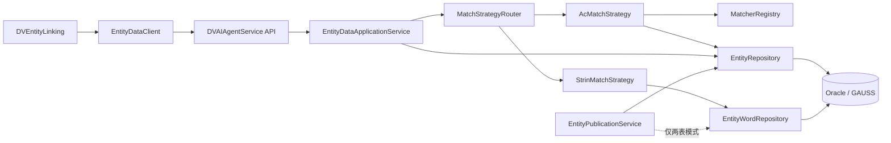
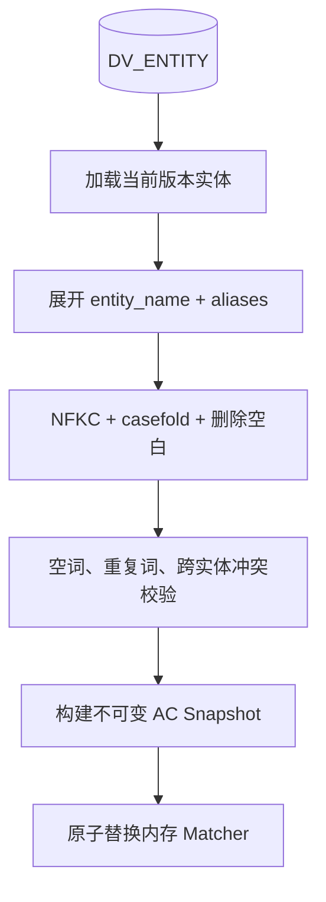
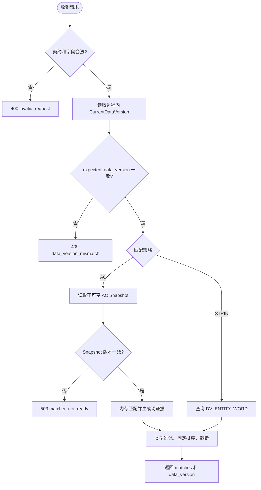
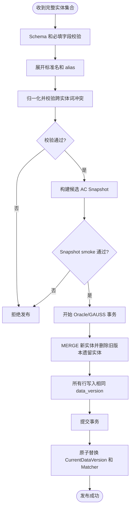
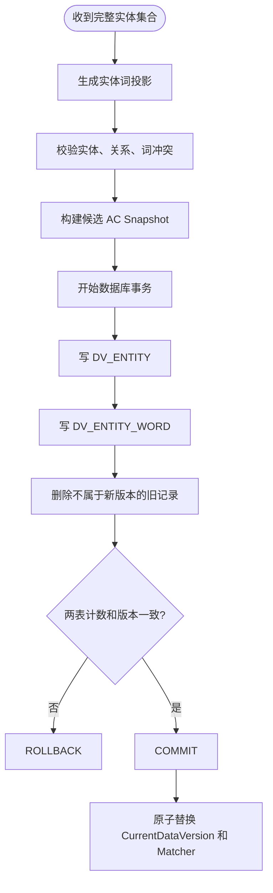
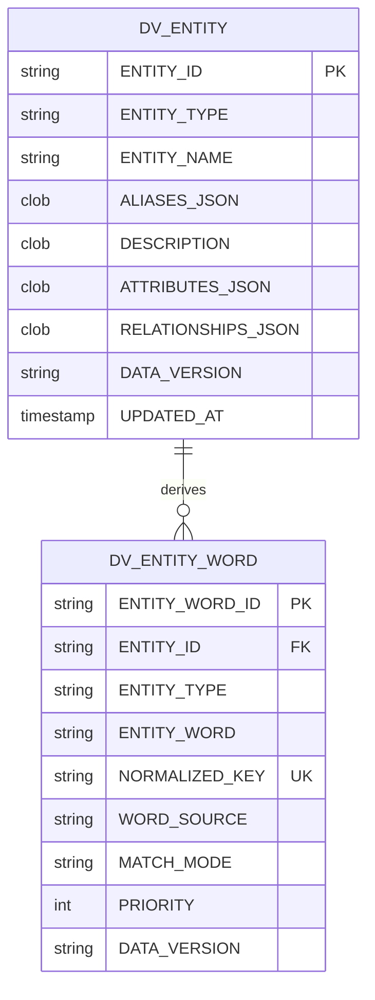
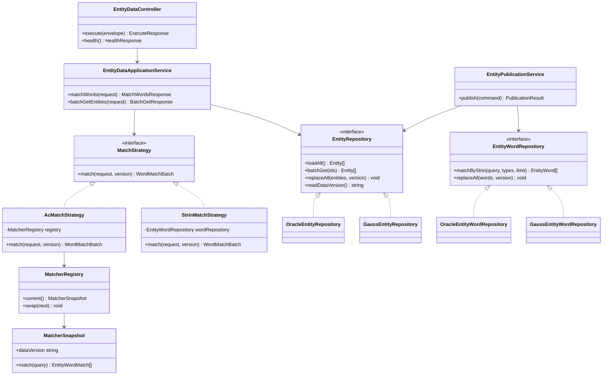
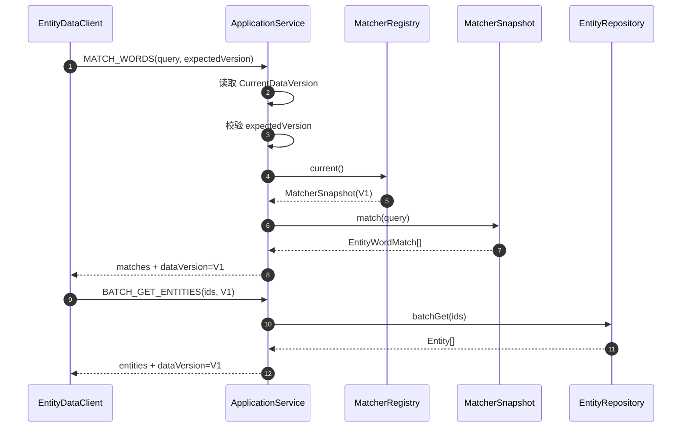
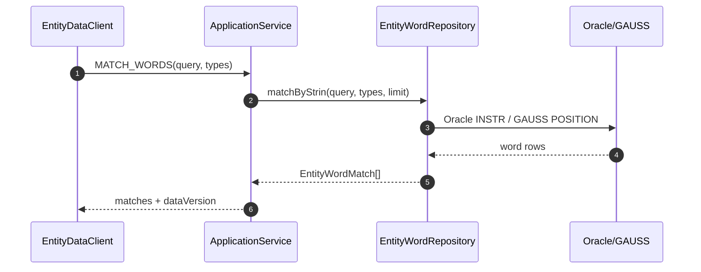

# DVAIAgentService 接口与数据库设计

> AC 与 STRIN 双方案｜V3.0｜设计评审稿｜2026-07-20

## 1. 设计结论

本设计按“最少持久化模型”收敛：

| 部署模式 | 持久化表 | 推荐程度 | 说明 |
| --- | ---: | --- | --- |
| 纯 AC | 1 张：`DV_ENTITY` | **推荐** | 从标准名和别名字段构建内存 AC 索引；数据库只保存权威实体 |
| AC + STRIN 回退 | 2 张：`DV_ENTITY`、`DV_ENTITY_WORD` | 可选 | 第二张表只为数据库反向包含检索及词级配置服务 |
| 纯 STRIN | 2 张 | 不推荐作为生产主方案 | 查询复杂度随词量、Query 长度和并发放大 |

核心数据库为 Oracle 和 GAUSS。业务模型保持一致，DDL、分页语法、JSON/CLOB 处理和字符串函数由数据库适配层分别实现。

> 本文中的“STRIN”按需求称谓保留，实际含义是“Query 包含实体归一化词”的数据库反向包含查询。Oracle 使用 `INSTR(:query, normalized_key)`；GAUSS 使用 `POSITION(normalized_key IN :query)`，若目标 GAUSS 版本兼容 `INSTR`，也可由适配层使用 `INSTR`。

## 2. 设计目标与边界

- 提供实体词匹配、实体详情批读、健康检查和实体全量发布接口；
- AC 与 STRIN 共享请求、响应、排序、错误码和数据版本语义；
- AC 索引是可重建的进程内派生物，不持久化为数据库表；
- 数据库最多两张业务表，不设计数据集表、指针表或审计表；
- 发布版本、当前版本和发布审计由服务配置、平台发布记录及应用日志管理；
- DVEntityLinking 负责 span、重叠消除、消歧和 Query 级状态聚合，DVAIAgentService 不承担这些职责。

## 3. 总体架构



### 3.1 一表 AC 模式



在该模式下，`DV_ENTITY_WORD` 不存在。`entity_word_id`、`source`、`normalized_key` 等词级返回字段由服务在构建 AC 索引时确定性生成。

### 3.2 两表兼容模式

`DV_ENTITY_WORD` 是 `DV_ENTITY` 的可重建投影，仅在以下任一条件成立时使用：

- 必须保留 STRIN 数据库回退；
- 词级 `match_mode`、`priority`、上下文关键词需要独立维护；
- 需要数据库侧检查词冲突、追溯或词级运维查询。

如果这些要求都不存在，应使用一表 AC 模式。

## 4. 查询接口

### 4.1 统一端点

`POST /v1/entity-data:execute`

#### 请求信封

| 字段 | 类型 | 必填 | 规则 |
| --- | --- | --- | --- |
| `contract_version` | string | 是 | 固定 `v1` |
| `operation` | string | 是 | `HEALTH`、`MATCH_WORDS`、`BATCH_GET_ENTITIES` |
| `request_id` | string | 是 | UUID，最大 64 字符 |
| `payload` | object | 是 | 随 operation 变化 |

#### 成功响应信封

| 字段 | 类型 | 必填 | 说明 |
| --- | --- | --- | --- |
| `contract_version` | string | 是 | 固定 `v1` |
| `operation` | string | 是 | 原样返回 |
| `request_id` | string | 是 | 原样返回 |
| `status` | string | 是 | `success` |
| `data_version` | string | 是 | 本次请求使用的数据版本 |
| `data` | object | 是 | operation 响应体 |

#### 错误响应信封

| 字段 | 类型 | 必填 | 说明 |
| --- | --- | --- | --- |
| `status` | string | 是 | `error` |
| `error.code` | string | 是 | 稳定机器错误码 |
| `error.message` | string | 是 | 安全错误描述 |
| `error.retryable` | boolean | 是 | 是否允许有限重试 |
| `error.details` | object | 否 | 仅允许版本、字段名、上限等安全信息 |

### 4.2 `MATCH_WORDS`

#### 入参

| 字段 | 类型 | 必填 | 默认值 | 校验与含义 |
| --- | --- | --- | --- | --- |
| `normalized_query` | string | 是 | 无 | 1～16384 字符；已由上游按约定归一化 |
| `entity_types` | string[] | 否 | `[]` | 去重后最多 64 个；空数组表示全部类型 |
| `expected_data_version` | string | 否 | `null` | 与服务当前版本不一致时返回 409 |
| `max_matches` | integer | 否 | `1000` | 范围 1～5000 |

```json
{
  "contract_version": "v1",
  "operation": "MATCH_WORDS",
  "request_id": "b5160066-93b8-4b07-bd21-3bbcc30e5903",
  "payload": {
    "normalized_query": "查询alm51020关联实体",
    "entity_types": ["alarm"],
    "expected_data_version": "20260720-001",
    "max_matches": 1000
  }
}
```

#### 返回数据

| 字段 | 类型 | 必填 | 说明 |
| --- | --- | --- | --- |
| `matches` | `EntityWordMatch[]` | 是 | 按 `priority DESC, entity_word_id ASC` 排序 |
| `match_count` | integer | 是 | 实际返回数量 |
| `truncated` | boolean | 是 | 是否因 `max_matches` 截断 |
| `strategy` | string | 是 | `ac` 或 `strin`，仅诊断使用 |

`EntityWordMatch`：

| 字段 | 类型 | 一表 AC 来源 | 两表来源 | 说明 |
| --- | --- | --- | --- | --- |
| `entity_word_id` | string | `hash(entity_id, source, ordinal, normalized_key)` | `DV_ENTITY_WORD.ENTITY_WORD_ID` | 稳定词标识，建议字符串避免跨库数值差异 |
| `entity_id` | string | 实体记录 | 检索表 | 实体 ID |
| `entity_type` | string | 实体记录 | 检索表冗余 | 实体类型 |
| `entity_word` | string | 标准名或 alias | 检索表 | 原始词面 |
| `normalized_key` | string | 构建时生成 | 检索表 | 归一化匹配键 |
| `source` | string | `entity_name`/`confirmed_alias` | 检索表 | 词来源 |
| `match_mode` | string | 按类型配置生成 | 检索表 | 匹配模式 |
| `min_context_required` | boolean | 按类型配置生成 | 检索表 | 上下文要求 |
| `context_keywords` | string[] | 按类型配置生成 | 检索表 CLOB | 上下文词 |
| `priority` | integer | 按来源/类型配置生成 | 检索表 | 优先级 |

```json
{
  "contract_version": "v1",
  "operation": "MATCH_WORDS",
  "request_id": "b5160066-93b8-4b07-bd21-3bbcc30e5903",
  "status": "success",
  "data_version": "20260720-001",
  "data": {
    "matches": [{
      "entity_word_id": "ew-7c95f4e9",
      "entity_id": "DV-ALM-001",
      "entity_type": "alarm",
      "entity_word": "ALM-51020",
      "normalized_key": "alm51020",
      "source": "entity_name",
      "match_mode": "STRUCTURED_TOKEN",
      "min_context_required": false,
      "context_keywords": [],
      "priority": 100
    }],
    "match_count": 1,
    "truncated": false,
    "strategy": "ac"
  }
}
```

### 4.3 `BATCH_GET_ENTITIES`

#### 入参

| 字段 | 类型 | 必填 | 默认值 | 校验与含义 |
| --- | --- | --- | --- | --- |
| `entity_ids` | string[] | 是 | 无 | 去重后 1～1000 个；保持首次出现顺序 |
| `expected_data_version` | string | 否 | `null` | 版本不一致返回 409 |
| `include_relationships` | boolean | 否 | `true` | 是否返回关系 |
| `attribute_keys` | string[] | 否 | `[]` | 空表示安全白名单内全部；最多 100 个 |

#### 返回数据

| 字段 | 类型 | 必填 | 说明 |
| --- | --- | --- | --- |
| `entities` | `Entity[]` | 是 | 按请求 ID 顺序 |
| `missing_ids` | string[] | 是 | 当前数据版本不存在的 ID |
| `entity_count` | integer | 是 | 返回实体数 |

`Entity`：

| 字段 | 类型 | 必填 | 说明 |
| --- | --- | --- | --- |
| `entity_id` | string | 是 | 稳定唯一 ID |
| `entity_type` | string | 是 | 实体类型 |
| `entity_name` | string | 是 | 标准名称 |
| `alias` | string[] | 是 | 确认别名，无值返回 `[]` |
| `desc` | string | 是 | 描述，无值返回空字符串 |
| `attributes` | object | 是 | 安全属性投影 |
| `relationships` | `Relationship[]` | 是 | 可按请求关闭 |

### 4.4 查询活动图



## 5. 发布与版本接口

### 5.1 发布接口

`POST /v1/admin/entities:publish`

| 字段 | 类型 | 必填 | 说明 |
| --- | --- | --- | --- |
| `data_version` | string | 是 | 新数据版本，1～64 字符 |
| `expected_current_version` | string | 否 | 乐观并发条件 |
| `idempotency_key` | string | 是 | 幂等键，1～128 字符 |
| `entities` | `EntityWrite[]` | 是 | 完整实体集合，不接受部分 patch |
| `requested_by` | string | 是 | 发布服务身份 |

发布成功返回 `previous_data_version`、`current_data_version`、`entity_count`、`entity_word_count`、`matcher_state` 和 `duration_ms`。

### 5.2 一表 AC 发布活动图



### 5.3 两表发布活动图



### 5.4 数据版本管理

由于不增加版本指针表，采用以下约束：

1. `DATA_VERSION` 直接存入业务表；同一次发布写入完全相同的值；
2. 服务进程内保存不可变 `CurrentDataVersion`；
3. 启动时执行 `SELECT DATA_VERSION FROM DV_ENTITY FETCH FIRST 1 ROW ONLY` 获取版本；
4. 后台完整性检查确认 `MIN(DATA_VERSION)=MAX(DATA_VERSION)`；
5. 发布由单一 leader 执行，使用平台分布式锁或数据库会话锁防止并发发布；
6. 数据库事务提交后，发布者广播版本变更事件；其他实例重建/切换 AC；
7. 没有第三张元数据表意味着数据库自身不保留多版本快照；回退依赖平台备份、发布输入归档或重新发布上一版本。

> 若业务必须实现数据库内秒级版本回退，就需要额外版本/指针结构，这与“最多两表”约束冲突，应作为独立架构决策确认。

## 6. 一表 AC 数据库设计

### 6.1 `DV_ENTITY`

| 字段 | 逻辑类型 | 必填 | 键/索引 | 说明 |
| --- | --- | --- | --- | --- |
| `ENTITY_ID` | string(128) | 是 | PK | 实体稳定 ID |
| `ENTITY_TYPE` | string(64) | 是 | `IDX_ENTITY_TYPE` | 实体类型 |
| `ENTITY_NAME` | string(255) | 是 | 无 | 标准名；AC 词源 |
| `ALIASES_JSON` | large text | 是 | 无 | 确认别名字符串数组，默认 `[]` |
| `DESCRIPTION` | large text | 否 | 无 | 描述，不参与匹配 |
| `ATTRIBUTES_JSON` | large text | 是 | 无 | 属性对象，默认 `{}` |
| `RELATIONSHIPS_JSON` | large text | 是 | 无 | 关系数组，默认 `[]` |
| `DATA_VERSION` | string(64) | 是 | `IDX_ENTITY_VERSION` | 当前发布版本；全表必须一致 |
| `UPDATED_AT` | timestamp | 是 | 无 | 最近发布时间 |

### 6.2 一表模式约束

- `ALIASES_JSON` 只能保存确认别名，不得从描述或属性自动生成；
- 服务读取后校验其为字符串数组，并对标准名和 alias 执行统一归一化；
- 不同实体生成相同 `normalized_key` 时整批发布失败；
- 词级 `match_mode`、`priority` 等从服务配置按实体类型和词来源生成；
- 如果词级配置必须由业务人员逐词维护，则一表模式不适用，应启用第二张表。

## 7. 两表兼容模式数据库设计

### 7.1 `DV_ENTITY_WORD`

| 字段 | 逻辑类型 | 必填 | 键/索引 | 说明 |
| --- | --- | --- | --- | --- |
| `ENTITY_WORD_ID` | string(64) | 是 | PK | 稳定词 ID |
| `ENTITY_ID` | string(128) | 是 | FK/`IDX_WORD_ENTITY` | 对应实体 |
| `ENTITY_TYPE` | string(64) | 是 | `IDX_WORD_TYPE` | 类型冗余，减少 join |
| `ENTITY_WORD` | string(255) | 是 | 无 | 原始词面 |
| `NORMALIZED_KEY` | string(255) | 是 | UK | 归一化匹配键，跨实体唯一 |
| `WORD_SOURCE` | string(32) | 是 | 无 | `entity_name` 或 `confirmed_alias` |
| `MATCH_MODE` | string(32) | 是 | 无 | 匹配模式 |
| `MIN_CONTEXT_REQUIRED` | small integer | 是 | 无 | 0/1 |
| `CONTEXT_KEYWORDS_JSON` | large text | 是 | 无 | 字符串数组 |
| `PRIORITY` | integer | 是 | 无 | 排序优先级 |
| `DATA_VERSION` | string(64) | 是 | `IDX_WORD_VERSION` | 必须与实体表一致 |
| `UPDATED_AT` | timestamp | 是 | 无 | 最近发布时间 |

### 7.2 ER 图



## 8. Oracle DDL

### 8.1 一表 AC 模式

```sql
CREATE TABLE DV_ENTITY (
    ENTITY_ID           VARCHAR2(128 CHAR) NOT NULL,
    ENTITY_TYPE         VARCHAR2(64 CHAR)  NOT NULL,
    ENTITY_NAME         VARCHAR2(255 CHAR) NOT NULL,
    ALIASES_JSON        CLOB DEFAULT '[]' NOT NULL,
    DESCRIPTION         CLOB,
    ATTRIBUTES_JSON     CLOB DEFAULT '{}' NOT NULL,
    RELATIONSHIPS_JSON  CLOB DEFAULT '[]' NOT NULL,
    DATA_VERSION        VARCHAR2(64 CHAR) NOT NULL,
    UPDATED_AT          TIMESTAMP(6) DEFAULT SYSTIMESTAMP NOT NULL,
    CONSTRAINT PK_DV_ENTITY PRIMARY KEY (ENTITY_ID)
);

CREATE INDEX IDX_DV_ENTITY_TYPE ON DV_ENTITY (ENTITY_TYPE, ENTITY_ID);
CREATE INDEX IDX_DV_ENTITY_VER  ON DV_ENTITY (DATA_VERSION);
```

如 Oracle 版本支持并启用 JSON 约束，可增加：

```sql
ALTER TABLE DV_ENTITY ADD CONSTRAINT CK_DVE_ALIAS_JSON CHECK (ALIASES_JSON IS JSON);
ALTER TABLE DV_ENTITY ADD CONSTRAINT CK_DVE_ATTR_JSON CHECK (ATTRIBUTES_JSON IS JSON);
ALTER TABLE DV_ENTITY ADD CONSTRAINT CK_DVE_REL_JSON CHECK (RELATIONSHIPS_JSON IS JSON);
```

### 8.2 第二张检索表

```sql
CREATE TABLE DV_ENTITY_WORD (
    ENTITY_WORD_ID           VARCHAR2(64 CHAR)  NOT NULL,
    ENTITY_ID                VARCHAR2(128 CHAR) NOT NULL,
    ENTITY_TYPE              VARCHAR2(64 CHAR)  NOT NULL,
    ENTITY_WORD              VARCHAR2(255 CHAR) NOT NULL,
    NORMALIZED_KEY           VARCHAR2(255 CHAR) NOT NULL,
    WORD_SOURCE              VARCHAR2(32 CHAR)  NOT NULL,
    MATCH_MODE               VARCHAR2(32 CHAR)  NOT NULL,
    MIN_CONTEXT_REQUIRED     NUMBER(1) DEFAULT 0 NOT NULL,
    CONTEXT_KEYWORDS_JSON    CLOB DEFAULT '[]' NOT NULL,
    PRIORITY                 NUMBER(10) DEFAULT 0 NOT NULL,
    DATA_VERSION             VARCHAR2(64 CHAR) NOT NULL,
    UPDATED_AT               TIMESTAMP(6) DEFAULT SYSTIMESTAMP NOT NULL,
    CONSTRAINT PK_DV_ENTITY_WORD PRIMARY KEY (ENTITY_WORD_ID),
    CONSTRAINT UK_DVEW_NORMALIZED UNIQUE (NORMALIZED_KEY),
    CONSTRAINT FK_DVEW_ENTITY FOREIGN KEY (ENTITY_ID) REFERENCES DV_ENTITY (ENTITY_ID),
    CONSTRAINT CK_DVEW_CONTEXT CHECK (MIN_CONTEXT_REQUIRED IN (0, 1)),
    CONSTRAINT CK_DVEW_SOURCE CHECK (WORD_SOURCE IN ('entity_name', 'confirmed_alias'))
);

CREATE INDEX IDX_DVEW_ENTITY ON DV_ENTITY_WORD (ENTITY_ID, ENTITY_WORD_ID);
CREATE INDEX IDX_DVEW_TYPE   ON DV_ENTITY_WORD (ENTITY_TYPE, ENTITY_WORD_ID);
CREATE INDEX IDX_DVEW_VER    ON DV_ENTITY_WORD (DATA_VERSION);
```

Oracle STRIN 查询：

```sql
SELECT ENTITY_WORD_ID, ENTITY_ID, ENTITY_TYPE, ENTITY_WORD,
       NORMALIZED_KEY, WORD_SOURCE, MATCH_MODE,
       MIN_CONTEXT_REQUIRED, CONTEXT_KEYWORDS_JSON, PRIORITY
FROM DV_ENTITY_WORD
WHERE INSTR(:normalized_query, NORMALIZED_KEY) > 0
  AND ENTITY_TYPE IN (:type_1, :type_2)
ORDER BY PRIORITY DESC, ENTITY_WORD_ID ASC
FETCH FIRST :max_matches ROWS ONLY;
```

实际 Oracle 驱动若不支持绑定 `FETCH FIRST` 行数，Repository 使用外层 `ROWNUM <= :max_matches`。

## 9. GAUSS DDL

以下使用 GAUSS/PostgreSQL 兼容基线语法。目标环境若为特定 GaussDB 版本，需在实施前确认 `JSON/JSONB`、`POSITION`、外键和在线 DDL 支持情况。

### 9.1 一表 AC 模式

```sql
CREATE TABLE DV_ENTITY (
    ENTITY_ID           VARCHAR(128) NOT NULL,
    ENTITY_TYPE         VARCHAR(64)  NOT NULL,
    ENTITY_NAME         VARCHAR(255) NOT NULL,
    ALIASES_JSON        TEXT NOT NULL DEFAULT '[]',
    DESCRIPTION         TEXT,
    ATTRIBUTES_JSON     TEXT NOT NULL DEFAULT '{}',
    RELATIONSHIPS_JSON  TEXT NOT NULL DEFAULT '[]',
    DATA_VERSION        VARCHAR(64) NOT NULL,
    UPDATED_AT          TIMESTAMP(6) NOT NULL DEFAULT CURRENT_TIMESTAMP,
    CONSTRAINT PK_DV_ENTITY PRIMARY KEY (ENTITY_ID)
);

CREATE INDEX IDX_DV_ENTITY_TYPE ON DV_ENTITY (ENTITY_TYPE, ENTITY_ID);
CREATE INDEX IDX_DV_ENTITY_VER  ON DV_ENTITY (DATA_VERSION);
```

### 9.2 第二张检索表

```sql
CREATE TABLE DV_ENTITY_WORD (
    ENTITY_WORD_ID           VARCHAR(64)  NOT NULL,
    ENTITY_ID                VARCHAR(128) NOT NULL,
    ENTITY_TYPE              VARCHAR(64)  NOT NULL,
    ENTITY_WORD              VARCHAR(255) NOT NULL,
    NORMALIZED_KEY           VARCHAR(255) NOT NULL,
    WORD_SOURCE              VARCHAR(32)  NOT NULL,
    MATCH_MODE               VARCHAR(32)  NOT NULL,
    MIN_CONTEXT_REQUIRED     SMALLINT NOT NULL DEFAULT 0,
    CONTEXT_KEYWORDS_JSON    TEXT NOT NULL DEFAULT '[]',
    PRIORITY                 INTEGER NOT NULL DEFAULT 0,
    DATA_VERSION             VARCHAR(64) NOT NULL,
    UPDATED_AT               TIMESTAMP(6) NOT NULL DEFAULT CURRENT_TIMESTAMP,
    CONSTRAINT PK_DV_ENTITY_WORD PRIMARY KEY (ENTITY_WORD_ID),
    CONSTRAINT UK_DVEW_NORMALIZED UNIQUE (NORMALIZED_KEY),
    CONSTRAINT FK_DVEW_ENTITY FOREIGN KEY (ENTITY_ID) REFERENCES DV_ENTITY (ENTITY_ID),
    CONSTRAINT CK_DVEW_CONTEXT CHECK (MIN_CONTEXT_REQUIRED IN (0, 1)),
    CONSTRAINT CK_DVEW_SOURCE CHECK (WORD_SOURCE IN ('entity_name', 'confirmed_alias'))
);

CREATE INDEX IDX_DVEW_ENTITY ON DV_ENTITY_WORD (ENTITY_ID, ENTITY_WORD_ID);
CREATE INDEX IDX_DVEW_TYPE   ON DV_ENTITY_WORD (ENTITY_TYPE, ENTITY_WORD_ID);
CREATE INDEX IDX_DVEW_VER    ON DV_ENTITY_WORD (DATA_VERSION);
```

GAUSS STRIN 查询：

```sql
SELECT ENTITY_WORD_ID, ENTITY_ID, ENTITY_TYPE, ENTITY_WORD,
       NORMALIZED_KEY, WORD_SOURCE, MATCH_MODE,
       MIN_CONTEXT_REQUIRED, CONTEXT_KEYWORDS_JSON, PRIORITY
FROM DV_ENTITY_WORD
WHERE POSITION(NORMALIZED_KEY IN :normalized_query) > 0
  AND ENTITY_TYPE IN (:type_1, :type_2)
ORDER BY PRIORITY DESC, ENTITY_WORD_ID ASC
LIMIT :max_matches;
```

## 10. 类图



## 11. 关键时序图

### 11.1 一表 AC 查询



### 11.2 两表 STRIN 查询



## 12. 错误与一致性

| HTTP | 错误码 | 是否重试 | 说明 |
| --- | --- | --- | --- |
| 400 | `invalid_request` | 否 | 字段、长度或类型非法 |
| 409 | `data_version_mismatch` | 是 | 调用方整链最多重试一次 |
| 409 | `concurrent_publication` | 是 | 发布锁/CAS 冲突 |
| 409 | `idempotency_conflict` | 否 | 幂等键对应不同请求 |
| 422 | `entity_word_conflict` | 否 | 不同实体归一化词冲突 |
| 422 | `relationship_target_missing` | 否 | 关系目标不存在 |
| 429 | `overloaded` | 是 | 并发隔离已满 |
| 503 | `database_unavailable` | 是 | Oracle/GAUSS 不可用 |
| 503 | `matcher_not_ready` | 是 | AC 未构建或版本不一致 |

一致性要求：

- 同一发布事务内所有行写入相同 `DATA_VERSION`；
- 两表模式下两张表必须在同一数据库事务中提交；
- MATCH 与 BATCH_GET 使用同一版本，版本不同不得返回混合结果；
- 发布提交成功但 AC 切换失败时，实例立即 `not_ready` 并重建；
- 一表模式回退依赖重新发布上一版本，不承诺数据库内瞬时指针回退。

## 13. DFX 设计

DFX 指面向质量属性的设计要求。本章指标是开发、部署和验收的共同约束；尚未获得生产基线的数值标记为“暂定”，正式上线前必须通过 Oracle、GAUSS 目标环境压测确认。

### 13.1 性能 Efficiency

| DFX ID | 指标 | 设计目标 | 实现措施 | 验证方式 |
| --- | --- | --- | --- | --- |
| DFX-PERF-001 | `MATCH_WORDS` 时延 | AC 模式 P95≤100ms、P99≤300ms（暂定） | 内存 AC、请求路径不查版本表、无数据库字符串扫描 | 目标数据库环境容量矩阵 |
| DFX-PERF-002 | `BATCH_GET_ENTITIES` 时延 | 100 ID P95≤100ms；1000 ID P95≤300ms（暂定） | 主键批读、分批参数、连接池复用 | Oracle/GAUSS 集成压测 |
| DFX-PERF-003 | 吞吐 | 单实例稳定 QPS 由正式压测确定；达到上限前错误率<0.1% | bulkhead、连接池、水平扩展 | c10/c20/c50/c100 持续压测 |
| DFX-PERF-004 | AC 构建 | 50 万词构建≤60s（暂定） | 流式加载、后台构建、单飞 | 启动及发布构建测试 |
| DFX-PERF-005 | 内存 | 单 worker 50 万词 RSS 增量≤100MB（暂定） | Snapshot 仅保存必要词证据；限制 worker 数 | RSS 峰值与稳态采样 |
| DFX-PERF-006 | 发布 | 全量发布不阻塞在线读；事务时间受控 | 候选数据先校验/构建，数据库只在最终替换阶段提交 | 查询与发布并发测试 |

性能口径：

- 时延从 DVAIAgentService 收到完整请求到返回完整响应计算；
- P95/P99 必须同时报告样本数、并发、Query 长度、实体/词数量和冷热状态；
- AC 构建时间不计入在线请求时延，但计入启动和发布恢复时间；
- STRIN 不承诺与 AC 相同 SLO，启用时必须使用独立限流和告警；
- Oracle 与 GAUSS 分别建立容量基线，不允许用 MySQL 压测值代替。

### 13.2 可用性 Availability

| DFX ID | 要求 | 设计 |
| --- | --- | --- |
| DFX-AVL-001 | 查询服务月可用性目标≥99.9%（暂定） | 多实例部署、健康探针、实例级 AC Snapshot |
| DFX-AVL-002 | 单实例 AC 构建失败不影响其他健康实例 | 构建失败实例保持 `not_ready`，流量不进入 |
| DFX-AVL-003 | 新版本发布失败不影响当前已发布数据 | 发布前完成校验与候选 Matcher 构建；事务失败回滚 |
| DFX-AVL-004 | Oracle/GAUSS 短暂不可用 | AC 的 `MATCH_WORDS` 可继续使用内存 Matcher；实体详情批读明确返回 503 |
| DFX-AVL-005 | 禁止静默降级 | AC→STRIN 只能由显式配置或运维操作触发，并产生告警 |

探针语义：

- `/healthz` 只证明进程存活，不访问数据库；
- `/readyz` 校验配置已加载、CurrentDataVersion 已确定、AC Snapshot 已激活；
- 两表 STRIN 模式下 `/readyz` 还应校验数据库连接可用；
- AC 模式数据库不可用时，可按部署策略保持 MATCH readiness，但 BATCH_GET 能力必须在 HEALTH 中标记 `degraded`。

### 13.3 可靠性 Reliability

| 故障 | 检测 | 服务行为 | 恢复方式 |
| --- | --- | --- | --- |
| AC 构建失败 | 构建 Job 状态、错误码 | 不替换当前 Snapshot | 修复数据/资源后重试 |
| AC 与数据版本不一致 | readiness、版本指标 | 实例 `not_ready`，不返回混合版本 | 重建目标版本 Snapshot |
| Oracle/GAUSS 事务失败 | 数据库异常、回滚结果 | 发布失败，旧数据保持可见 | 有限重试或人工重新发布 |
| 发布进程崩溃 | 发布锁租约、启动检查 | 未提交事务自动回滚 | 重新获取锁并幂等执行 |
| 版本事件丢失 | 周期版本检查 | 最多延迟一个检查周期 | 发现差异后重建/切换 |
| 数据库连接池耗尽 | pool wait 指标 | fail-fast 返回 429/503 | 降载、扩容、排查慢 SQL |
| STRIN 慢查询 | SQL 超时、P95/P99 | 中止查询，不占用无限连接 | 熔断 STRIN，恢复 AC |

可靠性要求：

- 所有远程错误必须分类，禁止捕获后返回空成功；
- 自动重试只适用于连接建立失败、短暂超时和明确可重试错误；
- 写操作只有携带 `idempotency_key` 才允许自动重试；
- 查询重试最多一次，且必须受调用方总超时预算约束；
- AC Snapshot 构建后不可修改，避免并发读写破坏。

### 13.4 数据一致性 Consistency

| DFX ID | 不变量 |
| --- | --- |
| DFX-CON-001 | `DV_ENTITY` 全表 `DATA_VERSION` 必须一致 |
| DFX-CON-002 | 两表模式下 `DV_ENTITY` 与 `DV_ENTITY_WORD` 的 `DATA_VERSION` 必须一致 |
| DFX-CON-003 | AC Snapshot 的 `dataVersion` 必须等于服务的 CurrentDataVersion |
| DFX-CON-004 | `MATCH_WORDS` 与其后 `BATCH_GET_ENTITIES` 必须使用相同版本 |
| DFX-CON-005 | `DV_ENTITY_WORD` 只能由 `ENTITY_NAME` 和确认 alias 派生 |
| DFX-CON-006 | 一个 `NORMALIZED_KEY` 只能映射一个实体；冲突整批拒绝 |
| DFX-CON-007 | 关系目标必须存在于同一完整实体集合 |

发布后执行以下对账：

```text
entity_count(输入) == entity_count(DV_ENTITY)
word_count(派生) == word_count(DV_ENTITY_WORD)        # 仅两表模式
MIN(DATA_VERSION) == MAX(DATA_VERSION)
AC.pattern_count == 派生有效词数量
AC.data_version == CurrentDataVersion
```

### 13.5 可扩展性 Scalability

- 查询服务无会话状态，可通过增加实例水平扩展；
- AC 索引按进程独立，扩容会线性增加内存，部署预算必须按 `实例数 × worker 数` 计算；
- 单实例不建议通过大量 worker 扩展，优先使用少 worker、多实例；
- 数据量上限由 AC 构建时间、RSS、启动时间和发布窗口共同决定；
- `max_matches` 防止命中数导致响应和数据库批读无界增长；
- 实体详情批读最多 1000 ID，Repository 应按数据库参数上限分批；
- Oracle `IN` 列表存在元素数量限制时，必须分批或使用临时集合/数组绑定；不得拼接超长 SQL；
- GAUSS 的参数上限和执行计划必须按目标版本验证。

### 13.6 安全 Security

| 控制域 | 约束 |
| --- | --- |
| 身份认证 | 查询接口使用服务身份；发布接口使用独立管理角色 |
| 最小权限 | 查询账号只允许 SELECT；发布账号只允许目标表 DML，不授予任意 DDL |
| 传输 | 服务间 TLS；数据库链路按平台要求启用加密 |
| SQL 注入 | 全部参数绑定；动态 `IN` 只生成占位符，不拼接值 |
| 敏感信息 | 凭据只从 Secret Manager/部署注入，不进入配置文件和响应 |
| 日志 | 禁止完整 Query、完整 attributes、Authorization、token、数据库连接串 |
| JSON/CLOB | 校验 JSON 类型、最大长度、最大深度和允许字段；拒绝畸形输入 |
| 管理面 | 与查询面分离路由、权限和限流；记录发布服务身份与结果 |
| 防滥用 | Query 长度、批量 ID、响应大小、并发、超时均有硬上限 |

### 13.7 可观测性 Observability

| 指标 | 标签 | 告警建议 |
| --- | --- | --- |
| `dv_entity_requests_total` | operation、status、error_code | 5 分钟错误率超过 SLO |
| `dv_entity_request_duration_ms` | operation、strategy、stage | P95/P99 超阈值 |
| `dv_matcher_state` | instance、state | 非 ACTIVE 持续超过 1 个检查周期 |
| `dv_matcher_version_info` | instance、version_hash | 与 current 不一致立即告警 |
| `dv_matcher_build_duration_ms` | result | 构建失败或超 60s（暂定） |
| `dv_matcher_memory_bytes` | instance | 超容器限制 70% 告警、85% 阻止新构建 |
| `dv_db_pool_in_use` | datasource、instance | 使用率持续>80% |
| `dv_db_pool_wait_ms` | datasource | P95 超池等待预算 |
| `dv_publication_total` | database、result | 任意失败告警 |
| `dv_data_version_mismatch_total` | operation | 异常增长告警 |
| `dv_strin_fallback_total` | reason | 任意生产回退告警 |

每个请求使用 `request_id` 关联入口日志、策略阶段、数据库调用和响应结果。版本只记录安全哈希或非敏感版本号，不记录实体内容。

### 13.8 可维护性 Maintainability

- 领域层只依赖 `EntityRepository`、`EntityWordRepository` 接口；Oracle 和 GAUSS 通过 Adapter 实现；
- AC 与 STRIN 实现同一个 `MatchStrategy`，不得在 Controller 中写数据库分支；
- 数据库差异只允许出现在 Repository、SQL 文件和数据库集成测试；
- 归一化算法必须只有一个实现并有固定 golden 测试；
- DDL、索引、SQL 和 Repository 版本必须同步评审；
- 配置采用强类型、不可变快照，热加载失败保留上一有效配置；
- 禁止将压测 mock SQL 直接复制为生产 Oracle/GAUSS SQL。

### 13.9 兼容性与可移植性 Compatibility/Portability

| 项目 | 要求 |
| --- | --- |
| API | Oracle/GAUSS、AC/STRIN 均返回同一 JSON 契约 |
| 数据类型 | 领域模型不暴露 `CLOB/TEXT/VARCHAR2` 等数据库类型 |
| Boolean | 接口使用 JSON boolean；数据库使用 0/1，由 Adapter 转换 |
| JSON | 领域使用 object/array；数据库以 CLOB/TEXT 保存并由服务校验 |
| 分页/限行 | Oracle `FETCH FIRST/ROWNUM`；GAUSS `LIMIT`，由 Repository 处理 |
| 反向包含 | Oracle `INSTR`；GAUSS `POSITION` 或经版本验证的 `INSTR` |
| 时间 | 接口统一 UTC ISO-8601；数据库使用带精度 timestamp，由 Adapter 转换 |
| 标识符 | 表列名使用大写下划线逻辑名，避免数据库保留字 |

### 13.10 容灾与恢复 Recoverability

在“一表/两表且无版本表”的约束下，数据库内不具备常量时间的历史指针回退，恢复策略如下：

| 场景 | RPO/RTO 建议（暂定） | 恢复方式 |
| --- | --- | --- |
| 应用实例故障 | RPO=0，RTO≤5min | 其他实例承接；重启后从数据库重建 AC |
| 错误数据发布 | RPO=最近成功发布，RTO≤30min | 使用归档的上一发布输入重新全量发布 |
| 数据库故障 | 依赖数据库平台 SLA | Oracle/GAUSS 主备或平台备份恢复 |
| 区域级故障 | 按业务灾备等级确认 | 异地数据库备份 + 应用重新构建 AC |

发布输入必须在受控对象存储或平台制品中归档，至少保留最近两个成功版本及其 checksum。归档不计入 DVAIAgentService 业务表数量。

### 13.11 可测试性 Testability

- `MatchStrategy`、Repository、时钟、版本事件和发布锁均可注入 fake；
- 同一 golden 数据集必须在 AC、Oracle STRIN、GAUSS STRIN 上运行；
- 数据库集成测试使用目标数据库真实实例，不以 SQLite/MySQL 替代 SQL 兼容验证；
- 故障测试覆盖连接断开、超时、事务回滚、构建失败、事件丢失和版本不一致；
- 性能测试分别记录算法耗时、数据库耗时、排队耗时和序列化耗时。

## 14. 设计约束

### 14.1 强制约束

| 约束 ID | 约束 |
| --- | --- |
| CST-001 | 业务持久化表最多两张；纯 AC 只使用 `DV_ENTITY` |
| CST-002 | 第二张 `DV_ENTITY_WORD` 只能作为可重建检索投影 |
| CST-003 | 目标数据库仅为 Oracle 和 GAUSS；禁止在生产实现中依赖 MySQL 方言 |
| CST-004 | AC 索引仅驻留内存，不新增 AC 节点、边或序列化索引表 |
| CST-005 | `ENTITY_NAME` 与确认 alias 是唯一合法词源 |
| CST-006 | 不同实体的归一化词冲突时 fail-closed，不允许自动覆盖 |
| CST-007 | 发布只接受完整实体集合，不提供单实体在线 patch |
| CST-008 | 两表模式必须在同一数据库事务中更新两张表 |
| CST-009 | Query 模块和 DVEntityLinking 不得持有数据库连接或 SQL |
| CST-010 | 接口、日志和异常不得暴露凭据、完整连接串或完整敏感 payload |
| CST-011 | AC 与 STRIN 的响应集合、排序和错误语义必须一致 |
| CST-012 | 未确认 Oracle/GAUSS 具体版本前，DDL 仅作为逻辑基线，不可直接生产执行 |

### 14.2 数据约束

| 数据项 | 约束 |
| --- | --- |
| `ENTITY_ID` | 1～128 字符；全局稳定；发布后不得复用给其他实体 |
| `ENTITY_TYPE` | 1～64 字符；必须属于部署白名单 |
| `ENTITY_NAME` | 1～255 字符；去除首尾空白后非空 |
| alias | 字符串数组；单值≤255；实体内归一化去重；不得包含空词 |
| `NORMALIZED_KEY` | NFKC + Unicode casefold + 删除 Unicode 空白；长度 1～255 |
| `DESCRIPTION` | 建议≤4096 字符；不参与匹配 |
| `ATTRIBUTES_JSON` | JSON object；建议≤64KB、深度≤8；响应按安全白名单投影 |
| `RELATIONSHIPS_JSON` | JSON array；目标必须存在；同关系去重 |
| `DATA_VERSION` | 1～64 字符；同一次发布所有行一致；不得包含秘密或时间以外的业务明文 |

### 14.3 接口约束

- `MATCH_WORDS.normalized_query` 长度 1～16384；
- `entity_types` 去重后最多 64 个；
- `max_matches` 范围 1～5000，默认 1000；
- `BATCH_GET_ENTITIES.entity_ids` 去重后最多 1000 个；
- 请求 JSON 大小、响应 JSON 大小由网关和服务双重限制；
- 任何截断必须返回 `truncated=true`，禁止静默丢弃；
- 空命中是成功响应，依赖失败不是空命中；
- `expected_data_version` 不一致返回 409，不允许自动改读新版本后继续当前链路。

### 14.4 AC 约束

- Snapshot 必须不可变并携带 `dataVersion`；
- 构建和替换必须单飞；
- 新 Snapshot 完整校验前不得替换旧 Snapshot；
- 一表模式的词 ID 必须使用固定算法确定性生成，并做碰撞检测；
- AC 匹配后仍按公共排序规则输出，不能依赖自动机遍历顺序；
- 多 worker 的索引不共享，内存容量按 worker 数线性计算；
- 启动时无可用 Snapshot 的实例不得进入 readiness。

### 14.5 STRIN 约束

- 只有两表模式允许启用 STRIN；
- STRIN 必须使用 `DV_ENTITY_WORD`，禁止对 `ALIASES_JSON`/CLOB/TEXT 执行在线全表解析；
- Oracle 使用参数化 `INSTR`，GAUSS 使用经目标版本验证的 `POSITION`/`INSTR`；
- B-Tree 不能优化反向包含本身，类型索引只用于缩小前置集合；
- STRIN 使用独立并发隔离、SQL 超时、熔断和告警；
- 生产回退必须显式启用并设置自动过期，不允许永久静默运行。

### 14.6 Oracle 约束

- 使用 `VARCHAR2(... CHAR)` 明确字符语义；
- JSON 使用 CLOB 时由服务校验；只有目标版本确认后才启用 `IS JSON`；
- 批量 ID 查询必须处理 Oracle `IN` 列表限制，可使用分批或数组绑定；
- 限行按驱动和版本选择 `FETCH FIRST` 或外层 `ROWNUM`；
- 发布只使用 DML 事务，禁止在事务中使用会隐式提交的 DDL/TRUNCATE；
- 连接池、statement timeout 和事务隔离级别由 Oracle Adapter 显式配置。

### 14.7 GAUSS 约束

- 必须先确认具体产品和版本，不能假设所有 GaussDB/openGauss 方言完全一致；
- JSON 能力未确认前使用 TEXT 并由服务校验；
- 字符串反向包含函数、参数绑定、`LIMIT`、外键和在线 DDL 必须实库验证；
- 发布事务禁止依赖 MySQL 特有语义；
- 分布式部署形态下需确认事务一致性、主键分布键和热点风险；
- Repository 集成测试必须覆盖生产使用的兼容模式和驱动版本。

### 14.8 部署与配置约束

- 配置至少包含 `database.vendor`、连接引用、`match.strategy`、并发上限、超时和 AC 内存水位；
- `database.vendor` 只能为 `oracle` 或已确认的 GAUSS 枚举值；
- 密钥通过 Secret 引用提供，不允许热加载明文密钥；
- 配置热加载先完整校验再原子替换，失败保留上一有效配置；
- 发布任务每个数据库集群只能有一个 leader；
- DVAIAgentService 与数据库优先同区域/同网络域部署；
- 系统时间必须同步，日志和接口时间统一 UTC。

## 15. 压测证据的辅助作用

| 证据 | 结果 | 支持的设计决策 |
| --- | --- | --- |
| 500k/超长 Query/c1 | STRIN 5570ms；AC 100ms | AC 作为默认方案 |
| 500k/超长 Query/c20 | STRIN 113437ms；AC 346ms | STRIN 只作受控回退 |
| Golden 等价 | 60 次比较 0 不一致 | 两种策略共享接口语义 |
| AC 匹配 | p50 约 0.007～0.011ms | 一表内存索引可行 |
| AC 内存 | 500k 单进程 RSS 约 80.5MB | worker 数进入容量预算 |

这些数据来自 MySQL mock 环境，只用于说明算法选型。Oracle 和 GAUSS 上的数据库访问、发布事务和 STRIN 性能必须重新测试，不能直接沿用 MySQL 数值。

## 16. 验收要求

| 验收项 | 通过条件 |
| --- | --- |
| 一表 AC | 只创建 `DV_ENTITY`，可构建索引并完成 MATCH/BATCH_GET |
| 两表兼容 | 两表投影一致，STRIN 与 AC 返回有序指纹一致 |
| Oracle | Oracle Repository 契约、DDL、事务、分页和 INSTR 测试通过 |
| GAUSS | GAUSS Repository 契约、DDL、事务、分页和 POSITION/INSTR 测试通过 |
| 发布原子性 | 读请求只能看到发布前或发布后完整集合 |
| 版本一致性 | MATCH→BATCH_GET 不混合版本 |
| 冲突校验 | 跨实体同 normalized key 整批拒绝 |
| AC 生命周期 | 构建失败保留旧服务状态；切换失败实例 not-ready |
| 安全 | 日志无完整 Query、凭据、完整属性 payload |
| DFX | 性能、可用性、可靠性、内存、容灾和可观测性指标均有测试证据 |
| 约束 | CST-001～CST-012 均有代码、Schema 或测试检查 |

## 17. 待确认项

1. GAUSS 的具体产品与版本：GaussDB、openGauss 或其他兼容发行版；
2. Oracle 的具体版本，以及是否允许 `IS JSON` 约束；
3. 是否必须保留 STRIN 生产回退；若不需要，正式方案仅保留一张 `DV_ENTITY`；
4. 词级 `match_mode`、上下文关键词和 priority 是否需要逐词维护；
5. 是否要求数据库内保存历史版本并秒级回退；若要求，需放宽“最多两表”限制或依赖平台备份表/临时表。

## 附录：参考材料

- `docs/reports/ENTITY_MATCH_AC_VS_INSTR_COMPARISON_20260718.md`
- `docs/reports/AC_ADOPTION_GATE_REPORT_20260718.md`
- `docs/reports/ENTITY_MATCH_VOLUME_MATRIX_BENCHMARK_20260718.md`
- `docs/design/ENTITY_SERVICE_CONSTRUCTION_DESIGN.md`
