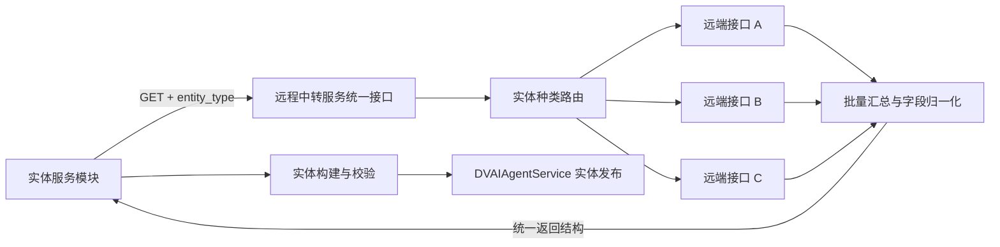
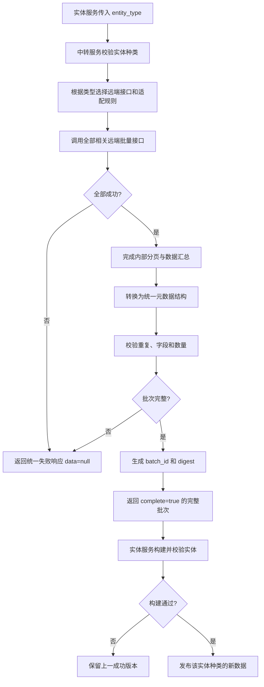
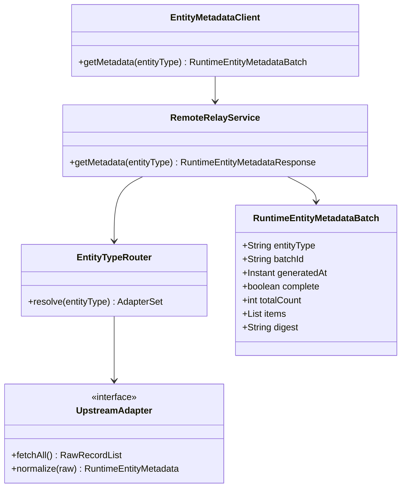

Exit code: 0
Wall time: 0.7 seconds
Output:
# DVAIAgentService 运行时实体构建元数据接口设计

最后更新：2026-07-20
状态：设计草案，待评审

## 1. 设计结论

实体服务模块只感知一个统一 GET 接口，并且只传入需要获取的实体种类：

`GET /v1/runtime/entity-metadata?entity_type={entity_type}`

远程中转服务根据 `entity_type` 识别数据来源、调用对应远端接口、完成批量获取、分页收敛、字段转换和结果汇总，最终向实体服务返回统一结构。

实体服务模块不感知：

- 上游来源系统及接口地址；
- 一个实体种类对应一个还是多个远端接口；
- 上游认证、协议、分页和重试方式；
- 上游原始字段名和数据合并规则；
- Oracle、GAUSS 或其他来源存储实现。

实体服务只感知：

- 请求的 `entity_type`；
- 统一的实体构建元数据列表；
- 本次批量结果是否完整、可用于构建；
- 稳定的错误码和批次标识。

## 2. 设计目标与边界

### 2.1 设计目标

- 将多个批量数据接口收敛为一个统一运行时接口；
- 实体种类是实体服务与中转服务之间唯一的业务路由条件；
- 中转服务屏蔽不同远端接口的字段、协议和分页差异；
- 返回值可直接转换为实体构建输入；
- 任何来源失败或批量数据不完整时禁止覆盖上一成功实体数据。

### 2.2 不属于本接口的职责

- AC/STRIN 实体匹配；
- 实体查询和详情查询；
- 实体数据库发布；
- 实体种类的业务配置维护；
- 向实体服务暴露来源接口注册表或路由信息。

## 3. 总体架构



### 3.1 组件职责

| 组件 | 职责 |
| --- | --- |
| 实体服务模块 | 按实体种类发起请求，校验统一返回结构，构建并发布实体 |
| 远程中转服务 | 识别实体种类，路由远端接口，处理认证、分页、重试、聚合和字段转换 |
| 远端业务服务 | 提供各自领域的原始批量数据 |
| DVAIAgentService | 接收校验通过的完整实体集合并完成原子发布 |

### 3.2 依赖方向

实体服务只能依赖统一接口契约，禁止依赖某个远端业务服务的 DTO、URL、字段名或客户端。新增远端接口时，只允许修改中转服务的路由和适配配置，不修改实体服务调用逻辑。

## 4. 统一接口设计

### 4.1 接口定义

| 项目 | 设计 |
| --- | --- |
| HTTP Method | `GET` |
| Path | `/v1/runtime/entity-metadata` |
| 业务参数 | `entity_type` |
| 返回类型 | `RuntimeEntityMetadataResponse` |
| 调用方式 | 一个实体种类一次请求 |
| 数据语义 | 指定实体种类的完整、统一批量结果 |

### 4.2 请求参数

| 参数 | 位置 | 类型 | 必填 | 约束 |
| --- | --- | --- | --- | --- |
| `entity_type` | query | string | 是 | 单个实体种类，1～64 字符，必须来自双方确认的枚举 |
| `X-Request-ID` | header | string | 否 | 链路追踪字段，不属于业务路由参数 |

请求示例：

```http
GET /v1/runtime/entity-metadata?entity_type=alarm
Accept: application/json
X-Request-ID: req-20260720-000042
```

接口不接受来源系统名称、远端接口编号、URL、分页游标、数据库类型或多个实体种类数组。

### 4.3 实体种类枚举

首期枚举以实际业务确认结果为准，设计示例如下：

| `entity_type` | 含义 |
| --- | --- |
| `alarm` | 告警类型实体 |
| `network_element` | 网元实体 |
| `kpi` | KPI/性能指标实体 |
| `topology` | 拓扑或关系实体 |
| `knowledge` | 知识、案例或 Runbook 实体 |

实体种类枚举是双方接口契约的一部分。中转服务不得把未知类型静默映射为其他类型；实体服务也不得传入来源系统自己的数据分类编码。

## 5. 返回值结构

### 5.1 返回对象层级

```text
RuntimeEntityMetadataResponse
├── code
├── message
├── request_id
└── data: RuntimeEntityMetadataBatch
    ├── entity_type
    ├── batch_id
    ├── generated_at
    ├── complete
    ├── total_count
    ├── items[]: RuntimeEntityMetadata
    └── digest
```

### 5.2 顶层响应 `RuntimeEntityMetadataResponse`

| 字段 | 类型 | 必填 | 说明 |
| --- | --- | --- | --- |
| `code` | string | 是 | 成功固定为 `0`；失败返回稳定错误码 |
| `message` | string | 是 | 安全摘要；调用方不得依赖该字段做程序判断 |
| `request_id` | string | 是 | 当前请求追踪 ID |
| `data` | `RuntimeEntityMetadataBatch/null` | 是 | 成功时返回批量结果；失败时固定为 `null` |

### 5.3 批量结果 `RuntimeEntityMetadataBatch`

| 字段 | 类型 | 必填 | 说明 |
| --- | --- | --- | --- |
| `entity_type` | string | 是 | 必须与请求参数完全一致 |
| `batch_id` | string | 是 | 中转服务生成的本次完整批次标识，用于日志、对账和幂等判断 |
| `generated_at` | string(date-time) | 是 | 批次完成时间，RFC 3339 且必须带时区 |
| `complete` | boolean | 是 | 是否取得该实体种类的完整数据；HTTP 200 时必须为 `true` |
| `total_count` | integer | 是 | 本批次记录总数，必须等于 `items.length` |
| `items` | `RuntimeEntityMetadata[]` | 是 | 统一实体构建元数据，允许空数组但禁止 `null` |
| `digest` | string/null | 是 | 规范化批量内容摘要，推荐 `sha256:<hex>`；不支持时返回 `null` |

中转服务内部即使调用多个远端接口或执行多次分页，也必须在全部成功后才返回 `complete=true`。任何子接口失败、超时、解析失败或数据冲突，都不能以成功响应返回部分 `items`。

### 5.4 单条记录 `RuntimeEntityMetadata`

单条记录已经由中转服务转换为统一结构，不包含来源系统专属字段。

| 字段 | 类型 | 必填 | 约束与含义 |
| --- | --- | --- | --- |
| `record_id` | string | 是 | 该实体种类下稳定且不可复用的记录标识，1～128 字符 |
| `entity_id` | string/null | 是 | 可以提供全局稳定实体 ID 时填写；否则由实体构建服务确定性生成 |
| `entity_name` | string | 是 | 标准名称，去首尾空白后 1～255 字符 |
| `aliases` | string[] | 是 | 已确认别名，默认 `[]`；不得由描述自动生成 |
| `description` | string/null | 是 | 实体描述；没有时显式返回 `null` |
| `attributes` | object | 是 | 该实体种类的扩展构建属性，默认 `{}` |
| `relationships` | `RuntimeRelationship[]` | 是 | 统一关系信息，默认 `[]` |
| `status` | enum | 是 | `active` 或 `inactive` |
| `updated_at` | string(date-time) | 是 | 记录最近更新时间，RFC 3339 且带时区 |

`entity_type` 不在每条 `items` 中重复返回，以批量对象中的 `entity_type` 为准。这样可以确保一次响应只对应一个实体种类，也避免记录级类型与请求类型不一致。

### 5.5 关系对象 `RuntimeRelationship`

| 字段 | 类型 | 必填 | 说明 |
| --- | --- | --- | --- |
| `relationship_type` | string | 是 | 双方约定的统一关系类型 |
| `target_entity_type` | string | 是 | 目标实体种类 |
| `target_record_id` | string/null | 是 | 目标记录 ID |
| `target_entity_id` | string/null | 是 | 已知目标实体 ID 时填写 |
| `attributes` | object | 是 | 关系属性，默认 `{}` |

`target_record_id` 与 `target_entity_id` 至少一个非空。两者同时存在时必须能够解析为同一目标实体。

## 6. 成功返回示例

```json
{
  "code": "0",
  "message": "success",
  "request_id": "req-20260720-000042",
  "data": {
    "entity_type": "alarm",
    "batch_id": "alarm-20260720T090000-73f5",
    "generated_at": "2026-07-20T09:00:00+08:00",
    "complete": true,
    "total_count": 2,
    "items": [
      {
        "record_id": "alarm-type-51020",
        "entity_id": "DV-ALM-51020",
        "entity_name": "ALM-51020",
        "aliases": ["链路中断告警"],
        "description": "传输链路中断告警类型",
        "attributes": {
          "severity": "major",
          "domain": "transport"
        },
        "relationships": [],
        "status": "active",
        "updated_at": "2026-07-20T08:42:11+08:00"
      },
      {
        "record_id": "alarm-type-51021",
        "entity_id": "DV-ALM-51021",
        "entity_name": "ALM-51021",
        "aliases": [],
        "description": null,
        "attributes": {
          "severity": "minor",
          "domain": "transport"
        },
        "relationships": [],
        "status": "active",
        "updated_at": "2026-07-20T08:43:02+08:00"
      }
    ],
    "digest": "sha256:4f18a2..."
  }
}
```

## 7. 空批次语义

合法空结果的返回结构为：

```json
{
  "code": "0",
  "message": "success",
  "request_id": "req-20260720-000043",
  "data": {
    "entity_type": "knowledge",
    "batch_id": "knowledge-20260720T090100-11ab",
    "generated_at": "2026-07-20T09:01:00+08:00",
    "complete": true,
    "total_count": 0,
    "items": [],
    "digest": "sha256:e3b0c4..."
  }
}
```

由于接口表达完整批量数据，空批次可能导致删除该种类的全部现有实体。实体服务默认不得自动发布空批次，必须由配置显式允许或由人工确认。

## 8. 错误返回

失败时 `data` 固定为 `null`：

```json
{
  "code": "upstream_batch_incomplete",
  "message": "The requested entity metadata batch could not be completed.",
  "request_id": "req-20260720-000099",
  "data": null
}
```

| HTTP | `code` | 可重试 | 说明 |
| --- | --- | --- | --- |
| 400 | `invalid_entity_type` | 否 | 实体种类为空、格式错误或不受支持 |
| 401 | `unauthorized` | 否 | 实体服务身份认证失败 |
| 403 | `forbidden` | 否 | 无权读取该实体种类 |
| 409 | `metadata_conflict` | 否 | 多来源合并后存在记录或关键字段冲突 |
| 429 | `rate_limited` | 是 | 按 `Retry-After` 退避 |
| 502 | `upstream_response_invalid` | 是 | 远端返回无法解析或不满足映射规则 |
| 503 | `upstream_batch_incomplete` | 是 | 一个或多个远端接口失败，无法形成完整批次 |
| 504 | `upstream_timeout` | 是 | 远端批量获取超时 |
| 500 | `runtime_metadata_internal_error` | 是 | 中转服务内部错误 |

实体服务只识别统一错误码，不感知是哪个远端接口失败。具体来源错误只能记录在中转服务内部安全日志中。

## 9. 处理活动图



## 10. 类图



实体服务侧只需要实现 `EntityMetadataClient.getMetadata(entityType)`，不包含 `UpstreamAdapter` 或来源路由实现。

## 11. 字段映射到标准实体

| 统一返回字段 | 标准实体字段 | 实体服务处理规则 |
| --- | --- | --- |
| 批次 `entity_type` | `entity_type` | 应用到该批次全部记录 |
| `entity_id` | `entity_id` | 非空时采用；为空时由 `entity_type + record_id` 确定性生成 |
| `entity_name` | `entity_name` | 校验长度和非空 |
| `aliases` | `alias` | 按规范化值去重，不自动生成 |
| `description` | `desc` | 按标准实体空值规则转换 |
| `attributes` | `attributes` | 按实体种类 schema 校验 |
| `relationships` | `relationships` | 解析目标并校验完整性 |
| `status` | 无 | 只有 `active` 记录进入当前发布集合 |
| `updated_at` | 无 | 仅用于构建诊断，不写入实体业务字段 |

## 12. 中转服务统一处理规则

中转服务必须：

1. 维护 `entity_type -> 远端接口及适配器` 的内部映射；
2. 完成远端认证、限流、重试、分页和超时控制；
3. 将所有远端原始字段转换为本文统一结构；
4. 合并同一实体种类下多个远端接口的结果；
5. 校验 `record_id` 唯一性和关键字段冲突；
6. 只有所有必需远端接口成功时才返回 `complete=true`；
7. 对实体服务隐藏远端 URL、来源名称、游标和原始错误体；
8. 新增或替换远端接口时保持实体服务接口不变。

## 13. 实体服务校验规则

实体服务必须：

1. 校验响应 `entity_type` 与请求值完全一致；
2. 校验 `complete=true`；
3. 校验 `total_count == items.length`；
4. 校验 `record_id` 在当前批次唯一；
5. 校验生成后的 `entity_id` 全局唯一；
6. 校验标准名和别名归一化后不存在跨实体冲突；
7. 校验关系目标能够解析；
8. 任一校验失败时拒绝发布，并保留该种类上一成功数据；
9. 对空批次执行额外保护，禁止未经授权清空实体种类。

## 14. DFX 设计

| 维度 | 设计要求 |
| --- | --- |
| 性能 | 单次返回一个实体种类的完整批次；大批量响应应支持 HTTP 压缩和流式解析 |
| 可用性 | 中转服务负责远端重试；实体服务不得针对来源实现特殊重试逻辑 |
| 一致性 | `complete=true` 表示完整批次；部分结果不以成功返回 |
| 可靠性 | 构建或调用失败保留上一成功数据，不发布空数据或半成品 |
| 安全 | TLS、服务身份认证、最小权限；双方日志不得输出凭据或完整敏感 payload |
| 可观测性 | 记录实体种类、request ID、batch ID、数量、摘要、耗时和统一错误码 |
| 可扩展性 | 新增实体种类或远端接口主要修改中转服务路由和 Adapter |
| 可维护性 | 实体服务客户端只有一个方法；不同来源差异不进入实体领域代码 |
| 兼容性 | 新增可选字段可兼容；删除、改名或语义变化必须升级接口版本 |
| 可测试性 | 按实体种类提供固定 fixture，覆盖成功、空批次、冲突、超时和部分来源失败 |

接口性能目标需要结合最大实体种类数据量确认。若完整批次超过网关响应大小或超时上限，应由中转服务提供文件/流式传输能力，但实体服务的业务入参仍然只能是 `entity_type`，不得暴露远端分页参数。

## 15. 设计约束

- 实体服务只调用一个 GET 接口；
- 业务请求参数只有单个 `entity_type`；
- 一次请求只返回一种实体；
- `entity_type` 同时承担业务选择和中转路由语义；
- 中转服务对外必须返回统一 DTO；
- 中转服务内部来源数量和实现对实体服务透明；
- 数组字段永不返回 `null`，对象无值返回 `{}`，可空标量显式返回 `null`；
- 时间统一使用带时区的 RFC 3339；
- 调用方只根据 HTTP 状态和 `code` 判断，不解析 `message`；
- 返回顺序必须稳定，建议按 `record_id` 升序；
- GET 请求不得携带 body；
- `entity_type` 不得传逗号分隔的多个值；
- `complete=false` 不得与 HTTP 200 同时出现；不完整批次必须返回错误；
- 单次响应为空不等于来源异常，但默认禁止据此清空已发布数据。

## 16. 验收要求

| 编号 | 验收项 |
| --- | --- |
| AC-RUNTIME-001 | 实体服务只配置一个中转服务地址和一个 GET 客户端方法 |
| AC-RUNTIME-002 | 请求只传入一个合法 `entity_type` |
| AC-RUNTIME-003 | 一个类型对应多个远端接口时，由中转服务完成调用与汇总 |
| AC-RUNTIME-004 | 实体服务代码和日志不出现远端 URL、来源名称或分页游标 |
| AC-RUNTIME-005 | 返回 `entity_type`、数量和 items 一致 |
| AC-RUNTIME-006 | 任一必需远端接口失败时返回统一错误且 `data=null` |
| AC-RUNTIME-007 | 中转服务不向实体服务返回部分成功批次 |
| AC-RUNTIME-008 | 重复记录、字段冲突和无效结构被拒绝 |
| AC-RUNTIME-009 | 空批次保护可以阻止误清空某类实体 |
| AC-RUNTIME-010 | 构建失败时保留该实体种类上一成功版本 |

## 17. 待确认项

- 正式接口路径和中转服务 owner；
- `entity_type` 正式枚举及命名规范；
- 各实体种类的 `attributes` 和关系 schema；
- `entity_id` 由中转服务提供还是由实体服务生成；
- 单个实体种类的最大记录数和响应体大小；
- 网关超时、压缩方式及是否支持流式响应；
- 中转服务内部多来源合并优先级；
- 空批次的授权和人工确认机制；
- `digest` 的规范化和计算算法。

