# 实体服务与智能召回设计说明书

## 1. 文档目的与背景

本文定义一个可独立部署的实体服务：以在线实体召回与链接为核心，并从运行时系统与知识库拉取实体数据，完成校验、合并、入库和检索投影生成。它用于把当前实体能力迁移到新的微服务中，保留已验证的实体链接语义，同时使构建、存储与查询职责可独立演进。

当前业务中的实体来自多个外部接口，数据会持续变化；调用方又需要以自然语言查询召回 mention 和关联实体。若让查询模块直接依赖来源接口、数据库或 HTTP 实现，会带来时延、耦合、数据不一致和迁移困难。因此本设计采用“离线构建发布 + 在线只读召回”的模型：构建链路只在启动或受控调度时运行，在线链路只读取已发布的权威实体数据。

### 1.1 目标

- 以统一实体模型承接运行时数据和知识库数据，并批量、原子地发布。
- 保证一次发布中的实体、别名和检索词投影一致；任何关键冲突均拒绝发布。
- 提供简单的查询入口：原始 `query` 为必填，`use_llm`、`top_k` 为可选覆盖项，其余策略由可热加载配置决定。
- 将远程请求封装为常驻共享能力；业务组件只声明 URL、方法、参数和请求体。
- 将一次构建任务与定时刷新任务分离；一个来源失败不得中断其他来源，也不得破坏已发布数据。
- 支持未来将构建能力整体迁移到承载数据库的实体服务中，而不改变查询调用方。

### 1.2 非目标

- 不让查询模块直连数据库、执行 SQL 或直接访问外部来源。
- 不将来源、采集时间、快照标识等运行元数据写入实体业务字段。
- 不自动从描述、属性或关系中猜测别名；只有标准名和已确认别名参与默认召回。
- 不在未具备分布式协调能力时承诺多实例的全局唯一调度。
- 不将自由文本、凭据、完整 URL 或完整上游报文写入日志、诊断或查询结果。

## 2. 总体方案

### 2.1 核心原则

1. **查询召回是核心**：在线请求必须完整执行 P1–P11，数据库词命中只是候选证据，不能直接产生链接结论。
2. **远程数据边界**：P4/P9 只通过 Entity Data Client 调用远程 `DVAIAgentService`，module 不直连数据库。
3. **候选先于详情**：先完成 mention 合并、候选生成和消歧，再批量读取 P8 后仍保留的候选详情。
4. **权威数据唯一**：远程实体表是权威来源，实体词表是可重建的检索投影。
5. **构建是数据维护旁路**：构建和发布不参与在线 query，只负责更新查询所需的权威数据。
6. **完整校验后发布**：候选实体集合未全部通过校验时，不替换已发布数据。
7. **原子组件**：查询、来源适配、构建校验、发布、调度和请求工具分别依赖抽象端口。
8. **失败封闭**：查询依赖失败不伪装成无匹配；构建字段、词或关系冲突拒绝发布。

### 2.2 逻辑架构

逻辑架构以在线查询为主链。实体构建位于数据维护旁路，只负责保证远程 `DVAIAgentService` 中的权威数据和词投影持续可用，不参与单次 query 的运行时编排。

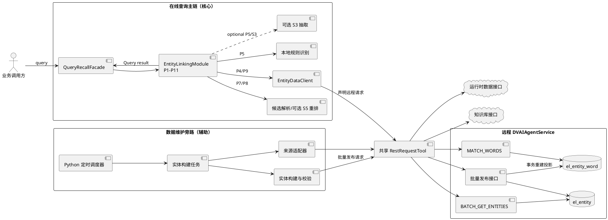

### 2.3 组件职责

| 组件 | 职责 | 不负责 |
| --- | --- | --- |
| 查询召回门面 | 接收简单查询参数、加载策略、投影兼容结果。 | 数据构建、来源拉取、数据库连接。 |
| 实体链接器 | 编排 P1–P11，完成 mention 识别、合并、候选确认、详情读取和状态聚合。 | 直连数据库、写入实体或维护词表。 |
| Entity Data Client | 将 P4/P9 映射为远程 `MATCH_WORDS` / `BATCH_GET_ENTITIES` 请求，并校验响应。 | SQL、数据库连接、mention 决策。 |
| 共享请求工具 | 执行 HTTP/平台内部调用、超时、有限重试、响应解码、安全错误分类。 | 业务字段映射、候选决策、数据库写入。 |
| `DVAIAgentService` | 在数据库中执行词召回和详情批读，维护权威实体与词投影。 | Query span 恢复、重叠消除、候选消歧和状态聚合。 |
| 来源适配器 | 按统一分页协议拉取数据并映射为实体对象。 | 在线 query 召回、合并多来源、发布、调度。 |
| 实体构建器 | 校验 schema、去重、合并、词冲突和关系完整性检查。 | 在线 query 召回、网络请求、持久化细节。 |
| 任务编排器 | 区分一次/定时任务、接口隔离、缓存最近成功结果、汇总发布。 | 在线 query 编排或决定集群 leader。 |
| 批量发布端口 | 对候选实体集做事务写入、投影重建、对账和原子切换。 | mention 识别和自然语言消歧。 |

## 3. 核心：在线实体召回与链接设计

### 3.1 核心定位

在线实体召回不是“数据库匹配到一个词后立即读取实体并返回”。数据库只提供已知实体词证据，最终结果由 Python module 完成多源识别、原文 span 恢复、mention 合并、类型判断、候选生成、排序、消歧、详情读取和状态聚合。

最终主链固定为：

```text
P1 请求校验
→ P2 是否需要链接
→ P3 Query 归一化与原文位置映射
→ 并行执行 P4 已知词召回、P5 本地识别/可选抽取
→ P6 已知词原文恢复与边界/上下文确认
→ P7 多源 mention 合并与非重叠选择
→ P8 候选生成、类型过滤、排序与消歧
→ P9 仅对消歧后保留的候选批量读取实体详情
→ P10 生成 mention 级结果
→ P11 聚合 Query 级状态与安全 trace
```

任何实现都不得简化为 `MATCH_WORDS → BATCH_GET_ENTITIES → linked`。

### 3.2 P1–P11 阶段定义

| 阶段 | 输入 | 处理与输出 | 强制约束 |
| --- | --- | --- | --- |
| P1 请求校验 | 原始 query | 合法请求或 `invalid_input`。 | 空白或无有效内容时不得访问远端服务。 |
| P2 是否需要链接 | 原始 query | bypass 或继续。 | 明确无需链接时返回 `not_required`，不得调用词匹配。 |
| P3 归一化 | 原始 query | `normalized_text` 和归一化位置到原文位置的映射。 | 归一化文本只用于召回，不能作为用户可见 mention。 |
| P4 远程已知词召回 | normalized query、可选类型提示 | 通过 `EntityDataClient` 调用远程 `DVAIAgentService.MATCH_WORDS`，返回 `EntityWordMatch[]` 和数据一致性标识。 | module 不直连数据库；`DVAIAgentService` 内部查询 `el_entity_word`。P4 与 P5 并行，每个 query 最多调用一次。 |
| P5 本地识别 | 原始 query、安全上下文、可选类型提示 | 正则/未知实体形态 mention，以及合法的可选抽取 mention。 | P5 必须在 P4 完成前已启动；数据库 miss 不能阻止本地识别。 |
| P6 已知词恢复与确认 | P4 命中、位置映射 | 原文 mention/span 和词级证据。 | 枚举全部出现位置，应用 `match_mode`、边界和上下文规则。 |
| P7 合并与选择 | P5/P6 mention | 非重叠 mention 集合。 | 同起点优先更长词，再结合优先级；unknown mention 不得静默丢弃。 |
| P8 候选生成与消歧 | mention、词证据、类型证据 | 唯一候选、Top-K 歧义候选或无候选。 | 必须在 P9 前完成；可选重排只能选择已有候选 ID。 |
| P9 详情读取 | P8 后仍保留的全部候选 ID | 权威实体详情。 | 每个 query 最多一次 `BATCH_GET_ENTITIES`；包括 Top-K 歧义候选，不包括被过滤候选和 local-only unknown。 |
| P10 mention 结果 | mention、候选、实体详情 | `linked`、`ambiguous` 或 `no_match` mention。 | 详情缺失或数据不一致时返回依赖失败，不能伪造实体。 |
| P11 Query 聚合 | 全部 mention 结果 | Query 状态、顶层候选、降级信息和安全 trace。 | 必须保留 mention 级差异，不能用单个成功覆盖其余未命中或歧义。 |

### 3.3 最终召回活动图

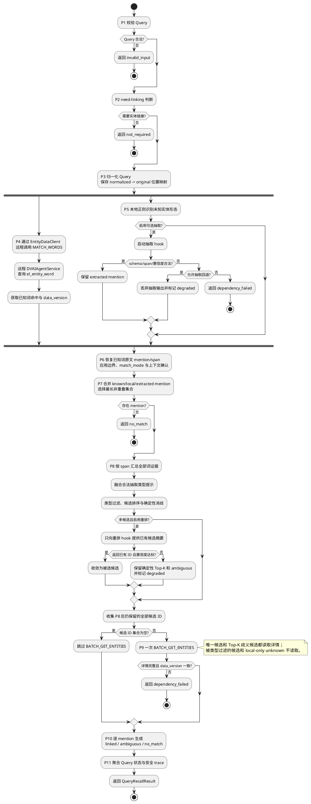

### 3.4 P4/P5 并发识别设计

P4 与 P5 是真正独立的识别支路。实现必须先启动 P5 的本地规则和可选抽取任务，再由 `EntityDataClient` 通过共享请求工具调用远程 `DVAIAgentService.MATCH_WORDS`，随后等待本地任务完成。数据库查询发生在 `DVAIAgentService` 内部，linking module 不持有数据库连接、SQL 或 ORM。P6 只能在 P4 返回后恢复已知词 span，P7 是两个支路唯一的正式汇合点。

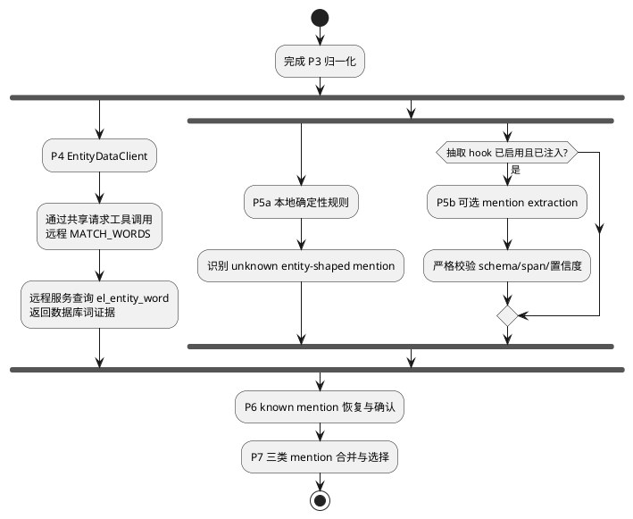

并发验收不能只检查最终响应或 module 自身 trace。测试 client 必须观测到：`MATCH_WORDS` 执行时可选抽取已经启动；数据库返回空结果时本地规则仍能产出 unknown/no-match mention。

### 3.5 P6 原文恢复、边界与上下文确认

词匹配响应只是数据库候选证据。P6 必须基于 `NormalizedQuery` 的位置映射，把每个命中词在归一化 query 中的所有出现位置恢复为原始 query 的 `[start, end)` span，并使用原始文本构造 mention。

| 字段/规则 | 用途 |
| --- | --- |
| `entity_word` | 恢复原始 mention 的词级证据。 |
| `normalized_key` | 校验、去重和映射，不能直接展示给用户。 |
| `match_mode` | `EXACT_WORD`、`STRUCTURED_TOKEN` 或 `CONTEXT_REQUIRED`。 |
| `min_context_required` | 强制进行上下文确认。 |
| `context_keywords` | 上下文确认允许的关键词。 |
| `priority` | 同位置候选的排序辅助信息。 |

结构化实体必须通过完整 token 边界校验，不能让 `ALM-5102` 命中 `ALM-51020`。普通短词或 `CONTEXT_REQUIRED` 词条没有有效上下文时不得进入已知 mention 集合。

### 3.6 P7 mention 合并与选择

P7 合并三类输入：

- P6 恢复并确认的数据库已知词 mention；
- P5 本地规则识别的未知实体形态 mention；
- 通过 schema、span 和置信度校验的可选抽取 mention。

相同 span 的多条已知词记录不能提前丢失，因为它们可能指向不同类型或实体 ID，必须作为 P8 的完整候选证据。mention 选择负责去重和重叠消除，不负责提前读取详情或强制选择实体。选择顺序保持原文起点、同起点更长优先，并结合已确认的 priority；未知 mention 即使没有数据库候选也必须进入 P10 形成 `no_match`。

### 3.7 P8 候选生成、类型过滤与双 hook 边界

P8 在详情读取之前完成全部候选决策：

1. 按 mention span 汇总 P4/P6 的全部 `EntityWordMatch`。
2. 将通过校验的抽取 `predicted_type` 作为类型线索；低置信、非法 span 或异常输出不得参与过滤。
3. 由类型解析器过滤不符合有效类型证据的候选。
4. 由候选解析器按实体 ID、类型、来源、priority 和词证据生成确定性有序候选。
5. 零候选保留为 local-only `no_match`；一候选进入唯一链接路径；多候选保留为 Top-K 歧义。
6. 多候选且重排 hook 可用时，允许从输入候选 ID 中选择一个；不得创建新 ID、别名或读取完整实体详情。

两个可选 LLM hook 的语义完全不同：

| Hook | 执行位置 | 允许输出 | 失败规则 |
| --- | --- | --- | --- |
| S3 mention extraction | P5，与 P4 并行。 | 可回映原文的 mention、span、预测类型和置信度。 | `allow_fallback=true` 时丢弃输出继续确定性路径；否则返回 `dependency_failed`。 |
| S5 candidate rerank | P8，且确定性候选数大于 1。 | 输入候选中的一个 ID、置信度和理由。 | 无论 `allow_fallback` 如何，均保留确定性 Top-K 与 `ambiguous`，并标记降级。 |

### 3.8 P9 详情读取与一致性

P9 的输入不是 P4 的原始命中 ID，而是 P8 消歧后仍然保留的候选 ID 去重集合：

- 唯一候选进入集合；
- 尚未收敛的 Top-K 歧义候选全部进入集合，以便 P10 返回可解释候选详情；
- 被类型过滤或重排排除的 ID 不进入集合；
- local-only unknown、无候选 mention 不进入集合；
- 集合为空时不得调用 `BATCH_GET_ENTITIES`。

P4 返回的 `data_version` 必须作为 P9 的 `expected_data_version`。详情响应版本不一致、缺失任何请求 ID 或返回记录不完整时，整个 query 返回 `dependency_failed`，不能混用两份数据，也不能把实体缺失转成 `no_match`。

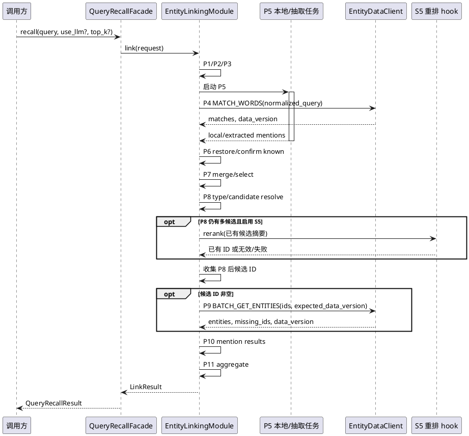

### 3.9 P10/P11 状态语义

| 状态 | 形成条件 | 处理要求 |
| --- | --- | --- |
| `linked` | 所有保留 mention 都有且仅有一个候选，并取得一致的权威详情。 | 返回 mention 原文、span、实体和单一候选证据。 |
| `partial` | 至少一个 mention 为 `linked`，同时存在 `ambiguous`、`no_match` 或降级 mention。 | 调用方必须逐 mention 处理，不能把整个 query 当作成功或失败。 |
| `ambiguous` | 没有 linked mention，至少一个 mention 在 P8 后仍有多个候选。 | 返回确定性有序候选及详情，不强制 Top-1。 |
| `no_match` | P7 无 mention，或保留 mention 在 P8 后无候选。 | local-only unknown 仍保留 mention 原文与 span。 |
| `not_required` | P2 判定无需链接。 | 不访问 `DVAIAgentService`。 |
| `invalid_input` | P1/P3 判定输入无效。 | 不访问 `DVAIAgentService`。 |
| `dependency_failed` | P4/P9 数据服务失败、详情缺失或数据不一致；或严格模式下 S3 失败。 | 不得伪装为 `no_match`。 |

Query 顶层 candidates 是 mention 候选的安全聚合；`top_k` 只在门面投影结果时限制候选数量，不能改变 P8 的安全消歧结论或让歧义强制变成 `linked`。

### 3.10 最终流程验收约束

以下是迁移后必须通过的黑盒反例：

| 场景 | 外部边界必须观测到的行为 |
| --- | --- |
| 可选抽取与数据库召回并行 | `MATCH_WORDS` 被调用时，抽取任务已经启动。 |
| 同 span 存在跨类型候选，抽取提供合法类型线索 | P8 先过滤候选，P9 只读取过滤后 ID。 |
| 数据库空命中、本地规则识别未知实体 | 返回 local-only `no_match` mention，且 P9 零调用。 |
| 重排返回新 ID、低置信、非法 schema 或超时 | 保留确定性 Top-K、返回 `ambiguous`，不读取新 ID。 |
| 歧义候选未被收敛 | P9 读取 P8 后全部 Top-K ID，以便返回候选详情。 |
| P9 详情缺失或数据版本不一致 | 返回 `dependency_failed`，不降级成 `no_match`。 |
| 无链接意图 | P4/P9 都不调用。 |

安全 trace 仅记录阶段、状态、数量、降级原因和数据一致性摘要；不得记录凭据、IR URL、完整 query、完整上游 payload 或未安全投影的实体属性。

## 4. 实体构建设计

### 4.1 统一实体模型

构建链路中的实体对象仅使用以下字段；不得附加来源、快照、采集时间、内部 canonical 标记等字段。

| 字段 | 类型 | 约束 |
| --- | --- | --- |
| `entity_id` | string | 必填、非空、稳定唯一标识。 |
| `entity_type` | string | 必填、非空，必须属于部署允许的类型集合。 |
| `entity_name` | string | 必填、非空，作为标准展示名称和词投影来源。 |
| `alias` | string[] | 可选，默认 `[]`；仅确认别名可参与投影。 |
| `desc` | string | 可选，默认空字符串；不参与匹配。 |
| `attributes` | object | 可选，默认 `{}`；必须为安全 JSON 数据。 |
| `relationships` | object[] | 可选，默认 `[]`；每项含 `relation_type`、`target_entity_id`。 |

来源元数据仅保存在配置、调度报告、审计日志或独立运维表中，不能污染以上实体对象。这样实体数据可以不依赖采集方式而迁移和复用。

### 4.2 来源与分页协议

所有可配置来源使用同一读协议。调用使用 `GET`，请求参数如下：

| 参数 | 必填 | 说明 |
| --- | --- | --- |
| `page_size` | 是 | 单页数量，范围建议 1–1000。 |
| `cursor` | 否 | 首页不传；后续请求使用上页返回的游标。 |

响应必须为：

```json
{
  "items": [
    {
      "entity_id": "DV-ALM-001",
      "entity_type": "alarm",
      "entity_name": "ALM-51020",
      "alias": ["51020"],
      "desc": "告警实体",
      "attributes": {},
      "relationships": []
    }
  ],
  "has_more": true,
  "next_cursor": "opaque-token"
}
```

处理规则：

- `items` 必须是对象数组，`has_more` 必须是布尔值。
- `has_more=true` 时 `next_cursor` 必须是非空字符串；否则该接口本轮失败。
- 游标是不透明值，只能原样透传，不能拼接、解析或猜测。
- 单页失败、超时或返回体不合规时，终止该接口本轮拉取，不把已拉取的半页集合用于发布。
- 新增同构接口只需在配置中增加 `{name, url}`，无需新增适配器或调度分支。

示例配置：

```json
{
  "entity_build": {
    "page_size": 100,
    "retry_count": 2,
    "once_endpoints": [
      {"name": "knowledge-bootstrap", "url": "${KNOWLEDGE_ENTITY_URL}"}
    ],
    "daily_endpoints": [
      {"name": "runtime-entities", "url": "${RUNTIME_ENTITY_URL}"},
      {"name": "knowledge-delta", "url": "${KNOWLEDGE_DELTA_URL}"}
    ]
  }
}
```

URL 和认证信息必须来自密钥管理或部署配置；配置文件、日志和构建报告只允许展示来源名称和脱敏后的状态。

### 4.3 校验、合并与冲突处理

构建器在内存中生成完整候选集合，按照以下顺序处理：

```text
来源分页拉取
  → 单实体 schema 校验
  → 按 entity_id 合并
  → 关系目标完整性校验
  → 标准名与确认别名归一化
  → 同实体去重
  → 跨实体词冲突校验
  → 批量发布
```

| 规则 | 结果 |
| --- | --- |
| 相同 `entity_id` 的完整对象完全相同 | 去重，保留一条。 |
| 相同 `entity_id` 但任一业务字段不同 | 拒绝整批，错误 `canonical_conflict`。 |
| 必填字段空缺、alias 非字符串数组、JSON 结构非法 | 拒绝整批，错误 `source_schema_invalid` 或 `missing_required_field`。 |
| 关系目标不在同一候选集合 | 拒绝整批，错误 `relationship_target_missing`。 |
| 不同有效实体产生相同归一化词 | 拒绝整批，错误 `entity_word_conflict`。 |
| 描述、属性、关系被当作别名 | 不生成词条；若来源试图显式投影则拒绝。 |

归一化规则应固定为 Unicode NFKC、大小写折叠并移除 Unicode 空白。标准名和确认别名生成的有效归一化词必须在所有有效实体中一对一映射。若未来需要“同词多实体”，须先扩展候选消歧模型、接口结果与验收用例，不能先放松唯一约束。

### 4.4 一次任务与定时任务

| 任务类型 | 触发方式 | 数据处理 |
| --- | --- | --- |
| `once` | 服务启动或人工显式调用。 | 成功结果缓存，作为后续完整集合的一部分。 |
| `daily` | 由服务内 Python 调度器触发。 | 拉取最新数据；成功接口替换其缓存，失败接口保留最近成功缓存。 |

一次任务与定时任务必须独立注册。一次任务不应被每日调度重复执行；定时任务新增接口只增加配置项。每个接口是最小隔离单元：一个接口失败后继续执行后续接口。若存在成功更新，则用“已缓存成功数据 + 本轮成功更新”重建完整集合并发布，整轮报告为 `partial`；若所有接口失败且没有可用缓存，则报告 `failed`，不发布任何数据。

### 4.5 调度与并发控制

默认调度为 `Asia/Shanghai` 时区每日 `00:00`。服务启动时由 Python 生命周期组件显式启动 `DailyRefreshScheduler` 的后台守护线程；该线程以可配置的短间隔检查当前时间，到期后调用 `run_daily()`，服务停止时显式 `stop()` 并等待线程退出。调度能力由本服务自身实现，不依赖平台 Cron、外部调度器或人工轮询。状态机如下：

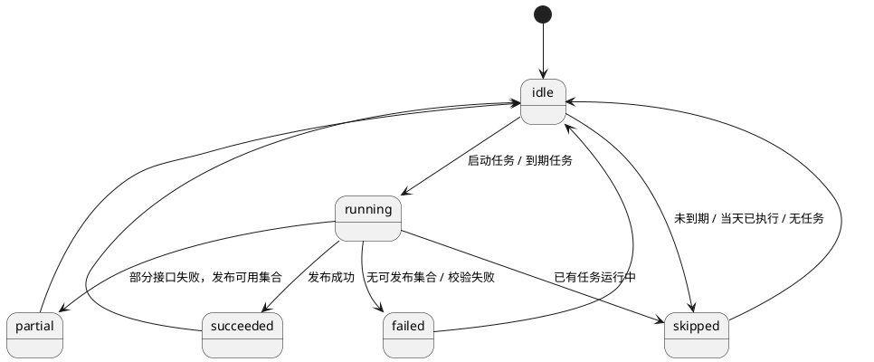

同一进程以互斥锁阻止重叠执行；收到重叠触发时立即返回 `skipped` 和 `refresh_skipped_in_progress`。多实例部署时，每个实例都可运行自身 Python 调度器，但写侧必须通过数据库租约/分布式锁取得 leader；未取得 leader 的实例只提供读服务并跳过本轮写任务。

### 4.6 构建活动图

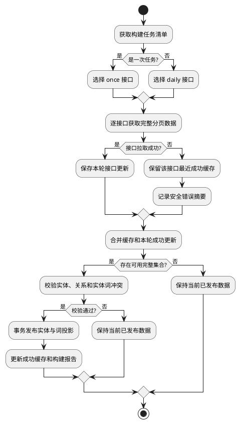

### 4.7 接口隔离并发活动图

接口拉取可并发执行，但构建合并与发布必须串行且单实例互斥。并发数由 Python 线程池或协程信号量限制，防止集中触发来源限流。

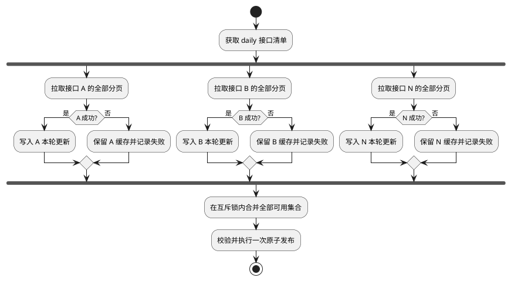

## 5. 4+1 视图

### 5.1 逻辑视图

逻辑视图以查询域为中心：调用方进入 Query Recall Facade，由链接应用服务编排 P1–P11；本地识别组件与远程 Entity Data Client 共同提供候选证据，候选解析完成后再经远程接口读取详情。实体构建域是独立的数据维护旁路，只更新远程 `DVAIAgentService`，不参与在线 query 调用。

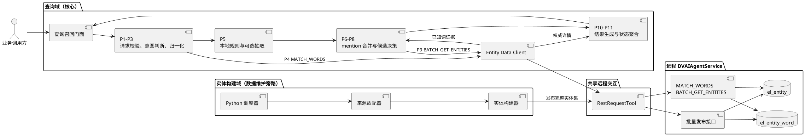

### 5.2 开发视图

推荐按两个边界组织。业务微服务集成当前 module 和可插拔构建组件；数据库 repository、事务和词投影只属于远程 `DVAIAgentService`：

```text
entity-recall-service/
├─ application/          # Query Recall Facade、P1-P11 编排和 DTO
├─ domain/               # 归一化、mention、候选、消歧、状态聚合
├─ infrastructure/
│  ├─ entity_data/       # P4/P9 远程 EntityDataClient adapter
│  ├─ rest/              # 共享请求工具和 transport
│  ├─ source/            # 可插拔构建来源 adapter
│  └─ scheduler/         # Python 定时线程与时钟抽象
├─ entity_build/         # 独立构建插件，可整体迁移
├─ interfaces/           # Query API、健康检查、受控管理接口
└─ config/               # 查询策略和来源声明，不保存秘密

dv-ai-agent-service/      # 独立远程 DVAIAgentService
├─ interfaces/           # MATCH_WORDS、BATCH_GET_ENTITIES、批量发布
├─ application/          # 读写用例与事务边界
└─ infrastructure/
   └─ persistence/       # 数据库 repository、事务和词投影
```

查询召回微服务内的依赖方向只允许 `interfaces → application → domain`，远程适配器实现 domain port。查询模块不能导入构建实现；构建器不能导入 SQL 方言；查询微服务的基础设施只持有远程 transport，不持有数据库连接。数据库连接只存在于 `DVAIAgentService` 的 persistence 实现。

### 5.2.1 类图

```plantuml
@startuml
skinparam classAttributeIconSize 0

interface EntitySource {
  +fetch_entities() : Entity[]
}
interface EntityPublisher {
  +publish(entities, requestId) : PublishResult
}
interface RestTransport {
  +execute(request) : RestResponse
}

class RestRequestTool {
  -transport : RestTransport
  +execute(request : RestRequest) : RestResponse
}
class ConfiguredEndpointSource {
  -tool : RestRequestTool
  -endpoint : EndpointConfig
  +fetch_entities() : Entity[]
}
class EntityConstructionService {
  +build(sources : EntitySource[]) : Entity[]
  -validate(entity)
  -validateRelationships(entities)
  -validateWordConflict(entities)
}
class EntityBuildPlugin {
  -builder : EntityConstructionService
  -publisher : EntityPublisher
  +refresh(entities) : BuildReport
}
class EntityBuildTask {
  +name : string
  +mode : once|daily
  +source : EntitySource
}
class EntityBuildTaskRunner {
  -tasks : EntityBuildTask[]
  -cache : Map
  +run_once() : BuildReport
  +run_daily() : BuildReport
}
class DailyRefreshScheduler {
  -runner : EntityBuildTaskRunner
  -clock : Clock
  -thread : Thread
  +start()
  +stop()
  +run_if_due(now) : BuildReport
}
class QueryRecallFacade {
  +recall(query, useLlm, topK) : QueryRecallResult
}
class EntityLinker {
  +link(query, policy) : LinkResult
  -normalizeAndMap(query)
  -resolveCandidates(mentions)
  -aggregateStatus(mentions)
}
interface EntityDataReader {
  +match_words(normalizedQuery, types) : WordMatchResponse
  +batch_get(entityIds, expectedDataVersion) : EntityResponse
}
interface EntityExtractionEnhancer {
  +extract(query, context, types) : ExtractedMention[]
}
interface CandidateReranker {
  +rerank(query, mention, candidates) : RerankDecision
}
class LinkingIntentPolicy {
  +should_link(query) : bool
}
class KnownMentionRecognizer {
  +recognize(normalizedQuery, wordMatches) : Mention[]
}
class UnknownMentionRecognizer {
  +recognize(query) : Mention[]
}
class MentionSelector {
  +select(mentions) : Mention[]
}
class EntityTypeResolver {
  +filter(matches, mention, typeHints) : WordMatch[]
}
class CandidateResolver {
  +resolve(matches) : Candidate[]
}
class ResultAggregator {
  +status(mentionStatuses, degraded) : string
}

ConfiguredEndpointSource ..|> EntitySource
RestRequestTool --> RestTransport
ConfiguredEndpointSource --> RestRequestTool
EntityBuildTask --> EntitySource
EntityBuildTaskRunner --> EntityBuildTask
EntityBuildTaskRunner --> EntityBuildPlugin
EntityBuildPlugin --> EntityConstructionService
EntityBuildPlugin --> EntityPublisher
DailyRefreshScheduler --> EntityBuildTaskRunner
QueryRecallFacade --> EntityLinker
EntityLinker --> EntityDataReader
EntityLinker --> LinkingIntentPolicy : P2
EntityLinker --> KnownMentionRecognizer : P6
EntityLinker --> UnknownMentionRecognizer : P5
EntityLinker --> MentionSelector : P7
EntityLinker --> EntityTypeResolver : P8
EntityLinker --> CandidateResolver : P8
EntityLinker --> ResultAggregator : P11
EntityLinker ..> EntityExtractionEnhancer : optional S3
EntityLinker ..> CandidateReranker : optional S5
@enduml
```

### 5.3 进程视图

进程视图描述在线 query 的核心交互。实体构建的调度与发布时序见第 4 章，不占据本视图主链。

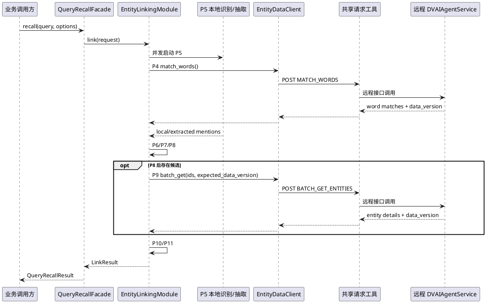

### 5.4 物理部署视图

查询召回 module 部署在业务微服务中，通过远程接口访问 `DVAIAgentService`；数据库只属于 `DVAIAgentService` 私有网络。实体构建能力可以暂时与查询 module 同进程部署，但只能通过批量发布接口更新远程服务，不能绕过接口直连数据库。

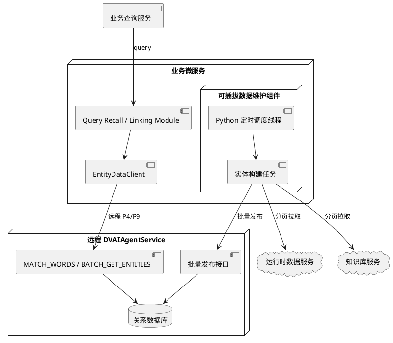

数据库主从、备份、密钥管理、网关鉴权和多实例 leader 均是部署层能力，不能散落在业务代码中。

### 5.5 场景视图：查询召回

1. 调用方提交原始 `query`，可选传递 `use_llm`、`top_k`。
2. 查询门面加载最近有效策略，显式参数优先于配置。
3. 链接器并行完成已知词召回与本地未知形态识别；可选使用 LLM 辅助，但其失败遵循回退策略。
4. 系统在 mention 合并后完成类型过滤、候选生成和可选重排，再批量读取 P8 后仍保留的唯一或 Top-K 歧义候选详情。
5. 返回 `linked`、`partial`、`ambiguous`、`no_match`、`not_required`、`invalid_input` 或 `dependency_failed`，不能把依赖失败伪装为无匹配。

#### 5.5.1 实体召回活动图

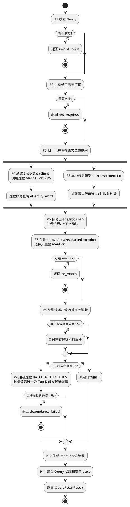

#### 5.5.2 实体召回时序图

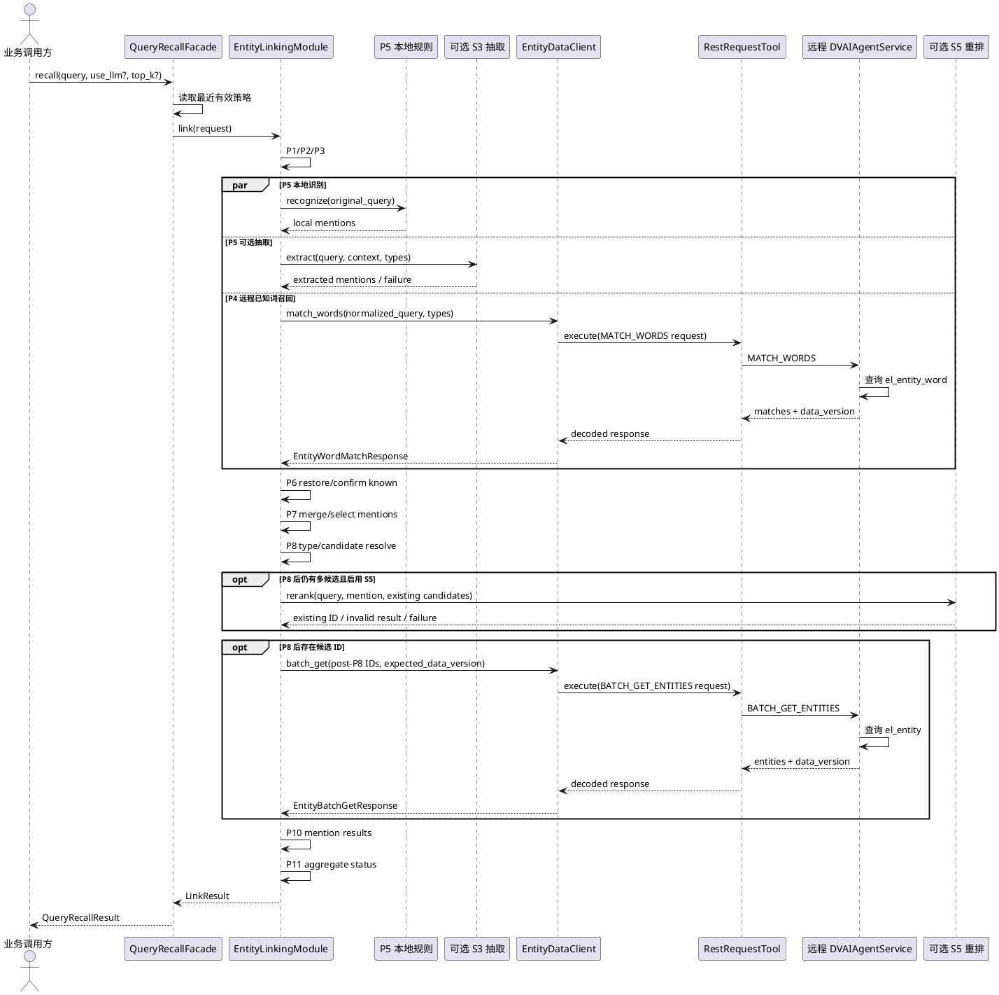

## 6. DFX 设计

| 维度 | 设计措施 | 验收指标 |
| --- | --- | --- |
| 可用性 | 读链路不访问来源接口；上一成功数据保留；构建和来源失败不破坏当前查询。 | 单来源故障时查询持续可用，依赖失败有明确状态。 |
| 可靠性 | P1–P11 顺序固定；P8 后才允许 P9；读版本一致；写侧事务发布。 | 不出现提前详情读取、混合数据或实体表与词表漂移。 |
| 可扩展性 | 同构来源配置化；一次/定时任务独立；端口可替换。 | 新接口只增加配置，不改构建核心代码。 |
| 可维护性 | 分层目录、稳定端口、错误码、无版本化对外 DTO。 | 构建、查询、存储可独立测试和替换。 |
| 可观测性 | 记录 P1–P11 阶段耗时、状态分布、歧义率、降级率和构建安全摘要。 | 可区分识别、候选、详情和构建失败，不暴露敏感内容。 |
| 安全性 | 凭据仅由 transport/密钥系统注入；读写权限分离；日志脱敏。 | 日志和 API 返回中无 token、cookie、完整 URL、完整 payload。 |
| 性能 | 每 query 最多一次词召回和一次详情批读；构建 cursor 分页和批量写入。 | P9 只读取 P8 后候选，查询不访问来源接口。 |
| 可测试性 | 可观测 `EntityDataClient`、fake hook/clock/transport、内存 publisher。 | 黑盒验证 P4/P5 并行、P8/P9 顺序、歧义候选详情和构建原子性。 |
| 可迁移性 | 构建仅依赖 source/publisher/scheduler 端口，查询仅依赖 read 端口。 | 整体迁移构建模块时不修改调用方的查询契约。 |

### 6.1 `INSTR` 实体词召回性能风险

`DVAIAgentService.MATCH_WORDS` 当前在数据库中使用反向包含查询召回实体词，逻辑形式为：

```sql
SELECT entity_word_id,
       entity_id,
       entity_type,
       entity_word,
       normalized_key,
       source,
       match_mode,
       min_context_required,
       context_keywords_json,
       priority
FROM el_entity_word
WHERE status = 'active'
  AND INSTR(:normalized_query, normalized_key) > 0;
```

该查询是“常量 query 包含表字段 `normalized_key`”，不是常见的“字段按固定前缀查询”。普通 B-Tree 索引通常只能辅助 `status`、`entity_type` 等前置过滤，难以直接加速 `INSTR(:query, normalized_key)`。随着 active entity word 数量增长，每次 P4 可能需要扫描并计算大量词条，主要风险包括：

- P4 延迟随有效词条数量近似线性增长，逐步占满整个实体召回延迟预算。
- 无匹配 query、长 query、类型过滤缺失或类型分布不均时容易形成最差扫描路径。
- 并发 query 会同时放大数据库 CPU、逻辑读、缓存抖动和连接池等待。
- P4 与 P5 虽然并行，但 P7 必须等待 P4，因此 P4 的尾延迟会直接成为整条召回链路的尾延迟。
- 数据每日更新后，词条数量和分布变化可能使原有执行计划或容量结论失效。

因此 `INSTR` 方案只能在明确容量边界内使用，性能压测是上线准入项，不能仅用功能测试或少量样例推断生产性能。

### 6.2 专项压测模型

压测必须直接调用 `DVAIAgentService.MATCH_WORDS`，同时执行 Query Recall 端到端压测，用于区分数据库查询耗时、远程调用耗时和 Python pipeline 耗时。

#### 数据规模

| 维度 | 压测档位 |
| --- | --- |
| active entity 数 | 1 万、5 万、10 万、50 万及预计生产峰值的 1.5 倍。 |
| active entity word 数 | 10 万、50 万、100 万、500 万；如生产预测更大，继续扩档。 |
| alias 分布 | 无 alias、平均 2 个 alias、长尾实体 20 个以上 alias。 |
| entity type | 单类型、均匀多类型、单一热点类型占比 80%。 |
| `normalized_key` 长度 | 短词、普通业务名称、长结构化编码混合。 |

压测数据必须保持与生产相近的词长、类型、alias 和状态分布，不能只复制同一条短词生成虚假数据。

#### Query 场景

| 场景 | 目的 |
| --- | --- |
| 无匹配 query | 测量必须扫描但不能提前返回的最差路径。 |
| 唯一标准名命中 | 测量正常单候选路径。 |
| alias 命中 | 验证 alias 数量增长影响。 |
| 同一词多次出现 | 测量 P6 span 恢复开销，但 P4 仍只调用一次。 |
| 多 mention、多类型 | 测量返回集、P7/P8 和 P9 放大。 |
| 有/无 `entity_types` 过滤 | 衡量类型索引能够缩小的扫描范围。 |
| 长 query、短普通词、热点词 | 覆盖字符串计算和候选返回上界。 |
| 构建发布同时发生 | 验证数据更新期间的读延迟、锁等待和一致性。 |

#### 并发与运行方式

- 并发梯度至少覆盖 `1 / 10 / 25 / 50 / 100`，并继续增加直到达到容量拐点。
- 每个档位先预热，再持续运行至少 15 分钟；另执行 1–5 分钟突发流量测试。
- 冷缓存、热缓存、数据库重启后、数据发布前后分别测试。
- 固定连接池、数据库资源和网络条件，并记录全部环境参数，保证结果可复现。
- `MATCH_WORDS` 单接口压测与 Query Recall 端到端压测使用相同数据集和 query 分布。

### 6.3 指标、容量判定与报告

| 层级 | 必须记录的指标 |
| --- | --- |
| Query Recall | QPS、P50/P95/P99、各状态比例、超时率、`dependency_failed`、降级率。 |
| P4 远程调用 | `MATCH_WORDS` P50/P95/P99、响应大小、重试次数、网络耗时。 |
| 数据库 | SQL 执行时间、执行计划、扫描行数、返回行数、CPU、逻辑读/物理读、锁等待、连接池等待。 |
| 数据规模 | entity/word 数量、active 比例、类型分布、alias 分布、平均/最大 key 长度。 |
| 数据更新并发 | 发布事务耗时、读阻塞时间、读写错误率、数据一致性失败数。 |

正式压测前必须由调用方和运维确认 Query Recall 总延迟预算、P4 分配预算、目标 QPS 和错误率 SLO。若暂未给出固定数值，则压测报告至少计算容量拐点 `N_max`：在目标并发下，P4 P95 首次超过分配预算时对应的 active entity word 数量。

上线准入要求：

1. 预计生产峰值词条数不得超过 `0.6 × N_max`，预留至少 40% 数据增长余量。
2. 目标并发下的 P95/P99、错误率和数据库资源利用率满足已确认 SLO。
3. 持续压测期间不得出现连接池耗尽、数据库 OOM、锁等待持续增长或数据一致性失败。
4. 发布实体数据时，在线读延迟仍满足预算，且查询只能读取发布前或发布后的完整数据。
5. 压测报告必须保存 SQL 执行计划、环境配置、数据生成规则、原始指标和结论，作为迁移验收证据。

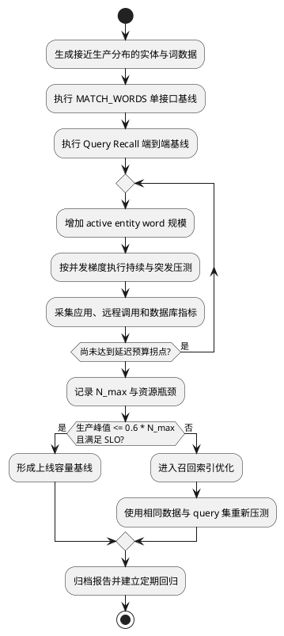

### 6.4 性能优化演进路径

若 `INSTR` 压测不能满足容量要求，优化必须发生在 `DVAIAgentService` 内部，并保持 `MATCH_WORDS` 请求与响应语义不变。推荐按以下顺序评估：

1. 先验证 `status`、`entity_type` 过滤索引、统计信息、分区和连接池配置，消除非算法性瓶颈。
2. 建立可重建的 n-gram/前缀桶倒排投影：由 normalized query 生成检索 token，先用索引缩小候选词，再用 `INSTR` 做最终语义校验。
3. 评估数据库原生全文/倒排索引能力，但必须验证短词、结构化编码、大小写和 Unicode 归一化语义不变。
4. 当数据库索引仍不足时，可在 `DVAIAgentService` 内维护随数据原子切换的多模式匹配索引；该索引不能下沉到 Query Recall module，也不能成为不受数据版本控制的本地缓存。
5. 每次优化都必须复用同一份压测数据、query 集和正确性 golden cases，比较性能提升并证明召回结果集合没有变化。

## 7. ER 设计与数据库表设计

本章描述远程 `DVAIAgentService` 内部的数据模型，用于服务实现和迁移对账。查询召回 module 只通过 P4/P9 远程接口使用这些数据，不引用表、SQL、ORM 或数据库连接。

### 7.1 ER 关系

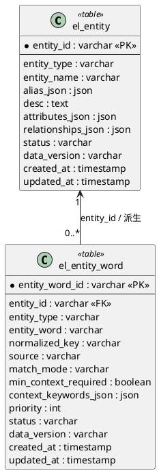

`relationships_json` 保存有限、随实体读取的有向关系，避免当前范围内过度拆表。若后续需要图遍历、反向关系查询或大规模分析，再新增独立关系表并单独演进读接口。

### 7.2 `el_entity`：实体权威表

| 字段 | 建议类型 | 约束与说明 |
| --- | --- | --- |
| `entity_id` | varchar | 主键、非空、稳定标识。 |
| `entity_type` | varchar | 非空，受类型白名单约束。 |
| `entity_name` | varchar | 非空，保留原始展示文本。 |
| `alias_json` | json | 非空，默认 `[]`；仅确认别名。 |
| `desc` | text | 非空，默认空字符串。 |
| `attributes_json` | json | 非空，默认 `{}`；禁止秘密和完整上游报文。 |
| `relationships_json` | json | 非空，默认 `[]`；目标必须存在于同一发布集合。 |
| `status` | varchar | `active` / `inactive`；只有 active 参与默认召回。 |
| `data_version` | varchar | 本次成功发布的数据标识，用于读一致性。 |
| `created_at` | timestamp | 创建审计时间。 |
| `updated_at` | timestamp | 最近更新审计时间。 |

### 7.3 `el_entity_word`：实体词检索投影表

| 字段 | 建议类型 | 约束与说明 |
| --- | --- | --- |
| `entity_word_id` | varchar | 主键。 |
| `entity_id` | varchar | 外键，引用 `el_entity.entity_id`。 |
| `entity_type` | varchar | 从实体冗余，支持匹配阶段类型过滤。 |
| `entity_word` | varchar | 标准名或确认别名的原始词面，用于原始 query 定位。 |
| `normalized_key` | varchar | 由词面重算，非空。 |
| `source` | varchar | 仅允许 `entity_name` 或 `confirmed_alias`。 |
| `match_mode` | varchar | `EXACT_WORD`、`STRUCTURED_TOKEN`、`CONTEXT_REQUIRED`。 |
| `min_context_required` | boolean | 是否必须经过上下文确认。 |
| `context_keywords_json` | json | 上下文词集合，默认 `[]`。 |
| `priority` | int | 同位置候选的辅助排序值。 |
| `status` | varchar | 随实体状态受控。 |
| `data_version` | varchar | 与实体表一致。 |
| `created_at` / `updated_at` | timestamp | 审计时间。 |

### 7.4 约束、索引与发布事务

- `el_entity.entity_id` 为主键。
- `el_entity_word.entity_id` 为外键并建立索引。
- 有效词的 `(normalized_key, status_scope)` 必须唯一；数据库可通过部分唯一索引或等价约束实现。
- 建立 `(status, entity_type)` 过滤索引，以及 `(status, normalized_key)` 匹配/冲突检查索引。
- 写入事务必须按“写入实体 → 删除旧投影 → 从标准名和确认别名重建投影 → 冲突检查 → 原子发布”完成；任一步失败全部回滚。
- 不允许人工双写实体表和词表；`desc`、`attributes_json`、`relationships_json` 永不自动生成词条。

## 8. 接口设计

### 8.1 共享请求工具

业务组件只构造如下请求描述：

```json
{
  "method": "GET",
  "url": "配置引用解析后的目标地址",
  "params": {"page_size": "100", "cursor": "opaque-token"},
  "json_body": null,
  "timeout_ms": 2000,
  "retry_count": 2,
  "idempotency_key": null
}
```

请求工具负责 transport 选择、认证注入、参数编码、超时、响应解码与错误分类。仅 GET/HEAD 可默认重试；POST、PUT、PATCH、DELETE 只有提供 `idempotency_key` 才允许重试。错误码至少包含 `timeout`、`auth_error`、`transport_error`、`http_error`、`schema_error`，且不携带秘密或原始报文。

### 8.2 构建管理接口

| 接口 | 方法 | 说明 |
| --- | --- | --- |
| `/entity-build:run-once` | POST | 执行全部一次任务。 |
| `/entity-build:run-daily` | POST | 受控人工触发全部定时任务；正常日常执行由服务内 Python 调度器完成。 |
| `/entity-build:status` | GET | 返回最近构建状态、安全摘要和计数。 |
| `/health` | GET | 服务健康与读写依赖摘要，不返回敏感配置。 |

构建结果：

```json
{
  "status": "succeeded",
  "entity_count": 1200,
  "source_count": 3,
  "failed_source_count": 0,
  "error_code": null,
  "data_version": "opaque-data-id"
}
```

`status` 可为 `idle`、`pending`、`running`、`succeeded`、`partial`、`failed`、`skipped`。接口不得返回 URL、token、完整来源响应或完整实体属性。

### 8.3 批量发布接口

批量发布由构建组件调用 `DVAIAgentService` 的受控写端口。建议使用统一操作信封，操作名为 `PUBLISH_ENTITY_SET`：

```json
{
  "contract_version": "由部署契约约定",
  "operation": "PUBLISH_ENTITY_SET",
  "request_id": "uuid-or-idempotency-key",
  "payload": {
    "entities": [
      {
        "entity_id": "DV-ALM-001",
        "entity_type": "alarm",
        "entity_name": "ALM-51020",
        "alias": ["51020"],
        "desc": "告警实体",
        "attributes": {},
        "relationships": []
      }
    ]
  }
}
```

服务端必须将 `request_id` 作为幂等键，验证整个 `entities` 集合后在同一事务中写入、重建投影并切换当前数据。成功响应至少返回 `data_version` 和实体数量；失败响应只返回受控错误码。现有单实体写入和投影重建接口可以保留给受控管理端，但不应用于构建任务的逐条循环发布。

### 8.4 查询召回接口

```http
POST /entity-recall
Content-Type: application/json

{
  "query": "检查 ALM-51020 的 CPU Usage",
  "use_llm": false,
  "top_k": 3
}
```

| 入参 | 必填 | 规则 |
| --- | --- | --- |
| `query` | 是 | 原始文本；空值返回 `invalid_input`。 |
| `use_llm` | 否 | 显式值覆盖动态配置。 |
| `top_k` | 否 | 1–100；显式值覆盖动态配置。 |

```json
{
  "query": "检查 ALM-51020 的 CPU Usage",
  "status": "linked",
  "mentions": [
    {
      "text": "ALM-51020",
      "span": [3, 12],
      "status": "linked",
      "entity_id": "DV-ALM-001",
      "candidates": []
    }
  ],
  "candidates": [],
  "top_entity_id": "DV-ALM-001",
  "error_code": null,
  "degraded": false
}
```

查询策略配置应原子热加载：新配置先解析、校验后再替换当前值；失败时继续使用最近有效配置。请求开始后使用其读取到的策略快照，不受并发 reload 影响。

### 8.5 实体数据读接口

实体链接器通过受控读端口访问实体数据：

| 操作 | 请求要点 | 语义 |
| --- | --- | --- |
| `MATCH_WORDS` | `normalized_query`、可选 `entity_types`、可选一致性标识。 | 批量返回命中的词投影及候选实体信息。 |
| `BATCH_GET_ENTITIES` | P8 后保留的 `entity_ids[]`、P4 返回的一致性标识。 | 批量返回唯一候选和未收敛 Top-K 歧义候选的权威详情。 |
| `HEALTH` | 无业务 payload。 | 返回读依赖健康和当前数据摘要。 |

单个 query 最多调用一次 `MATCH_WORDS` 和一次 `BATCH_GET_ENTITIES`。P8 后没有候选、仅有 local-only unknown 或无需实体链接时不得读取详情；存在未收敛歧义时必须读取 P8 后全部 Top-K 候选详情。

## 9. 兼容性与边界设计

### 9.1 兼容性

- 实体字段、实体词单值映射、mention 原文 span、查询状态和安全错误语义必须保持稳定。
- 新的查询门面对外不使用带版本后缀的类型名称；已有调用可通过兼容适配层逐步迁移。
- 查询侧只依赖实体数据读契约；构建服务迁移、存储替换或调度替换不应改变 query 入参与返回结构。
- 数据库查询命中只是候选来源，不直接等同于成功链接；边界、上下文、重叠和候选确认仍在链接器完成。
- 实体数据依赖失败必须显式返回 `dependency_failed`，不能降级为 `no_match`。

### 9.2 架构边界

| 边界 | 允许 | 禁止 |
| --- | --- | --- |
| 查询模块 ↔ 实体数据 | 通过 `EntityDataClient` 调用远程 `MATCH_WORDS` / `BATCH_GET_ENTITIES`。 | 直接 SQL、ORM、数据库连接、缓存词表或本地持久化快照。 |
| 构建器 ↔ 远程接口 | 通过共享请求工具和来源端口。 | 直接依赖 HTTP client、认证细节。 |
| 构建器 ↔ 存储 | 通过批量发布端口。 | 逐条提交、部分发布、手工维护词表。 |
| 任务编排 ↔ Python 调度器 | 接收 `run_once()` / `run_daily()` 触发。 | 依赖平台 Cron、外部调度器或由业务调用方轮询。 |
| LLM ↔ 实体数据 | 可辅助 mention 提取或候选排序。 | 生成未经确认的实体、别名或持久化数据。 |

### 9.3 失败与回退边界

- 来源不可用：保留该来源最近成功缓存，继续其他接口；无可用完整集合则不发布。
- 校验或词冲突：拒绝整个候选集合，继续使用当前已发布数据。
- 发布失败：数据库事务回滚，不清库，不删除已发布数据。
- 查询配置无效：保留最近有效配置，不影响正在执行的请求。
- 查询依赖失败：返回结构化失败；不得编造实体详情或将失败当作空结果。
- 多实例无 leader：禁止启用多个写侧调度器，或先配置分布式协调。

## 10. 迁移实施建议

1. 在新业务微服务中集成 Query Recall Facade、P1–P11 领域组件和 `EntityDataClient`，先以远程接口 stub 完成核心召回黑盒回归。
2. 对接远程 `DVAIAgentService` 的 `MATCH_WORDS` / `BATCH_GET_ENTITIES`，验证 P4/P5 并行、P8/P9 顺序和数据一致性。
3. 在 `DVAIAgentService` 侧建立或核对数据库 schema、词投影事务和批量发布接口；查询微服务不参与数据库实现。
4. 接入共享请求工具和统一分页来源接口，先以 dry-run 生成构建报告，不发布。
5. 实现 `PUBLISH_ENTITY_SET` 的幂等和原子切换，验证失败不影响当前读数据。
6. 接入 Python 一次任务和定时任务，使用 fake clock 验证到期、重复触发、重叠和失败隔离。
7. 使用既有查询样例对照 mention 文本、span、候选 ID 集合、详情读取集合、状态和错误语义。
8. 对当前 `INSTR` 词召回执行单接口和端到端专项压测，确认 `N_max`、生产余量和数据库资源基线；未满足准入条件时先完成索引优化。
9. 灰度切换新查询服务；保留上一成功数据集和可回退读链路，完成监控、权限、备份和演练后再下线旧部署。

## 11. 验收清单

- [ ] 所有来源使用统一 cursor 分页响应，并能在多页数据下无重复、无漏页地构建。
- [ ] 单接口失败不阻断其他接口；成功接口数据可发布，失败接口保留最近成功数据。
- [ ] 缺字段、重复实体冲突、词冲突、悬挂关系均不会产生部分发布。
- [ ] 实体表和实体词投影在同一事务中更新；有效归一化词保持单实体映射。
- [ ] 一次任务与定时任务互不混用；每日调度在指定时区只放行一次。
- [ ] 查询 API 仅需原始 query 和少量可选参数，策略配置可安全热加载。
- [ ] 查询依赖失败、歧义、无匹配、无需链接等状态可区分且语义稳定。
- [ ] `INSTR` 召回已完成生产分布数据、目标并发和发布并发场景的专项压测。
- [ ] 生产峰值 active entity word 数不超过压测容量拐点 `N_max` 的 60%，P4 与端到端指标满足已确认 SLO。
- [ ] 压测报告包含 SQL 执行计划、扫描行数、P50/P95/P99、QPS、CPU、I/O、连接池和原始结果。
- [ ] 日志、报告、接口响应不包含凭据、完整 URL、完整上游 payload 或敏感实体属性。
- [ ] 新微服务可以在不改动查询调用方的前提下替换构建、存储和调度实现。
